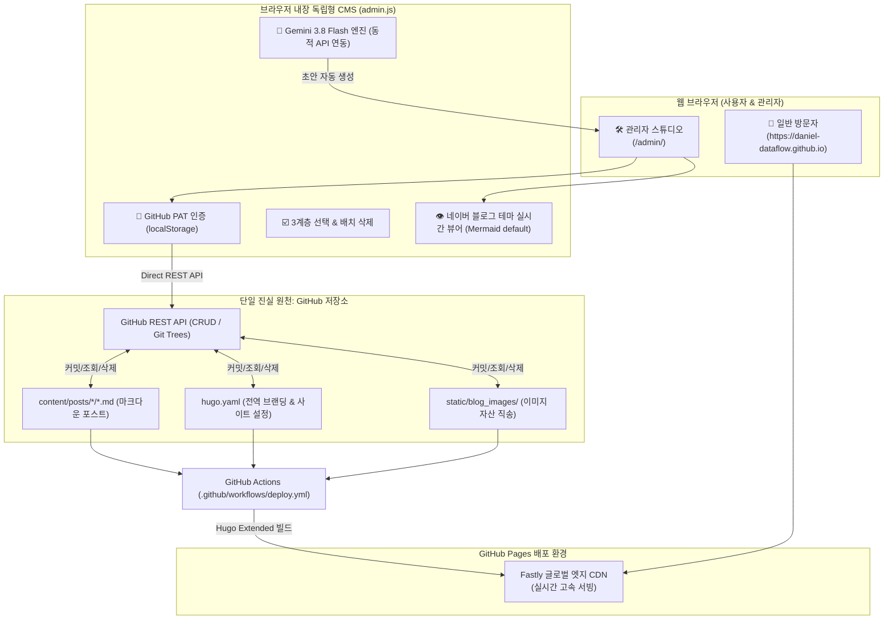

# 🌐 Daniel Tech Blog & Standalone Headless CMS

> **Daniel의 엔지니어링 기록 보관소이자 100% 웹 기반 서버리스(Serverless) 통합 관리자 스튜디오**  
> GitHub Pages 글로벌 CDN과 GitHub REST API를 단일 진실 원천(SSOT)으로 삼아, **서버 비용 0원·유지보수 0원**으로 운영되는 독립형 기술 블로그 플랫폼입니다.

[](https://daniel-dataflow.github.io)
[](https://daniel-dataflow.github.io/admin/)
[](https://ai.google.dev/)
[](https://gohugo.io/)

---

## 📑 목차
1. [시스템 아키텍처 개요](#1-시스템-아키텍처-개요)
2. [디렉토리 구조](#2-디렉토리-구조)
3. [로컬 실행 가이드 (Quick Start)](#3-로컬-실행-가이드-quick-start)
4. [블로그 어드민 스튜디오 핵심 기능](#4-블로그-어드민-스튜디오-핵심-기능)
5. [필수 보안 및 운영 주의사항](#5-필수-보안-및-운영-주의사항)
6. [자동 배포 파이프라인 (CI/CD)](#6-자동-배포-파이프라인-cicd)
7. [기술 의사결정 기록 (ADR)](#7-기술-의사결정-기록-adr)

---

## 1. 시스템 아키텍처 개요

본 프로젝트는 별도의 데이터베이스나 유료 클라우드 인스턴스(AWS, GCP 등) 없이, 정적 사이트 제너레이터(Hugo)와 브라우저 클라이언트 전용 Headless CMS로 구성되어 있습니다.



---

## 2. 디렉토리 구조

```plaintext
daniel-dataflow.github.io-main/
├── content/                     # 블로그 본문 콘텐츠 (카테고리별 마크다운 포스트)
│   └── posts/
│       ├── picksafe/            # PickSafe 프로젝트 아카이브 및 _index.md
│       └── lookalike/           # Lookalike 프로젝트 아카이브
├── doc/
│   └── decisions/               # 기술 의사결정 기록 (ADR 아카이브)
│       ├── README.md            # ADR 인덱스 목록
│       ├── 2026-08-30-...md     # [ADR-001] 독립형 CMS 아키텍처
│       └── 2026-09-14-...md     # [ADR-002] 어드민 고도화 및 테마 일치화
├── layouts/                     # Hugo 테마 커스텀 레이아웃 (네이버 블로그 스타일 2단 뷰)
│   ├── _default/                # 싱글 포스트 및 목록 템플릿
│   └── partials/                # 헤더, 푸터, 사이드바, Mermaid 스크립트 등
├── static/                      # 루트(/)에 직접 서빙되는 정적 자산
│   ├── admin/                   # 🛠️ 독립형 웹 어드민 CMS (index.html, admin.js, admin.css)
│   ├── blog_images/             # 포스트 본문 이미지 직송 저장소 (SSOT)
│   ├── css/                     # naver_blog.css (실제 배포 테마 스타일시트)
│   └── images/                  # 프로필(profile.jpg), 배너(banner.jpg) 등
├── hugo.yaml                    # 블로그 사이트 메타데이터 및 전역 설정
└── README.md                    # 프로젝트 종합 안내서 (현재 문서)
```

---

## 3. 로컬 실행 가이드 (Quick Start)

로컬에서 어드민 스튜디오나 블로그를 테스트하는 방법은 두 가지가 있습니다.

### 방법 A: 초간편 파이썬 웹 서버 (권장 - 별도 설치 0초)

어드민 CMS 페이지(`static/admin`)는 100% 브라우저 기반 순수 자바스크립트로 동작하므로, **Hugo 설치 없이 파이썬 내장 모듈만으로 즉시 구동**할 수 있습니다.

1. **터미널에서 프로젝트 루트 디렉토리로 이동**:
   ```bash
   cd /home/daniel/dev/daniel-dataflow.github.io-main
   ```

2. **`static` 디렉토리 기반 로컬 서버 실행 (포트 1313)**:
   ```bash
   python3 -m http.server 1313 --directory static
   ```

3. **브라우저 접속**:
   👉 **[http://localhost:1313/admin/](http://localhost:1313/admin/)**  
   *(주의: Hugo가 `static/` 디렉토리를 웹 사이트 루트에 1:1 매핑하므로 끝에 `/admin/`을 입력해야 합니다.)*

---

### 방법 B: Hugo 로컬 개발 서버 (전체 블로그 사이트 빌드 검증)

블로그 프론트엔드 테마 변경이나 전체 사이트 빌드 상태를 검증할 때 사용합니다.

1. **Hugo Extended 설치**:
   - **Ubuntu/Debian**:
     ```bash
     sudo apt update && sudo apt install hugo
     # 또는 최신 deb 다운로드 (권장: Extended 버전)
     ```
   - **macOS**:
     ```bash
     brew install hugo
     ```

2. **로컬 개발 서버 실행**:
   ```bash
   hugo server -D --port 1313
   ```

3. **브라우저 접속**:
   - 블로그 메인 화면: [http://localhost:1313/](http://localhost:1313/)
   - 어드민 스튜디오: [http://localhost:1313/admin/](http://localhost:1313/admin/)

---

## 4. 블로그 어드민 스튜디오 핵심 기능

어드민 스튜디오([http://localhost:1313/admin/](http://localhost:1313/admin/) 또는 배포 사이트의 `/admin/`)는 다음과 같은 고도화된 기능들을 제공합니다:

### 1) 🔒 안전한 클라이언트 사이드 인증
- 최초 접속 시 **GitHub Personal Access Token (PAT)**을 입력받습니다.
- 토큰은 외부 서버로 전송되지 않고 **브라우저의 `localStorage`에만 안전하게 저장**되며, GitHub REST API 호출 시 직접 인증 헤더로 사용됩니다.
- *필수 토큰 권한*: `repo` (Contents 읽기/쓰기/삭제 권한)

### 2) 🤖 최신 Gemini 3.8 Flash 기반 AI 초안 생성기
- **최신 1순위 권장 모델**: `gemini-3.8-flash`가 기본값으로 적용되어 있습니다.
- **실시간 모델 동적 갱신**: 상단 모달의 `새로고침` 버튼을 누르면 Google Gemini API(`GET /v1beta/models`)를 호출하여 현재 활성화된 모델 목록을 실시간 동기화합니다.
- **폐기 모델 자동 제외**: `gemini-1.0-pro`, `gemini-pro`, `embedding-*`, `aqa` 등 상용화 지원이 중단되었거나 텍스트 생성을 지원하지 않는 레거시 모델을 자동으로 걸러냅니다.
- **개발 회고록(DevLog) 맞춤 프롬프트**: 불필요한 과장 인사말을 배제하고 담백하고 진솔한 엔지니어링 회고 어조, Mermaid 다이어그램 작성 규칙이 사전에 튜닝되어 있습니다.

### 3) 📑 3계층 다중 선택 및 일괄 삭제 (Batch Delete)
- **전체 선택**: 사이드바 상단의 `[ ] 전체 선택` 체크박스로 모든 기발행 글 일괄 선택.
- **월별 선택**: `YYYY-MM` 폴더 헤더(예: `📁 2026-09 (14)`)의 체크박스로 특정 월의 글만 한 번에 토글.
- **개인 선택**: 각 포스트 카드의 체크박스로 개별 선택 (글 클릭 시 에디터 로드 이벤트와 완전 분리).
- **순차 안전 삭제**: GitHub API Rate Limit 방어를 위해 순차 비동기(Promise Chain) 방식으로 포스트를 안전하게 삭제하며, 화면에 실시간 진행 토스트(`(3/10) 삭제 중...`)를 안내합니다.

### 4) 👁️ 실시간 네이버 블로그 뷰어 & Mermaid 다이어그램
- **100% 동일한 뷰포트**: 실제 블로그 테마([naver_blog.css](static/css/naver_blog.css))의 소제목 H2(그린 바), H3, 인용구, 테이블 스타일을 실시간 반영합니다.
- **Mermaid 테마 일치화**: 다이어그램이 어두운 코드 블록(`<pre>`) 내부에 갇히는 현상을 해결하고, 실제 사이트와 동일한 **화이트 카드 배경 + 연보라색 노드 + 보라색 테두리 + 선명한 텍스트**로 렌더링됩니다.

### 5) 📸 이미지 직송 (SSOT 파이프라인)
- 에디터 내 **마우스 드래그앤드롭** 또는 **클립보드 붙여넣기(`Ctrl+V`)** 시, 로컬 디스크를 오염시키지 않고 GitHub 저장소(`static/blog_images/`)로 즉시 REST API를 통해 자동 커밋 및 마크다운 태그가 삽입됩니다.

### 6) ⚙️ 블로그 전역 브랜딩 & 카테고리 생애주기 관리
- **전역 설정 ([hugo.yaml](hugo.yaml))**: 상단 뱃지 문구, 사이트 타이틀, 서브타이틀, 소개글(Bio), 포트폴리오 URL, GitHub 링크를 GUI에서 수정 후 원클릭 배포.
- **카테고리 안전 이관**: 카테고리 삭제 시 기존 글들이 유실되지 않도록 다른 대상 카테고리로 안전하게 이동시키고 Frontmatter를 일괄 갱신합니다.

---

## 5. 필수 보안 및 운영 주의사항

> [!IMPORTANT]
> 1. **GitHub Personal Access Token (PAT) 관리**:
>    - 토큰 발급 시 `repo` 스코프(전체 저장소 읽기/쓰기/삭제 권한)가 필요합니다.
>    - 공용 PC나 타인의 브라우저에서 작업한 후에는 반드시 상단 탑바의 **로그아웃(🚪)** 버튼을 눌러 `localStorage`에서 토큰을 제거해 주세요.
> 2. **Google Gemini API Key 보호**:
>    - Gemini API 키 또한 브라우저의 로컬 스토리지에만 저장됩니다.
>    - 소스 코드 파일(Git 저장소) 내에 키를 하드코딩하여 커밋하지 마십시오.
> 3. **글 영구 삭제 주의**:
>    - 일괄 삭제 또는 개별 삭제 시 GitHub 원격 저장소에서 파일이 즉시 커밋 삭제됩니다. Git 히스토리를 통해 복원할 수는 있으나, 실행 전 신중히 확인해 주세요.

---

## 6. 자동 배포 파이프라인 (CI/CD)

- 블로그 저장소의 `main` 브랜치에 변경사항이 푸시되면, GitHub Actions 워크플로우([.github/workflows/deploy.yml](.github/workflows/deploy.yml))가 자동으로 트리거됩니다.
- Hugo Extended 최신 버전을 기반으로 정적 사이트를 빌드(`hugo --minify`)하고 GitHub Pages Fastly CDN으로 배포를 완료합니다 (평균 30초~1분 소요).

---

## 7. 기술 의사결정 기록 (ADR)

프로젝트의 주요 아키텍처 결정 배경과 상세 기술 사양은 [doc/decisions](doc/decisions/README.md)에 보관되어 있습니다:

- 📄 **[ADR-001] 독립형 통합 개인 기술 블로그 CMS 및 웹 관리 아키텍처 설계**  
  *(2026-08-30: Zero-Server Headless CMS 선정 및 GitHub REST API 연동 명세)*
- 📄 **[ADR-002] 블로그 어드민 고도화: 최신 Gemini 3.8 Flash 동적 연동, 다중 선택 일괄 삭제 및 실시간 뷰어 테마 일치화**  
  *(2026-09-14: Gemini 3.8 Flash 및 폐기 모델 필터링, 3단계 다중 선택 삭제, Mermaid 테마 일치화)*

---

**Developer & Architect**: Daniel ([daniel.han.developer@gmail.com](mailto:daniel.han.developer@gmail.com))
