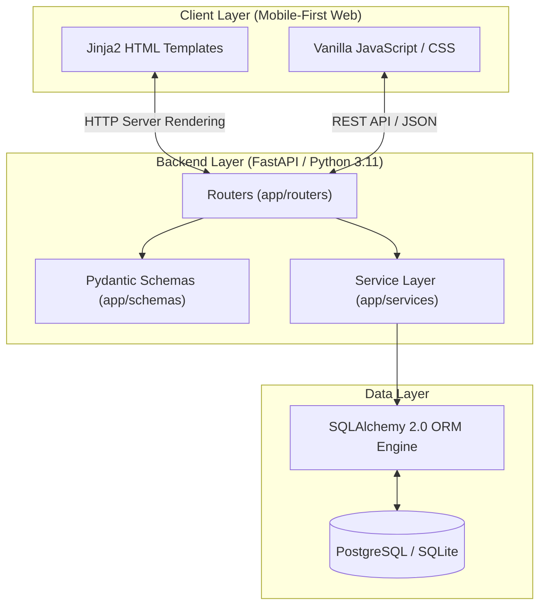

화장품 성분 정보는 표기가 복잡하고 전문 용어가 많아, 민감성 피부나 특정 알레르기를 가진 소비자가 현장에서 제품 안전성을 즉시 판단하기 어렵습니다. **PickSafe(픽세이프)**는 오프라인 매장이나 모바일 환경에서 제품 성분표를 촬영했을 때 식약처 지정 26대 알레르기 유발 성분과 사용자 개인 기피 성분을 1초 내에 감지하고 모바일 뷰로 보여주는 서비스를 목표로 기획했습니다.

이번 글은 서비스의 기초가 되는 백엔드 프레임워크 선택, 데이터베이스 및 프론트엔드 연동 아키텍처 설계, 그리고 프로젝트 초기 스캐폴딩을 진행하며 했던 기술적 고민과 트러블슈팅 과정을 정리한 기술 회고입니다.

---

## 🎯 마주한 고민과 문제 배경

초기 시스템 설계 시 가장 중요하게 고려한 조건은 **"모바일 환경에서의 빠른 초기 진입 속도"**와 **"향후 OCR 분석 및 외부 API 연동을 대비한 비동기 I/O 처리 성능"**이었습니다.

1. **모바일 네트워크 환경에서의 첫 화면 로딩 (First Contentful Paint)**
   스마트폰 웹 브라우저로 접근했을 때, 무거운 자바스크립트 번들 파일 다운로드로 인해 첫 화면이 뜨는 데 몇 초씩 걸린다면 사용자 경험이 저하될 위험이 컸습니다.
2. **복잡한 성분 데이터의 유효성 검증과 비동기 I/O 처리**
   성분 텍스트 파싱, DB 조회, 알레르기 성분 매칭 등 백엔드에서 일어나는 데이터 처리가 비동기로 이루어지지 않을 경우 높은 Latency가 발생할 수 있었습니다.
3. **유지보수 가능한 구조적 계층 분리**
   프로젝트 초기 단계에서 엔티티 구조와 로직을 명확히 분리해두지 않으면 서비스 확장이 이루어질 때 라우터와 데이터베이스 계층이 엉키는 기술 부채가 누적될 위험이 있었습니다.

---

## ⚖️ 기술적 대안 비교 및 선택 이유

백엔드 프레임워크와 프론트엔드 렌더링 방식을 결정하기 위해 몇 가지 대안을 비교 검토했습니다.

| 구분 | 대안 A: Django + React (SPA) | 대안 B: Flask + Vanilla JS | 대안 C: FastAPI + Jinja2 + Vanilla JS (최종 선택) |
| :--- | :--- | :--- | :--- |
| **백엔드 성능** | 동기 처리 기반, 기능은 풍부하나 중량감 있음 | 동기 기반 경량화, 비동기 처리에 한계 | ASGI 기반 초고속 비동기 처리, Pydantic 유효성 검증 내장 |
| **프론트엔드** | SPA 번들링 오버헤드 (FCP 1.5초~3초) | SSR 및 바닐라 JS로 경량화 가능 | Jinja2 SSR + 바닐라 JS로 최적 FCP (0.5초 이내) |
| **개발 생산성** | ORM/Admin 기본 제공, 프론트-백 분리 비용 발생 | 간단하나 구조화 작업을 직접 구축해야 함 | Pydantic / OpenAPI(Swagger) 자동 생성으로 빠른 API 명세 확인 |

### 선택 이유
- **FastAPI**: Python 3.11의 비동기(ASGI) 생태계를 완벽하게 활용할 수 있고, Pydantic을 통한 스키마 검증이 빌트인되어 있어 데이터 파이프라인의 안정성을 높일 수 있었습니다.
- **Jinja2 + Vanilla JS**: 모바일 웹 초기 접근 시 빌드된 거대한 JS 파일을 내려받는 오버헤드를 줄이고, 서버 사이드 렌더링으로 0.5초 이내에 화면을 노출하기 위해 채택했습니다. 컴포넌트 단위의 복잡한 상태 관리가 필요하지 않은 모바일 웹 환경에는 직관적인 바닐라 JS가 최선이라 판단했습니다.

---

## 🏗️ 시스템 아키텍처 및 흐름

전체 아키텍처는 클라이언트, 백엔드 애플리케이션 계층, 데이터 계층으로 명확히 역할 구분을 두었습니다.



### 디렉토리 구조 표준화
백엔드 로직과 프론트엔드 정적 자산을 깔끔하게 분리하기 위해 아래 구조로 스캐폴딩을 진행했습니다.

```text
web/
├── backend/
│   └── app/
│       ├── main.py          # Application Entrypoint
│       ├── config.py        # Environment Configurations
│       ├── database.py      # SQLAlchemy Session Setup
│       ├── routers/         # Endpoint Handlers
│       ├── models/          # DB Domain Entities
│       ├── schemas/         # Pydantic Schemas
│       └── services/        # Core Business Logic
└── frontend/
    ├── templates/           # Jinja2 HTML Templates
    └── static/              # CSS, JS, Image Assets
```

---

## 💻 핵심 구현 및 트러블슈팅

### 1. 비동기 DB 세션 관리 및 백엔드 스캐폴딩

데이터베이스 접속 정보나 민감한 환경 변수는 외부 노출 방지를 위해 추상화된 환경 설정을 통하도록 구현했습니다.

```python
# app/config.py
from pydantic_settings import BaseSettings

class Settings(BaseSettings):
    PROJECT_NAME: str = "PickSafe"
    DATABASE_URL: str = "sqlite:///./picksafe.db"
    
    class Config:
        env_file = ".env"

settings = Settings()
```

```python
# app/database.py
from sqlalchemy import create_engine
from sqlalchemy.orm import sessionmaker, declarative_base
from app.config import settings

engine = create_engine(
    settings.DATABASE_URL, 
    connect_args={"check_same_thread": False} if "sqlite" in settings.DATABASE_URL else {}
)
SessionLocal = sessionmaker(autocommit=False, autoflush=False, bind=engine)
Base = declarative_base()

def get_db():
    db = SessionLocal()
    try:
        yield db
    finally:
        db.close()
```

### 2. Jinja2 템플릿과 REST API 라우팅 통합 트러블슈팅

초기 설정 중 프론트엔드 Jinja2 템플릿 렌더링 라우트와 JSON REST API 라우트 간 정적 파일(`static`) 참조 경로가 꼬여 404 에러가 발생하는 문제가 발생했습니다.

**[원인]**
`StaticFiles` 디렉터리 마운트 위치가 템플릿 내부의 상대 경로 지정과 일치하지 않아 static 자산을 읽어오지 못했습니다.

**[해결 과정]**
`main.py`에서 `StaticFiles`와 `Jinja2Templates`의 기준 경로를 절대 경로(Pathlib) 기반으로 정교하게 지정하여 환경에 종속되지 않도록 개선했습니다.

```python
# app/main.py
from pathlib import Path
from fastapi import FastAPI, Request
from fastapi.staticfiles import StaticFiles
from fastapi.templating import Jinja2Templates

BASE_DIR = Path(__file__).resolve().parent.parent.parent
FRONTEND_DIR = BASE_DIR / "frontend"

app = FastAPI(title="PickSafe Core API")

# Static assets and Jinja2 Templates mounting
app.mount("/static", StaticFiles(directory=FRONTEND_DIR / "static"), name="static")
templates = Jinja2Templates(directory=FRONTEND_DIR / "templates")

@app.get("/", summary="메인 페이지 렌더링")
async def read_root(request: Request):
    return templates.TemplateResponse("index.html", {"request": request, "title": "PickSafe - 성분 안전 판별"})
```

---

## 💡 돌아보며 배운 점 (회고)

### 1. 기술의 화려함보다 유즈케이스에 맞는 도구 선택
처음에는 익숙한 SPA(React/Vue) 프레임워크 도입을 먼저 생각했으나, PickSafe 모바일 웹의 목적은 **"스캔 결과의 빠른 확인"**이었습니다. 과도한 클라이언트 렌더링을 내려놓고 Jinja2 템플릿과 경량 바닐라 자바스크립트를 조합함으로써 번들링 파이프라인 구축 시간을 아끼고 0.5초 이내의 빠른 첫 화면 응답 속도를 확보할 수 있었습니다.

### 2. 초기 디렉토리 및 레이어 분리의 중요성
FastAPI는 자유도가 높아서 한 파일에 라우터, DB 모델, 비즈니스 로직을 모두 넣기 쉽습니다. 하지만 초기 스캐폴딩 단계부터 `routers`, `models`, `services`, `schemas`로 역할을 명확히 쪼개놓았기에 추후 비동기 OCR 엔진 및 성분 데이터 분석 알고리즘이 들어올 자리를 깔끔하게 확보할 수 있었습니다.

### 3. 향후 보완 과제
* **Async DB Driver 전환**: 현재는 SQLAlchemy 동기 세션을 기본 세팅으로 사용 중이나, 향후 트래픽 증가와 비동기 OCR 작업 병목을 방지하기 위해 `AsyncSession`과 `asyncpg` 기반으로 데이터베이스 인터페이스를 전환할 예정입니다.
* **캐싱 레이어 도입**: 자주 조회되는 26대 알레르기 성분 마스터 데이터는 In-Memory 데이터 구조나 Redis 캐싱 체계를 도입하여 DB 조회를 최소화하는 작업이 필요합니다.