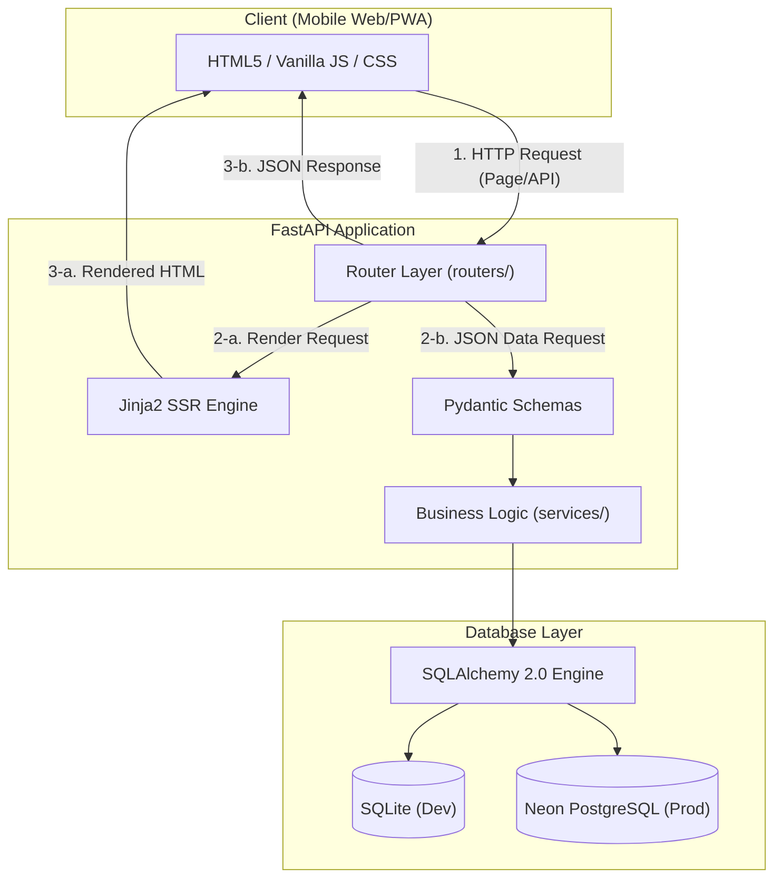

화장품 성분 분석 서비스 **PickSafe(픽세이프)**의 초기 기초(Scaffolding) 아키텍처를 설계하고 백엔드 파이프라인의 기반을 잡으면서 고민했던 기술적 의사결정 과정을 정리합니다. 

복잡한 전성분 표기 속에서 식약처 지정 26대 알레르기 유발 성분과 개인별 기피 성분을 1초 내로 판별하는 서비스를 목표로 삼으면서, 초기 단계에서 어떤 레이어 구조와 기술 스택을 선택했는지 기록으로 남깁니다.

---

## 🎯 마주한 고민과 문제 배경

서비스의 핵심 사용자 경험은 **"모바일 환경에서 화장품 성분표를 촬영했을 때 딜레이 없이 빠르게 위험 성분을 확인하는 것"**이었습니다. 이 목표를 달성하기 위해 초기 설계 단계에서 크게 두 가지 병목 요소를 고려해야 했습니다.

1. **모바일 웹의 초기 진입 속도(FCP) 저하 문제**
   - React나 Vue 같은 현대적인 SPA(Single Page Application) 프레임워크는 우수한 UI 상태 관리 기능을 제공하지만, 초기에 클라이언트가 내려받아야 하는 번들 파일의 크기가 큽니다. 모바일 네트워크 환경에서는 이 번들 파싱 시간이 첫 화면 렌더링(First Contentful Paint) 속도를 떨어뜨리는 원인이 됩니다.

2. **I/O 바운드 작업 시 서버 응답성 확보**
   - 성분 분석 기능은 텍스트 렌더링뿐만 아니라 OCR 이미지 처리, 성분 데이터베이스 조회, 알레르기 유발 물질 매칭 알고리즘 등 다수의 I/O 작업 및 데이터 변환 과정이 동반됩니다. 동기식(Sync) 프레임워크 기반으로 시작할 경우 병목이 생길 가능성이 높았습니다.

결국 초기 스캐폴딩의 핵심 요구사항은 **"최소한의 리소스로 0.5초 이내 첫 화면을 보장하면서, 비동기 처리에 유연한 백엔드 구조를 만드는 것"**이었습니다.

---

## ⚖️ 기술적 대안 비교 및 선택 이유

### 1. 백엔드 프레임워크: FastAPI vs Django vs Flask

| 비교 항목 | FastAPI | Django | Flask |
| :--- | :--- | :--- | :--- |
| **I/O 처리 방식** | Native Async (ASGI 기반) | WSGI/ASGI 혼용 (설정 복잡) | 기본 WSGI (Sync 중심) |
| **데이터 검증** | Pydantic 내장 (유효성 검증 탁월) | Django Form/Serializer | 별도 라이브러리 필요 |
| **API 문서화** | Swagger/ReDoc 자동 생성 | 별도 패키지 필요 | 별도 패키지 필요 |
| **무게감** | 경량 모듈화 가능 | 풀스택(유저, 관리자 등 무거움) | 매우 경량이나 기능 부족 |

- **선정 결과**: **FastAPI**
- **이유**: OCR 텍스트 분석 및 외부 데이터 연동 시 비동기(ASGI) 성능이 필수적이었습니다. 또한 Pydantic 모델을 통한 입출력 스키마의 엄격한 유효성 검증이 런타임 오류를 사전에 차단해 준다는 점이 가장 큰 결정 이유였습니다.

### 2. 프론트엔드 렌더링 전략: Jinja2 SSR + Vanilla JS vs React SPA

- **선정 결과**: **Jinja2 서버사이드 렌더링 + Vanilla JavaScript**
- **이유**: 번들링 빌드 과정(Webpack/Vite 등)의 오버헤드를 없애고 초기 HTML 렌더링을 서버에서 처리하여 **FCP를 0.5초 이내로 단축**하고자 했습니다. 동적 상태 변경이 필요한 카메라 촬영 및 실시간 알림 부분만 바닐라 자바스크립트로 가볍게 작성했습니다.

---

## 🏗️ 시스템 아키텍처 및 흐름

전체 아키텍처는 백엔드 core 로직과 템플릿 영역을 명확히 분리하고, DB 계층은 SQLAlchemy 2.0 ORM을 통해 로컬(SQLite)과 운영 환경(PostgreSQL)을 범용적으로 지원하도록 구성했습니다.



### 디렉토리 구조 표준화
라우팅과 비즈니스 로직, 데이터베이스 엔티티를 엄격히 분리하기 위해 다음과 같이 계층 구조를 정립했습니다.

```text
web/
├── backend/
│   └── app/
│       ├── core/       # 환경 변수 및 설정 (config.py)
│       ├── database/   # DB 세션 및 SQLAlchemy Engine 설정
│       ├── models/     # DB 테이블 ORM 모델 Definition
│       ├── routers/    # API & Page 라우터 분리 (page.py, api.py)
│       ├── schemas/    # Pydantic Request/Response 모델
│       └── services/   # 성분 분석 및 비즈니스 로직
└── frontend/
    ├── static/         # CSS, Vanilla JS, 이미지 자산
    └── templates/      # Jinja2 HTML 템플릿
```

---

## 💻 핵심 구현 및 트러블슈팅

### 1. 라우터 체계 및 템플릿 렌더링 분리

화면을 뿌려주는 HTML 라우트와 JSON 데이터를 주고받는 API 라우터를 명확하게 세분화했습니다.

```python
# web/backend/app/routers/page.py
from fastapi import APIRouter, Request, Depends
from fastapi.templating import Jinja2Templates
from sqlalchemy.orm import Session
from app.database import get_db

router = APIRouter(tags=["Pages"])
templates = Jinja2Templates(directory="../frontend/templates")

@router.get("/")
async def render_home(request: Request, db: Session = Depends(get_db)):
    """
    모바일 홈 화면 렌더링
    """
    return templates.TemplateResponse(
        "index.html",
        {"request": request, "title": "PickSafe - 성분 안전 판별"}
    )
```

```python
# web/backend/app/schemas/ingredient.py
from pydantic import BaseModel, Field

class IngredientAnalysisRequest(BaseModel):
    raw_text: str = Field(..., description="OCR로 추출된 전성분 텍스트")
    user_avoid_list: list[str] = Field(default=[], description="사용자 지정 기피 성분 목록")

class IngredientAnalysisResponse(BaseModel):
    has_allergen: bool
    detected_allergens: list[str]
    detected_avoidances: list[str]
    safety_score: int
```

### 2. 개발 및 운용 환경 간 DB Connection 트러블슈팅

**문제 상황**: 
초기 개발 환경에서는 SQLite를 사용하고 생산 환경에서는 Neon PostgreSQL을 도입하면서, SQLAlchemy 2.0 엔진 설정 시 데이터베이스 드라이버 연결 방식 차이로 인한 세션 관리 오류가 발생했습니다. SQLite는 동시성 관련 드라이버 인자가 다르고, Neon PostgreSQL은 SSL 커넥션 옵션이 필수적이었습니다.

**해결 방안**:
`core/config.py` 변수에 따라 엔진 생성을 추상화하여 데이터베이스 세션 공급 방식을 고도화했습니다.

```python
# web/backend/app/database.py
import os
from sqlalchemy import create_engine
from sqlalchemy.orm import sessionmaker, declarative_base

DATABASE_URL = os.getenv("DATABASE_URL", "sqlite:///./dev.db")

# 환경별 Engine 커스텀 옵션 세팅
engine_options = {}
if DATABASE_URL.startswith("sqlite"):
    engine_options["connect_args"] = {"check_same_thread": False}
else:
    # PostgreSQL / Neon DB 커넥션 풀 설정
    engine_options["pool_pre_ping"] = True
    engine_options["pool_size"] = 10
    engine_options["max_overflow"] = 20

engine = create_engine(DATABASE_URL, **engine_options)
SessionLocal = sessionmaker(autocommit=False, autoflush=False, bind=engine)
Base = declarative_base()

def get_db():
    db = SessionLocal()
    try:
        yield db
    finally:
        db.close()
```

---

## 💡 돌아보며 배운 점

1. **유행보다 목적에 맞는 기술 선택의 가치**
   - 최신 SPA 프레임워크를 도입하는 대신 Jinja2와 Vanilla JS 조합을 택한 덕분에 별도의 빌드 체인 없이 개발 속도를 극대화할 수 있었고, 초기 FCP 성능도 0.5초 이하로 유지할 수 있었습니다. 기술 선택의 기준은 항상 서비스가 해결하고자 하는 문제와 사용자 경험에 맞춰져야 함을 다시 한번 느꼈습니다.

2. **FastAPI + Pydantic 구조의