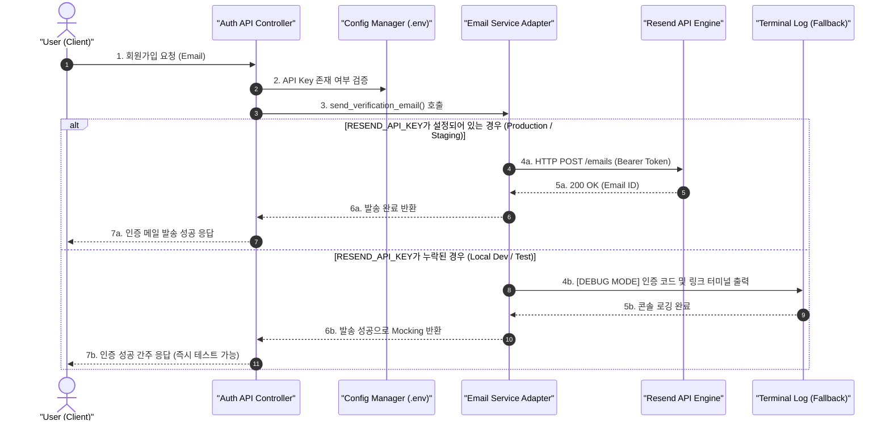
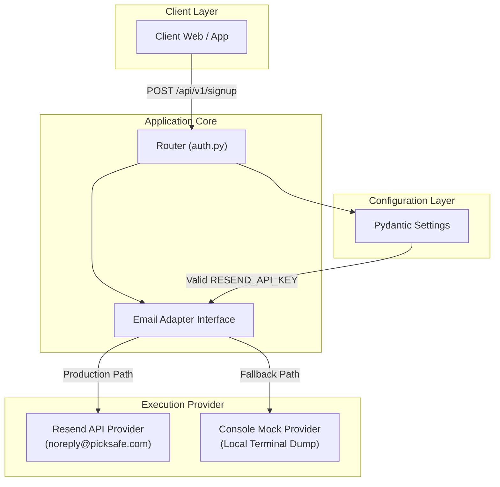

스타트업 프로토타입 구축 단계에서 가장 쉽게 범하는 실수 중 하나는 **"이메일 발송 쯤이야 빠르게 Gmail SMTP로 붙이지 뭐"**라는 생각입니다. 초기 PickSafe 서비스 역시 빠른 MVP 검증을 위해 Gmail SMTP를 사용했으나, 서비스가 가시화됨에 따라 단순한 발송 기능을 넘어 **신뢰성, 계정 보안, 로컬 개발 생산성** 측면에서 명확한 한계에 봉착했습니다.

이번 글에서는 메일 발송 인프라를 **Resend API**로 전환하면서 고민했던 기술적 배경과, 개발 편의성과 production 안정성을 동시에 확보하기 위해 도입한 **디버깅 폴백(Fallback) 패턴 아키텍처**를 공유합니다.

---

## 🎯 문제 정의: 단순 SMTP가 가져온 3가지 병목

초기 회원가입 인증 시스템에 Gmail SMTP를 적용했을 때 발생한 엔지니어링 문제는 다음과 같았습니다.

1. **발신자 신뢰도 낮음 및 스팸함 직행 이슈**
   - `@gmail.com` 주소로 발송되는 트랜잭션 메일(Transactional Email)은 수신 측 EOP(Exchange Online Protection)나 Gmail 스팸 필터에 걸릴 확률이 극도로 높았습니다. 커스텀 도메인 기반의 SPF(Sender Policy Framework), DKIM(DomainKeys Identified Mail) 서명이 부재하여 인증 이메일의 수신율이 현저히 떨어졌습니다.
2. **보안 리스크 및 인증 관리 파편화**
   - 사내 개인/공용 Google 계정의 '앱 비밀번호(App Password)'를 개발자 및 CI 환경에 공유해야 했습니다. 이는 최소 권한 원칙(Principle of Least Privilege)에 위배되며, 키 유출 시 해당 Google 계정 전체의 보안 위험으로 이어질 수 있었습니다.
3. **로컬 개발 환경의 의존성 및 개발 병목 (Developer Experience)**
   - 로컬 기능 개발 및 E2E 테스트 시 매번 실제로 이메일을 수신하고 인증 코드를 확인해야 했습니다. 이로 인해 테스트 속도가 저하되었을 뿐만 아니라, 개발 단계에서 불필요하게 일일 메일 발송 쿼터를 소모하는 문제가 발생했습니다.

---

## 🏗️ 핵심 아키텍처 및 다이어그램

이러한 문제를 해결하기 위해 **Resend API**를 도입하고, 내부적으로 `EmailService` 레이어를 추상화하여 **환경 변수 유무에 따라 동작이 분기되는 유연한 어댑터 패턴**을 설계했습니다.

### 시스템 메일 발송 아키텍처 Flow



### 환경별 이메일 파이프라인 구조



---

## ⚖️ 대안 비교 및 Trade-off 분석

메일 인프라 선정을 위해 `Gmail SMTP`, `AWS SES`, `SendGrid`, `Resend` 4가지 대안을 비교 평가했습니다.

| 비교 항목 | Gmail SMTP | AWS SES | SendGrid | **Resend (최종 선택)** |
| :--- | :--- | :--- | :--- | :--- |
| **발신자 신뢰도** | ❌ 낮음 (`@gmail.com`) | ⭕️ 높음 (DKIM/SPF) | ⭕️ 높음 (DKIM/SPF) | **🎯 최상 (자동 도메인 인증 최적화)** |
| **API/SDK DX** | ❌ 불편 (SMTP 프로토콜) | ⚠️ 복잡함 (Boto3/IAM 설정) | ⚠️ 보통 | **🎯 극상 (React Email 연동 & 현대적 REST API)** |
| **보안 제어** | ❌ 계정 앱 비밀번호 노출 | ⭕️ IAM fine-grained | ⭕️ API Key scoped | **🎯 scoped API Key (폐기/재발급 용이)** |
| **무료 티어** | 1일 500건 (스팸 위험) | Sandbox 환경 제한 | 1일 100건 | **🎯월 3,000건 / 1일 100건 (MVP에 최적)** |
| **도메인 전환** | ❌ 불가능 | ⚠️ Console 설정 복잡 | ⚠️ Console 설정 복잡 | **🎯 환경변수 변경만으로 즉시 전환** |

### 💡 Resend 선택의 결정적 이유
AWS SES는 비용 효율성이 뛰어난 대안이었으나, 초기 샌드박스 해제 절차 및 IAM 정책 설정에 드는 **오버헤드 대비 DX(개발자 경험)** 측면에서 **Resend**가 훨씬 우수했습니다. 특히 트랜잭션 메일에 특화되어 있어 SPF/DKIM 설정 가이드가 직관적이고, 템플릿 코드 작성이 매우 용이하다는 점이 백엔드 생산성을 극대화해 주었습니다.

---

## 🚀 구현 핵심 코드 및 트러블슈팅 경험

### 1. 보안 중심 설정 관리 (`config.py`)

민감한 시크릿 키는 Pydantic 기반의 `BaseSettings`를 통해 관리하며, 환경 변수 부재 시 `None`으로 세팅되어 Fallback 인프라가 동작하도록 설계했습니다.

```python
# app/core/config.py
from typing import Optional
from pydantic_settings import BaseSettings

class Settings(BaseSettings):
    PROJECT_NAME: str = "PickSafe"
    
    # Email Configuration
    RESEND_API_KEY: Optional[str] = None  # 보안을 위해 기본값은 None
    EMAIL_FROM_ADDRESS: str = "onboarding@resend.dev" # 기본 테스트 도메인

    class Config:
        env_file = ".env"

SETTINGS = Settings()
```

### 2. Graceful Degradation을 적용한 이메일 서비스 구현

핵심은 `RESEND_API_KEY` 가 선언되지 않은 로컬 개발 환경에서 **시스템이 에러를 뱉는 것이 아니라, 디버깅 폴백 모드로 우회**하도록 만든 것입니다.

```python
# app/services/email_service.py
import logging
import resend
from app.core.config import SETTINGS

logger = logging.getLogger("picksafe.email")

class EmailService:
    def __init__(self):
        if SETTINGS.RESEND_API_KEY:
            resend.api_key = SETTINGS.RESEND_API_KEY
            self.is_active = True
        else:
            self.is_active = False
            logger.warning("⚠️ RESEND_API_KEY가 없습니다. [디버깅 폴백 모드]로 동작합니다.")

    async def send_verification_code(self, to_email: str, code: str) -> bool:
        """
        회원가입 인증 메일을 발송합니다.
        API Key 미설정 시 콘솔에 로그만 출력하고 성공 상태를 반환합니다.
        """
        subject = f"[{SETTINGS.PROJECT_NAME}] 회원가입 이메일 인증 코드"
        
        # 1. Fallback Mode (Local / Test Environment)
        if not self.is_active:
            logger.info("=" * 50)
            logger.info(f"📧 [DEV EMAIL FALLBACK] To: {to_email}")
            logger.info(f"🔑 [VERIFICATION CODE]: {code}")
            logger.info("=" * 50)
            return True

        # 2. Production Service Mode (Resend API)
        try:
            params = {
                "from": SETTINGS.EMAIL_FROM_ADDRESS,
                "to": [to_email],
                "subject": subject,
                "html": f"<p>인증 코드: <strong>{code}</strong></p>",
            }
            response = resend.Emails.send(params)
            logger.info(f"✅ 메일 발송 성공 (ID: {response.get('id')})")
            return True
        except Exception as e:
            logger.error(f"❌ Res