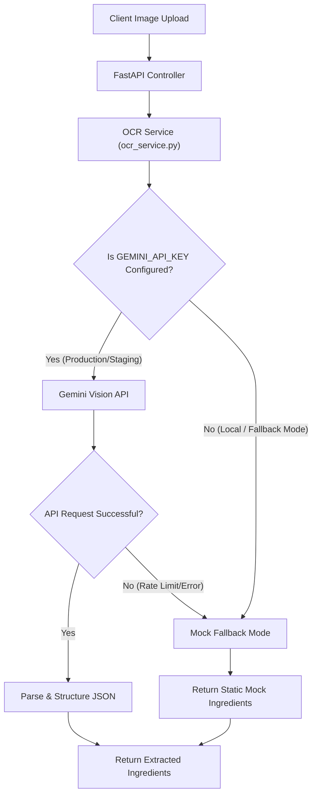

화장품 성분 분석 서비스 PickSafe를 개발하면서 가장 먼저 마주한 기술적 장벽은 **"성분표 이미지에서 성분명을 어떻게 정확하고 정형화된 텍스트 데이터로 추출할 것인가"**였습니다. 

화장품 용기는 대개 둥글거나 굴곡져 있고, 성분표는 매우 작은 글씨로 빽빽하게 인쇄되어 있습니다. 여기에 한국어, 영어, 라틴어 학명이 불규칙한 줄바꿈과 쉼표(,)로 뒤섞여 있어 일반적인 OCR 솔루션만으로는 만족스러운 인식률을 얻기 어려웠습니다. 

이 문제를 해결하기 위해 시도했던 기술적 접근과 최종적으로 Gemini Vision API를 채택하고 안정적인 개발 환경을 위해 폴백(Fallback) 메커니즘을 구축한 과정을 기록으로 남깁니다.

---

## 🎯 마주한 고민과 문제 배경

화장품 성분표 이미지 인식 모듈을 설계할 때 해결해야 할 핵심 요구사항은 다음과 같았습니다.

1. **비정형 텍스트의 정밀한 인식**: 단순히 글자를 읽는 것을 넘어, 구겨지거나 빛이 반사된 화장품 표면의 텍스트를 왜곡 없이 복원해야 했습니다.
2. **다국어 지원 및 문맥 이해**: 성분명에는 "정제수", "Glycerin", "Centella Asiatica Extract" 등 다국어와 화학 물질명이 혼재합니다. 오탈자가 발생했을 때 문맥적으로 이를 올바른 성분명으로 보정해 줄 수 있는 지능이 필요했습니다.
3. **비용과 리소스의 제약**: 서비스 초기 단계에서 고비용의 엔터프라이즈급 OCR API를 전면 도입하는 것은 비용 부담이 컸고, 자체 OCR 모델을 구축하여 호스팅하는 것은 인프라 유지 비용과 개발 공수 측면에서 비효율적이었습니다.

---

## ⚖️ 기술적 대안 비교 및 선택 이유

성분표 추출 엔진 후보로 세 가지 대안을 검토했습니다.

| 비교 항목 | Tesseract (오픈소스 OCR) | Cloud OCR (AWS Textract / Google Cloud Vision) | Gemini Vision API (Free Tier) |
| :--- | :--- | :--- | :--- |
| **인식 정확도** | 낮음 (곡면 왜곡 및 저조도에 취약) | 높음 (순수 텍스트 추출 우수) | **매우 높음** (문맥 기반 오탈자 보정 가능) |
| **다국어 처리 능력** | 미흡 (사전 학습 및 언어 팩 설정 복잡) | 보통 (개별 언어 인식 성능은 좋으나 혼용 시 하락) | **매우 우수** (LLM 기반의 강력한 다국어 이해) |
| **도입 비용** | 무료 (인프라 호스팅 비용 발생) | 유료 (호출당 과금) | **무료** (일정 호출 한도 내 Free Tier 활용 가능) |
| **후처리 공수** | 매우 높음 (정규식 및 파싱 로직 직접 구현) | 높음 (추출된 텍스트의 구조화 작업 필요) | **낮음** (프롬프트를 통해 JSON 형태로 직접 반환 가능) |

### 최종 선택: Gemini Vision API

오픈소스인 Tesseract는 초기 테스트 결과 둥근 화장품 용기에서 글자가 조금만 휘어져도 인식률이 급격히 떨어졌습니다. 반면 Gemini Vision API는 거대언어모델(LLM) 기반의 시각 인지 능력을 갖추고 있어, **일부 글자가 흐릿하거나 깨져 있어도 문맥상 어떤 성분명인지 유추하여 복원하는 성능**이 압도적이었습니다. 

또한, MVP 검증 단계에서 제공되는 무료 티어(Free Tier)의 한도(RPM/TPM)가 초기 트래픽을 감당하기에 충분하다고 판단했습니다.

---

## 🏗️ 시스템 아키텍처 및 흐름

개발 과정에서 외부 API 의존성이 높은 구조가 가질 수 있는 치명적인 약점을 대비해야 했습니다. API 키가 설정되지 않은 로컬 개발 환경이나, Rate Limit(호출 제한)을 초과하는 예외 상황에서도 전체 애플리케이션이 마비되지 않도록 **Mock 디버그 폴백(Fallback) 모드**를 아키텍처에 통합했습니다.



---

## 💻 핵심 구현 및 트러블슈팅

구현 시 가장 신경 쓴 부분은 `ocr_service.py` 모듈 내에서 외부 API 호출부와 예외 처리 로직을 깔끔하게 격리하는 것이었습니다. 유효한 API 키가 없거나 외부 통신 장애가 발생하면 경고 로그를 남기고 즉시 미리 준비된 Mock 데이터를 반환하도록 설계했습니다.

### Core Implementation: `ocr_service.py`

```python
import os
import logging
from typing import List, Dict, Any

logger = logging.getLogger(__name__)

class OCRService:
    def __init__(self):
        # 환경 변수에서 API 키 로드 (보안을 위해 직접적인 키 노출 방지)
        self.api_key = os.environ.get("GEMINI_API_KEY")
        self.is_fallback_mode = not bool(self.api_key)
        
        if self.is_fallback_mode:
            logger.warning(
                "GEMINI_API_KEY가 설정되지 않았습니다. OCR 서비스가 Mock 폴백 모드로 동작합니다."
            )

    def extract_ingredients(self, image_bytes: bytes) -> Dict[str, Any]:
        """
        이미지 바이너리를 받아 성분표 텍스트를 추출하고 구조화된 데이터를 반환합니다.
        """
        if self.is_fallback_mode:
            return self._get_mock_data()

        try:
            # 실제 Gemini Vision API 호출 로직 (추상화 예시)
            # response = gemini_client.generate_content(image_bytes, prompt=PROMPT)
            # return self._parse_response(response)
            
            # 임시 구현체 예시
            return {
                "status": "success",
                "source": "gemini_api",
                "ingredients": ["정제수", "글리세린", "부틸렌글라이콜", "병풀추출물", "1,2-헥산디올"]
            }
            
        except Exception as e:
            logger.error(f"Gemini API 호출 중 예외 발생: {str(e)}. 폴백 모드로 전환합니다.")
            return self._get_mock_data()

    def _get_mock_data(self) -> Dict[str, Any]:
        """
        API 키가 없거나 에러 발생 시 반환할 안전한 기본 성분 데이터 세트
        """
        return {
            "status": "fallback",
            "source": "mock_data",
            "ingredients": [
                "정제수", 
                "글리세린", 
                "부틸렌글라이콜", 
                "나이아신아마이드", 
                "판테놀", 
                "소듐하이알루로네이트"
            ]
        }
```

### 트러블슈팅: 로컬 개발 환경에서의 병목 해소

처음에는 API 키 체크 없이 무조건 외부 API를 호출하도록 구현했더니 다음과 같은 문제가 발생했습니다.

1. 로컬에서 백엔드 기능이나 UI 레이아웃을 다듬는 단순 테스트 중에도 무의미하게 API 호출 한도를 소모했습니다.
2. 외부 네트워크 연결이 불안정하거나 API 키가 등록되지 않은 환경에서 일하는 경우, 회원가입이나 다른 도메인 로직을 테스트하는 도중에도 OCR 에러로 인해 전체 파이프라인이 멈추는 현상이 발생했습니다.

**해결책**으로 도입한 환경 변수 기반의 `is_fallback_mode` 분기 처리는 신의 한 수였습니다. 로컬 개발 환경(`SETTINGS.GEMINI_API_KEY`가 지정되지 않은 상태)에서는 0.1초 만에 Mock 데이터가 반환되므로 UI 렌더링 피드백 루프가 극