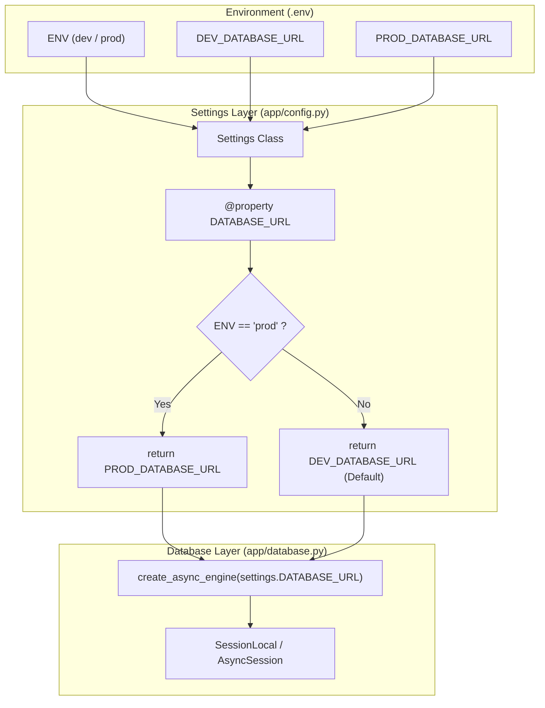

화장품 성분 분석 서비스 PickSafe를 개발하며 백엔드 초기 아키텍처를 잡을 때, 가장 먼저 마주한 과제 중 하나는 데이터베이스 연결 관리였습니다. 

서비스의 핵심 도메인은 성분 데이터 분석과 사용자 맞춤형 화장품 추천 로직입니다. 도메인 로직을 빠르게 구현하고 검증하는 데 집중하다 보니, 초기에는 단일 `DATABASE_URL` 환경 변수 하나에 의존하여 로컬 테스트와 원격 환경을 오가며 개발을 진행했습니다. 하지만 기능이 확장되고 마이그레이션 스크립트와 시드 데이터를 다루는 빈도가 늘어나면서, 이 방식이 가진 잠재적 위험 요소들이 명확하게 드러나기 시작했습니다.

이번 글에서는 개발(DEV) 환경과 운영(PROD) 환경의 데이터베이스 연결을 안전하게 분리하고, 상위 비즈니스 로직의 변경 없이 애플리케이션 설정 계층을 리팩토링한 과정을 기록합니다.

---

## 🎯 마주한 고민과 문제 배경

초기 구조에서는 `.env` 파일에 선언된 `DATABASE_URL` 하나로 모든 연결을 처리했습니다. 그러나 서비스를 고도화하는 과정에서 세 가지 현실적인 문제에 직면했습니다.

1. **데이터 오염 및 휴먼 에러의 위험**
   - 로컬 환경에서 성분 파싱 알고리즘을 테스트하거나 더미 데이터를 대량으로 밀어 넣는 작업이 빈번했습니다.
   - 설정 파일의 실수나 환경 변수 오염으로 인해 운영 데이터베이스에 테스트 데이터가 인입되거나, 반대로 운영 스키마가 덮어씌워질 수 있는 치명적인 위험이 존재했습니다.

2. **서버리스 PostgreSQL(Neon) 리소스 제약**
   - PickSafe의 데이터베이스로 채택한 Neon Postgres는 브랜치 기능과 서버리스 확장이 용이하지만, 무료 티어 기준 활성 컴퓨트 시간과 스토리지 용량에 명확한 한계가 있습니다.
   - 로컬 개발 시 발생하는 잦은 쿼리 폴링과 무거운 테스트 작업이 운영 인스턴스의 리소스를 소모하는 구조를 분리해야 했습니다.

3. **기존 코드베이스와의 하위 호환성 유지**
   - 이미 `database.py`를 비롯한 서비스 계층에서는 `settings.DATABASE_URL`을 참조하고 있었습니다.
   - 환경 분리를 적용하더라도 SQLAlchemy 엔진 생성부나 비즈니스 레이어의 참조 코드를 전면 수정하지 않는 **투명한 추상화**가 필요했습니다.

---

## ⚖️ 기술적 대안 비교 및 선택 이유

환경 격리를 구현하기 위해 세 가지 접근 방식을 비교 검토했습니다.

| 방식 | 설명 | 장점 | 단점 / Trade-off |
| :--- | :--- | :--- | :--- |
| **대안 1: 다중 `.env` 파일 분리** | `.env.dev`, `.env.prod` 파일을 별도로 관리하고 실행 스크립트로 분기 | 환경별 설정이 완전히 물리적 파일로 격리됨 | 로컬 실행 스크립트가 복잡해지고, 파일 누락 시 런타임 에러 추적이 번거로움 |
| **대안 2: 외부 CI/CD 주입 전용** | 소스 코드 내에는 단일 변수만 두고 CI/CD 파이프라인에서만 교체 | 코드가 가장 단순함 | 로컬 개발 환경에서 상용 DB와 개발 DB를 유연하게 전환하며 디버깅하기 어려움 |
| **대안 3: Pydantic 동적 프로퍼티 분기 (선택)** | `DEV_DATABASE_URL`, `PROD_DATABASE_URL`을 두고 `ENV` 값에 따라 `DATABASE_URL` 프로퍼티로 동적 반환 | 기존 코드(`settings.DATABASE_URL`) 변경 없이 동작하며, 기본값 안전장치 구성 가능 | 설정 클래스 내에 약간의 분기 로직이 포함됨 |

외부 환경 변수 주입 방식만을 믿기보다는, **애플리케이션 코드 내부에서 기본 안전장치를 마련하는 것**이 휴먼 에러를 막는 가장 견고한 방법이라고 판단했습니다. 

따라서 **대안 3**을 선택하여 Pydantic Settings의 `@property` 데코레이터를 활용했습니다. 기본 `ENV` 값을 `'dev'`로 고정하여, 개발자가 의도적으로 `ENV=prod`를 주입하지 않는 한 로컬 작업이 운영 데이터베이스로 향하는 사고를 원천 차단했습니다.

---

## 🏗️ 시스템 아키텍처 및 흐름

설정 계층과 데이터베이스 연결 계층 간의 흐름은 다음과 같습니다. 상위 모듈인 `database.py`는 내부 분기 메커니즘을 알 필요 없이 오직 `settings.DATABASE_URL` 인터페이스만을 신뢰합니다.



---

## 💻 핵심 구현 및 트러블슈팅

### 1. `config.py`의 프로퍼티 기반 동적 분기 구현

`pydantic-settings`를 활용하여 환경 변수를 안전하게 로드하고, `DATABASE_URL` 호출 시점에 `ENV` 상태를 검사하여 올바른 연결 문자열을 반환하도록 작성했습니다.

```python
# app/config.py
from typing import Literal
from pydantic_settings import BaseSettings, SettingsConfigDict


class Settings(BaseSettings):
    # 환경 구분: 기본값을 'dev'로 두어 명시적 설정 누락 시 상용 연결 방지
    ENV: Literal["dev", "prod"] = "dev"

    DEV_DATABASE_URL: str
    PROD_DATABASE_URL: str | None = None

    model_config = SettingsConfigDict(
        env_file=".env",
        env_file_encoding="utf-8",
        extra="ignore"
    )

    @property
    def DATABASE_URL(self) -> str:
        """ENV 상태에 따라 적절한 데이터베이스 연결 URL을 반환합니다."""
        if self.ENV == "prod":
            if not self.PROD_DATABASE_URL:
                raise ValueError("운영 환경(ENV=prod)에서는 PROD_DATABASE_URL이 필수입니다.")
            return self.PROD_DATABASE_URL
        
        return self.DEV_DATABASE_URL


settings = Settings()
```

### 2. `database.py` 무수정 유지

기존의 엔진 생성부는 아무런 수정 없이 그대로 유지할 수 있었습니다.

```python
# app/database.py
from sqlalchemy.ext.asyncio import create_async_engine, async_sessionmaker, AsyncSession
from app.config import settings

# settings.DATABASE_URL 프로퍼티를 그대로 호출하므로 영향 없음
engine = create_async_engine(
    settings.DATABASE_URL,
    echo=(settings.ENV == "dev"),
    pool_pre_ping=True,
)

AsyncSessionLocal = async_sessionmaker(
    bind=engine,
    class_=AsyncSession,
    expire_on_commit=False,
)
```

### 3. 트러블슈팅: Pydantic v2 프로퍼티 직렬화 및 유효성 검사 예외

적용 과정에서 한 가지 문제를 겪었습니다. 로컬 개발 환경에서는 `PROD_DATABASE_URL`을 `.env`에 정의하지 않고 비워두는 경우가 있는데, Pydantic 모델 필드 타입을 단순 `str`로 두면 인스턴스화 시점에 `ValidationError`가 발생했습니다.

- **원인:** 로컬 개발 단계에서는 운영 DB URL을 알 필요도 없고 입력해서도 안 되지만, 필수 필드로 선언되어 검증에 실패함.
- **해결:** `PROD_DATABASE_URL: str | None = None`으로 선언하여 로컬에서는 누락을 허용하되, `DATABASE_URL` 프로퍼티 내부에서 `self.ENV == "prod"`일 때 `PROD_DATABASE_URL`의 유효성을 런타임에 엄격히 검증하도록 방어 로직을 추가했습니다.

---

## 💡 돌아보며 배운 점

이번 설정 계층 리팩토링은 코드 라인 수 기준으로는 크지 않은 변화였지만, 운영 안정성 측면에서는 매우 중요한 기틀을 다진 작업이었습니다.

1. **안전장치는 기본값(Default)에서 나온다**
   - 개발 환경을 기본값으로 두고 운영 환경을 명시적 주입(`ENV=prod`)으로 분리함으로써, 설정 누락이나 부주의로 발생할 수 있는 데이터 오염 사고를 구조적으로 방지할 수 있었습니다.
2. **인터페이스 캡슐화의 이점**
   - `Settings` 클래스 내부에서 분기 처리를 프로퍼티 뒤로 숨김으로써, 상위 계층인 `database.py`나 마이그레이션 도구(Alembic)의 코드를 단 한 줄도 수정하지 않고 변경 사항을 흡수할 수 있었습니다.
3. **향후 보완 과제**
   - 현재는 `dev`와 `prod` 2단계 분기이지만, 향후 CI 파이프라인 상의 격리된 테스트를 위해 인메모리 SQLite나 별도의 격리된 `TEST_DATABASE_URL`을 다루는 `ENV="test"` 환경으로 확장할 계획입니다.

작은 구조적 개선이지만, 서비스의 뼈대를 단단하게 만드는 데에는 이러한 기본적인 격리와 추상화가 필수적임을 다시 한번 체감했습니다.