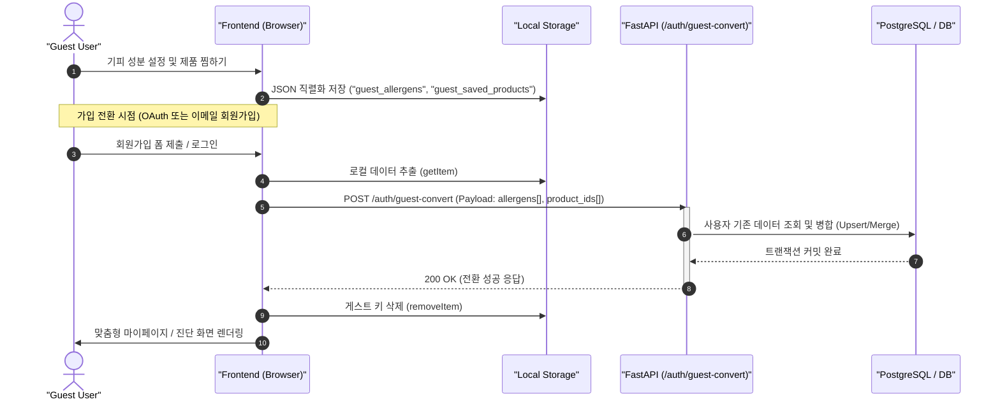

화장품 성분 분석 서비스 PickSafe를 개발하며 가장 신경 썼던 지점 중 하나는 **'첫 진입 사용자가 가치(Value)를 경험하기까지 걸리는 시간(Time to Value)'**을 최소화하는 것이었습니다. 

모바일 웹을 통해 유입된 사용자나 외국인 관광객이 제품 패키지의 성분표를 촬영하고 즉시 유해/알레르기 유발 성분을 확인하고 싶을 때, 강제적인 회원가입과 소셜 로그인 팝업은 가장 큰 이탈 요인이 됩니다. 따라서 로그인 없이 즉각 핵심 기능을 탐색할 수 있는 '게스트 모드(Guest Mode)'를 우선 도입하기로 결정했습니다.

하지만 게스트 모드를 도입하자마자 새로운 엔지니어링 문제가 발생했습니다. 비회원 상태에서 사용자가 설정한 '기피 성분(Allergens)'과 '찜한 화장품(Saved Products)' 목록을 어떻게 안전하게 유지하고, 추후 정식 회원으로 전환될 때 유실 없이 서버로 병합(Data Migration)할 것인가에 대한 고민이었습니다.

---

## 🎯 마주한 고민과 문제 배경

초기 기획에서는 비회원도 온보딩 과정을 거치며 피부 타입과 알레르기 유발 성분을 선택할 수 있고, 진단 결과 페이지에서 마음에 드는 제품을 북마크할 수 있도록 지원해야 했습니다.

이때 선택할 수 있는 데이터 저장 전략은 크게 두 가지였습니다.

1. **서버 세션 및 임시 회원(Anonymous User) 레코드 생성**
2. **클라이언트 브라우저 스토리지 활용**

처음에는 일반적인 웹 애플리케이션처럼 서버 데이터베이스에 임시 UUID를 발급하여 `Guest_User` 레코드를 쌓는 방식을 검토했습니다. 그러나 다음과 같은 명확한 한계와 비용 문제가 드러났습니다.

- **데이터베이스 오염 및 리소스 낭비**: 일회성으로 방문하고 이탈하는 수많은 트래픽에 대해 매번 DB 커넥션을 맺고 세션 테이블에 쓰기(Write) 작업을 수행하면, 데이터베이스에 쓰레기 데이터(Dead Records)가 기하급수적으로 누적됩니다.
- **주기적인 배치 청소 비용**: 만료된 게스트 세션을 정리하기 위해 별도의 크론(Cron) 작업이나 청소 배치를 상시 가동해야 하며, 이는 인프라 운영 비용으로 이어집니다.
- **네트워크 오버헤드**: 비회원의 단순 UI 상태 변경(성분 체크박스 토글 등)마다 불필요한 백엔드 API 호출이 발생합니다.

결과적으로 비회원 단계에서는 서버 자원을 전혀 소모하지 않으면서도, 기기 내에서 즉각적이고 영속적인 상태 저장이 가능한 클라이언트 사이드 스토리지 패턴이 필요했습니다.

---

## ⚖️ 기술적 대안 비교 및 선택 이유

클라이언트 측 저장소 후보로 `Cookie`, `sessionStorage`, `localStorage`, `IndexedDB`를 두고 현실적인 장단점을 비교했습니다.

| 비교 항목 | Cookie | sessionStorage | localStorage (선택) | IndexedDB |
| :--- | :--- | :--- | :--- | :--- |
| **용량 한계** | 4KB (매우 협소) | ~5MB | ~5MB | >50MB |
| **생명 주기** | 만료일 지정 가능 | 탭/창 종료 시 증발 | 브라우저 캐시 삭제 전까지 영속 | 브라우저 캐시 삭제 전까지 영속 |
| **네트워크 비용** | 매 HTTP 요청마다 자동 전송 (오버헤드) | 전송 안 됨 | 전송 안 됨 | 전송 안 됨 |
| **구현 복잡도** | 낮음 | 낮음 | 매우 낮음 (동기 API) | 높음 (비동기, 스키마 관리 필요) |
| **적합성 평가** | 부적합 (네트워크 낭비) | 부적합 (탭 닫으면 데이터 유실) | **최적 (영속성 + 단순성)** | 오버엔지니어링 |

### 선택 이유: `localStorage`

- **영속성**: 사용자가 브라우저 탭을 닫거나 며칠 뒤 다시 방문하더라도 설정해 둔 기피 성분과 찜 목록이 그대로 유지되어야 했습니다. `sessionStorage`는 탭 종료 시 데이터가 날아가므로 탈락했습니다.
- **네트워크 효율**: `Cookie`는 매 API 요청의 헤더에 실려 나가기 때문에 서버 대역폭을 낭비하지만, `localStorage`는 클라이언트 자바스크립트에서 명시적으로 읽고 쓸 때만 제어할 수 있어 효율적입니다.
- **적정 기술**: 저장해야 할 데이터가 단순 ID 배열 형태(`['paraben', 'fragrance']`, `[104, 209]`)이므로, `IndexedDB`와 같은 복잡한 트랜잭션 DB를 브라우저에 구성하는 것은 오버엔지니어링이라 판단했습니다.

---

## 🏗️ 시스템 아키텍처 및 흐름

게스트 사용자가 서비스를 탐색하다가 회원가입/로그인을 완료하는 순간, 로컬에 머물던 데이터를 서버 데이터베이스로 무손실 병합하는 전체 아키텍처 흐름입니다.



---

## 💻 핵심 구현 및 트러블슈팅

### 1. 프론트엔드: 스토리지 캡슐화와 이관 요청

로컬 스토리지 I/O를 비즈니스 로직과 분리하기 위해 헬퍼 모듈을 작성하고, 인증 성공 이벤트 직후 비동기로 `/auth/guest-convert`를 호출하도록 구성했습니다.

```javascript
// static/js/auth.js (일부 발췌)
const GuestStorage = {
    KEYS: {
        ALLERGENS: 'picksafe_guest_allergens',
        SAVED_PRODUCTS: 'picksafe_guest_saved_products'
    },

    getData() {
        return {
            allergens: JSON.parse(localStorage.getItem(this.KEYS.ALLERGENS) || '[]'),
            saved_products: JSON.parse(localStorage.getItem(this.KEYS.SAVED_PRODUCTS) || '[]')
        };
    },

    clear() {
        localStorage.removeItem(this.KEYS.ALLERGENS);
        localStorage.removeItem(this.KEYS.SAVED_PRODUCTS);
    }
};

async function convertGuestDataToServer(authToken) {
    const guestData = GuestStorage.getData();
    
    // 이관할 데이터가 없으면 API 호출 생략
    if (guestData.allergens.length === 0 && guestData.saved_products.length === 0) {
        return;
    }

    try {
        const response = await fetch('/auth/guest-convert', {
            method: 'POST',
            headers: {
                'Content-Type': 'application/json',
                'Authorization': `Bearer ${authToken}`
            },
            body: JSON.stringify({
                allergen_names: guestData.allergens,
                product_ids: guestData.saved_products
            })
        });

        if (response.ok) {
            GuestStorage.clear();
        } else {
            console.warn('게스트 데이터 동기화 실패 (서버 오류)');
        }
    } catch (error) {
        console.error('게스트 데이터 동기화 네트워크 에러:', error);
    }
}
```

### 2. 백엔드: 중복 방지 및 트랜잭션 멱등성 보장

단순히 `INSERT`를 날릴 경우, 사용자가 이미 계정을 가지고 있던 상태에서 재로그인할 때 Unique Constraint 위반이 발생할 수 있습니다. 이를 방지하기 위해 `Set`을 이용한 중복 제거 및 DB 레벨의 충돌 방지 로직을 구현했습니다.

```python
# routers/auth.py (FastAPI 예시)
from fastapi import APIRouter, Depends, HTTPException, status
from sqlalchemy.orm import Session
from typing import List
from pydantic import BaseModel
from database import get_db
from models import User, UserAllergen, SavedProduct
from core.security import get_current_user

router = APIRouter(prefix="/auth", tags=["Auth"])

class GuestConvertRequest(BaseModel):
    allergen_names: List[str]
    product_ids: List[int]

@router.post("/guest-convert", status_code=status.HTTP_200_OK)
def convert_guest_data(
    payload: GuestConvertRequest,
    current_user: User = Depends(get_current_user),
    db: Session = Depends(get_db)
):
    try:
        # 1. 기피 성분 병합 (기존 성분과의 중복 제거)
        existing_allergens = {
            ua.allergen_name for ua in current_user.allergens
        }
        new_allergens = set(payload.allergen_names) - existing_allergens
        
        for name in new_allergens:
            db.add(UserAllergen(user_id=current_user.id, allergen_name=name))

        # 2. 찜한 제품 병합
        existing_products = {
            sp.product_id for sp in current_user.saved_products
        }
        new_product_ids = set(payload.product_ids) - existing_products
        
        for pid in new_product_ids:
            db.add(SavedProduct(user_id=current_user.id, product_id=pid))

        db.commit()
        return {"message": "Data successfully merged", "merged_items_count": len(new_allergens) + len(new_product_ids)}

    except Exception as e:
        db.rollback()
        raise HTTPException(
            status_code=status.HTTP_500_INTERNAL_SERVER_ERROR,
            detail=f"게스트 데이터 병합 중 오류가 발생했습니다: {str(e)}"
        )
```

### 3. 트러블슈팅: 데이터 유실과 시점 불일치 문제

개발 및 테스트 과정에서 한 가지 치명적인 레이스 컨디션(Race Condition)을 겪었습니다.

- **문제**: 소셜 로그인(OAuth) 콜백 처리 후 메인 페이지로 리다이렉트되는 과정에서, 페이지 로딩 직후 `localStorage.clear()`가 먼저 실행되거나 반대로 백엔드 동기화 완료 전에 사용자가 브라우저를 이탈하면 데이터가 증발하는 현상이 있었습니다.
- **해결책**:
  1. 인증 완료 후 즉시 스토리지를 비우지 않고, 반드시 백엔드로부터 `HTTP 200 OK` 응답을 확인한 시점에만 `removeItem`을 트리거하도록 프로미스 체이닝을 강제했습니다.
  2. 만약 네트워크 순단으로 `/guest-convert` 요청이 실패하더라도 로컬 스토리지는 그대로 남겨두어, 다음번 로그인 세션이나 마이페이지 진입 시 재시도(Retry)할 수 있는 방어 로직을 추가했습니다.

---

## 💡 돌아보며 배운 점

1. **서버 리소스 절약과 비즈니스 메트릭의 양립**  
   불특정 다수가 접속하는 모바일 웹 환경에서 세션을 무작정 서버 DB에 생성하지 않고, 브라우저 로컬 자원을 격리된 저장소로 활용함으로써 백엔드 I/O 부하와 스토리지 낭비를 원천 차단할 수 있었습니다. 가입 전환 전까지 서버는 완전히 무상태(Stateless)를 유지합니다.

2. **사용자 경험(UX) 관점의 무마찰 흐름**  
   회원가입을 강제하지 않고 먼저 가치를 전달한 뒤, 가입 시점에 기존 선택값을 온전히 승계해 주는 흐름은 이탈률 감소에 결정적인 역할을 했습니다.

3. **향후 보완할 점**  
   현재 구조는 단일 디바이스(브라우저) 내의 데이터 이관에는 완벽하지만, 게스트 상태로 A 기기에서 탐색하다가 B 기기에서 새로 가입하는 크로스 디바이스(Cross-Device) 시나리오까지는 커버할 수 없습니다. 향후에는 온보딩 완료 시점에 단축 공유 링크나 임시 마이그레이션 토큰을 발급하는 방식을 검토하여 멀티 디바이스 전환 편의성을 보완할 계획입니다.