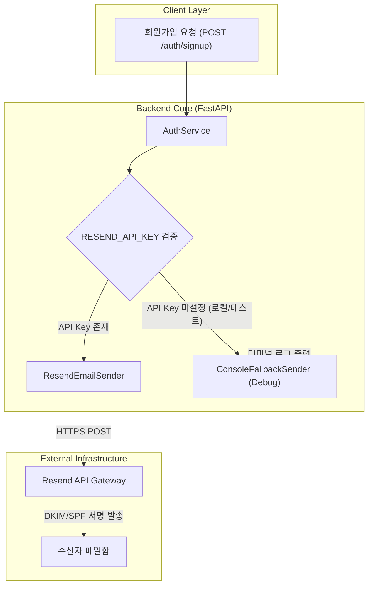

## 🎯 마주한 고민과 문제 배경

PickSafe의 회원가입 기능을 구현하면서 가장 먼저 직면한 과제 중 하나는 신뢰할 수 있는 이메일 인증 체계를 구축하는 일이었습니다. 서비스 특성상 유저가 입력한 성분 알레르기 정보와 피부 타입 등 개인화된 데이터를 안전하게 보관해야 하므로, 실재하는 이메일 주소인지 검증하는 절차는 필수적이었습니다.

초기 프로토타입 단계에서는 구현이 가장 단순한 Gmail SMTP 프로토콜을 활용해 인증 메일을 발송했습니다. Python 내장 라이브러리인 `smtplib`와 `email` 모듈을 조합해 구글 계정의 '앱 비밀번호'를 환경변수로 주입하는 방식이었습니다. 

하지만 로컬 테스트를 넘어 배포 환경을 고민하기 시작하면서 다음과 같은 현실적인 문제들이 드러났습니다.

1. **발신자 신뢰도 및 스팸 분류 문제**: `xxx@gmail.com` 형태의 일반 개인 계정 주소로 인증 메일을 발송하다 보니, 주요 메일 서비스(특히 네이버, 다음, 사내 메일망 등)에서 스팸 메일함으로 직행하거나 아예 수신이 차단되는 현상이 빈번했습니다.
2. **보안 관리의 취약점**: 개인 구글 계정의 앱 비밀번호를 사용하는 구조는 계정 탈취 위험이나 권한 분리 관점에서 안전하지 못했습니다. 키 유출 시 대응 수단이 계정 전체 보안 설정에 종속되는 문제가 있었습니다.
3. **인프라 연결성 한계**: 클라우드 서버 환경(AWS, GCP 등)에서는 보안 정책상 아웃바운드 SMTP 포트(25, 465, 587)가 기본적으로 제한되어 있거나 네트워크 지연이 발생하여, 동기식 메일 발송 시 API 응답 지연(Latency)이 사용자 경험을 크게 해쳤습니다.

이러한 문제들을 해결하기 위해 단순 SMTP 연결을 걷어내고, 현대적인 트랜잭션 메일 발송 API 서비스로의 전환을 결정했습니다.

---

## ⚖️ 기술적 대안 비교 및 선택 이유

트랜잭션 메일(Transactional Email) 발송을 위한 솔루션으로 널리 사용되는 대안들을 비교 검토했습니다.

| 비교 항목 | Gmail SMTP | AWS SES | Resend API |
| :--- | :--- | :--- | :--- |
| **통신 방식** | SMTP (Socket) | SDK / REST API | REST API (Modern SDK) |
| **도메인 인증 (DKIM/SPF)** | 불가 (Gmail 도메인 종속) | 가능 (복잡한 DNS 설정) | 가능 (직관적인 DNS 가이드) |
| **보안 및 키 관리** | 구글 계정 앱 비밀번호 | IAM 정책 기반 자격증명 | 세분화된 API Token 관리 |
| **초기 개발 생산성** | 보통 | 낮음 (Sandbox 탈출 필요) | 매우 높음 (즉시 테스트 도메인 제공) |
| **운영 비용** | 무료 (일일 발송 제한 존재) | 종량제 (매우 저렴) | 무료 티어 넉넉함 (월 3,000건) |

### 최종 선택: Resend API

검토 끝에 **Resend API**를 최종 도입하기로 결정했습니다. 선택한 주된 이유는 다음과 같습니다.

1. **개발 생산성과 Sandbox 경험**: AWS SES의 경우 프로덕션 발송을 위해 별도의 Sandbox 해제 요청 및 승인 절차를 거쳐야 하는 반면, Resend는 가입 즉시 제공되는 테스트 도메인(`onboarding@resend.dev`)을 통해 발송 파이프라인을 바로 검증할 수 있었습니다.
2. **도메인 전환의 유연성**: 초기에는 기본 테스트 도메인으로 연동하되, 커스텀 도메인 확보 후에는 DNS 레코드 등록 및 환경변수(`EMAIL_FROM_ADDRESS`) 수정만으로 즉시 프로덕션 도메인으로 스위칭할 수 있도록 설계가 가능했습니다.
3. **HTTP 기반의 안정적인 통신**: 방화벽이나 포트 차단 이슈가 많은 레거시 SMTP 대신, 표준 HTTPS 엔드포인트를 호출하므로 네트워크 예외 처리가 명확해집니다.

---

## 🏗️ 시스템 아키텍처 및 흐름

메일 발송 파이프라인은 설정 주입, 발송 엔진 추상화, 그리고 로컬 개발 환경을 위한 디버그 폴백(Fallback) 구조를 갖추도록 설계했습니다.



---

## 💻 핵심 구현 및 트러블슈팅

### 1. 발송 인터페이스 및 서비스 모듈화

환경에 따라 유연하게 대처할 수 있도록 이메일 발송 기능을 추상화하고, Resend SDK를 래핑한 모듈을 작성했습니다.

```python
import logging
import resend
from app.core.config import settings

logger = logging.getLogger(__name__)

class EmailDeliveryService:
    def __init__(self):
        self.api_key = settings.RESEND_API_KEY
        self.from_address = settings.EMAIL_FROM_ADDRESS
        if self.api_key:
            resend.api_key = self.api_key

    def send_verification_email(self, to_email: str, code: str) -> bool:
        # API 키가 주입되지 않은 로컬 개발 환경을 위한 폴백 로직
        if not self.api_key:
            logger.warning("[DEBUG] RESEND_API_KEY가 설정되지 않아 메일을 발송하지 않습니다.")
            logger.info(f"[DEBUG] Verification Code for {to_email}: {code}")
            return True

        try:
            params = {
                "from": self.from_address,
                "to": [to_email],
                "subject": "[PickSafe] 회원가입 이메일 인증 코드",
                "html": f"""
                <div style="font-family: sans-serif; padding: 20px;">
                    <h2>PickSafe 이메일 인증</h2>
                    <p>아래 6자리 인증 코드를 화면에 입력해 주세요.</p>
                    <h3 style="color: #2563eb; font-size: 24px;">{code}</h3>
                    <p>본 코드는 5분간 유효합니다.</p>
                </div>
                """,
            }
            response = resend.Emails.send(params)
            logger.info(f"이메일 발송 성공: {to_email} (ID: {response.get('id')})")
            return True

        except Exception as e:
            logger.error(f"이메일 발송 실패 ({to_email}): {str(e)}", exc_info=True)
            return False

email_service = EmailDeliveryService()
```

### 2. 마주친 문제와 해결: 로컬 환경과 CI 파이프라인의 종속성 격리

Resend API를 적용한 직후, 로컬에서 매번 실제 외부 API를 호출하거나 CI/CD 파이프라인에서 테스트 코드를 실행할 때 유효하지 않은 API Key로 인해 테스트가 실패하는 문제가 발생했습니다.

- **원인**: 외부 네트워크 의존성이 서비스 계층 초기화 시점에 강하게 결합되어 있었음.
- **해결**: `RESEND_API_KEY` 환경변수가 비어있을 경우, 예외를 발생시키는 대신 콘솔 로그로 인증 코드를 덤프하고 성공 상태를 반환하는 **디버깅 폴백 모드**를 추가했습니다. 덕분에 외부 서비스 결합 없이도 로컬 환경에서 회원가입 E2E 플로우를 막힘없이 검증할 수 있게 되었습니다.

---

## 💡 돌아보며 배운 점

1. **외부 서비스 연동 시 격리(Decoupling)의 중요성**: 메일 발송과 같은 외부 I/O 작업은 개발 환경, 스테이징, 프로덕션 환경에서 각기 다르게 동작해야 합니다. 초기부터 폴백 메커니즘을 고려해 둔 덕분에 로컬 개발 효율성을 해치지 않으면서 안정적인 프로덕션 파이프라인을 구축할 수 있었습니다.
2. **프로토콜(SMTP)보다 API 지향 구조의 이점**: 레거시 메일 전송 프로토콜에 의존하기보다 현대적인 RESTful API 서비스를 활용하는 것이 애플리케이션의 에러 핸들링, 보안(키 수명주기 관리), 유지보수 관점에서 훨씬 유리하다는 점을 확인했습니다.
3. **향후 보완 과제**: 현재는 단일 요청 흐름 내에서 동기적으로 API를 호출하고 있습니다. 가입 요청 트래픽이 증가할 경우 메일 발송 I/O로 인한 응답 지연을 방지하기 위해, 백그라운드 태스크(FastAPI `BackgroundTasks` 또는 Celery/Redis 기반 비동기 큐)로 발송 작업을 분리하는 최적화를 진행할 계획입니다.