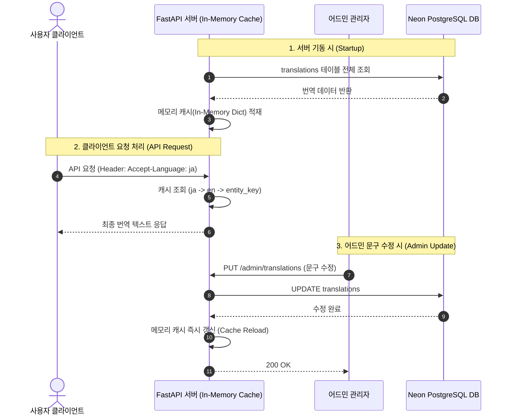

화장품 성분 분석 서비스 PickSafe를 개발하며 서비스 초기 아키텍처 단계에서 오랫동안 미결정 과제로 남아있던 **다국어(i18n) 지원 방식**을 최종 확정하고 구현했습니다. 

처음 다국어 기능을 구상할 때는 "모든 성분명과 스캔 결과 텍스트를 자동 번역 API로 처리하면 쉽지 않을까?"라고 단순하게 접근했으나, 실제 운영 안정성과 비용, 데이터의 정확성을 따져볼수록 상당한 엔지니어링 병목과 리스크가 예상되었습니다. 

본 글에서는 정적/동적 콘텐츠 분리를 통해 API 비용 및 오번역 리스크를 통제하고, DB 기반 메모리 캐시 및 체계적인 폴백(Fallback) 구조를 구축한 기술적 의사결정 과정을 담담하게 기록합니다.

---

## 🎯 마주한 고민과 문제 배경

PickSafe 서비스는 한국 사용자뿐만 아니라 방한 외국인 관광객과 해외 사용자를 타깃으로 설계하고 있습니다. 따라서 서비스 다국어화는 필수적인 요구사항이었습니다. 하지만 기획 초기 다국어 번역 범위를 설정하는 과정에서 크게 세 가지 현실적인 문제에 부딪혔습니다.

### 1. 동적 콘텐츠의 무제한 번역 비용 위험
사용자 스캔을 통해 실시간으로 생성되거나 조회되는 성분 분석 결과, 제품명 등의 동적 데이터(Dynamic Content)를 외부 유료 번역 API(Google Translate, DeepL 등)로 실시간 처리할 경우, 호출 건수에 비례해 외부 API 비용이 무제한으로 증가할 위험이 있었습니다.

### 2. 안전/성분 문구의 오번역으로 인한 도메인 리스크
화장품 성분 및 주의 성분 안내 텍스트는 건강 및 피부 안전과 직결됩니다. AI 번역 API가 성분 특이성이나 면책 문구를 임의로 해석하여 오번역을 발생시킬 경우, 서비스 신뢰도 저하 및 안전 문제로 직결될 수 있었습니다.

### 3. 코드 배포 없는 문구 관리의 필요성
UI 라벨, 버튼 텍스트, 안내 문구 등 정적 콘텐츠(Static Content)를 단순히 프론트엔드 코드 내 `json` 파일로 관리할 경우, 문구 오탈자를 수정할 때마다 매번 프론트엔드 앱을 빌드하고 배포해야 하는 운영상 번거로움이 존재했습니다.

---

## ⚖️ 기술적 대안 비교 및 선택 이유

이러한 문제를 해결하기 위해 다국어 처리 방식을 세 가지 대안으로 나누어 비교 검토했습니다.

| 대안 | 장점 | 단점 | 최종 채택 여부 |
|---|---|---|---|
| **A. 프론트엔드 정적 파일(JSON) 관리** | 서버 요청이 없고 구현이 매우 간결함 | 문구 수정 시마다 코드 배포 필요, 동적 데이터 확장 불가능 | 미채택 |
| **B. 전면 외부 번역 API 연동 (실시간 번역)** | 모든 동적 데이터의 즉각적인 번역 가능 | 호출 비용 폭증 risk, 성분 및 안전 문구 오번역 위험 | 미채택 |
| **C. DB 기반 정적 데이터 관리 + 동적 데이터 원문 노출 (채택)** | 실시간 배포 없는 문구 수정, 캐싱을 통한 DB 부하 저감, 데이터 정확성 보장 | 초기 DB 구조 및 어드민 UI 설계 필요 | **최종 선택** |

### 정적 데이터와 동적 데이터의 명확한 분리

최종적으로 콘텐츠를 **정적 데이터**와 **동적 데이터**로 분리하여 다르게 다루기로 결정했습니다.

1. **동적 데이터(성분명, 스캔 결과 등): 1차 MVP에서는 번역하지 않고 원문 그대로 노출**
   - 화장품 국제 성분명(INCI: International Nomenclature Cosmetic Ingredient)은 이미 라틴어/영어로 규격화된 글로벌 표준입니다. 한국 식약처 고시 성분명 역시 INCI 표기를 기반으로 둔 표준화된 명칭입니다.
   - 따라서 성분 데이터 자체는 이미 언어 중립적인 성격을 띱니다. 1차 MVP에서는 별도의 자동 API 번역을 도입하지 않고 식약처 원문(한글)과 INCI 표준(영문)을 그대로 노출하도록 결정했습니다.
   - 성분 매칭 실패 시에도 무리하게 번역을 시도하지 않고 "확인 불가"로 명확히 표시하여, 번역 누락과 데이터 누락을 혼동하지 않도록 조치했습니다.

2. **정적 데이터(UI 라벨, 버튼, 면책 문구): DB 기반 통합 관리**
   - 유한한 집합인 정적 UI 텍스트는 DB 테이블 하나로 관리하며, 서버 메모리에 캐싱하여 조회 성능을 극대화합니다.

### 지원 언어 선정 및 전략적 순위

방한 외국인 관광객 통계 데이터 및 초기 협력 파트너십을 기반으로 언어 지원 우선순위를 아래와 같이 정립했습니다.

1. **한국어(`ko`), 영어(`en`)**: 기본 지원 언어
2. **중국어 간체(`zh-CN`)**: 방한 관광객 비중 1위 데이터 반영
3. **일본어(`ja`)**: 방한 관광객 비중 2위 데이터 반영
4. **중국어 번체(`zh-TW`)**: 대만/홍콩 관광객 대응
5. **포르투갈어(`pt`)**: 브라질 소재 협력 파트너와의 파일럿 테스트 및 전략적 유입 유도를 위한 채택

---

## 🏗️ 시스템 아키텍처 및 흐름

설계한 다국어 시스템은 서버 기동 시 DB에서 번역 텍스트를 읽어와 메모리에 캐싱하고, 캐시 미스 또는 언어 누락 시 폴백(Fallback) 체인을 거치도록 구성했습니다. 

또한 어드민 화면에서 문구가 수정되면 API를 통해 메모리 캐시가 시신경처럼 즉시 갱신되도록 처리하여, Neon PostgreSQL 무료 티어의 DB 읽기 부하를 대폭 줄였습니다.



---

## 💻 핵심 구현 및 트러블슈팅

### 1. 단일 번역 테이블 스키마 설계

향후 동적 데이터(성분, 제품명) 번역으로 확장하더라도 테이블 스키마 변경 없이 그대로 재사용할 수 있도록 `entity_type`과 `entity_key` 체계를 정립했습니다.

```sql
CREATE TABLE translations (
    id UUID PRIMARY KEY DEFAULT gen_random_uuid(),
    entity_type VARCHAR(20) NOT NULL, -- 'ui_string' (현재 사용) / 'ingredient', 'product' (향후 확장용)
    entity_key VARCHAR(255) NOT NULL, -- 예: 'result.no_flagged'
    locale VARCHAR(10) NOT NULL,      -- 'ko', 'en', 'ja', 'zh-CN', 'zh-TW', 'pt'
    text TEXT NOT NULL,
    updated_at TIMESTAMP WITH TIME ZONE DEFAULT NOW(),
    
    CONSTRAINT uq_translations_entity_locale UNIQUE (entity_type, entity_key, locale)
);

CREATE INDEX idx_translations_lookup ON translations (entity_type, locale);
```

### 2. 폴백(Fallback) 체인 및 인메모리 캐시 구현

번역 텍스트가 누락되었을 때 빈 문자열(`""`)로 유실되면 클라이언트 화면이 깨지거나 원인을 파악하기 어렵습니다. 

이를 방지하기 위해 **요청 언어 ➔ `en`(기본 영어) ➔ `entity_key` 자체 노출** 순으로 이어지는 3단계 폴백 로직을 작성했습니다. 키 자체를 노출함으로써 UI 테스트 시 번역 누락을 즉시 직관적으로 발견할 수 있습니다.

```python
# app/core/i18n.py
import logging
from typing import Dict, Tuple, Optional

logger = logging.getLogger(__name__)

class TranslationManager:
    def __init__(self):
        # Cache Key Structure: (entity_type, entity_key, locale) -> text
        self._cache: Dict[Tuple[str, str, str], str] = {}
        self.default_locale = "en"

    def load_cache(self, translations_from_db: list):
        """서버 기동 시 또는 어드민 수정 시 캐시를 전면 갱신"""
        new_cache = {}
        for item in translations_from_db:
            key = (item.entity_type, item.entity_key, item.locale)
            new_cache[key] = item.text
        self._cache = new_cache
        logger.info(f"[i18n] Successfully loaded {len(self._cache)} translations into memory.")

    def get_text(self, entity_key: str, locale: str, entity_type: str = "ui_string") -> str:
        """
        3단계 Fallback Chain:
        1. 요청한 locale 텍스트 조회
        2. 없으면 기본 언어('en') 텍스트 조회
        3. 그래도 없으면 entity_key 문자열 자체를 반환하여 누락 인지 유도
        """
        # 1. Target Locale Lookup
        target_text = self._cache.get((entity_type, entity_key, locale))
        if target_text:
            return target_text

        # 2. Default Fallback ('en')
        fallback_text = self._cache.get((entity_type, entity_key, self.default_locale))
        if fallback_text:
            logger.warning(f"[i18n] Missing locale '{locale}' for key '{entity_key}'. Fallback to 'en'.")
            return fallback_text

        # 3. Final Fallback (Return entity_key itself)
        logger.error(f"[i18n] Missing translation for key '{entity_key}' in all fallbacks. Displaying key name.")
        return entity_key

i18n_manager = TranslationManager()
```

### 3. 개발 중 마주친 트러블슈팅: 어드민 대조 UI 구조 문제

어드민 페이지에서 번역 관리를 구현할 때, 단순히 행(Row) 단위로 언어 목록을 나열하면 **"특정 키에 어떤 언어가 번역되지 않고 비어있는지"** 파악하기가 매우 까다로웠습니다.

- **문제 해결:** 어드민 대조 화면 피벗(Pivot) 응답 API 제공
  어드민 전용 API(`/admin/translations/grid`)를 마련하여, DB 상의 가로/세로 데이터를 피벗 테이블 형태로 변환하여 반환하도록 개선했습니다. `ko` 기준 원문을 좌측 첫 번째 컬럼에 고정하고, 나머지 언어 컬럼(`en`, `ja`, `zh-CN` 등)을 나란히 배치하여 빈 셀(누락 항목)이 시각적으로 즉시 드러나도록 조치했습니다.

```python
# app/api/admin_translations.py
@router.get("/admin/translations/grid")
async def get_translation_grid(db: Session = Depends(get_db)):
    """어드민 관리용 대조 그리드 데이터 반환"""
    records = db.query(Translation).all()
    
    grid_map = {}
    for r in records:
        if r.entity_key not in grid_map:
            grid_map[r.entity_key] = {"entity_key": r.entity_key}
        grid_map[r.entity_key][r.locale] = r.text
        
    return list(grid_map.values())
```

---

## 💡 돌아보며 배운 점 (회고)

PickSafe 다국어 아키텍처를 설계하고 적용하면서 얻은 기술적 회고와 교훈은 다음과 같습니다.

### 1. 도메인 특성에 대한 이해가 엔지니어링 비용을 결정한다
모든 데이터를 다국어로 변환하겠다는 욕심을 내려놓고, 화장품 성분 데이터(INCI)가 지닌 국제 표준성을 이해한 것이 아키텍처를 단순하게 다듬는 데 큰 도움이 되었습니다. 동적 콘텐츠의 API 번역을 보류하고 원문을 노출하는 선택을 통해 **불필요한 외부 API 비용과 안전 문구 오번역 위험을 동시에 예방**할 수 있었습니다.

### 2. 예외를 조용히 덮지 않는 폴백 전략
번역 텍스트가 없을 때 빈 문자열(`""`)이나 임의의 빈 값을 반환하도록 방치하지 않고 `entity_key` 자체를 화면에 드러나게 한 폴백 전략은 개발 및 QA 과정에서 번역 누락을 발견하는 시간을 대폭 줄여주었습니다.

### 3. 향후 과제 및 확장성
현재는 `ui_string` 유형의 정적 텍스트만 처리하고 있으나, 스키마에 `entity_type` 컬럼을 유연하게 설계해 둔 덕분에 추후 해외 사용자 유입 통계에 따라 동적 성분 데이터 번역이 필요해지더라도 기존 데이터베이스 테이블 및 어드민 관리 로직을 수정 없이 그대로 확장 재사용할 수 있을 것입니다.