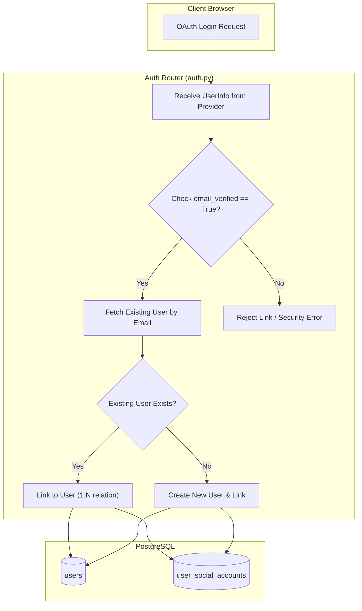

화장품 성분 분석 서비스 PickSafe를 개발하며 서비스 초기 설계 단계에서 단순하게 처리했던 사용자 인증 구조와 프론트엔드 스타일링을 정비했습니다. 

단순히 "소셜 로그인이 작동한다"는 수준에 만족하고 넘어갔던 부분들이 사용자 세션 꼬임, 타인 계정 무단 점유 가능성, 로컬 개발 환경에서의 메일 발송 병목 등의 문제로 되돌아왔기 때문입니다.

이번 글에서는 소셜 로그인 1:N 구조 분리 과정과 OAuth security validation 강화, 로컬 DX(Developer Experience) 개선을 위한 이메일 폴백 모드, 그리고 서비스 정체성에 맞춘 UI 리뉴얼 경험을 기술적으로 되짚어보고자 합니다.

---

## 🎯 마주한 고민과 문제 배경

### 1. 단일 소셜 계정 덮어쓰기 문제 (1:1 매핑의 한계)
초기 DB 구조는 `users` 테이블 단일 엔티티 내에 소셜 프로바이더 정보(`provider`, `social_id`)를 직접 들고 있었습니다. 
이로 인해 동일한 이메일 주소(`user@example.com`)를 사용하는 사용자가 구글로 회원가입 후 페이스북이나 타 소셜 서비스로 로그인을 시도할 경우, 기존 소셜 연동 정보가 덮어씌워지거나 기존 계정과 분리된 파편화 데이터가 생성되는 치명적인 문제가 있었습니다.

### 2. OAuth 계정 탈취 위험 (`email_verified` 미검증)
일부 OAuth 프로바이더는 이메일 실소유 여부 검증(`email_verified`)이 되지 않은 상태에서도 이메일 값을 반환합니다. 만약 시스템이 이메일 주소만으로 기존 회원 계정과 소셜 계정을 자동 매핑(Auto-linking)한다면, 타인의 이메일로 가짜 소셜 계정을 만든 공격자가 피해자의 계정으로 자동 로그인할 수 있는 보안 구멍이 존재했습니다.

### 3. 로컬 개발 환경의 이메일 인증 병목
회원가입 메일 발송 서비스로 Resend API를 도입했는데, 로컬 개발 환경(`ENV=dev`)에서는 샌드박스 메일 수신 주소 제한으로 인해 403 Forbidden 에러가 빈번하게 발생했습니다. 이로 인해 로컬 디버깅 시 회원가입 흐름 전체가 차단되는 병목을 겪었습니다.

### 4. 도메인 성격과 불일치하는 다크 테마 UI
초기 UI는 다크 네이비 톤의 범용 테마로 구성되어 있었는데, PickSafe의 핵심 브랜드 이미지(민트 그린, 파스텔 핑크 계열의 아기자기하고 정돈된 룩앤필)와 거리가 멀었습니다. 화장품 성분 분석이라는 서비스 성격에 맞게 맑고 친근한 분위기로 visual identity를 통일할 필요성이 제기되었습니다.

---

## ⚖️ 기술적 대안 비교 및 선택 이유

### 1. 소셜 계정 구조 설계 대안

| 구분 | 대안 A: users 테이블 내 프로바이더별 컬럼 추가 | 대안 B: 별도 매핑 테이블 분리 (1:N 연동) |
| :--- | :--- | :--- |
| **구조** | `users`에 `google_id`, `kakao_id` 등 컬럼 계속 추가 | `user_social_accounts` 매핑 테이블 분리 |
| **장점** | 조회 쿼리가 단순함 (JOIN 불필요) | 소셜 프로바이더 추가/삭제가 유연함, 1개의 계정에 N개 소셜 연동 가능 |
| **단점** | 새로운 연동 서비스가 늘어날 때마다 테이블 스키마 변경 필요 | 로그인 시 JOIN 비용 소폭 발생 |
| **선택** | ❌ 탈락 | **✅ 최종 선택** |

**선택 이유:** 사용자 아이덴티티 하나에 여러 소셜 로그인 수단을 자유롭게 연결 및 해제할 수 있어야 사용자 데이터 파편화를 막을 수 있다고 판단했습니다. JOIN 비용은 적절한 외래키 인덱싱으로 충분히 커버 가능하다고 보았습니다.

### 2. 로컬 개발용 이메일 발송 처리 대안

*   **대안 A (외부 테스트 메일 서버 구축):** Mailtrap 등 별도의 SMTP Mock 서버 연동
    *   *한계:* 설정 복잡도 증가 및 외부 네트워크 의존성 지속
*   **대안 B (개발 환경 터미널 콘솔 로그 폴백):** `ENV=dev` 및 API 에러 발생 시 인증 링크를 콘솔 출력으로 스킵
    *   *장점:* 외부 API 차단 상황에서도 로컬 디버깅 흐름을 단절 없이 완전히 통제 가능

**선택 이유:** 테스트 가입 흐름의 본질은 "인증 토큰 링크를 획득하여 엔드포인트를 호출하는 것"이므로, 로컬 환경에 한해 터미널 콘솔로 링크를 출력하는 대안 B가 훨씬 직관적이고 가벼웠습니다.

---

## 🏗️ 시스템 아키텍처 및 흐름

새롭게 정의한 소셜 계정 검증 및 로그인 처리 흐름과 엔티티 관계도입니다.



---

## 💻 핵심 구현 및 트러블슈팅

### 1. DB 스키마 분리 및 자가 진단 마이그레이션

`UserSocialAccount` 모델을 신설하여 1:N 관계를 맺도록 설정했습니다. 기존 `users` 테이블과의 호환성을 유지하면서, 서버 구동 시 `role` 컬럼 미존재로 발생하는 에러를 방지하기 위해 자가 진단 DDL을 적용했습니다.

```python
# web/backend/app/models/user.py (일부)

class User(Base):
    __tablename__ = "users"

    id = Column(Integer, primary_order=True, primary_key=True, index=True)
    email = Column(String(255), unique=True, index=True, nullable=False)
    hashed_password = Column(String(255), nullable=True)
    role = Column(String(50), default="user", nullable=False)
    
    # 1:N 연동 관계 정의
    social_accounts = relationship("UserSocialAccount", back_populates="user", cascade="all, delete-orphan")

class UserSocialAccount(Base):
    __tablename__ = "user_social_accounts"

    id = Column(Integer, primary_key=True, index=True)
    user_id = Column(Integer, ForeignKey("users.id", ondelete="CASCADE"), nullable=False)
    provider = Column(String(50), nullable=False)  # google, facebook, etc.
    social_id = Column(String(255), nullable=False)
    created_at = Column(DateTime, default=datetime.utcnow)

    user = relationship("User", back_populates="social_accounts")
    __table_args__ = (UniqueConstraint("provider", "social_id", name="uix_provider_social_id"),)
```

백엔드 엔진 로딩 시 DDL 안전장치를 두어 데이터베이스 마이그레이션 이탈을 방지했습니다.

```python
# web/backend/app/main.py (일부)

def ensure_schema_integrity(db_engine):
    with db_engine.connect() as conn:
        # role 컬럼 부재로 인한 SQL 에러 자가 진단 및 방어 조치
        conn.execute(text("ALTER TABLE users ADD COLUMN IF NOT EXISTS role VARCHAR(50) DEFAULT 'user' NOT NULL;"))
        conn.commit()
```

### 2. 인증 보안 필터링: `email_verified` 검증 로직

OAuth 프로바이더로부터 전송된 `email_verified` 상태값을 검증하여 안전할 때만 1:N 자동 연동을 수행하도록 보완했습니다.

```python
# web/backend/app/routers/auth.py (일부)

@router.get("/oauth/callback/{provider}")
async def oauth_callback(provider: str, code: str, db: Session = Depends(get_db)):
    user_info = await get_social_user_info(provider, code)
    
    email = user_info.get("email")
    is_verified = user_info.get("email_verified", False)
    social_id = str(user_info.get("id"))

    # 1. 기존 연동된 소셜 계정이 있는지 확인
    social_acc = db.query(UserSocialAccount).filter_by(provider=provider, social_id=social_id).first()
    if social_acc:
        return create_access_token_response(social_acc.user)

    # 2. 이메일 기반 계정 매핑 시 보안 필터링
    existing_user = db.query(User).filter_by(email=email).first()
    if existing_user:
        if not is_verified:
            # 이메일 미검증 소셜 계정의 자동 연동 시도 거부 (계정 탈취 방지)
            raise HTTPException(
                status_code=400, 
                detail="검증되지 않은 소셜 이메일 계정입니다. 해당 이메일로 자동 연동할 수 없습니다."
            )
        
        # 신뢰할 수 있는 소셜 요청에 한해 1:N 매핑 추가
        new_social = UserSocialAccount(user_id=existing_user.id, provider=provider, social_id=social_id)
        db.add(new_social)
        db.commit()
        return create_access_token_response(existing_user)

    # 3. 최초 가입인 경우 신규 유저 및 소셜 매핑 동시 생성
    ...
```

### 3. 로컬 이메일 발송 개발용 폴백(Fallback) 처리

Resend API 403 에러로 인한 로컬 테스트 중단을 막기 위해, 에러를 스킵하고 인메모리/콘솔 출력으로 전환하는 폴백 코드를 작성했습니다.

```python
# web/backend/app/services/email_service.py (일부)

async def send_verification_email(email: str, token: str):
    verify_url = f"{SETTINGS.APP_DOMAIN}/auth/verify-email?token={token}"
    
    try:
        # Resend API 호출 시도
        response = await resend_client.send_email(...)
    except Exception as e:
        if SETTINGS.ENV == "dev":
            # 개발 모드 환경에서 API 실패 발생 시 콘솔 로그 출력으로 폴백
            print("\n==================================================")
            print(f"[이메일 발송 개발용 폴백] 수신자: {email}")
            print(f"[인증 링크]: {verify_url}")
            print("==================================================\n")
            return True
        # 운영 환경에서는 에러를 상위로 전파
        raise e
```

### 4. 파스텔 톤 디자인 시스템 리뉴얼

로고 이미지(`picksafe_log.png`)의 색상 아이덴티티를 바탕으로 CSS 커스텀 변수를 체계화했습니다.

```css
/* web/frontend/static/css/styles.css (일부) */

:root {
  /* 로고 기반 브랜드 파스텔 컬러 팔레트 */
  --color-primary-mint: #5ABFAD;
  --color-secondary-pink: #F4A5B0;
  --color-bg-cream: #FFF8F0;
  --color-text-main: #2D3748;
  --color-white: #FFFFFF;
  
  --font-family-base: 'Nunito', -apple-system, BlinkMacSystemFont, "Segoe UI", Roboto, sans-serif;
}

body {
  background-color: var(--color-bg-cream);
  color: var(--color-text-main);
  font-family: var(--font-family-base);
}

/* 로고 마우스 오버 인터랙션 (윙크 이미지 전환) */
.brand-logo {
  content: url('/static/images/picksafe_log.png');
  transition: all 0.2s ease-in-out;
}

.brand-logo:hover {
  content: url('/static/images/picksafe_log_on.png');
}
```

해당 디자인 가벤트를 적용하여 8개 HTML 템플릿(`home.html`, `login.html`, `scan.html`, `mypage.html` 등)의 구조적 시각 톤을 한 번에 정돈했습니다.

---

## 💡 돌아보며 배운 점 (회고)

### 1. 초기 모델링 시 "확장성"에 대한 경각심
처음 OAuth 서비스를 만들 때 단순히 '단일 소셜 로그인만 지원해도 충분하겠지'라고 판단했던 점이 데이터 구조 개편이라는 작업으로 돌아왔습니다. 사용자 식별자(Identity)와 인증 수단(Authentication Providers)은 비즈니스 초기부터 **1:N 구조로 명확히 분리**하여 다루어야 한다는 점을 배웠습니다.

### 2. Security Validation과 DX 사이의 균형
`email_verified` 값 검증 없이 구현된 단순 계정 매핑은 보안 측면에서 매우 취약한 선택이 될 수 있었습니다. 한편으로는 로컬 개발 시 겪는 API 제약(Resend 샌드박스 제한)을 무조건 환경 탓으로 돌리지 않고, 서비스 내에 안전한 **개발용 폴백 모드(Dev Fallback)**를 마련함으로써 전체적인 테스트 생산성을 끌어올릴 수 있었습니다.

### 3. 일관성 있는 디자인 언어의 중요성
성분 분석이라는 기능적 신뢰성과 시각적 우호성을 전달하기 위해 테마 변수를 일원화하는 과정 역시 엔지니어링의 연장선이었습니다. 테마 시스템을 CSS 변수로 추상화해둔 덕분에 전체 8개 화면 리뉴얼 작업을 부작용 없이 완료할 수 있었습니다.

다음 단계로는 데이터베이스 마이그레이션의 명시적 관리를 위해 Alembic 도구를 본격 도입하고, 연결된 소셜 계정을 사용자가 마이페이지에서 직접 해제(Unlink)할 수 있는 관리 기능을 추가할 예정입니다.