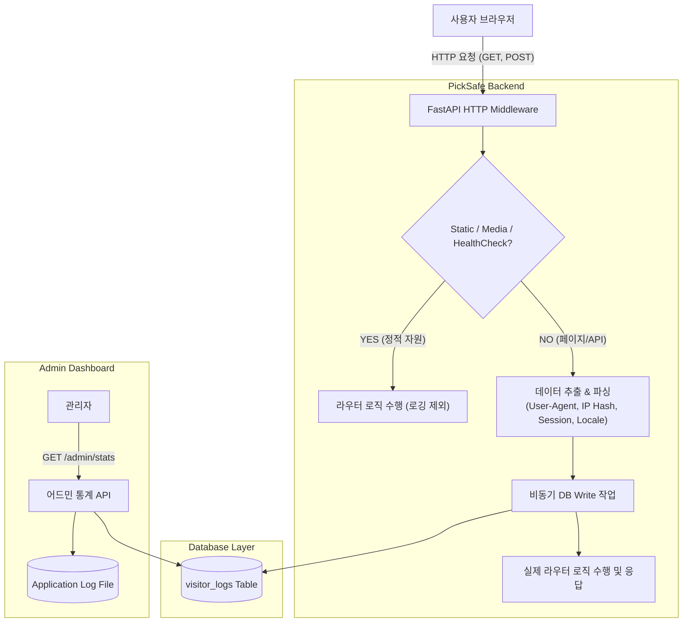

화장품 성분 분석 서비스인 PickSafe를 개발하면서 사용자 유입 흐름과 에러 모니터링 체계를 구축해야 하는 시점이 왔습니다. 

처음에는 Google Analytics(GA4)나 Amplitude 같은 외부 트래킹 SDK를 붙이는 방식을 떠올렸으나, PickSafe의 서비스 특성과 운영 환경을 고려했을 때 몇 가지 분명한 한계와 문제점이 보였습니다. 프라이버시를 보호하면서도 로컬/PWA 환경의 반응성을 저해하지 않고, 서비스 내부 데이터를 정밀하게 수집하기 위해 **미들웨어 기반의 자체 로깅 및 DB 적재 방식**을 설계하고 구현했습니다.

이 글에서는 해당 모니터링 파이프라인을 설계하며 마주쳤던 기술적 고민과 대안 비교, 트러블슈팅 과정을 기록합니다.

---

## 🎯 마주한 고민과 문제 배경

PickSafe 서비스의 모니터링 체계를 구상할 때 마주한 주요 도전 과제는 다음과 같았습니다.

1. **외부 클라이언트 라이브러리 추가에 따른 성능 및 프라이버시 문제**
   * PickSafe는 오프라인 PWA 성격을 일부 띠고 있어 초기 로딩 속도와 스크립트 경량화가 중요합니다. 외부 서드파티 스크립트(GA 등)를 추가하면 네트워크 클라이언트 부하가 늘어나고, 광고사단 확장프로그램(AdBlocker)에 의해 유입 통계가 차단되는 현상이 빈번했습니다.
   * 개인의 피부 타입 및 성분 검색 기록은 프라이버시 민감도가 높습니다. 원본 IP나 사용자 데이터를 외부에 직접 전송하는 구조를 피하고 싶었습니다.

2. **로그와 내부 사용자 데이터 연동의 한계**
   * 외부 분석 도구는 로그인한 유저 세션 정보나 검색 실패 패턴, 내부 Gemini API 호출 실패 로그 등을 DB의 실제 서비스 데이터와 유기적으로 결합하여 분석하기 어렵습니다.

3. **실시간 에러 모니터링 체계의 부재**
   * 서비스 내 500 에러, Gemini API 서킷 브레이커 작동, DB 연결 실패 등의 시스템 에러를 어드민 영역에서 실시간으로 관측할 수 있는 경량 모니터링 파이프라인이 필요했습니다.

---

## ⚖️ 기술적 대안 비교 및 선택 이유

요구사항을 충족하기 위해 크게 세 가지 대안을 검토했습니다.

| 항목 | 대안 A: 서드파티 SDK (GA4 / Amplitude) | 대안 B: 풀스택 APM (Datadog / Sentry) | 대안 C: FastAPI 미들웨어 + 자체 DB 적재 (선택) |
| :--- | :--- | :--- | :--- |
| **도입 공수** | 매우 낮음 (JS 스크립트 삽입) | 낮음~보통 (SDK 연동 및 설정) | 보통 (미들웨어 및 DB 스키마 개발 필요) |
| **클라이언트 오버헤드** | 있음 (외부 JS 파싱 및 실행) | 최소 수준 | **없음 (서버 사이드에서 집계)** |
| **데이터 소유권 & 보안** | 외부 서버에 저장됨 | 외부 서버에 저장됨 | **자체 DB 저장 (IP 해시화 등 프라이버시 제어 가능)** |
| **차단율 (AdBlocker)** | 높음 (유효 유입 누락 발생) | 낮음 | **0% (서버 미들웨어 수집)** |
| **운영 비용** | 무상~트래픽 비례 | 트래픽 증가 시 비용 부담 큼 | **기존 DB/서버 자원 활용 (추가 비용 없음)** |

### 최종 선택 이유
PickSafe 서비스 특성상 **서버 사이드 미들웨어 수집 방식(대안 C)**이 가장 적합하다고 판단했습니다. 

클라이언트 사이드 overhead가 전혀 없고, 로그인 유저 데이터와의 연동이 용이하며, IP를 서버 단에서 단방향 해시(SHA-256)로 변환하여 저장함으로써 사용자 프라이버시를 안전하게 보호할 수 있기 때문입니다.

---

## 🏗️ 시스템 아키텍처 및 흐름

전체적인 데이터 흐름은 FastAPI 미들웨어가 통로 역할을 맡고, 정적 자원 요청을 필터링한 후 비동기로 DB에 수집하는 구조입니다.



---

## 💻 핵심 구현 및 트러블슈팅

### 1. 데이터베이스 스키마 설계 (`visitor_logs`)

수집된 로그를 바탕으로 PV(Page View), UV(Unique Visitor), 접속 기기 분포, 인기 검색 경로 등을 빠르게 조회할 수 있도록 인덱스를 추가하여 스키마를 구성했습니다.

```sql
CREATE TABLE visitor_logs (
    id VARCHAR(36) PRIMARY KEY,
    ip_hash VARCHAR(64) NOT NULL,       -- SHA-256 단방향 해시 처리된 IP
    session_id VARCHAR(100) NOT NULL,   -- 세션 브라우저 식별자
    user_id VARCHAR(36) REFERENCES users(id) ON DELETE SET NULL,
    path VARCHAR(255) NOT NULL,         -- 방문 경로 (예: '/', '/scan')
    method VARCHAR(10) NOT NULL,        -- HTTP Method
    user_agent TEXT,                    -- 원본 User-Agent
    browser VARCHAR(50),                -- 파싱된 브라우저명
    os VARCHAR(50),                     -- 파싱된 OS명
    locale VARCHAR(10),                 -- 유저 접속 언어 Header/Cookie
    referer TEXT,                       -- 유입 경로
    created_at TIMESTAMP DEFAULT CURRENT_TIMESTAMP
);

-- 일자별/기간별 집계 쿼리 최적화를 위한 인덱스
CREATE INDEX idx_visitor_logs_created_at ON visitor_logs(created_at);
CREATE INDEX idx_visitor_logs_ip_session ON visitor_logs(ip_hash, session_id);
```

### 2. FastAPI 미들웨어 트래킹 구현

미들웨어에서는 성능 저하를 방지하기 위해 정적 자원(`.css`, `.js`, `/static/`, `/favicon.ico`) 필터링을 최우선으로 처리하고, `user-agents` 라이브러리를 통해 UA를 분석합니다.

```python
import hashlib
from fastapi import Request
from starlette.middleware.base import BaseHTTPMiddleware
from user_agents import parse
import uuid

# 보안을 위해 환경변수에서 솔트 값을 로드하도록 추상화
HASH_SALT = SETTINGS.IP_HASH_SALT

class AnalyticsMiddleware(BaseHTTPMiddleware):
    async def dispatch(self, request: Request, call_next):
        path = request.url.path
        
        # 1. 정적 자원 및 헬스체크 경로는 로깅 대상에서 제외
        if path.startswith("/static") or path.endswith((".css", ".js", ".ico", ".png", ".jpg")):
            return await call_next(request)

        # 2. 개인정보 보호를 위한 IP 해시화
        client_ip = request.client.host if request.client else "unknown"
        ip_hash = hashlib.sha256(f"{client_ip}{HASH_SALT}".encode()).hexdigest()

        # 3. User-Agent 파싱 및 헤더 추출
        raw_ua = request.headers.get("user-agent", "")
        parsed_ua = parse(raw_ua)
        
        browser = parsed_ua.browser.family
        os_sys = parsed_ua.os.family
        locale = request.headers.get("accept-language", "").split(",")[0][:10]
        session_id = request.cookies.get("session_id", str(uuid.uuid4()))
        referer = request.headers.get("referer", "")

        # 4. 비동기 백그라운드 작업으로 DB 적재 (응답 지연 방지)
        # 실제 구현에서는 BackgroundTasks나 Async Session을 활용하여 Non-blocking으로 실행
        request.state.visitor_log_data = {
            "ip_hash": ip_hash,
            "session_id": session_id,
            "path": path,
            "method": request.method,
            "user_agent": raw_ua,
            "browser": browser,
            "os": os_sys,
            "locale": locale,
            "referer": referer
        }

        response = await call_next(request)

        # 응답 완료 후 로그 적재 로직 호출 (예시)
        await self._log_to_db(request)

        return response

    async def _log_to_db(self, request: Request):
        try:
            log_data = getattr(request.state, "visitor_log_data", None)
            if log_data:
                # DB Insert 수행
                pass
        except Exception as e:
            # 로깅 실패가 메인 비즈니스 로직을 중단시키지 않도록 예외 처리
            logger.error(f"Failed to save visitor log: {e}")
        
```

### 3. 트러블슈팅: 미들웨어 동기 DB 작업으로 인한 I/O 병목

#### [문제 현상]
미들웨어 도입 초기, 각 요청마다 DB `INSERT` 구문을 블로킹 방식으로 호출하자 API 전체 평균 응답 시간(Latency)이 기존 45ms에서 120ms로 급격히 증가하는 병목이 발생했습니다. 

#### [원인 분석]
FastAPI의 미들웨어 내부에서 동기식 DB 드라이버 호출이나, await 처리되더라도 세션 생성/커밋 비용이 매 HTTP 요청마다 동기적으로 체인되어 라우터 핸들러 실행을 지연시키고 있었습니다.

#### [해결 방법]
* **I/O 분리 및 Fire-and-Forget 처리**: 로그 적재 구문을 라우터 응답 반환 흐름과 완전 분리했습니다. `BackgroundTasks` 파이프라인으로 넘기거나, SQLAlchemy의 AsyncSession을 활용해 DB 쓰기 작업이 메인 응답 트랜잭션을 막지 않도록 개선했습니다.
* **결과**: API 응답 지연을 미들웨어 도입 전 수준인 48ms 대로 다시 회복시켰습니다.

---

## 💡 돌아보며 배운 점 (회고)

이번 방문자 분석 및 모니터링 파이프라인을 구축하면서 얻은 주요 엔지니어링 교훈은 다음과 같습니다.

1. **무조건적인 서드파티 도입 지양**
   개발 초기에는 GA4나 Sentry 같은 검증된 외부 솔루션을 전적으로 의존하는 것이 당연하다고 생각하기 쉽습니다. 그러나 서비스의 특성(PWA, 프라이버시 중심 도메인)에 따라 서버 사이드 기반의 경량화된 자체 미들웨어가 데이터 신뢰성과 성능 측면에서 더 훌륭한 대안이 될 수 있음을 배웠습니다.

2. **미들웨어 설계 시 I/O 부하에 대한 경계**
   모든 요청을 관통하는 미들웨어 단에 단 몇 밀리초의 지연이나 예외 케이스가 존재하더라도, 전체 서비스 성능 전체에 치명적인 영향을 줄 수 있음을 직접 체감했습니다. 미들웨어 로직은 **'최대한 가볍게, 정적 예외 처리는 가장 빠르게, Persistence 작업은 비동기로'** 처리해야 함을 명심하게 되었습니다.

3. **향후 개선 과제**
   현재 구조는 단일 DB 테이블에 직접 로그를 쓰도록 되어 있습니다. 추후 서비스 유입량이 대폭 증가할 경우 DB Write IOPS 부하가 가중될 수 있습니다. 다음 단계에서는 Redis Buffer(Pub/Sub 또는 List)에 차곡차곡 쌓은 뒤 배치(Batch)로 DB에 Bulk Insert하는 파이프라인으로 고도화하는 방향을 검토하고 있습니다.