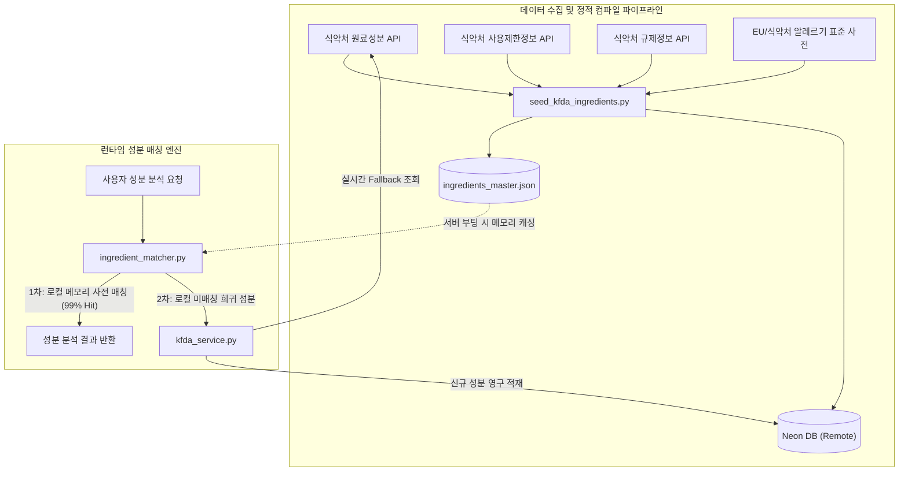

화장품 성분 분석 서비스 PickSafe를 개발하며 마주한 가장 큰 과제 중 하나는 신뢰할 수 있는 성분 규제 데이터의 확보와 이를 안전하고 지속 가능하게 서빙할 수 있는 백엔드 파이프라인의 구축이었습니다. 

서비스의 핵심 가치인 '정확한 유해/배합한도 성분 판별'을 달성하기 위해 공공 데이터를 연동하는 과정에서 겪었던 데이터 정합성 문제와 클라우드 인프라의 현실적인 제약을 해결해 나간 과정을 기록합니다.

---

## 🎯 마주한 고민과 문제 배경

### 1. 단일 데이터셋의 한계: 단순 명칭 이상의 규제 정보 필요
초기에는 식약처의 "화장품 원료성분정보" 단일 API만 연동하여 성분 표준명을 매칭하도록 구성했습니다. 그러나 서비스가 고도화됨에 따라 단순 명칭 식별을 넘어 다음 정보가 필수적이었습니다.

* 해당 성분이 사용 제한 원료인지 여부
* 살균보존제, 자외선차단제 등 특정 기능성 성분의 배합 한도(%)
* 금지 원료 및 국내외 규제 현황

단일 API 응답에는 이러한 배합한도(`restriction_info`)나 규제 세부사항(`regulation_info`)이 포함되어 있지 않아, 성분 위험도를 정량적으로 판별하는 데 명확한 한계가 드러났습니다.

### 2. Neon DB의 트래픽/컴퓨팅 리소스 제약
PickSafe의 영구 저장소로 채택한 Neon Postgres Serverless 환경은 유연하지만 명확한 상한선(Network Egress 월 5GB, Compute Hours 제한)을 가집니다.

화장품 전성분 분석 요청 1건에는 적게는 20개, 많게는 60개 이상의 성분이 포함됩니다. 이미지 OCR이나 텍스트 입력 후 분석이 일어날 때마다 원격 DB로 수십 번의 쿼리가 반복 발생하거나, 수천 건의 성분 마스터 데이터를 수시로 Bulk Seeding할 경우 네트워크 전송량 및 커넥션 부하로 인해 서비스 가용성이 심각하게 위협받을 수 있었습니다.

---

## ⚖️ 기술적 대안 비교 및 선택 이유

성분 매칭의 성능과 영구 저장소 부하를 줄이기 위해 세 가지 아키텍처를 검토했습니다.

| 항목 | 대안 1: 순수 원격 DB 쿼리 | 대안 2: Redis 캐시 계층 도입 | 대안 3: 로컬 JSON 캐시 + DB 하이브리드 (선택) |
| :--- | :--- | :--- | :--- |
| **인프라 구성** | Neon DB 단독 의존 | Neon DB + Redis 인스턴스 | 로컬 정적 JSON 파일 + Neon DB |
| **네트워크 비용** | 성분당 1 RTT 발생 (매우 높음) | DB 부하는 낮으나 Redis 통신 비용 발생 | **인메모리 디스크 조회 (네트워크 비용 0)** |
| **운영 복잡도** | 낮음 (구현 단순) | 높음 (별도 캐시 인스턴스 관리/비용) | **매우 낮음 (애플리케이션 내 번들링)** |
| **오프라인 내결함성**| DB 장애 시 서비스 전체 중단 | Redis/DB 다운 시 서비스 장애 | **DB 일시 장애 시에도 핵심 분석 가동** |

별도의 관리형 캐시(Redis)를 두는 것은 비용과 운영 포인트를 증가시키므로, **정적 마스터 데이터를 빌드/배치 시점에 로컬 JSON 파일로 컴파일하여 애플리케이션 기동 시 메모리에 적재하는 '로컬-퍼스트(Local-First) 하이브리드' 방식**을 최종 선택했습니다.

아울러 테스트 과정에서 발생할 수 있는 데이터 오염을 막기 위해 **임의의 Mock 데이터 사용을 전면 배제**하고, 식약처 3대 API와 EU CosIng/식약처 고시 알레르기 유발 성분(82종/25종)만을 결합한 무결성 원칙을 적용했습니다.

---

## 🏗️ 시스템 아키텍처 및 흐름

수집 파이프라인과 실시간 분석 요청의 조회 흐름을 도식화하면 다음과 같습니다.



### 처리 흐름
1. **사전 컴파일 단계:** 3대 식약처 API와 알레르기 표준 사전을 병합하여 `app/resources/ingredients_master.json` 파일과 Neon DB에 동기화 적재합니다.
2. **런타임 요청 단계:** 서버 시작 시 JSON 파일이 메모리 딕셔너리로 캐싱됩니다. 사용자가 전성분을 스캔하면 네트워크 I/O 없이 메모리에서 즉시 1차 매칭됩니다.
3. **Fallback 단계:** 로컬 사전에 없는 극소수의 신규/희귀 성분만 실시간 API를 호출하고, 결과를 Neon DB에 추가 적재합니다.

---

## 💻 핵심 구현 및 트러블슈팅

### 1. 데이터 모델 확장 (`IngredientMaster`)
기존 단순 성분 테이블에 배합한도 및 규제 메타데이터, 알레르기 플래그를 수용하도록 모델을 확장했습니다.

```python
# web/backend/app/models/ingredient.py
from sqlalchemy import Column, Integer, String, Boolean, Text
from app.database import Base

class IngredientMaster(Base):
    __tablename__ = "ingredients_master"

    id = Column(Integer, primary_key=True, index=True)
    korean_name = Column(String(255), unique=True, index=True, nullable=False)
    english_name = Column(String(255), index=True, nullable=True)
    cas_number = Column(String(50), nullable=True)
    
    # 3대 API 매쉬업 추가 필드
    restriction_info = Column(Text, nullable=True)  # 배합한도 (예: "0.5% 이하")
    regulation_info = Column(Text, nullable=True)   # 규제 상세 설명
    is_allergen_standard = Column(Boolean, default=False, nullable=False) # 고시 알레르기 성분 여부
```

### 2. 식약처 3대 API 병합 및 시더 구축
Mock 데이터를 완전히 배제하고, 공공데이터 포털의 3개 엔드포인트를 병합하여 정적 JSON으로 컴파일하는 시더를 작성했습니다.

```python
# web/backend/app/services/seed_kfda_ingredients.py
import json
import os
from typing import Dict, Any
from app.services.kfda_service import fetch_all_kfda_datasets
from app.core.config import SETTINGS

def compile_ingredients_master():
    """
    식약처 3대 API(원료/사용제한/규제) 및 알레르기 사전을 매쉬업하여
    로컬 정적 JSON 파일로 컴파일합니다.
    """
    raw_ingredients = fetch_all_kfda_datasets()
    compiled_data: Dict[str, Dict[str, Any]] = {}

    for item in raw_ingredients:
        name = item.get("INGR_KOR_NAME", "").strip()
        if not name:
            continue

        compiled_data[name] = {
            "korean_name": name,
            "english_name": item.get("INGR_ENG_NAME", "").strip(),
            "cas_no": item.get("CAS_NO", "").strip(),
            "restriction_info": item.get("RESTRICTION_LIMIT", None),
            "regulation_info": item.get("REGULATION_DESC", None),
            "is_allergen_standard": check_allergen_standard(name)
        }

    output_path = os.path.join(SETTINGS.BASE_DIR, "app/resources/ingredients_master.json")
    os.makedirs(os.path.dirname(output_path), exist_ok=True)
    
    with open(output_path, "w", encoding="utf-8") as f:
        json.dump(compiled_data, f, ensure_ascii=False, indent=2)

    print(f"[Seed] Successfully compiled {len(compiled_data)} ingredients to {output_path}")
```

### 3. 로컬 메모리 우선 매칭 매커니즘 (`ingredient_matcher.py`)
매칭 엔진은 Neon DB보다 로컬 인메모리 사전을 최우선으로 탐색합니다.

```python
# web/backend/app/services/ingredient_matcher.py
import json
import os
from typing import List, Dict, Any
from app.core.config import SETTINGS
from app.services.kfda_service import fetch_single_ingredient_live

class IngredientMatcher:
    def __init__(self):
        self._local_cache: Dict[str, Dict[str, Any]] = {}
        self._load_local_master()

    def _load_local_master(self):
        cache_path = os.path.join(SETTINGS.BASE_DIR, "app/resources/ingredients_master.json")
        if os.path.exists(cache_path):
            with open(cache_path, "r", encoding="utf-8") as f:
                self._local_cache = json.load(f)

    def match_ingredients(self, parsed_names: List[str]) -> List[Dict[str, Any]]:
        results = []
        for raw_name in parsed_names:
            clean_name = raw_name.strip()
            
            # 1차: 로컬 인메모리 사전 탐색 (네트워크 I/O 0ms)
            if clean_name in self._local_cache:
                matched = self._local_cache[clean_name].copy()
                matched["match_status"] = "matched"
                results.append(matched)
                continue

            # 2차: 로컬에 없는 경우 식약처 API 실시간 Fallback 탐색
            live_data = fetch_single_ingredient_live(clean_name)
            if live_data:
                live_data["match_status"] = "matched_live"
                results.append(live_data)
            else:
                # Mock 데이터 주입 없이 순수 unmatched 상태 반환
                results.append({
                    "korean_name": clean_name,
                    "match_status": "unmatched",
                    "restriction_info": None,
                    "regulation_info": None,
                    "is_allergen_standard": False
                })
        return results
```

### 4. 트러블슈팅: 성분명 내 특수기호 및 공백 불일치
데이터 파이프라인 구축 중 공공데이터 내 성분명에 비표준 특수기호(쉼표, 전각 괄호 `（）`, 불규칙 띄어쓰기)가 다수 포함되어 있어 단순 문자열 키 매칭 시 누락율이 높았습니다.

* **해결:** 시더 컴파일 단계와 런타임 매칭 단계 모두에 정규화 함수(`normalize_ingredient_name`)를 공통 적용하여 괄호 표준화, 다중 공백 제거, 소문자 치환을 거친 '정규화 키'를 인덱스로 삼도록 보정했습니다.

---

## 💡 돌아보며 배운 점

### 1. 무료 티어 리소스 한계를 극복하는 설계
데이터의 변경 주기가 길고(식약처 고시는 수시로 바뀌지 않음) 읽기 빈도가 압도적으로 높은 도메인 특성을 살려 정적 파일 컴파일 방식을 도입했습니다. 이를 통해 **Neon DB 호출 횟수를 99% 이상 절감**할 수 있었고, 외부 DB에 장애가 발생하더라도 서비스의 기본 분석 엔진은 100% 정상 작동하는 높은 복원력을 확보했습니다.

### 2. 가짜 데이터(Mock) 배제의 중요성
개발 편의를 위해 임의의 Mock 데이터를 섞어두면 테스트 시점에는 편하지만, 실제 운영 환경에서 예외 케이스를 숨기거나 사용자에게 잘못된 규제 정보를 제공할 위험이 큽니다. 데이터 파이프라인 전반에서 Mock을 완전히 걷어내고 실측 데이터셋과 표준 고시 사전만을 다루도록 통제한 덕분에 분석 신뢰도를 확실하게 담보할 수 있게 되었습니다.

### 3. 향후 과제
현재는 수동/배치 스크립트로 `ingredients_master.json`을 생성하고 있으나, 향후에는 GitHub Actions 기반의 주기적 파이프라인을 구축하여 식약처 고시 개정 사항을 자동으로 감지하고 Pull Request 형태로 데이터셋을 갱신하는 체계를 갖출 계획입니다.