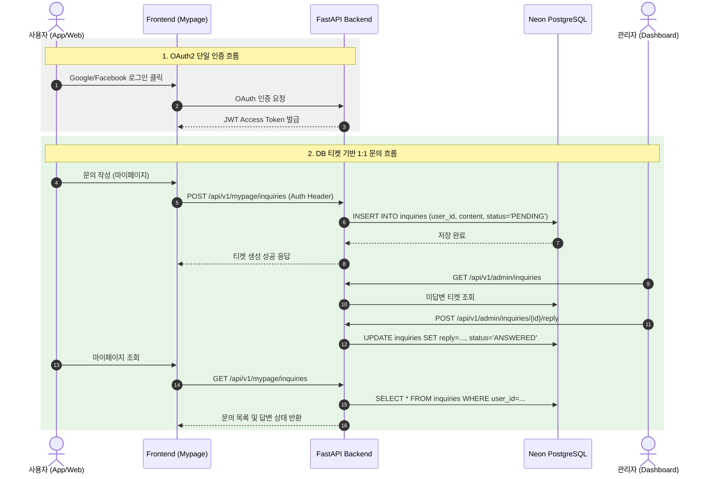

화장품 성분 분석 서비스 PickSafe를 개발하면서 초기 기능 검증(MVP) 스펙을 다듬던 중, 예상보다 많은 유지보수 비용과 운영 마찰을 일으키는 지점을 발견했습니다. 바로 이메일 기반 회원가입과 외부 이메일 발송 인프라(Resend API) 의존성이었습니다. 

서비스의 본질인 '성분 분석 및 사용자 맞춤 정보 제공'에 집중하기 위해, 이메일 발송 인프라를 전면 삭제하고 인앱 1:1 티켓형 문의 시스템으로 개편한 기술적 고민과 트러블슈팅 과정을 기록합니다.

---

## 🎯 마주한 고민과 문제 배경

초기 설계 단계에서는 일반적인 서비스와 마찬가지로 자체 이메일 가입(`auth/signup`) 및 인증 메일 발송, 그리고 사용자 문의에 대한 이메일 답변 수신 구조를 채택했습니다. 하지만 실제 클라우드 환경(Render 및 Neon PostgreSQL)에 배포하고 운영 테스트를 진행하면서 세 가지 명확한 병목에 부딪혔습니다.

1. **외부 이메일 인프라의 운영 마찰 및 샌드박스 제약**
   - API 기반 메일 발송 서비스(Resend 등)의 무료 플랜은 도메인 소유권 검증(DKIM/SPF 설정)이 필수적이었으며, 샌드박스 환경에서는 발송 타겟이 제한되었습니다.
   - 외부 API 호출 실패나 네트워크 레이턴시가 회원가입 및 문의 등록 전체 트랜잭션의 안정성을 해치는 요소가 되었습니다.

2. **비회원 문의의 피드백 신뢰도 저하**
   - 비회원(게스트)으로부터 문의를 받을 경우, 입력된 이메일 주소의 유효성을 검증하기 어려웠습니다.
   - 오타가 포함된 이메일로 답변을 발송하다 실패하거나, 스팸성 문의가 접수되어도 이를 제어할 수 있는 수단이 부족했습니다.

3. **불필요한 코드 복잡도**
   - 인증 메일 토큰 생성 및 만료 처리, 재발송 로직, 메일 HTML 템플릿 관리 등 핵심 비즈니스 로직과 무관한 코드 자산이 `email_service.py`를 중심으로 커지고 있었습니다.

---

## ⚖️ 기술적 대안 비교 및 선택 이유

이 문제를 해결하기 위해 기존 방식의 유지보수안과 전면 개편안 두 가지 대안을 비교 검토했습니다.

| 비교 항목 | 대안 A: 유료/자체 SMTP 인프라 도입 | 대안 B: OAuth 소셜 로그인 단일화 + DB 티켓 문의 (최종 선택) |
| :--- | :--- | :--- |
| **인프라 의존성** | 높음 (SMTP 서버 또는 외부 API) | 없음 (내부 RDBMS 연동) |
| **운영 비용** | 도메인 구입 및 API 비용 발생 가능 | $0 (기존 RDBMS 활용) |
| **인증 신뢰성** | 가입 메일 인증 실패 리스크 존재 | OAuth Provider(Google, FB) 검증 완료 |
| **문의 전달 보장** | 스팸함 분류 및 발송 실패 가능성 존재 | 서비스 내 DB 저장으로 100% 상태 조회 가능 |
| **개발/유지보수** | 템플릿 및 발송 실패 재시도 로직 필요 | 단일 CRUD REST API 구조로 단순화 |

**선택 이유:**
PickSafe의 핵심 가치는 성분 데이터의 정확한 분석과 유저 경험입니다. 이메일 전달률을 관리하고 외부 서비스 실패 대처 로직을 작성하는 데 엔지니어링 리소스를 분산시키는 대신, **Google 및 Facebook OAuth 로그인으로 인증을 단일화**하기로 결정했습니다.

더불어 비회원 문의는 거두어내고, 로그인된 회원에 한해 마이페이지 내에서 DB 기반으로 문의 내역과 답변을 대화식(티켓 형태)으로 확인하는 구조로 아키텍처를 변경했습니다.

---

## 🏗️ 시스템 아키텍처 및 흐름

이메일 인프라를 제거한 후의 인증 및 문의 처리 흐름은 다음과 같이 단순화되었습니다.



---

## 💻 핵심 구현 및 트러블슈팅

### 1. 레거시 이메일 서비스 및 가입 엔드포인트 제거
기존 `web/backend/app/services/email_service.py`와 `auth/signup` 라우트를 완전히 비활성화하고, OAuth 인증을 거친 사용자만 접근할 수 있도록 보안 의존성을 정립했습니다.

```python
# web/backend/app/routers/auth.py (개편 후)
from fastapi import APIRouter, Depends, HTTPException, status
from app.core.config import SETTINGS

router = APIRouter(prefix="/auth", tags=["Auth"])

# 자체 이메일 가입(/signup) 및 이메일 검증(/verify-email) 엔드포인트 삭제
# OAuth2 소셜 로그인 콜백 전용 엔드포인트만 유지

@router.get("/callback/{provider}")
async def oauth_callback(provider: str, code: str):
    # Provider별 (Google, Facebook) 검증 및 토큰 발급 로직만 처리
    user_info = await verify_oauth_code(provider, code, secret=SETTINGS.OAUTH_CLIENT_SECRET)
    access_token = create_access_token(data={"sub": user_info.email})
    return {"access_token": access_token, "token_type": "bearer"}
```

### 2. 마이페이지 1:1 티켓 문의 CRUD 및 인가(Authorization) 처리

문의 작성 시 비회원의 접근을 방지하고, 타인의 문의 내역을 열람하지 못하도록 조치했습니다.

```python
# web/backend/app/routers/mypage.py
from fastapi import APIRouter, Depends, HTTPException, status
from sqlalchemy.orm import Session
from app.database import get_db
from app.models import Inquiry, User
from app.dependencies import get_current_user

router = APIRouter(prefix="/mypage", tags=["Mypage"])

@router.post("/inquiries")
def create_inquiry(
    payload: InquiryCreateSchema,
    db: Session = Depends(get_db),
    current_user: User = Depends(get_current_user)
):
    # 비회원은 get_current_user에서 401 Unauthorized로 차단됨
    new_inquiry = Inquiry(
        user_id=current_user.id,
        title=payload.title,
        content=payload.content,
        status="PENDING"
    )
    db.add(new_inquiry)
    db.commit()
    db.refresh(new_inquiry)
    return {"message": "문의가 정상 접수되었습니다.", "ticket_id": new_inquiry.id}

@router.get("/inquiries")
def list_my_inquiries(
    db: Session = Depends(get_db),
    current_user: User = Depends(get_current_user)
):
    # 본인의 문의 이력만 조회 가능하도록 인가 조건 강제
    inquiries = db.query(Inquiry).filter(Inquiry.user_id == current_user.id).order_by(Inquiry.created_at.desc()).all()
    return inquiries
```

### 💬 트러블슈팅: 비회원 접근 예외 처리와 UX 개선

**문제:** 기존 UI에는 비회원도 문의 폼을 볼 수 있게 노출되어 있었기에, 이메일 기능을 떼어내면서 로그인하지 않은 사용자가 문의를 제출할 경우 단순 `401 Unauthorized` 에러 응답만 반환되어 UX가 저하되는 문제가 생겼습니다.

**해결:** 프론트엔드 템플릿(`mypage.html`) 진입 단계 및 문의 작성 버튼 클릭 시점에 세션 상태를 검증하도록 변경하고, 미인증 사용자에게는 로그인 유도 모달 및 페이지 이동 처리(`login.html`)를 적용하여 불필요한 백엔드 에러 발생을 사전 차단했습니다.

---

## 💡 돌아보며 배운 점 (회고)

이번 아키텍처 개편을 통해 엔지니어링 측면에서 몇 가지 중요한 레슨을 얻었습니다.

1. **당연하게 여겨지던 보일러플레이트(Boilerplate) 기능에 대한 의문 제기**
   - 회원가입이 있는 서비스라면 당연히 '이메일 가입/인증'과 '이메일 문의 답변'이 있어야 한다고 관성적으로 생각했었습니다.
   - 프로젝트의 현재 단계(MVP)와 주어진 클라우드 인프라의 제약 조건을 고려했을 때, 이는 불필요한 복잡성과 장애 지점(Single Point of Failure)을 만드는 원인이었습니다.

2. **시스템 단순화가 가져다준 운영 안정성**
   - 외부 메일 API 연동 실패로 인한 가입 및 문의 에러 가능성이 완전히 사라졌습니다.
   - 이메일 서비스 구현을 위한 외부 SDK 라이브러리 의존성을 지움으로써 컨테이너 빌드 타임과 코드 베이스의 경량화를 이룰 수 있었습니다.

3. **향후 보완 과제**
   - 현재 방식은 사용자가 마이페이지에 직접 들어와야만 답변을 확인할 수 있는 구조입니다. 
   - 추후 사용자가 답변을 빠르게 인지할 수 있도록 브라우저 Web Push 알림이나 서비스 내 상단 알림 뱃지(In-App Notification) 시스템을 구축하여 보완할 계획입니다.