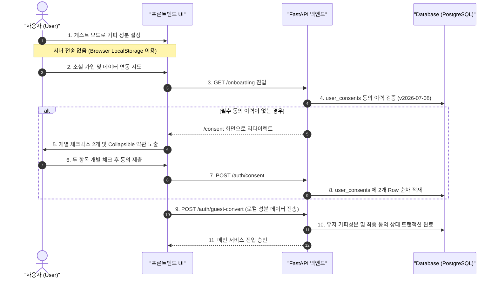

화장품 성분 분석 서비스 **PickSafe**를 개발하며 서비스 내 사용자의 알레르기 반응 성분, 아토피나 여드름 등의 피부 고민 정보 처리 로직을 구현하던 중, 법적 규제 준격 요구사항과 마주치게 되었습니다.

국내 개인정보보호법상 알레르기 유발 성분이나 피부 상태와 같은 정보는 '건강에 관한 정보'로서 **민감정보**로 분류됩니다. 따라서 일반 서비스 이용약관 동의와 별개로, 사용자에게 **명시적인 구분 동의(2단계 별도 동의)**를 수집하고 그 이력을 추적할 수 있도록 데이터베이스에 증적을 남겨야 합니다.

초기 구현에서는 단순성을 위해 회원가입 과정에서 모든 동의 항목을 묶어서 처리하거나 미들웨어 수준에서 전역 리다이렉트를 처리하도록 설계했습니다. 그러나 운영 환경의 관점에서 검토해보니 회원가입 전환율 저하, 비회원(게스트) 이용 시 UX 마찰, 불명확한 동의 이력 적재 등 여러 문제가 드러났습니다. 

본 글에서는 비회원 마찰을 최소화하면서도 법무 규제를 정확히 준수하도록 개인정보 및 건강 민감정보 동의 체계를 재설계한 기술적 과정과 고민을 기록합니다.

---

## 🎯 마주한 고민과 문제 배경

### 1. 일반 개인정보와 건강 민감정보의 분리 수집 필요성
기존에는 회원가입 시 하나의 통합 약관 체크박스만 제공했습니다. 하지만 관련 법령에 따르면 건강 데이터는 일반 개인정보(`privacy_policy`)와 독립된 항목(`sensitive_health_data`)으로 분리하여 각각 동의를 받아야 합니다. 동의 항목이 묶여 있거나 포괄 동의 방식으로 처리될 경우 법적 리스크가 발생합니다.

### 2. 게스트 UX 마찰 문제
PickSafe는 사용자가 로그인 없이도 성분 검색 및 맞춤 기피 성분 설정을 체험해 볼 수 있도록 설계되었습니다. 
초기에는 백엔드 미들웨어에서 로그인 여부와 관계없이 특정 진입로를 강제로 차단하고 동의 페이지(`/consent`)로 리다이렉트 시켰습니다. 이로 인해 비회원 사용자가 서비스를 탐색할 때 불필요한 약관 동의 팝업에 노출되어 초기 이탈률이 급증하는 문제가 생겼습니다.

### 3. 동의 이력의 버전 관리 및 증적 보관
약관이 개정되었을 때 어떤 사용자가 몇 버전의 약관에 언제 동의했는지 추적할 수 있는 DB 구조가 부재했습니다. 단순히 유저 테이블에 `is_agreed: True` 형태의 Boolean 플래그만 남기는 방식으로는 향후 법적 분쟁이나 감사 시 증적 자료로서의 효력이 부족했습니다.

---

## ⚖️ 기술적 대안 비교 및 선택 이유

문제를 해결하기 위해 크게 두 가지 아키텍처 접근법을 비교 검토했습니다.

| 비교 항목 | 대안 A: 전역 미들웨어 차단 방식 | 대안 B: 진입점 기반 인터스텔 관문 + 지연 저장 방식 (선택) |
| :--- | :--- | :--- |
| **작동 방식** | 모든 HTTP 요청 시 미들웨어에서 DB를 조회하여 동의 여부 검증 후 리다이렉트 | 데이터가 서버로 업로드되는 실제 지점(온보딩/이관)에서만 동의 여부를 검증하고 게스트 상태는 로컬 저장소 활용 |
| **게스트 UX** | 접속 즉시 약관 동의 팝업 노출 (마찰 극속 증가) | 완전히 자유롭게 서비스 탐색 가능 (마찰 제로) |
| **DB I/O 성능** | 모든 API 요청마다 미들웨어 수준의 동의 이력 조회 쿼리 발생 | 데이터 수정/이관 시점에만 쿼리 발생 (서버 부하 경감) |
| **동의 증적 체계** | 단순 상태 플래그 갱신 | `user_consents` 개별 테이블에 버전, 동의 유형, 일시 추적 적재 |

### 최종 선택 이유
비회원 상태에서는 어떠한 개인정보나 건강 정보도 서버로 전송되지 않고 클라이언트 로컬 저장소(LocalStorage)에만 유지됩니다. 따라서 **서버에 민감 정보가 수신 및 적재되는 온보딩 확정 시점 및 회원가입 이관 시점(`POST /auth/guest-convert`)으로 동의 수집 지점을 지연(Lazy Validation)**시키는 **대안 B**를 선택했습니다.

---

## 🏗️ 시스템 아키텍처 및 흐름

이러한 흐름을 바탕으로 설계한 사용자 진입 및 동의 수집 아키텍처는 다음과 같습니다.



---

## 💻 핵심 구현 및 트러블슈팅

### 1. 동의 이력 추적을 위한 `UserConsent` 모델 설계

단순 플래그가 아닌, 약관 버전과 동의 유형별로 독립된 이력을 관리하기 위해 `UserConsent` ORM 모델을 새로 신설했습니다.

```python
# models/consent.py
from datetime import datetime
from sqlalchemy import Column, Integer, String, DateTime, ForeignKey, UniqueConstraint
from sqlalchemy.orm import relationship
from database import Base

class UserConsent(Base):
    __tablename__ = "user_consents"

    id = Column(Integer, primaryHelper=True, primary_key=True, index=True)
    user_id = Column(Integer, ForeignKey("users.id", ondelete="CASCADE"), nullable=False)
    consent_type = Column(String(50), nullable=False)  # 'privacy_policy', 'sensitive_health_data'
    version = Column(String(20), nullable=False)       # 예: '2026-07-08'
    agreed_at = Column(DateTime, default=datetime.utcnow, nullable=False)

    user = relationship("User", back_populates="consents")

    __table_args__ = (
        # 특정 유저가 동일 버전의 동일 동의 타입을 중복 적재하지 않도록 유니크 제약 설정
        UniqueConstraint("user_id", "consent_type", "version", name="uix_user_consent_version"),
    )
```

### 2. 다국어 약관 마크다운 동적 렌더링 및 UI 접기/펴기(Collapsible) 바인딩

약관 내용을 하드코딩하지 않고, `docs/consent/` 디렉터리에 마크다운 문서로 관리하여 사용자 언어 환경(`locale`)에 맞춰 동적으로 읽어오도록 구성했습니다.

```python
# routers/shared.py
from pathlib import Path
import markdown
from settings import SETTINGS

CONSENT_DIR = Path("docs/consent")

def load_consent_document(doc_type: str, locale: str = "ko") -> str:
    """
    약관 마크다운 파일을 읽어와 HTML로 변환합니다.
    """
    file_path = CONSENT_DIR / f"{doc_type}_{locale}.md"
    if not file_path.exists():
        file_path = CONSENT_DIR / f"{doc_type}_ko.md" # Fallback
        
    with open(file_path, "r", encoding="utf-8") as f:
        content = f.read()
    
    return markdown.markdown(content, extensions=["tables", "fenced_code"])
```

### 3. 트러블슈팅: 게스트 회원가입 전환 시 트랜잭션 유실 문제

**문제 상황:**
게스트 모드 사용자가 로그인으로 전환할 때 `POST /auth/guest-convert` API가 호출됩니다. 이때 프론트엔드에서 성분 정보와 약관 동의 상태를 한꺼번에 전송하는데, 기존 로직에서는 동의 이력을 기록하는 과정과 기피 성분을 저장하는 과정이 서로 다른 세션으로 분리되어 있어, 성분 저장 중 에러가 발생했을 때 약관 동의 이력만 DB에 남는 데이터 불일치가 일어났습니다.

**해결 과정:**
단일 트랜잭션 내에서 동의 이력 적재와 성분 데이터 이관이 모두 성립되어야만 저장되도록 백엔드 서비스 레이어를 롤백 로직과 함께 원자적(Atomic)으로 재구성했습니다.

```python
# services/auth_service.py
from sqlalchemy.orm import Session
from models.consent import UserConsent
from models.user import UserAllergen

def process_guest_conversion(
    db: Session, 
    user_id: int, 
    allergens: list[str], 
    terms_version: str
) -> None:
    """
    게스트 사용자의 로컬 데이터를 회원 계정으로 이관하며 동의 이력을 원자적으로 적재합니다.
    """
    try:
        # 1. 동의 이력 2종(일반 약관, 건강 민감정보) 적재
        consent_types = ["privacy_policy", "sensitive_health_data"]
        for c_type in consent_types:
            consent_entry = UserConsent(
                user_id=user_id,
                consent_type=c_type,
                version=terms_version
            )
            db.add(consent_entry)

        # 2. 기피 성분 정보 저장
        for allergen_code in allergens:
            allergen_entry = UserAllergen(
                user_id=user_id,
                allergen_code=allergen_code
            )
            db.add(allergen_entry)

        # 단일 트랜잭션 커밋
        db.commit()
    except Exception as e:
        db.rollback()
        raise SQLIntegrityError("이관 작업 중 오류가 발생하여 원상복구되었습니다.") from e
```

---

## 💡 돌아보며 배운 점

이번 개인정보 및 민감정보 동의 체계 재설계 작업을 진행하면서 다음과 같은 엔지니어링 교훈을 얻을 수 있었습니다.

1. **규제 준수(Compliance)와 사용자 경험(UX)은 대립 관계가 아니다**
   처음에는 전역 차단 미들웨어를 두어 '무조건 동의부터 받아야 한다'는 고정관념에 갇혀 있었습니다. 그러나 서비스 내에서 "어느 시점에 실제 민감 데이터가 생성되어 서버로 전송되는가?"를 세밀히 분석함으로써, 게스트 모드의 마찰 없는 경험을 유지하면서도 법적 동의 의무를 완벽히 충족하는 최적의 시점을 찾아낼 수 있었습니다.

2. **데이터 스키마 설계 시 추적 가능성(Auditability) 고려의 중요성**
   Boolean 필드 하나로 동의 여부를 관리하던 방식에서 벗어나, `consent_type`과 `version`을 명시한 독립적인 이력 테이블 구조로 전환한 것은 미래의 법적 리스크를 크게 줄여주었습니다. 향후 약관 내용이 변경되더라도 개정 버전별로 사용자의 재동의 여부를 손쉽게 판별하고 리다이렉트 제어를 정교하게 수행할 수 있는 기반이 마련되었습니다.

3. **향후 보완할 과제**
   현재는 마크다운 문서 파일로 약관 내용을 관리하고 있으나, 향후 운영 체계가 확장됨에 따라 약관 버전 및 변경 내역 자체도 DB나 관리자 CMS를 통해 동적으로 배포되고 관리될 수 있도록 시스템을 확장해 나갈 계획입니다.