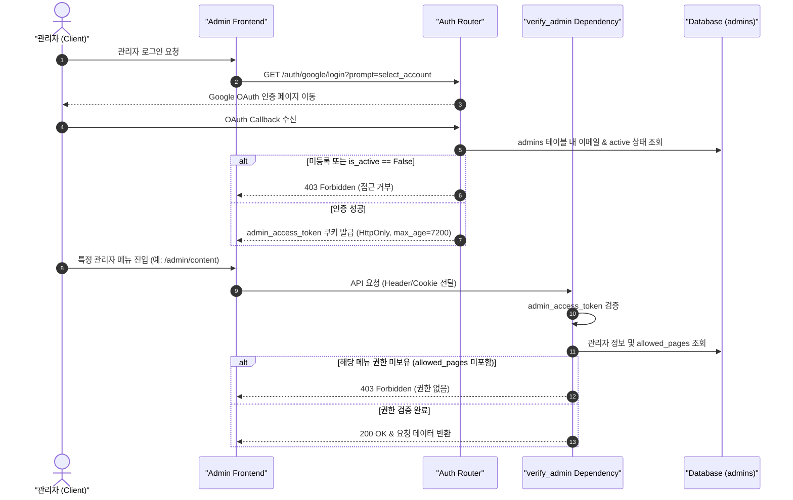

화장품 성분 분석 서비스 **PickSafe**를 개발하고 운영하면서, 서비스 초기 빠르게 기능을 검증하기 위해 작성했던 인증 구조가 서비스 확장과 함께 여러 문제점을 노출하기 시작했습니다. 

단순히 `users` 테이블에 `role='admin'` 컬럼을 추가해 다루던 초기 어드민 체계는 세션 혼용, 보안 취약점, 세부 권한 통제 불능이라는 한계에 부딪혔습니다. 이를 해결하기 위해 **어드민 계정/쿠키 완전 격리, 구글 OAuth 단일화, 역할 기반 권한 제어(RBAC) 도입, 그리고 프론트엔드 UX 최적화**를 진행했던 기술적 의사결정과 구현 과정, 트러블슈팅 경험을 차분히 정리해 봅니다.

---

## 🎯 마주한 고민과 문제 배경

### 1. 일반 회원 세션과 어드민 세션의 혼용
초기 구조에서는 일반 회원과 어드민이 동일한 `access_token` 쿠키 명칭을 공유했습니다. 이로 인해 브라우저에서 관리자 포털에 로그인한 상태로 일반 사용자 페이지로 이동하거나, 반대로 일반 계정으로 전환할 때 세션 쿠키가 덮어씌워지거나 오염되어 사용자 권한 상태가 꼬이는 UX/보안적 결함이 빈번하게 발생했습니다.

### 2. 하드코딩된 계정과 보안 취약점
로컬 개발 및 테스트 편의성을 위해 데이터베이스 시딩 시 `'admin7777!'` 같은 고정 패스워드를 가진 계정이 생성되도록 방치되어 있었습니다. 비밀번호 기반 로그인 경로(`/admin/login`)가 외부에 노출되어 있을 경우 불필요한 인증 공격 표면(Attack Surface)을 제공하는 문제가 있었습니다.

### 3. 세부 권한 분리의 부재 (RBAC의 필요성)
콘텐츠 관리자, 고객지원 에이전트, 시스템 운영자 등 관리자의 역할이 다양해짐에 따라 접근 가능한 대시보드 및 메뉴를 제한할 필요가 생겼습니다. 기존 방식으로는 특정 관리자가 시스템 원장 수정이나 인프라 현황 등 본인 업무 영역 이외의 민감 데이터에 제한 없이 접근할 수 있었습니다.

### 4. 스키마 결합으로 인한 데이터 오염
어드민 계정 로그인 및 초기 부트스트랩 과정에서 일반 회원 스키마(`users`)에 가상의 유저 레코드를 만들고 외래키를 연결하는 구조적 비효율이 존재했습니다. 이는 어드민 데이터의 독립성을 저해하고 DB 관리를 복잡하게 만들었습니다.

---

## ⚖️ 기술적 대안 비교 및 선택 이유

문제를 근본적으로 해결하기 위해 기존 `users` 테이블 재활용 방식과 **독립된 `admins` 스키마 구축 방식**을 비교 검토했습니다.

| 비교 항목 | 대안 A: 기존 `users` 테이블 확장 | 대안 B: `admins` 테이블 격리 및 쿠키 분리 (최종 선택) |
| :--- | :--- | :--- |
| **계정 격리성** | 일반 회원과 어드민 데이터가 섞여 데이터 오염 위험 상존 | 물리적 DB 스키마 분리로 완벽한 데이터 격리 보장 |
| **세션 관리** | 단일 `access_token` 사용으로 세션 충돌 위험 | `admin_access_token` 별도 쿠키 사용으로 동시 접속 및 독립 로그아웃 지원 |
| **인증 수단** | ID/PW 및 소셜 혼용으로 보안 관리 복잡성 증가 | ID/PW 전면 폐지, **구글 OAuth 단일 인증**으로 보안성 극대화 |
| **권한 제어** | 단순 단일 역할(`role` 컬럼) 판별만 가능 | **RBAC 도입**: 역할(`role`) 및 페이지별 접근 허용 목록(`allowed_pages`) 기반 제어 |
| **유지보수성** | 회원 관련 로직 수정 시 어드민 여파 검증 필요 | 어드민 체계 변경이 일반 회원 영역에 영향을 주지 않음 |

결과적으로 시스템 보안 강화와 세션 독립성 확보를 위해 **대안 B**를 채택했습니다. 

ID/PW 인증을 전면 폐지하고 **구글 소셜 로그인 단일화**를 결정했으며, 개발 환경 편의를 위해 운영 서버(`settings.ENV == "prod"`) 진입 시 엄격히 차단되는 Mock 로그인 엔드포인트를 병행 구성하기로 했습니다.

---

## 🏗️ 시스템 아키텍처 및 흐름

전체적인 어드민 인증 및 RBAC 인가 절차는 아래와 같이 동작합니다.



---

## 💻 핵심 구현 및 트러블슈팅

### 1. 환경별 인증 세션 및 만료 정책 차별화

운영 환경의 보안과 로컬 개발 테스트의 편의성을 동시에 만족시키기 위해 토큰 만료 시간과 Mock 로그인 백도어 차단 로직을 구현했습니다.

```python
# app/api/admin_auth.py

from fastapi import APIRouter, HTTPException, Response, status
from app.core.config import settings

router = APIRouter(prefix="/admin", tags=["Admin Auth"])

@router.post("/mock-login")
async def admin_mock_login(response: Response, email: str):
    # 운영 환경에서는 Mock 로그인 접근을 원천 차단
    if settings.ENV == "prod":
        raise HTTPException(
            status_code=status.HTTP_403_FORBIDDEN,
            detail="Mock 로그인 기능은 운영 환경에서 사용할 수 없습니다."
        )
    
    # 개발 환경 전용 토큰 만료 시간 (10년 무제한) 및 세션 처리
    max_age = 10 * 365 * 24 * 3600
    token = create_admin_jwt_token(email=email, expires_in=max_age)
    
    response.set_cookie(
        key="admin_access_token",
        value=token,
        httponly=True,
        samesite="lax",
        max_age=max_age
    )
    return {"message": "Dev mock login successful"}
```

운영 환경 구글 OAuth 로그인의 경우 `max_age=7200`(2시간)의 짧은 만료 시간을 부여하여 보안을 강화했습니다.

### 2. 백엔드 RBAC 의존성 주입 및 필수 권한 보장

관리자 요청 시 토큰 유효성 검증과 동시에 해당 관리자가 요청한 페이지(`tab_id`)에 접근 가능한지 검증하는 의존성 함수를 설계했습니다. 시스템 기본 현황을 보는 `"infra"` 권한은 누락되더라도 백엔드에서 강제로 기본 포함하도록 안전장치를 마련했습니다.

```python
# app/api/deps.py

from fastapi import Depends, HTTPException, Request, status
from app.models.admin import Admin

async def verify_admin(tab_id: str):
    async def dependency(request: Request, current_admin: Admin = Depends(get_current_admin)):
        if not current_admin.is_active:
            raise HTTPException(
                status_code=status.HTTP_403_FORBIDDEN, 
                detail="비활성화된 관리자 계정입니다."
            )
            
        # super_admin은 모든 권한 통과
        if current_admin.role == "super_admin" or current_admin.allowed_pages == "*":
            return current_admin

        # allowed_pages 문자열 파싱 (예: "infra,content,users")
        allowed_list = [p.strip() for p in current_admin.allowed_pages.split(",") if p.strip()]
        
        # 'infra' 권한 기본 포함 보장
        if "infra" not in allowed_list:
            allowed_list.append("infra")

        if tab_id not in allowed_list:
            raise HTTPException(
                status_code=status.HTTP_403_FORBIDDEN,
                detail=f"'{tab_id}' 페이지에 대한 접근 권한이 없습니다."
            )
        return current_admin

    return dependency
```

### 3. HttpOnly 쿠키의 서버 측 완전 파기 로그아웃

자바스크립트(`document.cookie`)로 접근할 수 없는 `HttpOnly` 쿠키 특성상, 클라이언트 단에서의 삭제 조치는 불완전했습니다. 이에 따라 서버 엔드포인트를 통해 쿠키 소멸 정책을 명시적으로 응답하도록 구현했습니다.

```python
# app/api/admin_auth.py

@router.get("/logout")
async def admin_logout(response: Response):
    # 쿠키 명시적 파기
    response.delete_cookie(
        key="admin_access_token",
        httponly=True,
        samesite="lax",
        path="/"
    )
    return {"message": "성공적으로 로그아웃되었습니다."}
```

### 4. 모바일 이미지 업로드 최적화 (Canvas 캔버스 압축)

성분 분석용 화장품 라벨 촬영 시, 모바일 웹 브라우저에서 `capture="environment"` 속성으로 인해 카메라 갤러리 접근이 막히거나 고화질 원본 이미지 업로드 시 타임아웃이 발생하는 UX 문제가 존재했습니다. 

속성을 제거하여 선택권을 제공하고, HTML5 Canvas를 이용해 업로드 전 클라이언트 브라우저 단에서 이미지를 압축하는 유틸리티를 추가했습니다.

```javascript
// static/js/image_compressor.js

async function compressImage(file, maxWidth = 1200, quality = 0.85) {
    return new Promise((resolve, reject) => {
        const image = new Image();
        image.src = URL.createObjectURL(file);
        image.onload = () => {
            let width = image.width;
            let height = image.height;

            if (width > maxWidth) {
                height = Math.round((height * maxWidth) / width);
                width = maxWidth;
            }

            const canvas = document.createElement('canvas');
            canvas.width = width;
            canvas.height = height;

            const ctx = canvas.getContext('2d');
            ctx.drawImage(image, 0, 0, width, height);

            canvas.toBlob(
                (blob) => {
                    if (blob) {
                        const compressedFile = new File([blob], file.name, {
                            type: 'image/jpeg',
                            lastModified: Date.now(),
                        });
                        resolve(compressedFile);
                    } else {
                        reject(new Error("Canvas compression failed"));
                    }
                },
                'image/jpeg',
                quality
            );
        };
        image.onerror = (err) => reject(err);
    });
}
```

이 압축 로직을 적용한 결과, 모바일에서 촬영한 5~10MB의 원본 사진이 품질 저하 없이 **200~300KB 수준으로 압축**되어 서버 업로드 속도 및 성공률이 획기적으로 개선되었습니다.

---

## 💡 돌아보며 배운 점 (회고)

이번 리팩토링과 보안 체계 개편 작업을 진행하며 얻은 주요 엔지니어링 레슨은 다음과 같습니다.

1. **"인증과 인가의 분리는 조건문이 아닌 아키텍처 수준에서 이루어져야 한다"**
   단순히 하나의 테이블 안에서 `if role == 'admin'` 조건문으로 통제하려던 시도는 시스템이 복잡해질수록 세션 오염과 보안 허점을 만들어냈습니다. DB 테이블(`admins`)과 세션 쿠키(`admin_access_token`)를 아키텍처 수준에서 물리적으로 분리함으로써, 코드의 명확성과 운영 안정성을 동시에 확보할 수 있었습니다.

2. **개발 편의 기능의 안전장치는 이중 통제가 필요하다**
   개발용 Mock 로그인 기능은 생산성을 대폭 향상시켜 주지만, 자칫 실수로 운영 환경에 배포될 경우 치명적인 백도어가 될 수 있습니다. 코드 수준에서의 `settings.ENV == "prod"` 검증과 함께 배포 파이프라인에서의 환경변수 주입을 철저히 검증하는 습관의 중요성을 다시 한번 상기했습니다.

3. **사용자 경험(UX)은 기술적 제약의 세심한 처리에서 나온다**
   소셜 로그인 시 계정 선택 창이 뜨지 않아 다른 아이디로 테스트하기 어렵던 문제(`prompt=select_account`), 모바일 카메라 업로드 시 멈춤 현상 등은 거창한 아키텍처 변경이 아닌 파라미터 하나, 클라이언트 캔버스 압축 코드 몇 줄로 해결되었습니다. 엔지니어로서 백엔드 로직뿐만 아니라 실제 사용자와 관리자가 겪는 프론트엔드의 세심한 마찰 지점을 적극적으로 포착하고 개선하는 자세가 필수적임을 느꼈습니다.

추후 관리자 작업에 대한 **감사 로그(Audit Log)** 추적 시스템을 추가 도입하여, 어떤 어드민이 어떤 성분 원장을 수정하거나 유저 상태를 변경했는지 이력을 투명하게 기록하는 체계로 발전시켜 나갈 계획입니다.