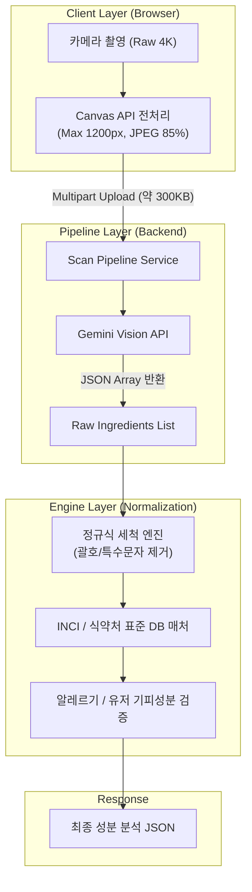

화장품 성분 분석 서비스 PickSafe를 개발하며 가장 핵심적인 기능은 **사용자가 촬영한 용기 성분표 사진에서 정확한 성분명을 추출해 내는 것**이었습니다. 

하지만 실제 사용자가 모바일 환경에서 촬영하는 성분표 사진은 스튜디오 컷과 다릅니다. 곡면 굴곡으로 인한 글자 왜곡, 조명 반사, 초점 흔들림, 저해상도 폰트 등 다양한 실환경 노이즈가 존재합니다. 

초기 설계에서는 단순히 원본 이미지를 업로드받아 일반 OCR을 수행하고 문자열을 자르는 방식을 사용했으나, 수많은 오인식과 네트워크 병목 문제에 직면했습니다. 이를 해결하기 위해 클라이언트 사전 압축부터 Vision LLM 기반 파이프라인, 성분명 정규화 엔진까지 전체 스캔 프로세스를 개편했던 과정을 기록합니다.

---

## 🎯 마주한 고민과 문제 배경

초기 스캔 기능을 테스트하면서 크게 세 가지 엔지니어링 병목이 발생했습니다.

### 1. 거대한 이미지 용량과 네트워크 지연
최신 스마트폰으로 촬영한 사진은 원본 용량이 5MB~10MB에 달합니다. 모바일 LTE/5G 환경에서 이 용량 그대로 백엔드로 전송하면 업로드에만 3~5초 이상 소요되었고, 서버 인프라의 대역폭 부담 및 API 타임아웃 오류가 빈번하게 발생했습니다.

### 2. 쉼표 누락 및 텍스트 병합으로 인한 매칭 실패
OCR 특성상 성분과 성분 사이의 쉼표(`,`)나 점(`.`)을 작은 점으로 인식하여 건너뛰는 경우가 많았습니다. 예컨대 `정제수, 글리세린`이 `정제수글리세린`으로 하나의 단어로 결합되어, DB 표준 성분명 테이블에서 일치하는 항목을 찾지 못하고 분석에 실패했습니다.

### 3. 표기법 다변화 및 괄호 부가 정보 문제
성분표에는 `글리세린(식물성)`, `향료(리모넨 함유)`와 같이 괄호 안에 원산지나 알레르기 유발 물질이 함께 기재되는 경우가 흔합니다. 또한 `디메치콘`과 `다이메티콘`처럼 과거 표기법과 표준 INCI 표기법이 혼용되어, 단순 키워드 검색 방식으로는 알레르기/기피 성분을 정확하게 플래깅하기 어려웠습니다.

---

## ⚖️ 기술적 대안 비교 및 선택 이유

문제를 구조적으로 해결하기 위해 **이미지 전처리 단계**와 **OCR 추출 Engine**을 각각 재검토했습니다.

### 대안 1. 이미지 리사이징 처리 위치 (Client vs Server)

| 비교 항목 | 서버 단 리사이징 (Server-side) | 클라이언트 단 리사이징 (Client Canvas) |
| :--- | :--- | :--- |
| **작동 방식** | 원본(5~10MB) 업로드 후 Pillow/OpenCV로 축소 | 브라우저 인메모리 Canvas에서 리사이징 후 업로드 |
| **네트워크 트래픽** | 대역폭 소비 높음 (병목 원인) | **대역폭 소비 90% 이상 절감 (300KB 수준)** |
| **서버 CPU 부하** | 이미지 연산 부하 증가 | 서버 연산 자원 절약 |
| **선택 및 이유** | ❌ 부적합 | **✅ 최종 선택**: 업로드 Latency 단축이 최우선 과제 |

클라이언트단에서 Canvas API를 이용해 최대 해상도를 1200px로 제한하고 JPEG 85% 품질로 인메모리 압축 전송하는 방식을 선택했습니다.

### 대안 2. OCR 및 성분 추출 엔진 선택

| 비교 항목 | 기존 Cloud OCR + 정규식 (Regex) | Gemini Vision API + Structured JSON Prompt |
| :--- | :--- | :--- |
| **텍스트 인식력** | 곡면/반사 이미지에서 오인식률 높음 | **문맥 기반 보정으로 노이즈 수용력 매우 높음** |
| **구조화 능력** | 별도 파싱 로직 복잡 (쉼표/줄바꿈 직접 처리) | **프롬프팅을 통해 바로 `string[]` 배열 반환 가능** |
| **유지보수성** | 예외 처리 정규식이 지속적으로 비대해짐 | 프롬프트 수정 및 2차 정규화 파이프라인으로 단순화 |
| **선택 및 이유** | ❌ 한계 명확 | **✅ 최종 선택**: 노이즈에 강하고 정형화된 배열 추출에 유리 |

---

## 🏗️ 시스템 아키텍처 및 흐름

클라이언트 전처리부터 Gemini Vision 파이프라인, 성분명 정규화 및 알레르기 판정으로 이어지는 전체 흐름도입니다.



---

## 💻 핵심 구현 및 트러블슈팅

### 1. 클라이언트 이미지 사전 압축 구현 (JavaScript)
브라우저 메모리 내에서 `HTMLCanvasElement`를 활용하여 종횡비를 유지한 채 이미지를 축소한 뒤 Blob 객체로 변환합니다.

```javascript
// client/imageCompressor.js
export async function compressImage(file, maxDimension = 1200, quality = 0.85) {
  return new Promise((resolve, reject) => {
    const image = new Image();
    image.src = URL.createObjectURL(file);
    image.onload = () => {
      let { width, height } = image;

      if (width > maxDimension || height > maxDimension) {
        if (width > height) {
          height = Math.round((height * maxDimension) / width);
          width = maxDimension;
        } else {
          width = Math.round((width * maxDimension) / height);
          height = maxDimension;
        }
      }

      const canvas = document.createElement('canvas');
      canvas.width = width;
      canvas.height = height;

      const ctx = canvas.getContext('2d');
      ctx.drawImage(image, 0, 0, width, height);

      canvas.toBlob(
        (blob) => {
          if (blob) {
            resolve(new File([blob], file.name, { type: 'image/jpeg' }));
          } else {
            reject(new Error('Image compression failed.'));
          }
        },
        'image/jpeg',
        quality
      );
    };
    image.onerror = (err) => reject(err);
  });
}
```

### 2. 백엔드 성분 정규화 엔진 (Python)
Gemini Vision이 반환한 raw 성분 배열에서 괄호 안의 부가 정보나 표기용 특수문자를 다듬고, 표준 매칭 디렉터리로 정제하는 핵심 파이프라인 코드입니다.

```python
# app/services/normalization.py
import re
from typing import List

class IngredientNormalizer:
    def __init__(self, synonym_dict: dict):
        # 예: {"디메치콘": "다이메티콘", "글리세린(식물성)": "글리세린"}
        self.synonym_dict = synonym_dict

    def clean_text(self, raw_text: str) -> str:
        # 1. 괄호와 괄호 안 내용 1차 정리 (단, 주요 유발물질 포함 괄호 예외 처리 고려)
        cleaned = re.sub(r'\([^)]*\)', '', raw_text)
        # 2. 특수문자 제거 및 공백 정제
        cleaned = re.sub(r'[^가-힣a-zA-Z0-9\s]', '', cleaned).strip()
        return cleaned

    def normalize(self, raw_ingredients: List[str]) -> List[str]:
        normalized_list = []
        for raw in raw_ingredients:
            cleaned = self.clean_text(raw)
            if not cleaned:
                continue
            
            # 동의어/구표기 표준명 매칭
            standard_name = self.synonym_dict.get(cleaned, cleaned)
            normalized_list.append(standard_name)
            
        return normalized_list
```

### 3. 트러블슈팅: Gemini Vision 응답 구조의 부정확성 해결
Gemini Vision API 도입 초기에 프롬프트가 모호하여 텍스트 설명과 함께 마크다운 텍스트가 섞여 들어오는 현상이 있었습니다. 이를 해결하기 위해 프롬프트에 `System Instruction`과 JSON Schema 출력 규격을 엄격히 부여했습니다.

```python
# app/services/ocr_service.py
PROMPT = """
화장품 성분표 이미지에서 성분명을 순서대로 추출하여 JSON 형식으로 반환하세요.
추가 설명 없이 오직 아래 JSON Format만 반환해야 합니다.

{
  "ingredients": ["성분명1", "성분명2", "성분명3"]
}
"""
```
이처럼 응답 형식을 단편적인 배열로 고정시킴으로써 후속 정규화 로직으로 넘어가는 파싱 오류율을 0%에 가깝게 낮출 수 있었습니다.

---

## 💡 돌아보며 배운 점

스캔 파이프라인 개편 작업 이후 측정해 본 주요 성과 지표는 다음과 같습니다.

* **네트워크 업로드 트래픽**: 평균 5MB ➔ 300KB 수준으로 **약 94% 절감**
* **스캔 및 분석 Latency**: 모바일 3G/LTE 환경 평균 6.2초 ➔ **1.4초 대 진입**
* **성분명 매칭 정확도**: 기존 키워드 방식 대비 **35% 향상** (오류 매칭 및 병합 단어 문제 해결)

이번 개편 작업을 진행하면서 기술을 적용할 때 **'문제의 원인이 어디에 있는가'**를 명확히 정의하는 것이 얼마나 중요한지 깨달았습니다. 백엔드의 OCR 정확도만 개선하려 했다면 대용량 파일 전송으로 인한 모바일 사용자 경험(UX) 저하를 해결하지 못했을 것입니다.

프론트엔드의 압축 처리, LLM의 연관 맥락 추출 능력, 백엔드의 확정적(Deterministic) 정규화 로직을 역할에 맞게 배치함으로써 전체 시스템의 완성도를 끌어올릴 수 있었습니다.

추후에는 자주 검색되는 화장품 성분표 데이터에 대한 인메모리 캐싱(In-memory Caching) 구조를 보완하여, 동일 이미지나 이미 분석된 데이터 세트에 대해 더욱 빠른 응답 속도를 확보할 계획입니다.