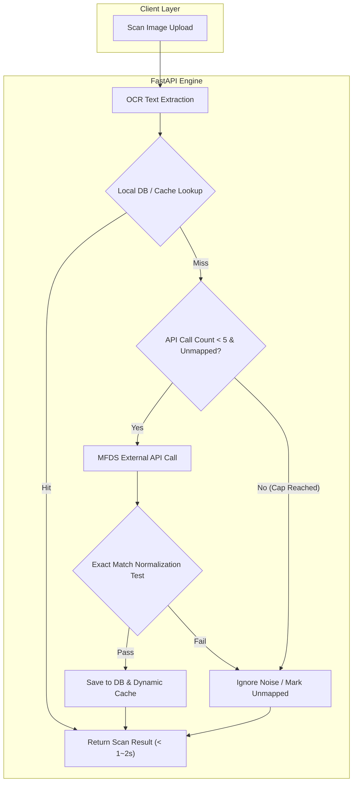

화장품 성분 분석 서비스 PickSafe를 개발하고 운영하면서, 최근 스캔 파이프라인의 성능 병목과 약관/동의 체계의 아키텍처적 허점을 마주했습니다.

이미지 OCR 결과물에 포함된 수많은 노이즈 문자열이 외부 공공 API(식약처 성분 DB) 호출로 무분별하게 흘러들어가면서 스캔 응답 시간이 최대 3분까지 늘어나는 심각한 문제가 발생했습니다. 또한, 외부 API의 유연한 유사도 검색 특성 때문에 노이즈 텍스트가 엉뚱한 성분(예: '가공소금')으로 잘못 매칭되는 데이터 오염 현상도 함께 발견했습니다.

본 글에서는 이와 같은 스캔 파이프라인의 병목을 단 1초 대 응답으로 개선하고, 다국어 지원을 고려한 약관 동의 체계 통합 및 백그라운드 스케줄러 시스템을 구축했던 엔지니어링 과정을 기록합니다.

---

## 🎯 마주한 고민과 문제 배경

### 1. 성분 스캔 응답 지연 (최대 3분) 및 오발 매칭
PickSafe의 성분 스캔 기능은 사용자가 성분표나 영수증 이미지를 업로드하면 OCR을 거쳐 로컬 DB 및 캐시에서 성분을 매칭하는 구조입니다. 기존 로직은 캐시/DB에 존재하지 않는 미매칭 성분이 발견될 경우, 실시간으로 식약처 API를 호출하여 데이터를 보완하도록 작성되어 있었습니다.

그러나 다음과 같은 비효율이 존재했습니다.
* **무제한 외부 API 호출**: OCR 특성상 쉼표, 특수문자, 오탈자 등 무의미한 노이즈 문자열이 다수 생성됩니다. 미매칭 문자열이 20~30개에 달할 경우, 순차적인 외부 API HTTP 요청으로 인해 스캔 응답 시간이 **최대 3분(180초)**까지 늘어났습니다.
* **유사 검색 결과의 오발 매칭**: 식약처 API는 입력 텍스트에 대해 널찍한 유사 검색을 지원합니다. 이로 인해 분석 불가능한 노이즈 문자열이 입력되었을 때 API 검색 결과의 첫 번째 항목인 전혀 무관한 성분(예: `가공소금`)으로 판정되어 DB에 오염된 데이터가 캐싱되었습니다.

### 2. 파편화된 약관 동의 체계와 다국어 미지원
기존 사용자 온보딩 및 소셜 가입(`guest-convert`) 흐름에서 이용약관(TOS) 동의 데이터의 저장이 누락되거나 동의 시점이 명확히 차단되지 않는 문제가 있었습니다. 또한 글로벌 확장성을 고려할 때, 사용자의 언어 설정에 맞춘 약관 문서 제공 및 영문(en)/한글(ko) 폴백(Fallback) 안전장치가 필요한 상황이었습니다.

### 3. 동기적 식약처 성분 동기화의 한계
공공 사전 성분 데이터(21,833개)를 동기화하는 작업이 웹 애플리케이션의 메인 스레드나 일시적인 스크립트에 의존하고 있어, 데이터 수집 중 검증 오류(CAS 번호 포맷 불량 등)가 발생하면 동기화 전체가 중단되거나 실패 이력을 추적하기 어려웠습니다.

---

## ⚖️ 기술적 대안 비교 및 선택 이유

### 스캔 API 성능 개선 전략 선택 (Option A vs Option B)

| 비교 항목 | Option A: 완전 비동기 큐 전환 (Celery + Redis) | Option B: 실시간 상한선 제한 + 정확 일치 검증 (최종 선택) |
| :--- | :--- | :--- |
| **구조** | OCR 완료 후 미매칭 성분은 Worker로 넘기고 비동기 처리 | 스캔당 API 호출 최대 5회 제한 + 공백/대소문자 제거 Exact Match 검증 |
| **장점** | 메인 API 응답 속도가 외부 API에 전혀 영향을 받지 않음 | 인프라 복잡도 없이 **스캔 속도를 3분 $\rightarrow$ 1초 수준으로 즉각 단축** |
| **단점** | Redis/Celery 등 추가 인프라 구축 및 클라이언트 폴링 로직 구현 필요 | 미매칭 성분이 5개를 초과하면 백그라운드 수집으로 이관됨 |
| **선택 이유** | 현재 단계에서는 인프라 복잡도를 늘리지 않고, **동기식 사용자 경험(UX) 내에서 1~2초 이내 응답을 보장**하는 Option B가 훨씬 현실적이고 효율적인 단판 문제 해결책이라 판단함. |

---

## 🏗️ 시스템 아키텍처 및 흐름

개선된 성분 매칭 흐름과 백그라운드 스케줄러 시스템 아키텍처는 다음과 같습니다. 외부 API 호출을 최대 5회로 제한하고, 검증된 데이터만 로컬 DB 및 메모리 캐시에 동적으로 합류시킵니다.



---

## 💻 핵심 구현 및 트러블슈팅

### 1. Exact Match 검증 및 API 호출 상한선 제어 (`ingredient_matcher.py`)

외부 API를 호출하기 전 상한선을 체크하고, API 응답 결과가 원본 요청 텍스트와 정규화(공백 제거, 대소문자 통일) 기준으로 **정확히 일치(Exact Match)**할 때만 캐싱 및 매치 판정을 내리도록 개편했습니다.

```python
# web/backend/app/services/ingredient_matcher.py

MAX_API_CALL_LIMIT = 5

async def match_ingredients(self, ocr_tokens: list[str]) -> list[MatchResult]:
    results = []
    api_call_count = 0

    for token in ocr_tokens:
        normalized_token = self._normalize_string(token)
        
        # 1. 메모리 캐시 및 로컬 DB 조회
        cached_item = self.cache.get(normalized_token)
        if cached_item:
            results.append(cached_item)
            continue

        # 2. 실시간 API 호출 상한선 제어 (Max 5)
        if api_call_count < MAX_API_CALL_LIMIT:
            api_call_count += 1
            api_data = await self.external_api.fetch_ingredient(token)
            
            # 3. 정확 일치 검증 (Exact Match Validation)
            if api_data and self._is_exact_match(normalized_token, api_data):
                saved_entity = await self.db.save_ingredient(api_data)
                self.cache.set(normalized_token, saved_entity)
                results.append(saved_entity)
                continue

        # 정확히 일치하지 않거나 상한선 초과 시 노이즈로 간주하여 오발 매칭 방지
        results.append(MatchResult.unmapped(token))

    return results

def _is_exact_match(self, normalized_token: str, api_data: dict) -> bool:
    """한글명 또는 영문명이 정규화된 입력값과 완전 일치하는지 검증"""
    ko_name = self._normalize_string(api_data.get("INGR_KOR_NAME", ""))
    en_name = self._normalize_string(api_data.get("INGR_ENG_NAME", ""))
    return normalized_token in (ko_name, en_name)
```

이 로직을 통해 `N/A-가공소금`과 같이 노이즈 문자열이 식약처 DB의 유사 검색 첫 항목으로 잘못 엮여 들어가던 버그를 완전히 차단했습니다.

### 2. 다국어 약관 지원 및 안전한 Fallback 체계 (`shared.py`)

요청된 언어에 해당하는 약관 파일이 없을 경우 `요청 언어` $\rightarrow$ `영어(en)` $\rightarrow$ `한국어(ko)` 순으로 복귀하도록 구현하여, 다국어 서비스 환경에서도 약관 페이지가 끊김 없이 출력되도록 보호했습니다.

```python
# web/backend/app/routers/shared.py

def get_terms_content(term_type: str, lang: str) -> str:
    # 예: docs/consent/terms_of_service_pt.md
    file_path = f"docs/consent/{term_type}_{lang}.md"
    
    if os.path.exists(file_path):
        return read_file(file_path)
    
    # 요청 언어가 없을 경우 English -> Korean 순으로 Fallback
    fallback_en = f"docs/consent/{term_type}_en.md"
    if os.path.exists(fallback_en):
        return read_file(fallback_en)
        
    fallback_ko = f"docs/consent/{term_type}_ko.md"
    return read_file(fallback_ko)
```

추가로 온보딩 페이지 진입 시 필수 약관 동의 이력을 검사하여, 동의가 누락된 경우 `/consent` 페이지로 강제 리다이렉트되도록 검증 로직을 추가했습니다.

### 3. 백그라운드 스케줄러 루프 및 어드민 모니터링 시스템

21,833개 성분 데이터의 안정적 수집을 위해 FastAPI 시작(`startup`) 시점에 상시 비동기 스레드 루프를 구동시켰습니다. 수집 실패 데이터는 `ingredient_seed_errors` 테이블에 격리 수집되며, 어드민 대시보드에서 관리자가 CAS 번호를 직접 교정하여 바로 재적재할 수 있는 인터페이스를 구축했습니다.

```python
# web/backend/app/main.py

@app.on_event("startup")
async def start_background_scheduler():
    # 웹 서비스 성능에 영향을 주지 않도록 비동기 루프로 스케줄러 실행
    asyncio.create_task(seeding_scheduler_loop())
```

| 어드민 모니터링 대시보드 기능 | 상세 내역 |
| :--- | :--- |
| **실시간 적재 현황** | 누적 적재량(21,833건) 및 백그라운드 수집 상태 배지 표시 |
| **실시간 로그 터미널** | 5초 간격 스트리밍으로 `seeding_run_log.txt` 수집 진행 현황 모니터링 |
| **실패 데이터 CAS 교정** | 포맷 오류로 누락된 성분에 대해 어드민 UI에서 **CAS 번호를 수정 후 '재적재' 클릭 시 즉시 DB 반영 및 오류 목록 자동 제거** |

---

## 💡 돌아보며 배운 점 (회고)

### 1. '화려한 아키텍처'보다 '명확한 제약 조건'이 효과적이다
처음 스캔 응답 지연 문제를 접했을 때 Celery나 RabbitMQ 같은 분산 큐 메시징 시스템 도입을 먼저 떠올렸습니다. 하지만 문제의 본질을 분석해 보니, OCR 특유의 노이즈 텍스트로 인해 발생한 **무제한 외부 API 호출**과 **느슨한 검색 알고리즘**이 원인이었습니다.

'1회 스캔당 API 호출 최대 5회 제한'과 'Exact Match 검증'이라는 명확한 제약 조건(Guardrail)을 적용하는 것만으로 인프라 추가 구성 없이 **응답 시간을 3분에서 1초대로 99% 이상 단축**시켰습니다. 복잡한 시스템 도입 이전에 도메인 문제와 입력 데이터의 특성을 깊이 파악하는 것이 최적화의 기본임을 깨달았습니다.

### 2. 예외 데이터 처리 흐름(Error Loop) 설계의 중요성
대량의 공공데이터를 동기화할 때, 일부 데이터의 CAS 번호 포맷 불량이나 특수문자 깨짐으로 인해 전체 수집 프로세스가 오염되거나 멈추는 일이 빈번했습니다.
이번 개편을 통해 실패 데이터를 단순 로그로 남기고 버리는 대신, DB 스키마(`ingredient_seed_errors`)에 수집하고 어드민 UI에서 수동 교정 후 재적재할 수 있는 **운영적 복원력(Operational Resilience)**을 갖추게 되었습니다.

### 향후 개선 과제
* **OCR Pre-filtering 강화**: OCR 단계에서 한글/영문 성분 표기 규칙에 맞지 않는 특수문자 노이즈를 식약처 API 호출 전에 1차 스크리닝하는 정규식 필터링 고도화.
* **캐시 히트율 모니터링**: 로컬 메모리 캐시 및 DB 매칭 히트율을 주기적으로 추적하여, 상위 빈도 미매칭 성분을 백그라운드 사전 동기화에 우선 반영하는 구조 도입.