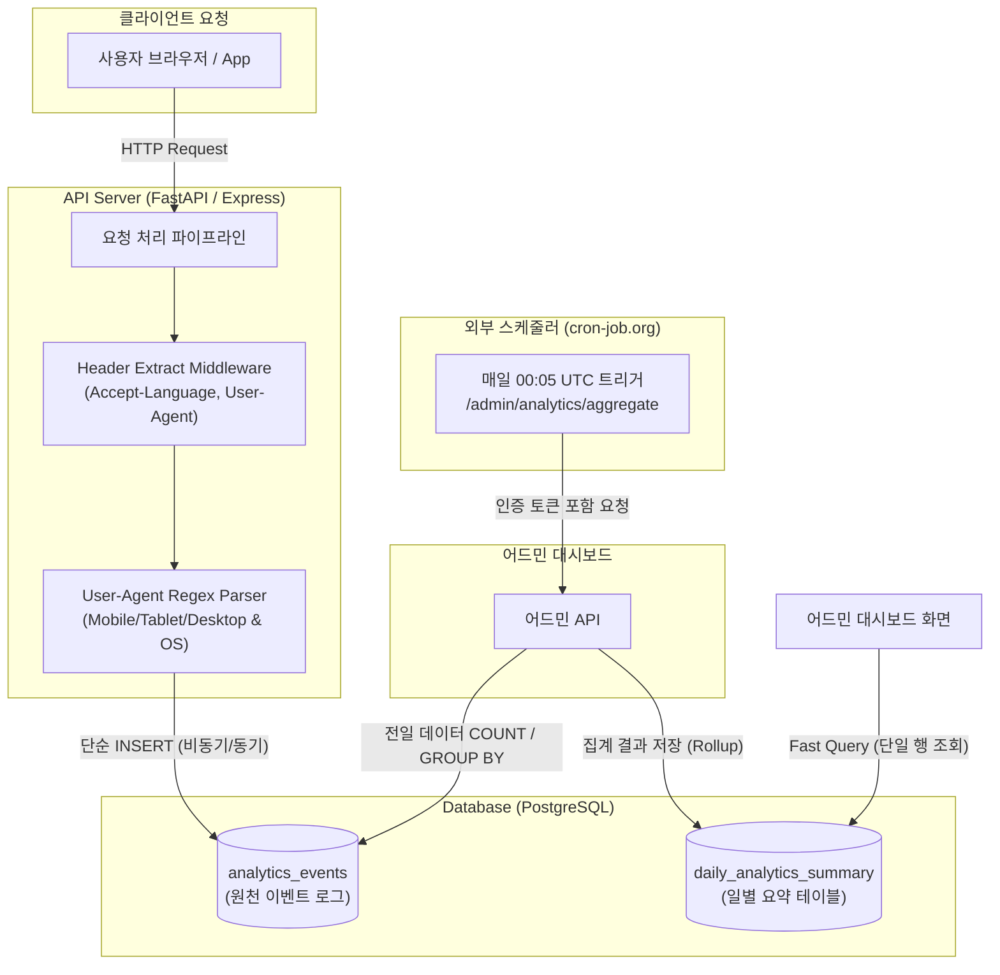

화장품 성분 분석 서비스 PickSafe를 개발하면서 운영 Telemetry 및 어드민 방문자 분석 기능을 구현해야 하는 시점이 있었습니다. 초기에는 접속자의 실시간 동향이나 접속 지역을 보여주는 시각화 기능부터 구상했습니다. 하지만 서비스를 설계하고 실제 데이터의 흐름을 따져보면서, 이러한 화려한 지표(Vanity Metrics)가 실제 인프라 리소스와 비즈니스 요구사항 측면에서 심각한 비효율을 초래한다는 것을 깨달았습니다.

제한된 인프라 환경에서 오버헤드를 최소화하면서도, 실질적으로 유용한 유저 통계를 확보하기 위해 수집 범위와 트래킹 구조를 대대적으로 변경했습니다. 이 과정에서 마주했던 문제들과 기술적 의사결정의 이유를 정리했습니다.

---

## 🎯 마주한 고민과 문제 배경

### 1. GeoIP 기반 국가 판별의 비즈니스적 도메인 한계
PickSafe는 방한 외국인 관광객이 한국 현지 매장에서 화장품을 구매할 때 성분을 분석해 주는 시나리오가 주요 유스케이스 중 하나입니다. 초기에는 접속자의 IP 주소를 기반으로 MaxMind 등 GeoIP 라이브러리를 사용해 국가를 판별하려 했습니다.

그러나 실제 테스트와 사용 환경을 분석한 결과, 한국에 방문한 외국인 사용자는 한국 현지 유심(USIM)을 착용하거나 한국 내 Wi-Fi/로밍망을 이용하므로 접속 IP가 대부분 한국(`KR`)으로 판별되는 문제가 있었습니다. 즉, IP 기반의 위치 분석은 서비스 핵심 타깃층인 외국인 유저의 실제 국가/언어권 식별 데이터를 크게 오염시켰습니다.

### 2. 무거운 실시간 집계 쿼리와 인프라 리소스 낭비
어드민 대시보드 조회 시 실시간 세션 목록 조회나 `COUNT`, `GROUP BY`가 포함된 무거운 집계 쿼리를 매번 실행하도록 구성할 경우, 데이터가 쌓임에 따라 DB CPU 점유율이 급증하고 커넥션 풀이 마르는 현상이 예상되었습니다. 인프라 대역폭을 불필요하게 소모하는 화려한 실시간 차트보다는, 실제 운영 의사결정에 직결되는 핵심 지표 중심의 경량화된 구조가 절실했습니다.

---

## ⚖️ 기술적 대안 비교 및 선택 이유

### 1. 언어권 식별: GeoIP 라이브러리 vs `Accept-Language` 헤더

*   **대안 A: GeoIP 라이브러리 (MaxMind DB 등)**
    *   *장점:* IP를 통한 대략적인 물리적 위치 추정 가능.
    *   *단점:* 관광객의 로밍/현지 유심 접속 시 국적이 `KR`로 오조회됨. IP DB 파싱 라이브러리 메모리 상주 오버헤드 발생. IP 저장 시 개인정보 보호 문제 수반.
*   **대안 B: 브라우저 `Accept-Language` 헤더 파싱 (최종 선택)**
    *   *장점:* 유저 기기의 실제 언어 설정 최우선 로케일 값을 신뢰하므로, 접속 네트워크 위치와 상관없이 실시간 사용자 언어권을 정확히 파싱 가능. 추가적인 외부 DB/라이브러리 조회가 없어 매우 경량임.
    *   *단점:* VPN 사용이나 헤더 임의 조작 시 약간의 변조 가능성이 있으나, 통계적 목적으로는 무시할 수 있는 수준.

### 2. 데이터 집계 방식: 실시간 쿼리 vs 이벤트 로그 ➔ 배치 집계 (Rollup)

*   **대안 A: 단일 로그 테이블 기반 실시간 집계**
    *   *장점:* 구현이 단순함.
    *   *단점:* 데이터가 수십만 건 이상 쌓일 경우 어드민 대시보드 로딩 속도가 저하되고, DB IOPS 및 CPU 사용량이 폭증함.
*   **대안 B: `analytics_events` (원천 로그) + `daily_analytics_summary` (배치 집계) (최종 선택)**
    *   *장점:* 유저 요청 시점에는 단일 `INSERT`만 수행하여 응답 속도에 영향을 주지 않음. 하루 1회 배치 처리로 요약 테이블을 구성하므로 어드민 조회 쿼리가 `O(1)` 수준으로 고속 실행됨.
    *   *단점:* 실시간 집계가 불가능하고 하루의 시차가 발생함. (그러나 어드민 통계 관점에서는 전날까지의 요약 정보로 충분함)

---

## 🏗️ 시스템 아키텍처 및 흐름

수집 범위를 **언어 분포**, **온보딩 완료율/건너뛰기율**, **게스트➔회원 전환율**의 3대 핵심 지표로 한정하고, 데이터 흐름을 수집(Ingestion)과 집계(Aggregation) 단계로 명확히 분리했습니다.



---

## 💻 핵심 구현 및 트러블슈팅

### 1. 헤더 기반의 경량화된 기기 사양 및 언어 추출

요청 헤더에서 개인 식별이 가능한 IP 주소는 배제하고, `Accept-Language`와 `User-Agent`를 안전하게 파싱하여 로그 테이블에 적재하는 로직을 작성했습니다.

```python
import re
from fastapi import Request

def extract_client_telemetry(request: Request) -> dict:
    # 1. Accept-Language 파싱 (최우선 언어 추출)
    accept_lang = request.headers.get("Accept-Language", "")
    primary_lang = "unknown"
    if accept_lang:
        # e.g., "en-US,en;q=0.9,ko;q=0.8" -> "en-US" -> "en"
        first_locale = accept_lang.split(",")[0].strip()
        primary_lang = first_locale.split(";")[0].split("-")[0].lower()

    # 2. User-Agent 파싱 (기기 유형 및 OS 추출)
    user_agent = request.headers.get("User-Agent", "")
    
    # OS 파싱
    os_type = "Other"
    if "iPhone" in user_agent or "iPad" in user_agent:
        os_type = "iOS"
    elif "Android" in user_agent:
        os_type = "Android"
    elif "Windows" in user_agent:
        os_type = "Windows"
    elif "Macintosh" in user_agent:
        os_type = "macOS"
    elif "Linux" in user_agent:
        os_type = "Linux"

    # Device Type 파싱
    device_type = "Desktop"
    if "Mobile" in user_agent or "Android" in user_agent or "iPhone" in user_agent:
        device_type = "Mobile"
    elif "iPad" in user_agent or "Tablet" in user_agent:
        device_type = "Tablet"
    elif not user_agent:
        device_type = "Unknown"

    return {
        "language": primary_lang,
        "os": os_type,
        "device_type": device_type
    }
```

### 2. 배치 집계(Rollup) 처리 및 멱등성 보장 SQL

매일 밤 전날의 데이터를 요약 테이블로 옮기는 배치 작업 시, 중복 실행되어도 데이터가 오염되지 않도록 **ON CONFLICT (멱등성)** 구문을 반영한 집계 쿼리를 설계했습니다.

```sql
-- daily_analytics_summary 테이블로 전일 데이터 Rollup
INSERT INTO daily_analytics_summary (
    summary_date,
    lang_distribution,
    device_distribution,
    onboarding_completion_rate,
    guest_to_user_conversion_rate,
    created_at
)
SELECT
    TARGET_DATE as summary_date,
    jsonb_object_agg(lang, lang_count) as lang_distribution,
    jsonb_object_agg(device_os, device_count) as device_distribution,
    (COUNT(CASE WHEN event_type = 'ONBOARDING_COMPLETE' THEN 1 END)::float / 
     NULLIF(COUNT(CASE WHEN event_type IN ('ONBOARDING_COMPLETE', 'ONBOARDING_SKIP') THEN 1 END), 0)) * 100 as onboarding_completion_rate,
    (COUNT(CASE WHEN event_type = 'GUEST_CONVERT_SUCCESS' THEN 1 END)::float / 
     NULLIF(COUNT(CASE WHEN event_type = 'GUEST_BANNER_VIEW' THEN 1 END), 0)) * 100 as guest_to_user_conversion_rate,
    NOW()
FROM (
    -- 전일 원본 로그 집계 서브쿼리
    SELECT 
        language as lang, COUNT(*) as lang_count,
        os as device_os, COUNT(*) as device_count,
        event_type
    FROM analytics_events
    WHERE created_at >= TARGET_DATE AND created_at < TARGET_DATE + INTERVAL '1 day'
    GROUP BY language, os, event_type
) sub
GROUP BY TARGET_DATE
ON CONFLICT (summary_date) 
DO UPDATE SET
    lang_distribution = EXCLUDED.lang_distribution,
    device_distribution = EXCLUDED.device_distribution,
    onboarding_completion_rate = EXCLUDED.onboarding_completion_rate,
    guest_to_user_conversion_rate = EXCLUDED.guest_to_user_conversion_rate,
    created_at = NOW();
```

### 3. 트러블슈팅: In-App 웹뷰(WebView) 및 예외 User-Agent 파싱 실패 대응
구현 초기, 인스타그램이나 카카오톡 내부 웹뷰로 접속하는 유저의 `User-Agent`에 `Mobile` 표준 키워드가 누락되거나 특이한 포맷으로 전달되어 `Desktop`이나 `Other`로 잘못 집계되는 현상이 있었습니다.

이를 해결하기 위해 대표적인 국내외 앱 내 웹뷰 식별자(`KAKAOTALK`, `Instagram`, `FB_IAB`, `NAVER`) 패턴을 정규식에 추가하고, 기기 식별 실패 시 무조건적인 디폴트 처리 대신 `Unknown` 카테고리로 분리하여 추후 파싱 규칙을 보완할 수 있도록 예외 처리를 강화했습니다.

---

## 💡 돌아보며 배운 점

### 지표 수집의 목적과 도메인 특성에 대한 이해
처음 통계 기능을 설계할 때는 '더 많은 데이터를 실시간으로 보여주는 것'이 좋은 기능이라 생각했습니다. 하지만 서비스의 도메인 특성(한국을 방문한 외국인 관광객 사용성)을 깊이 고려하지 않은 GeoIP 추적은 쓸모없는 오염된 데이터만 남길 뿐이었습니다. 지표를 수집하기 전에 **"이 데이터가 실제 어떤 비즈니스 의사결정에 쓰이는가?"**를 먼저 검증하는 것이 시스템 단순화의 첫걸음임을 깨달았습니다.

### 인프라 제약을 극복하는 비동기/배치 처리의 위력
실시간 집계를 포기하고 배치 집계 모델(`analytics_events` ➔ `daily_analytics_summary`)을 선택함으로써, 어드민 대시보드의 조회 성능을 데이터 증가와 무관하게 Constant한 수준으로 유지할 수 있었습니다. DB 리소스가 제한된 환경일수록 단순 쿼리의 조합과 적절한 데이터 라이프사이클 설계가 시스템 전체의 안정성을 좌우한다는 배움을 얻었습니다.

추후 `analytics_events` 원천 테이블의 크기가 과도하게 커지는 것을 방지하기 위해, 90일이 지난 원천 로그는 자동 파티셔닝 drop 처리하거나 S3 등 단가 낮은 저장소로 덤프하는 아카이빙 파이프라인을 추가로 보완할 계획입니다.