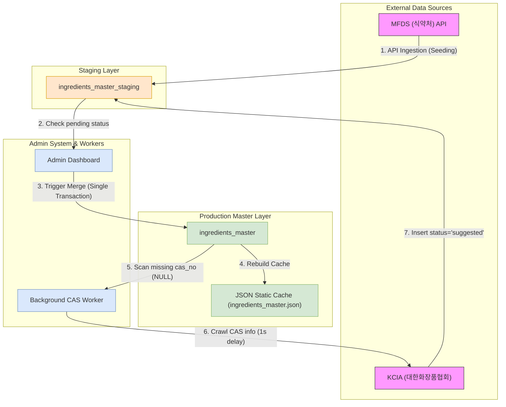

화장품 성분 분석 서비스 PickSafe를 개발하며 외부 공공 API(식약처 성분 정보)를 동기화하는 과정을 개편했습니다. 

초기에는 수집 데이터를 운영 테이블에 직접 덮어쓰거나 수집 시점마다 전체 테이블을 비우고 다시 채우는 방식으로 빠르게 구현했으나, 데이터 모델의 연관 관계가 복잡해짐에 따라 심각한 데이터 무결성 문제를 마주했습니다.

이 문제를 해결하기 위해 스테이징(Staging) 임시 테이블과 자연 키 기반의 병합(Merge) 아키텍처를 도입한 고민과 구현 과정을 기록합니다.

---

## 🎯 마주한 고민과 문제 배경

PickSafe의 핵심 DB 테이블인 `ingredients_master`(실운영 성분 마스터)는 서비스 내 주요 도메인들과 강한 외래 키(FK) 참조 관계를 맺고 있습니다.

- `user_allergens.ingredient_id` (사용자 설정 기피 성분)
- `product_ingredients.ingredient_id` (화장품 전성분 매핑)
- `scan_result_ingredients.ingredient_id` (사용자 성분 스캔 이력)

초기 방식처럼 식약처 API 수집 데이터를 실운영 테이블에 직접 덮어쓰거나 테이블을 재생성(Drop & Insert)하는 구조에서는 수집이 실행될 때마다 기존 성분 행의 식별자(`id`, UUID)가 교체되거나 삭제되었습니다.

이로 인해 사용자 기피 성분 참조가 엉뚱한 성분을 가리키거나 과거 스캔 결과 매칭 기록이 유실되는 **외래 키 참조 붕괴(FK Corruption)** 현상이 발생했습니다.

기존 데이터의 식별자(UUID)를 고정으로 보존하면서, 식약처 API에서 제공하는 신규 성분이나 변경된 속성만 안전하게 반영할 수 있는 정교한 데이터 수집 및 병합 메커니즘이 필요했습니다.

---

## ⚖️ 기술적 대안 비교 및 선택 이유

운영 테이블의 참조 무결성을 지키면서 외부 데이터를 수집하기 위해 세 가지 대안을 검토했습니다.

| 검토 항목 | 대안 1: 운영 테이블 직접 Upsert | 대안 2: 별도 매핑 테이블 연동 | 대안 3: 스테이징 테이블 + 자연 키 병합 (선택) |
| :--- | :--- | :--- | :--- |
| **작동 방식** | API 수집 즉시 실운영 DB에 Direct `ON CONFLICT UPDATE` | 외부 식별자와 내부 UUID를 매핑하는 중간 레이어 신설 | 임시 테이블에 1차 적재 후 검수 및 단일 트랜잭션 병합 |
| **무결성 안전성** | ⚠️ 수집 중 오염된 데이터가 운영 DB에 즉시 반영됨 | 🟢 원본 PK 보존 가능 | 🟢 원본 PK 보존 및 정제 데이터만 반영 |
| **조회 성능** | 🟢 추가 Join 없음 | 🔴 모든 성분 조회 시 매핑 Join 필요하여 레이턴시 증가 | 🟢 운영 DB 직접 조회로 성능 저하 없음 |
| **운영 검수성** | 🔴 불가능 (실시간 직접 반영) | 🟡 매핑 테이블 관리의 복잡도 증가 | 🟢 어드민에서 검수 후 승인 기반 병합 가능 |

### 선택 이유
대안 1은 잘못된 정제 데이터나 오타가 실시간으로 사용자에게 노출되는 위험이 컸고, 대안 2는 조회 쿼리마다 매핑 연산이 추가되어 백엔드 API 레이턴시 저하를 유발했습니다.

결과적으로 **대안 3(스테이징 테이블 도입 및 자연 키 병합)**을 선택했습니다. 외부 데이터 정제 과정과 실운영 서비스 조회를 물리적으로 분리하고, 검증된 데이터만 자연 키(`inci_name`, 국제 화장품 성분명)를 기준으로 병합하는 방식이 운영 안정성과 성능 측면에서 가장 적합하다고 판단했습니다.

---

## 🏗️ 시스템 아키텍처 및 흐름

수집, 스테이징, 어드민 검수 및 트랜잭션 병합, 백그라운드 CAS 보강으로 이어지는 데이터 파이프라인의 전체 흐름입니다.



### 파이프라인 주요 상태값 관리
스테이징 테이블(`ingredients_master_staging`)은 `status` 필드를 통해 수집 데이터의 생명주기를 관리합니다.
- `pending`: 국문명과 INCI명이 모두 정상 수집되어 병합 대기 중인 상태
- `error`: 필수 명칭 속성이 누락되어 수동 검토가 필요한 상태
- `suggested`: 백그라운드 배치가 추가 CAS 번호를 찾아내어 어드민 승인을 기다리는 상태
- `merged`: 실운영 테이블로 병합이 완료되어 보존 기록으로 전환된 상태

---

## 💻 핵심 구현 및 트러블슈팅

### 1. 자연 키(`inci_name`) 기반의 UUID 보존 병합 로직

`inci_name`을 자연 키로 사용하여 운영 DB에 이미 존재하는 성분일 경우 기존 UUID(`id`)를 유지한 채 성분명, CAS 번호, 규제 사유 필드만 `UPDATE`하고, 존재하지 않는 신규 성분에 대해서만 신규 UUID를 발급해 `INSERT`하도록 구현했습니다.

```python
# app/services/ingredient_service.py (개념 구현 스니펫)

from sqlalchemy.orm import Session
from sqlalchemy import select
import uuid

def merge_staging_to_master(db: Session) -> dict:
    # 단일 트랜잭션 시작
    try:
        # status가 'pending'인 스테이징 데이터 조회
        pending_items = db.scalars(
            select(IngredientStaging).where(IngredientStaging.status == "pending")
        ).all()

        merged_count = 0
        inserted_count = 0

        for item in pending_items:
            # 자연 키(inci_name) 기준 기존 운영 데이터 조회
            existing_master = db.scalar(
                select(IngredientMaster).where(IngredientMaster.inci_name == item.inci_name)
            )

            if existing_master:
                # [UPDATE] 기존 UUID(id) 고정 유지, 가변 속성만 업데이트
                existing_master.ko_name = item.ko_name
                existing_master.cas_no = item.cas_no or existing_master.cas_no
                existing_master.restriction_reason = item.restriction_reason
                merged_count += 1
            else:
                # [INSERT] 신규 성분일 경우에만 새 UUID 할당
                new_master = IngredientMaster(
                    id=str(uuid.uuid4()),
                    inci_name=item.inci_name,
                    ko_name=item.ko_name,
                    cas_no=item.cas_no,
                    restriction_reason=item.restriction_reason
                )
                db.add(new_master)
                inserted_count += 1

            # 스테이징 상태 업데이트
            item.status = "merged"

        # 트랜잭션 커밋
        db.commit()

        # 정적 JSON 캐시 파일 재빌드 호출
        rebuild_ingredient_cache_json(db)

        return {"updated": merged_count, "inserted": inserted_count}

    except Exception as e:
        db.rollback()
        raise e
```

### 2. 비동기 CAS 번호 사후 보강 배치

공공 API 수집 데이터 중 CAS 번호가 누락된 성분이 많았습니다. 수집 단계에서 CAS 번호가 없다고 전체 데이터를 차단하면 수집률이 급격히 떨어졌습니다. 

따라서 정상 명칭(국문명, INCI명)만 존재하면 일단 병합을 허용하고, 백그라운드 배치가 대한화장품협회(KCIA) 웹사이트를 순회하며 CAS 번호를 사후 보강하는 방식으로 트러블슈팅했습니다.

```python
# app/workers/cas_enrichment.py (배치 로직 스니펫)

import time
from sqlalchemy.orm import Session

def run_cas_enrichment_batch(db: Session):
    """실운영 DB 중 cas_no가 NULL인 항목을 찾아 KCIA 크롤링 후 Staging에 suggested로 제안"""
    target_ingredients = db.scalars(
        select(IngredientMaster).where(IngredientMaster.cas_no.is_(None))
    ).all()

    for target in target_ingredients:
        # 과도한 요청 방지를 위한 딜레이
        time.sleep(1.0)
        
        found_cas = fetch_cas_from_kcia(target.ko_name, target.inci_name)
        
        if found_cas:
            # 스테이징 테이블에 제안 상태로 등록하여 어드민 검수 유도
            suggestion = IngredientStaging(
                inci_name=target.inci_name,
                ko_name=target.ko_name,
                cas_no=found_cas,
                status="suggested",
                note="백그라운드 배치를 통해 발견된 CAS 번호"
            )
            db.add(suggestion)
            db.commit()
```

### 3. 어드민 비우기(초기화) 안전장치 도입

어드민 파널에서 전체 데이터를 비우는 고위험 동작을 실행할 때, 실수로 실운영 데이터를 삭제하는 사고를 방지하기 위해 폼 파라미터(`target_table`)를 통한 토글 제어 방식을 적용했습니다.

API 요청 시 기본 파라미터를 `staging`으로 제한하여, 명시적으로 `master` 파라미터가 전달되지 않는 한 실운영 DB 삭제 요청이 차단되도록 구현했습니다.

---

## 💡 돌아보며 배운 점

### 1. RDBMS에서 자연 키(Natural Key)와 대리 키(Surrogate Key)의 균형
UUID와 같은 대리 키는 내부 조인 및 참조 무결성 유지에 탁월하지만, 외부 시스템과의 데이터 동기화 과정에서는 데이터의 유일성을 식별할 자연 키(`inci_name`) 설정이 필수적이라는 점을 체득했습니다. 자연 키 매칭을 통한 조건부 Upsert 아키텍처를 통해 PK 변경 없는 안전한 데이터 갱신이 가능해졌습니다.

### 2. 원격 데이터 수집 시스템의 완충지대(Staging)의 가치
외부 API는 데이터 누락, 포맷 변경, 중복 전송 등 제어 불가능한 변수가 항상 존재합니다. 운영 DB에 데이터를 직접 꽂아 넣는 방식은 장애로 직결됩니다. 스테이징 테이블이라는 완충지대를 둠으로써 데이터 정제, 검수, 트랜잭션 단위 반영을 손쉽게 제어할 수 있었습니다.

### 3. UX 및 백엔드 안전장치의 중요성
데이터 비우기 기능의 기본 대상을 `Staging`으로 지정하고 대시보드에 `Master 건수`와 `Staging 건수`를 이중으로 노출하는 것만으로도 운영 중 발생할 수 있는 인적 실수를 크게 줄일 수 있었습니다. 백엔드 아키텍처 설계에는 정교한 로직뿐만 아니라 실수 가능성을 차단하는 방어적 설계가 포함되어야 함을 배웠습니다.