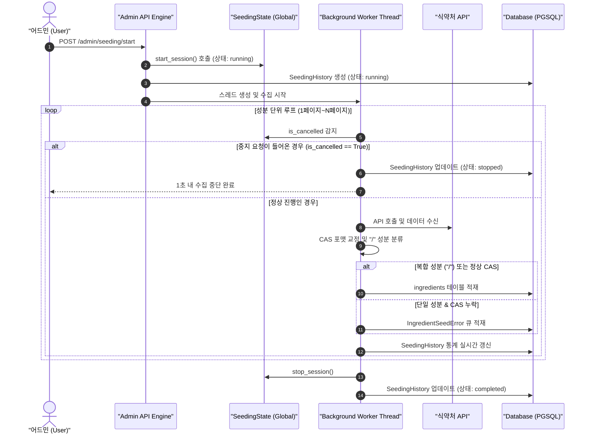

화장품 성분 분석 서비스 PickSafe를 개발하며 외부 공공 데이터 원천인 식약처 API를 매쉬업하는 수집 파이프라인을 구축했습니다. 파이프라인을 구축한 초기에는 단순히 API를 호출해 파싱 후 DB에 적재하는 형태로도 충분할 것이라 생각했습니다.

그러나 실제 외부 데이터를 대량으로 수집하는 과정에서 상용 환경 수준의 데이터 품질 관리와 백그라운드 스레드 제어의 부재로 인한 여러 구조적 문제에 부딪혔습니다. 이 글은 그 문제를 해결하는 과정에서 진행했던 아키텍처 재설계와 기술적 시도에 관한 기록입니다.

---

## 🎯 마주한 고민과 문제 배경

### 1. 외부 원천 데이터(식약처 API)의 불완전성
식약처 API 데이터는 공공 데이터 특성상 파편화되어 있거나 포맷 규격이 엄격하게 지켜지지 않는 경우가 많았습니다.
- **CAS 번호 오기 및 누락**: 하나의 필드에 여러 CAS 번호가 쉼표나 공백으로 엉켜 들어오거나, 숫자가 아닌 문자가 섞여 들어오는 현상이 발생했습니다.
- **복합 성분의 특이성**: 복합 원료나 추출물, 코폴리머 등 성분명에 슬래시(`/`)가 포함된 복합 성분은 대한화장품협회 사전에 준해 CAS 번호가 존재하지 않는 것이 정상입니다. 그러나 기존 파이프라인은 CAS 번호가 비어있다는 이유로 이를 무조건 수집 에러(`IngredientSeedError`)로 처리하여 무의미한 에러 내역이 수천 건씩 쌓였습니다.

### 2. 백그라운드 스레드의 제어권 및 가시성 부재
수집 작업은 시간이 오래 걸리기 때문에 백그라운드 스레드로 동작하도록 구현했습니다. 하지만 운영을 진행하면서 몇 가지 심각한 제어 이슈가 드러났습니다.
- **작업 취소 불가**: 잘못된 인자로 수집을 시작하거나 서버 부하가 높을 때 수집 스레드를 중간에 강제 종료할 방법이 없어, 작업이 끝날 때까지 기다리거나 프로세스를 재시작해야 했습니다.
- **스레드 섀도잉 및 상태 불일치**: Python 모듈 캐싱과 스레드 간 메모리 참조 방식의 문제로 인해, 어드민에서 '중지' 요청을 보내도 백그라운드 스레드가 이를 감지하지 못하고 계속 수집 루프를 돌았습니다.
- **진행 상황의 블라인드**: 수집이 어느 페이지를 지나고 있는지, 성공률과 실패율이 어떻게 되는지 실시간 모니터링이 불가능했습니다.

---

## ⚖️ 기술적 대안 비교 및 선택 이유

이 문제를 해결하기 위해 백그라운드 작업 관리 방식과 데이터 검증 정책에 대해 대안을 고민했습니다.

### 1. 백그라운드 작업 제어 방식

| 비교 항목 | 대안 A: 외부 데이터 스토어 기반 Celery / Redis 도입 | 대안 B: 글로벌 상태 객체 (`SeedingState`) & DB 이력 모델 도입 |
| :--- | :--- | :--- |
| **장점** | 분산 환경 확장성 우수, 작업 중단 및 상태 관리가 프레임워크 표준으로 제공됨. | 별도의 인프라(Redis 등) 추가 없이 현재 서비스 아키텍처 내에서 경량으로 제어 가능. |
| **단점** | 단순 백그라운드 수집 작업을 위해 인프라 관리 복잡도 및 메모리 오버헤드 증가. | 단일 애플리케이션 인스턴스 범위 내로 제어가 제한됨. |
| **선택** | ❌ (현재 단계에서는 과도한 아키텍처로 판단) | **✅ 최종 선택** |

**선택 이유**: 현재 PickSafe의 어드민 수집 인프라 단에서는 단일 인스턴스 내 스레드 제어만으로도 안정적인 운영이 가능하다고 판단했습니다. 인프라 복잡도를 늘리지 않으면서, 메모리 레퍼런스를 정확히 바라보는 글로벌 상태 객체(`SeedingState`)와 DB 테이블(`SeedingHistory`)을 조합하여 1초 이내 제어 반응성을 확보하기로 결정했습니다.

### 2. CAS 번호 미존재 성분에 대한 처리 정책

*   **기존 정책**: CAS 번호 미존재 시 무조건 `IngredientSeedError` 큐로 이관.
*   **개선 정책**: 성분명 내 슬래시(`/`) 유무로 단일 원료와 복합 원료 구분.
    *   **슬래시(`/`) 포함 성분**: 복합 원료로 판별하여 CAS 번호가 없어도 `NULL` 저장 후 정상 적재 처리.
    *   **슬래시(`/`) 미포함 단일 성분**: CAS 번호가 `0`이거나 `NULL`인 경우에만 `IngredientSeedError`로 이관하여 운영자의 수동 검토 대상으로 한정.

---

## 🏗️ 시스템 아키텍처 및 흐름

개선된 데이터 수집 및 상태 제어 파이프라인의 전체적인 아키텍처 흐름은 아래와 같습니다.



---

## 💻 핵심 구현 및 트러블슈팅

### 1. 스레드 섀도잉 해결 및 백그라운드 상태 제어

스레드 간 상태 불일치를 막기 위해, `SeedingState` 클래스는 클래스 레퍼런스 자체를 고정하고 실시간 속성 조회를 보장하도록 설계했습니다. Python 3.7+ 모듈 레벨 `__getattr__`을 활용하여 모듈 인포트 시점의 섀도잉 문제를 방지했습니다.

```python
# app/core/seeding_state.py
import threading
from typing import Optional

class SeedingState:
    _instance = None
    _lock = threading.Lock()

    def __new__(cls):
        with cls._lock:
            if cls._instance is None:
                cls._instance = super().__new__(cls)
                cls._instance._is_running = False
                cls._instance._cancel_requested = False
                cls._instance._current_history_id = None
            return cls._instance

    @property
    def is_running(self) -> bool:
        return self._is_running

    def request_cancel(self):
        if self._is_running:
            self._cancel_requested = True

    def should_stop(self) -> bool:
        return self._cancel_requested

    def start_session(self, history_id: int):
        self._is_running = True
        self._cancel_requested = False
        self._current_history_id = history_id

    def stop_session(self):
        self._is_running = False
        self._cancel_requested = False
        self._current_history_id = None

# 모듈 싱글톤 인스턴스
seeding_state = SeedingState()
```

수집 내부 루프에서는 매 성분 파싱 단계마다 `should_stop()`을 검사하여, 취소 요청이 들어왔을 때 즉시 루프를 탈출하도록 처리했습니다.

```python
# app/services/seeding_service.py
for item in raw_items:
    # 1초 내 반응성을 위한 루프 최상단 중단 체크
    if seeding_state.should_stop():
        logger.info("수집 중단 요청을 감지하여 스레드를 안전하게 종료합니다.")
        history.status = "stopped"
        db.commit()
        seeding_state.stop_session()
        return

    process_ingredient_item(db, item, history)
```

### 2. 성분 분기 및 복합 원료 예외 자율 통과 로직

식약처 API로부터 들어온 데이터에서 슬래시(`/`)를 감지해 정상 통과시키고, 비표준 CAS 번호 포맷을 정규화하는 트러블슈팅 코드입니다.

```python
# app/utils/ingredient_parser.py
import re
from typing import Optional, Tuple

def parse_and_validate_cas(ingredient_name: str, raw_cas: Optional[str]) -> Tuple[Optional[str], bool]:
    """
    성분명과 raw CAS 번호를 검증하여 (정제된_CAS, 에러_큐_이관_여부)를 반환합니다.
    """
    # 1. 성분명에 슬래시(/)가 들어간 복합 원료/추출물 처리
    is_composite = "/" in ingredient_name

    if not raw_cas or raw_cas.strip() in ["0", "", "None", "null"]:
        if is_composite:
            # 복합 원료는 CAS가 없는 것이 정상이므로 에러 큐에 넣지 않고 NULL로 정상 통과
            return None, False
        else:
            # 단일 원료인데 CAS가 없으면 사람의 검토 필요 -> 에러 큐 이관
            return None, True

    # 2. 비표준 포맷 정제 (공백 제거, 대문자화)
    clean_cas = raw_cas.strip().replace(" ", "")
    
    # 복수 CAS가 쉼표나 슬래시로 적힌 경우 첫 번째 유효 CAS 추출
    if "," in clean_cas or "/" in clean_cas:
        tokens = re.split(r'[,/]', clean_cas)
        clean_cas = tokens[0].strip()

    # 표준 CAS 번호 정규식 패턴 검증 (예: 7732-18-5)
    cas_pattern = r'^\d{2,7}-\d{2}-\d$'
    if re.match(cas_pattern, clean_cas):
        return clean_cas, False
    
    # 패턴 불일치 시 단일 성분이라면 에러 큐 이관
    return None, not is_composite
```

### 3. 어드민 편의성: 외부 사전에 연동된 일괄 재적재 엔드포인트

오류 큐에 적재된 성분을 검토할 때 운영자가 빠르게 외부 공인 사전과 비교할 수 있도록 단축 검색을 지원하고, 수정된 건들을 일괄 재적재하는 API를 추가했습니다.

```python
# app/api/admin_seeding.py
from fastapi import APIRouter, Depends, HTTPException
from sqlalchemy.orm import Session
from typing import List

router = APIRouter(prefix="/admin/seeding", tags=["Admin Seeding"])

@router.post("/retry-batch")
def retry_batch_errors(
    error_ids: List[int], 
    db: Session = Depends(get_db)
):
    """
    운영자가 수정한 IngredientSeedError 건들을 선택하여 일괄 재적재합니다.
    """
    errors = db.query(IngredientSeedError).filter(IngredientSeedError.id.in_(error_ids)).all()
    success_count = 0

    for err in errors:
        try:
            # 재적재 로직 수행
            ing = Ingredient(
                name_kr=err.name_kr,
                name_en=err.name_en,
                cas_number=err.corrected_cas
            )
            db.add(ing)
            db.delete(err) # 에러 큐에서 제거
            success_count += 1
        except Exception as e:
            db.rollback()
            continue

    db.commit()
    return {"status": "success", "processed_count": success_count}
```

---

## 💡 돌아보며 배운 점 (회고)

이번 작업을 진행하면서 얻은 실질적인 개선 효과와 기술적 레슨은 다음과 같습니다.

### 1. 정성적/정량적 성과
* **수동 검토 소요 90% 이상 절감**: 불필요한 복합 원료 예외 처리와 자동 포맷 정제를 통해 에러 큐에 쌓이던 비정상 내역의 대다수가 자동으로 걸러졌습니다.
* **제어 즉각성 확보**: 대시보드의 '중지' 버튼을 눌렀을 때 백그라운드 스레드가 1초 이내에 모니터링 수집 루프를 안전하게 멈추고 DB 상태(`stopped`)를 맞추는 것을 확인했습니다.
* **실시간 가시성 제공**: `SeedingHistory` 모델과 5초 주기 대시보드 상태판 연동을 통해, 현재 파이프라인의 진행률과 성공/실패 수치를 명확히 파악할 수 있게 되었습니다.

### 2. 엔지니어링 교훈
* **외부 API 데이터에 대한 상호 불신**: 외부 공공 API를 사용할 때는 데이터 원천의 정합성을 과신해서는 안 된다는 점을 깨달았습니다. 파이프라인 전면에 정규화 및 예외 필터를 명확히 둠으로써 내부 도메인 영역의 무결성을 지킬 수 있었습니다.
* **스레드 가시성과 상태 관리**: 단순히 멀티스레드로 작업을 넘기는 것에 그치지 않고, 그 스레드의 생명주기와 메모리 레퍼런스를 어떻게 추적하고 통제할 것인지 초기 설계 단계부터 고려해야 함을 배웠습니다.

### 3. 추후 보완 과제
현재는 단일 인스턴스 애플리케이션 구조에 맞춰 메모리 기반 `SeedingState`와 DB 이력 트래킹을 결합해 문제를 해결했습니다. 향후 수집 대상 외부 데이터 원천이 확장되고 인스턴스가 다중화된다면, 그때는 Redis Pub/Sub 기반의 Celery 태스크 구조로 한 단계 고도화하는 방향을 검토해볼 예정입니다.