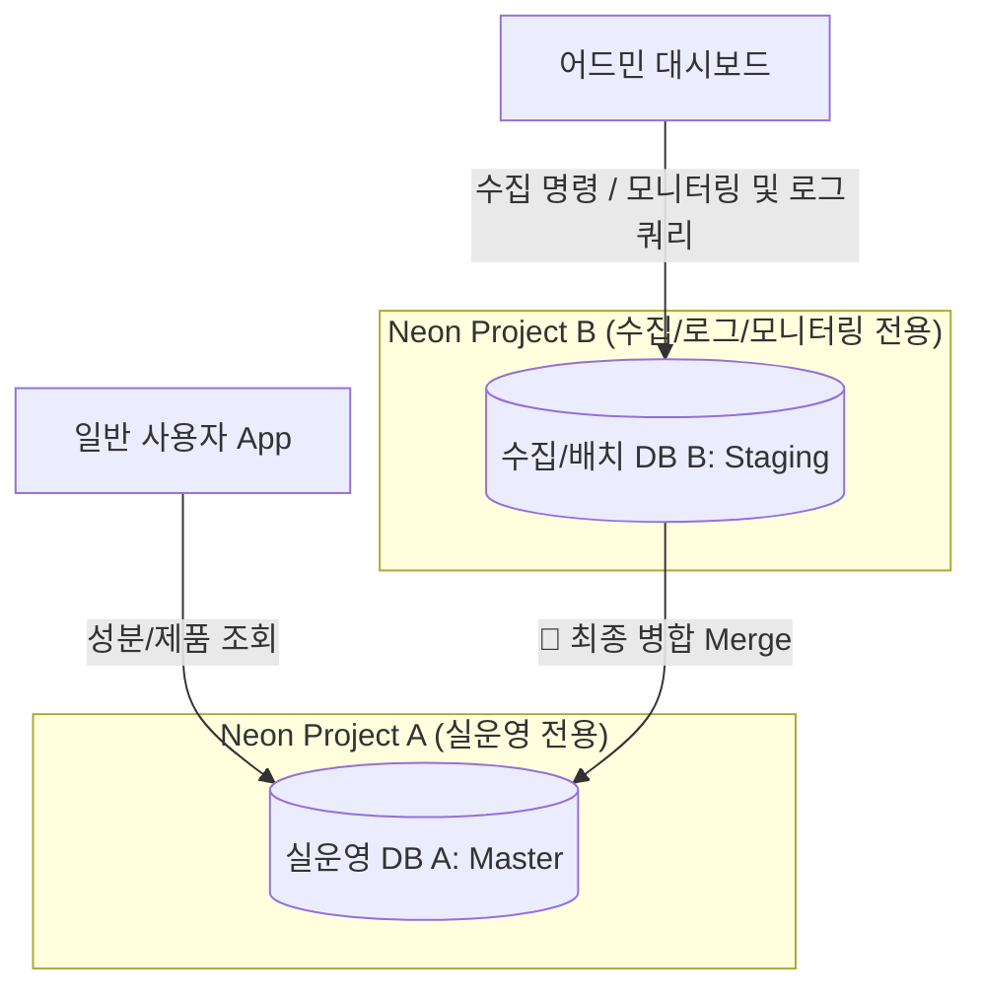
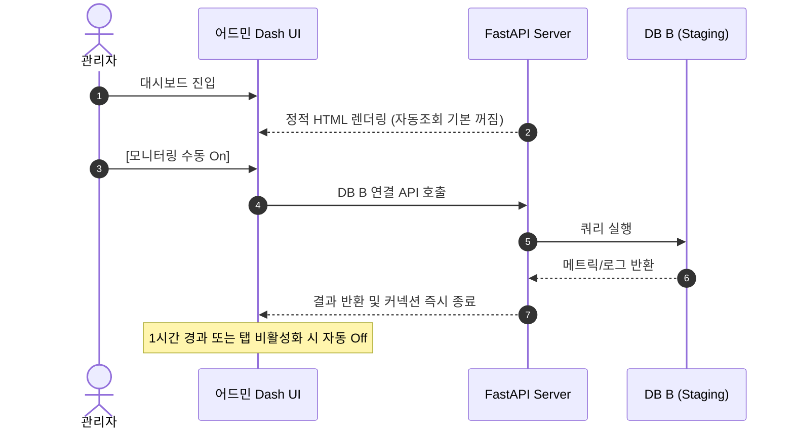

화장품 성분 분석 서비스 **PickSafe**를 개발하는 과정에서 식약처 공공 API 기반의 약 2만 건 성분 데이터 수집(Seeding) 및 매쉬업 파이프라인을 구축했습니다. 

하지만 클라우드 인프라로 채택한 Neon Serverless PostgreSQL 환경에서 서비스 규모가 커짐에 따라 **Compute 사용량(CU-Hours) 급증**이라는 현실적인 비용 문제에 직면했습니다.

이 글에서는 Serverless DB 환경의 특성을 이해하고, 서비스 안정성을 유지하면서 Compute 비용을 효과적으로 줄이기 위해 시도했던 아키텍처적 결단과 최적화 과정을 담담히 기록합니다.

---

## 🎯 마주한 고민과 문제 배경

Neon DB는 데이터베이스에 커넥션이 유지되거나 쿼리가 가동되는 활성 시간(Compute Active Time)을 기준으로 CU(Compute Unit)를 측정해 과금합니다. 개발 과정에서 크게 세 가지 기술적 병목과 비용 리스크를 마주했습니다.

1. **배치 부하로 인한 서비스 간섭**: 2만 건의 성분 데이터를 수집하고 매쉬업하는 과정에서 순간적으로 상당한 CPU와 IOPS 리소스가 소모되었습니다. 이는 동시 접속한 일반 사용자의 API 응답 속도 지연으로 이어졌습니다.
2. **어드민 모니터링으로 인한 Auto-suspend 불능**: 어드민 페이지에서 백그라운드로 실행되는 실시간 인프라/로그 모니터링 폴링(Polling) 쿼리가 DB 커넥션을 지속적으로 유지시켰습니다. 그 결과 DB가 자동 일시정지(Auto-suspend) 상태로 진입하지 못해 쓰지 않는 시간에도 Compute 비용이 계속 발생하는 원인이 되었습니다.
3. **인프라 메모리 제약**: 현재 소규모로 운용 중인 Render 호스팅 환경은 RAM 리소스가 넉넉하지 않아 외부 Redis 같은 별도의 인메모리 캐시 서버를 띄우기엔 비용과 리소스 부담이 컸습니다.

---

## ⚖️ 기술적 대안 비교 및 선택 이유

문제 해결을 위해 크게 두 가지 방향에서 대안을 비교 검토했습니다.

### 1. 단일 DB 스케일업 vs 물리적 Multi-DB 분리

| 구분 | 단일 DB + 고성능 CU 할당 | 물리적 Multi-DB 분리 (Master + DW/Staging) |
| :--- | :--- | :--- |
| **작업 격리** | 배치 구동 시 사용자 조회 쿼리와 리소스 경합 발생 | 수집/로그 작업이 실운영 DB에 전혀 영향을 주지 않음 |
| **비용 구조** | 상시 가동 스펙이 높아져 컴퓨팅 비용 전체 상승 | Staging DB에 5분 Auto-suspend를 적용하여 평소 비용 $0 유지가능 |
| **관리 복잡도** | 단일 접속 정보로 관리 간편 | DB 간 트랜잭션 분리 및 데이터 병합(Merge) 로직 구현 필요 |

**선택**: **물리적 Multi-DB 분리**를 선택했습니다. 단일 DB로는 배치 수집 중 사용자의 응답 속도를 보장하기 어려웠고, 배치용 DB B(`DEV_DATABASE_DW_URL`)에 타이트한 Auto-suspend(5분)를 적용하면 평상시 유휴 비용을 완전히 0으로 만들 수 있다고 판단했기 때문입니다.

### 2. Redis 캐시 인프라 구축 vs 백엔드 로컬 LRU 캐시

외부 Redis 인스턴스를 추가하는 것은 연간 모니터링 및 인프라 유지비용을 증가시킵니다. 데이터의 특성을 살펴보니 성분 이름 대칭 표와 같은 기본 마스터 데이터는 변경 빈도가 매우 적은 반고정 데이터였습니다.

따라서 굳이 분산 캐시를 도입하는 대신 Python 내장 라이브러리 기반의 **로컬 LRU 캐시(`cachetools`)**를 API 단에 적용하여 DB A로 들어가는 단순 조회 트래픽을 최대 70%까지 감쇄시키는 방향을 선택했습니다.

---

## 🏗️ 시스템 아키텍처 및 흐름

운영 환경(DB A)과 수집/로그 전용 환경(DB B)을 물리적으로 격리하고, 수동 병합(Merge) 단계를 거치도록 설계한 시스템 구조입니다.



어드민 모니터링의 백그라운드 폴링으로 인해 DB B가 일시정지되지 않는 문제를 막기 위해 아래와 같이 제어 흐름을 재설계했습니다.



---

## 💻 핵심 구현 및 트러블슈팅

### 1. 어드민 자동 폴링 기본값 Off 및 Safety Timeout 처리

어드민 화면 진입 시 모니터링 갱신 스위치를 기본적으로 `False`로 두어 불필요한 백엔드 API 호출을 차단했습니다. 또한 관리자가 스위치를 켜둔 채 자리를 비우는 상황에 대비해 클라이언트 측 1시간 자동 타임아웃과 Page Visibility API 연동을 적용했습니다.

```javascript
// dashboard.html 중 모니터링 자동 갱신 제어 로직 일부
let isAutoRefreshActive = false;
let autoRefreshTimer = null;
let timeoutSafetyTimer = null;

function toggleAutoRefresh(enabled) {
    isAutoRefreshActive = enabled;
    if (enabled) {
        startPolling();
        // 1시간(3600초) 후 강제 종료 장치
        timeoutSafetyTimer = setTimeout(() => {
            stopPolling();
            alert("안전을 위해 자동 모니터링이 1시간 후 자동 중단되었습니다.");
        }, 3600000);
    } else {
        stopPolling();
    }
}

// 브라우저 탭 비활성화 시 폴링 일시 중단 처리
document.addEventListener("visibilitychange", () => {
    if (document.hidden && isAutoRefreshActive) {
        stopPolling();
    }
});
```

### 2. 수집기 DB A 커넥션 완벽 격리 (Double-Buffering 시행착오)

#### 🐛 마주친 문제
초기 수집기 구현 시 배치 구동 중 매 페이지마다 데이터 중복을 확인하기 위해 DB A(Master)의 `ingredients_master` 테이블로 `SELECT` 쿼리를 지속해서 날렸습니다. 이로 인해 DB 분리 구조를 만들었음에도 배치 실행 중에 DB A의 CU 사용량이 동반 상승하는 문제가 발생했습니다.

#### 🛠️ 해결 방식
수집 프로세스 중에는 DB A로의 모든 커넥션을 원천 차단하도록 개편했습니다. 
오직 DB B(DW)의 `ingredients_master_staging` 테이블 내 플래그(`is_merged=True`) 및 CAS 번호 존재 여부만 체크하여 수집을 진행하도록 변경했습니다. 

실제 실운영 데이터 반영은 어드민에서 **[병합(Merge)]** 버튼을 클릭하는 시점에만 벌크 트랜잭션으로 처리하도록 단계를 분리했습니다.

```python
# db_router.py (개념 코드)
def get_seeding_check_target(db_session_b, cas_number: str) -> bool:
    """
    DB A를 조회하지 않고, DB B(Staging) 내부 플래그와 CAS 번호만으로 중복 여부 확인
    """
    exists_in_staging = db_session_b.query(IngredientMasterStaging)\
        .filter_by(cas_number=cas_number, is_merged=True)\
        .first()
    return exists_in_staging is not None
```

### 3. 일자별 로컬 로그 분할 및 로테이션 (Daily Log Rotation)

수집 과정에서 생성되는 장기간의 로그 파일이 단일 파일(`seeding_run_log.txt`)에 누적되며 디스크 용량을 지우거나 어드민 로딩 시 메모리 크래시를 유발했습니다. 

이를 해결하기 위해 프로젝트 루트의 독립된 `/log/` 폴더로 경로를 이관(Git 추적 제외)하고, `RotatingFileHandler`를 적용해 파일 크기를 엄격히 제어했습니다.

```python
import logging
from logging.handlers import RotatingFileHandler
import os

LOG_DIR = os.path.join(os.getcwd(), "log")
os.makedirs(LOG_DIR, exist_ok=True)

log_filename = os.path.join(LOG_DIR, f"seeding_run_{datetime.now().strftime('%Y-%m-%d')}.log")

# 파일당 최대 5MB, 백업본은 최대 1개로 제한하여 총 용량 10MB 초과 방지
handler = RotatingFileHandler(
    log_filename, 
    maxBytes=5 * 1024 * 1024, 
    backupCount=1, 
    encoding="utf-8"
)

logger = logging.getLogger("SeedingLogger")
logger.setLevel(logging.INFO)
logger.addHandler(handler)
```

---

## 💡 돌아보며 배운 점 (회고)

이번 최적화 작업을 이행하면서 얻은 리소스 절감 효과와 엔지니어링 측면의 교훈은 다음과 같습니다.

### 실질적인 개선 효과
1. **어드민 자동 폴링 Off 전환**: 불필요한 백그라운드 쿼리가 사라지며 DB B의 유휴 시간 활성화율이 대폭 감소했습니다. (약 30%의 Compute Unit 절감 효과)
2. **Local LRU Cache 도입**: 성분명 대칭 사전 등 자주 조회되는 데이터의 트래픽을 메모리 단에서 처리하여 DB A의 단순 Read 쿼리량을 최대 70% 감쇄했습니다.
3. **Auto-suspend 극대화**: 수집 배치가 동작하지 않는 대부분의 시간 동안 DB B의 DB Compute 비용을 $0에 가깝게 유지할 수 있게 되었습니다.

### 기술적 레슨
Serverless DB 구조는 사용한 만큼만 비용을 지불한다는 강력한 장점이 있지만, 커넥션 하나와 무심코 작성한 백그라운드 폴링 쿼리가 그대로 비용으로 직결된다는 엄정한 트레이드오프를 지니고 있습니다.

편리함 뒤에 숨은 비용 모델을 명확히 이해하고, **"필요할 때만 연결하고, 안 쓸 때는 확실히 잠들게 만든다"**는 자원 관리 원칙을 다시금 깨달았습니다. 향후 서비스 규모가 더 커진다면 인메모리 캐시 타임아웃 정교화 및 읽기 전용 복제본(Read Replica) 도입도 단계적으로 검토해볼 계획입니다.