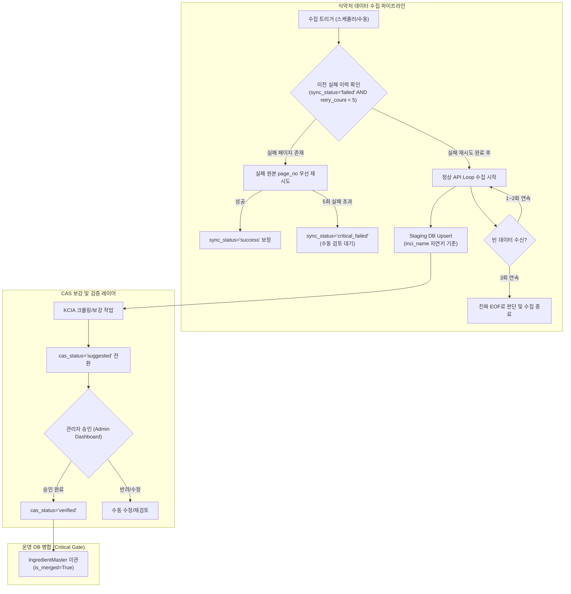

화장품 성분 분석 서비스 **PickSafe**를 개발하고 운영하면서 가장 기본이 되는 작업은 공공 데이터인 식약처(KFDA) 화장품 성분 정보를 정확하고 지속적으로 수집·유지하는 것입니다. 

하지만 서비스를 운영할수록 초기 수집 파이프라인 설계의 허점들이 하나씩 드러나기 시작했습니다. 공공 API의 불안정한 통신 상태, 단일 상태값(State) 오용으로 인한 데이터 유실, 그리고 특정 코드가 비대해지면서 생기는 유지보수 병목이 복합적으로 얽혀 있었습니다.

이 글은 식약처 성분 수집 파이프라인의 데이터 무결성을 확보하고 회복 탄력성(Resilience)을 높이기 위해 진행했던 구조적 재설계 과정과 기술적 고민을 정리한 기록입니다.

---

## 🎯 마주한 고민과 문제 배경

기존 파이프라인은 단순히 "API를 호출하고 가져온 데이터를 DB에 밀어 넣는다"는 관점으로 빠르게 작성되어 있었습니다. 이로 인해 실제 운영 환경에서 다음과 같은 4가지 핵심 결함이 발생했습니다.

### 1. 멱등성 결여와 미해결 이력 유실
수집을 1페이지부터 다시 실행할 때, 임시 적재 테이블(`IngredientMasterStaging`)에서 정상 처리되지 않은 데이터(`status = 'error'`)까지 일괄 삭제(`DELETE`)하는 로직이 존재했습니다. 이로 인해 수집 과정에서 에러가 발생하여 관리자의 확인을 기다리던 데이터가 재수집 트리거 한 번에 흔적도 없이 사라졌습니다.

### 2. CAS 번호 누락 데이터의 영구 소외
성분의 유일성을 판단하는 CAS(Chemical Abstracts Service) 번호를 보강하는 배치 작업이 운영 DB(`IngredientMaster`)를 기준으로 작동했습니다. 이미 이름이 등록된 성분은 수집 및 보강 루프에서 스킵되었기 때문에, **'이름은 존재하지만 CAS 번호가 누락된 성분'**은 영구적으로 보강 후보군에서 제외되는 모순이 생겼습니다.

### 3. API 일시 장애로 인한 조기 종료 (Fake EOF)
식약처 공공 API 호출 중 네트워크 타임아웃이나 일시적 호출 제한으로 빈 응답(`[]`)이 수신되면, 파이프라인은 이를 데이터의 끝(EOF)으로 간주하고 루프를 조기 종료했습니다. 결과적으로 전체 성분 중 일부만 수집된 채 프로세스가 끝나버렸습니다.

### 4. 라우터 코드의 단일 실패 지점화
수집, 스케줄링, 성분 병합, CAS 크롤링 등의 로직이 모두 `admin.py`라는 단일 라우터 파일에 몰려 있었습니다. 관리자 기능 수정 시 수집 파이프라인 코드까지 영향을 받는 구조적 위험을 안고 있었습니다.

---

## ⚖️ 기술적 대안 비교 및 선택 이유

문제를 해결하기 위해 파이프라인의 핵심 구조를 몇 가지 방향에서 비교 검토했습니다.

### 1. 상태 모델: 단일 문자열(String Enum) vs 다차원 분리 속성

| 구분 | 단일 문자열 상태 (`status`) | 다차원 분리 속성 (채택) |
| :--- | :--- | :--- |
| **구조** | `'pending'`, `'error'`, `'suggested'`, `'merged'` | `is_merged`, `sync_status`, `cas_status`, `cas_source`, `retry_count` |
| **장점** | 컬럼이 단순하고 조회 쿼리가 직관적임. | 수집 상태와 CAS 보강 상태, 운영 DB 병합 여부를 완벽히 독립 추적 가능. |
| **단점** | "통신 실패"와 "정보 불완전(CAS 없음)"의 구분이 불가능하여 상태 오염 발생. | 컬럼 수가 늘어나고 업데이트 로직 시 상태 변경 조건을 명확히 설계해야 함. |

**선택 이유:** 단일 상태 방식은 "API 통신은 성공했지만 CAS 번호 조회가 더 필요한 상태"를 표현하기 어려웠습니다. 따라서 각 도메인 영역(동기화, CAS 보강, 병합 여부)에 맞게 독립된 속성 필드로 완벽히 분리했습니다.

### 2. 수집 방식: Purge & Insert vs Key 기반 Upsert

*   **Purge & Insert:** 수집 시작 시 임시 테이블을 모두 비우고 다시 채우는 방식입니다. 구현은 쉽지만, 관리자 검토 대기 데이터나 이력이 날아가는 치명적 단점이 있었습니다.
*   **Key 기반 Upsert (선택):** 식약처 API에는 고유 ID가 없으므로 자연 키(Natural Key)인 `inci_name`(영문 성분명)과 `korean_name`(국문 성분명) 조합으로 존재 여부를 판단하여 `UPDATE` 또는 `INSERT`를 수행하는 방식을 선택했습니다. 이를 통해 수집을 몇 번을 재실행해도 데이터가 파괴되지 않는 **멱등성(Idempotency)**을 확보했습니다.

---

## 🏗️ 시스템 아키텍처 및 흐름

재설계된 파이프라인은 수집 회복(Retry) -> 식약처 API 수집 및 Upsert -> CAS 보강 -> 관리자 승인 -> 운영 DB 병합의 명확한 단계를 거칩니다.



---

## 💻 핵심 구현 및 트러블슈팅

### 1. 다차원 상태 데이터 모델 정의
SQLAlchemy 모델에서 단일 `status`를 제거하고, 도메인별 상태를 분리해 명시적으로 정의했습니다.

```python
# app/models/staging.py 일부

class IngredientMasterStaging(Base):
    __tablename__ = "ingredient_master_staging"

    id = Column(Integer, primary_primary_key=True, autoincrement=True)
    inci_name = Column(String(255), nullable=False, index=True)
    korean_name = Column(String(255), nullable=False)
    cas_no = Column(String(100), nullable=True)

    # 상태 분리 설계
    is_merged = Column(Boolean, default=False, nullable=False)
    sync_status = Column(String(20), default="success", nullable=False) # success, failed, critical_failed
    cas_status = Column(String(20), default="needed", nullable=False)  # needed, suggested, verified, not_found
    cas_source = Column(String(20), nullable=True)                      # kfda, kcia, manual
    retry_count = Column(Integer, default=0, nullable=False)
    error_message = Column(Text, nullable=True)
```

### 2. API 실패 자동 재시도 및 3회 연속 Empty 검증 루프
네트워크 불안정으로 인한 데이터 유실을 방지하기 위해 **실패 원본 페이지 우선 재시도 로직**과 **3회 연속 빈 데이터 수신 시 탈출하는 방어 로직**을 구현했습니다.

```python
# app/services/seed_kfda_ingredients.py 일부

MAX_RETRIES = 5
EMPTY_THRESHOLD = 3

async def process_failed_retries(db: AsyncSession):
    """이전 배치에서 실패했던 페이지 우선 재시도"""
    failed_records = await db.execute(
        select(IngredientMasterStaging)
        .where(
            IngredientMasterStaging.sync_status == "failed",
            IngredientMasterStaging.retry_count < MAX_RETRIES
        )
    )
    # 실패 페이지 재수집 처리...
    # retry_count >= 5 달성 시 sync_status = 'critical_failed' 변경

async def fetch_kfda_pipeline(db: AsyncSession):
    await process_failed_retries(db)

    page_no = 1
    empty_count = 0

    while True:
        try:
            items = await call_kfda_api(page_no=page_no)
            
            if not items:
                empty_count += 1
                if empty_count >= EMPTY_THRESHOLD:
                    # 3회 연속 빈 응답일 때만 진짜 종료로 처리
                    break
                page_no += 1
                continue

            empty_count = 0  # 정상 데이터 수신 시 리셋
            await upsert_staging_items(db, items)
            page_no += 1

        except Exception as e:
            # 예외 발생 시 무조건 중단하지 않고 error_message 기록 후 다음 진행
            await record_page_failure(db, page_no, str(e))
            page_no += 1
```

### 3. 병합 차단 게이트 (Critical Gate) 트러블슈팅
개발 과정에서 크롤링을 통해 자동으로 추정된 CAS 번호(`cas_status = 'suggested'`)가 검증 없이 운영 DB로 넘어가 데이터가 오염되는 문제가 발생할 가능성을 확인했습니다.

이를 막기 위해 **운영 DB 이관(Merge) 서비스**에 명시적인 Validation Gate를 추가했습니다.

```python
# app/services/merge_ingredients.py 일부

async def merge_staging_to_master(db: AsyncSession, staging_id: int):
    staging = await db.get(IngredientMasterStaging, staging_id)
    
    # CRITICAL GATE: 관리자 승인(verified) 상태가 아니면 절대로 병합 불가
    if staging.cas_status == "suggested":
        raise ValueError(
            f"[Gate Error] ID {staging_id} 성분은 관리자 검증(verified)이 필요합니다. 현재 상태: {staging.cas_status}"
        )
        
    if staging.sync_status != "success":
        raise ValueError(f"[Gate Error] 동기화 실패 데이터는 병합할 수 없습니다.")

    # Master DB 이관 처리 로직...
    staging.is_merged = True
    await db.commit()
```

### 4. 물리적 라우터 분리
기존 `admin.py`에 뒤엉켜 있던 수집 및 스케줄링 엔드포인트를 완전히 도려내어 `app/routers/seeding.py`로 분리했습니다. 이를 통해 라우터 단의 모듈화가 이루어졌고, 독립적인 테스트 작성이 가능해졌습니다.

---

## 💡 돌아보며 배운 점 (회고)

이번 재설계 작업을 진행하며 기술적으로, 그리고 아키텍처 관점에서 몇 가지 중요한 교훈을 얻었습니다.

1. **상태(State)는 명확할수록 안전하다**
   초기 개발 속도를 올리기 위해 문자열 하나로 관리하던 `status` 필드가 시스템이 확장되면서 얼마나 큰 독이 되는지 체감했습니다. 데이터의 수집 상태, 검증 상태, 반영 상태를 명확히 분리하자 복잡했던 조건문들이 대폭 단순해졌고, 쿼리의 정확도도 높아졌습니다.

2. **외부 API는 절대 신뢰할 수 없다 (Zero Trust Network)**
   공공 API의 타임아웃이나 일시적 빈 데이터 수신을 "데이터의 끝"으로 단정 지었던 단순한 생각이 데이터 누수의 원인이었습니다. 재시도 횟수 제한(`retry_count`), 임계값 기반 탈출(`EMPTY_THRESHOLD`), `critical_failed` 모니터링 체계 등 다중 방어선(Defense in Depth)이 파이프라인의 회복 탄력성을 만들어낸다는 것을 배웠습니다.

3. **멱등성은 시스템의 마음의 평화를 준다**
   "다시 실행해도 안전하다"는 멱등성이 보장되자, 배치가 중단되거나 오류가 발생해도 관리자가 심리적 불안감 없이 부담 없이 수집을 재실행할 수 있게 되었습니다.

앞으로는 수집 파이프라인의 처리량이 증가할 경우를 대비하여, 현재의 동기식/단일 루프 구조를 Celery나 Redis Queue 기반의 비동기 분산 작업 구조로 고도화하는 작업을 검토해볼 수 있을 것입니다.

---