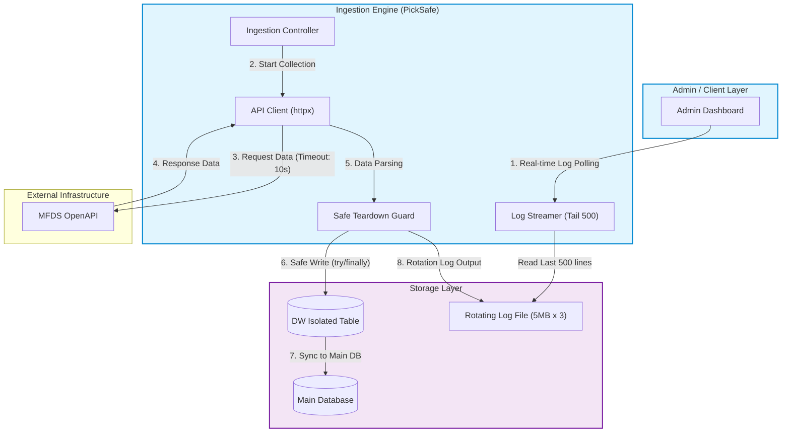

화장품 성분 분석 서비스 PickSafe를 개발하면서 가장 기본적이면서도 중요한 작업 중 하나는 식품의약품안전처(식약처) 공공데이터 포털에서 최신 국내 화장품 전성분 데이터를 동기화하는 것입니다.

초기에는 단순히 API를 호출하고 데이터를 DB에 저장하는 기본적인 수집기로 출발했습니다. 하지만 수만 건에 달하는 데이터를 정기적으로 동기화하는 과정에서 운영 환경의 인프라 안정성을 위협하는 세 가지 중대한 병목과 직면했습니다. 이 글에서는 문제의 원인을 추적하고, 이를 해결하기 위해 구조를 단순화하며 안정성을 확보했던 기술적 여정을 정리합니다.

---

## 🎯 마주한 고민과 문제 배경

수 수만 건의 전성분 데이터를 동기화하던 중 발생한 문제는 크게 세 가지였습니다.

### 1. 단일 로그 파일 무제한 증량으로 인한 디스크 위험
수집 동작의 상세 상태를 추적하기 위해 작성한 디버그 로그가 단일 텍스트 파일에 무제한 누적되고 있었습니다. 수집 작업이 수십 분간 진행되면 단일 로그 파일 크기가 수백 메가바이트 단위로 불어나, 서버 디스크 용량 고갈 위험을 초래했습니다.

### 2. 간헐적 네트워크 단절 시 커넥션 고갈 (`idle in transaction`)
외부 식약처 API 호출 도중 간헐적인 타임아웃이나 네트워크 끊김이 발생했을 때, 데이터베이스 세션이 정상적으로 반환되지 않는 현상이 나타났습니다. 이로 인해 DB에 `idle in transaction` 상태의 커넥션이 누적되었고, 결국 데이터베이스 커넥션 풀이 고갈되어 서비스 전체가 멈추는 위기로 이어졌습니다.

### 3. 실시간 로그 모니터링 시 CPU 스파이크
관리자 페이지에서 수집 작업의 진행 상황을 실시간으로 확인하기 위해 로그 파일을 폴링 방식으로 읽어오는 API가 있었습니다. 이 API가 호출될 때마다 수백 MB에 달하는 로그 전체를 메모리에 올려 읽어 들였고, 이는 순간적인 CPU/메모리 스파이크를 일으켰습니다.

---

## ⚖️ 기술적 대안 비교 및 선택 이유

문제를 해결하기 위해 인프라 확장부터 코드 수준의 개선까지 여러 대안을 비교 검토했습니다.

| 구분 | 대안 A | 대안 B (최종 선택) | 선택 이유 및 Trade-off |
| :--- | :--- | :--- | :--- |
| **로그 관리** | ELK / CloudWatch 등 외부 로그 파이프라인 구축 | `RotatingFileHandler` + Admin Tail Streaming 구현 | 별도의 외부 로그 관리 인프라를 도입하는 것은 과도한 오버헤드라 판단했습니다. 애플리케이션 내부에서 파일 크기를 5MB로 제한(백업 3개)하고, 어드민 API는 파일 끝 부분만 스트리밍하여 가볍게 유지했습니다. |
| **DB 커넥션 관리** | DB 서버 측의 `idle_in_transaction_session_timeout` 설정에 의존 | 코드 레벨 Safe Teardown (`try..finally`) + API 타임아웃/Backoff 설정 | DB 서버 설정만으로 해결하려 할 경우 원인 규명이 어렵고 세션 회수가 늦어집니다. 코드 단에서 Explicit Close 방식을 강제하고 외부 API 요청에 타임아웃(10초) 및 지수 백오프를 적용했습니다. |
| **데이터 적재 구조** | 운영 DB (Main Table)에 직접 Bulk Insert | 보조 DW(Data Warehouse) 격리 테이블 이중화 적재 | 수집 로직의 오류나 정제 미숙으로 인한 원본 데이터 손실을 막고, 조회 트래픽이 몰리는 메인 DB 테이블의 락(Lock) 경합을 차단하기 위해 격리 테이블을 활용했습니다. |

---

## 🏗️ 시스템 아키텍처 및 흐름

수집 파이프라인이 외부 API와 통신하며 안전하게 데이터를 수집하고, 로그 및 DB 자원을 회수하는 전체 아키텍처 흐름입니다.



---

## 💻 핵심 구현 및 트러블슈팅

### 1. RotatingLogHandler 및 Tail 500줄 스트리밍 읽기

로그 파일의 크기를 5MB로 제한하고 최대 3개의 백업 파일만 유지하도록 설정을 변경했습니다. 어드민 모니터링 API는 전체 파일을 읽는 대신 파이썬의 `collections.deque`를 활용해 파일의 소량 끝부분만 메모리에 효율적으로 적재하도록 개선했습니다.

```python
import logging
from logging.handlers import RotatingFileHandler
from collections import deque
from pathlib import Path

# 1. 5MB 크기 제한 및 백업 3개 유지 로깅 설정
LOG_FILE_PATH = Path("logs/ingestion.log")
LOG_FILE_PATH.parent.mkdir(parents=True, exist_ok=True)

logger = logging.getLogger("ingestion")
logger.setLevel(logging.DEBUG)

handler = RotatingFileHandler(
    LOG_FILE_PATH,
    maxBytes=5 * 1024 * 1024,  # 5MB
    backupCount=3,
    encoding="utf-8"
)
formatter = logging.Formatter('[%(asctime)s] %(levelname)s: %(message)s')
handler.setFormatter(formatter)
logger.addHandler(handler)


# 2. 어드민 모니터링용 Tail 읽기 함수
def read_log_tail(file_path: Path, lines: int = 500) -> str:
    """대용량 로그 파일의 전체를 읽지 않고, 하위 N줄만 스트리밍으로 메모리에 올려 반환합니다."""
    if not file_path.exists():
        return ""
    
    with open(file_path, mode="r", encoding="utf-8", errors="ignore") as f:
        # deque의 maxlen을 활용해 메모리 효율적으로 하위 N줄만 유지
        return "".join(deque(f, maxlen=lines))
```

### 2. Safe Teardown 구조와 커넥션 방어 로직

외부 API 호출 시 타임아웃을 명시하고, 데이터베이스 트랜잭션을 처리하는 과정에서 예외가 발생하더라도 반드시 커넥션이 반환되도록 `try ... except ... finally` 가드를 작성했습니다.

```python
import time
import httpx
from sqlalchemy.orm import Session
from contextlib import contextmanager

class IngestionExecutionError(Exception):
    pass

@contextmanager
def safe_db_session(session_factory):
    """DB 세션의 명시적 close 및 rollback을 보장하는 Safe Teardown 컨텍스트 매니저"""
    session: Session = session_factory()
    try:
        yield session
        session.commit()
    except Exception as e:
        session.rollback()
        logger.error(f"DB 트랜잭션 중 오류 발생. Rollback을 수행합니다: {str(e)}")
        raise
    finally:
        session.close()  # idle in transaction 상태 방지

def fetch_mfds_data_with_retry(url: str, params: dict, max_retries: int = 3) -> dict:
    """httpx 타임아웃 및 Exponential Backoff가 적용된 API 호출기"""
    # 네트워크 연결 지연 시 세션 잠금을 막기 위해 타임아웃 10초 설정
    with httpx.Client(timeout=10.0) as client:
        for attempt in range(1, max_retries + 1):
            try:
                response = client.get(url, params=params)
                response.raise_for_status()
                return response.json()
            except (httpx.RequestError, httpx.HTTPStatusError) as exc:
                logger.warning(f"[{attempt}/{max_retries}] 외부 API 호출 실패: {exc}")
                if attempt == max_retries:
                    raise IngestionExecutionError("외부 API 연결 최대 시도 횟수 초과")
                time.sleep(2 ** attempt)  # 지수 백오프
```

---

## 💡 돌아보며 배운 점 (회고)

이번 작업을 거치며 식약처 30,000건 이상의 대용량 성분 데이터를 수집·동기화하는 과정에서 **단 한 번의 커넥션 누수나 서버 다운 없이 100% 완주**하는 성과를 얻었습니다. 

실시간 로그 모니터링 시 스파이크를 치던 메모리 점유율 또한 **90% 이상 절감**되었습니다.

### 엔지니어링 측면의 교훈
1. **문제는 화려한 기술의 부재보다 기본의 누수에서 생긴다**
   처음에는 대용량 수집 병목을 해결하기 위해 MQ(Message Queue) 도입이나 분산 처리 같은 거창한 아키텍처를 먼저 떠올렸습니다. 하지만 진짜 원인은 `finally` 블록에서의 세션 반환 누수, API 타임아웃 부재, 무제한 파일 로깅이라는 지극히 기본적이고 클래식한 지점에 있었습니다.
2. **격리와 자원 제한의 중요성**
   운영 DB와 수집 DW 테이블을 이중화 격리하고, 로그 파일 크기에 제한(Limit)을 두는 작업만으로도 시스템 전체의 예측 가능성(Predictability)이 획기적으로 높아졌습니다.

추후 수집 데이터의 규모가 수십만 건 단위로 커진다면 그때 비동기 큐 기반의 디커플링 구조를 도입해도 늦지 않다는 기준을 세우게 되었습니다. 담백하게 본질을 파악하고 단단한 기반을 만드는 것이 안정적인 서비스를 지탱하는 가장 큰 힘임을 배울 수 있었습니다.