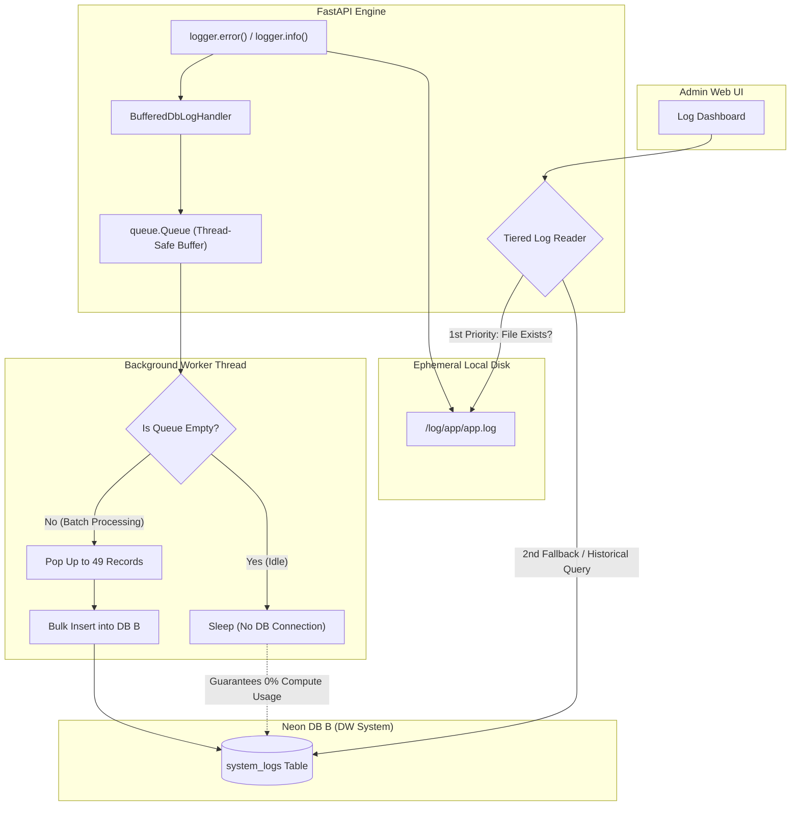

화장품 성분 분석 서비스 **PickSafe**의 백엔드를 개발하면서 최근 서버 로깅 구조를 대대적으로 개편했습니다. 

Render와 같은 PaaS(Platform as a Service) 환경은 가성비와 배포 편의성이 뛰어난 반면, 컨테이너 디스크가 **휘발성(Ephemeral)**을 띤다는 특징이 있습니다. 재배포나 서버 핫리로드, 인스턴스 재부팅이 발생하면 `/log/app/app.log`에 차곡차곡 쌓이던 파일 로그가 순식간에 사라졌습니다. 과거 장애 원인을 추적해야 하거나 고이력 모니터링이 필요한 순간에 정작 로그가 비어 있어 난감한 상황을 마주하곤 했습니다.

이 문제를 해결하기 위해 DW DB B(Neon DB)에 `system_logs` 영구 저장 테이블을 설계하고, **Neon DB의 Compute 소비를 극적으로 아끼면서도(유휴 수면 보장) 에러 로그 유실을 차단하는 비동기 로깅 시스템**을 구축했습니다.

---

## 🎯 마주한 고민과 문제 배경

가장 단순한 해결책은 `logger`가 실행될 때마다 DB에 바로 `INSERT` 쿼리를 날리는 것이었습니다. 하지만 이 방식에는 두 가지 명확한 문제가 있었습니다.

1. **HTTP 요청 스레드 블로킹**: 사용자 요청을 처리하는 동기/비동기 루프 안에서 DB I/O가 발생하면 API 응답 지연(Latency)이 직간접적으로 증가합니다.
2. **클라우드 DB 비용 증가**: DB B로 사용 중인 Neon DB는 일정 시간 요청이 없으면 Compute 인스턴스가 수면 상태(Autosuspend)로 전환되는 구조입니다. 매 로깅 시점마다 DB 커넥션을 유지하거나 자주 흔들면 DB가 잠들지 못해 자원이 불필요하게 소모됩니다.

결국 **"메인 서비스 성능에 영향을 주지 않는 Non-blocking 구조를 유지하면서, DB가 유휴 상태일 때는 커넥션을 맺지 않고, 시스템 종료나 장애 발생 시 로그 유실을 최우선으로 막는 구조"**가 필요했습니다.

---

## ⚖️ 점진적 설계 고도화 과정 (V1 ~ V5)

처음부터 완벽한 구조를 만든 것은 아니었습니다. 단순한 인메모리 버퍼링에서 시작해 엣지 케이스를 하나씩 해결해 나가며 V1부터 V5까지 단계를 거쳤습니다.

| 단계 | 주요 구현 내용 | 직면했던 문제점 및 한계 | 해결 방법 |
| :--- | :--- | :--- | :--- |
| **V1** | 20초 주기 단순 인메모리 버퍼링 | OOM이나 SIGKILL로 프로세스가 비정상 종료될 때 마지막 20초간의 에러 로그 유실 risk. 20초 고정 커넥션으로 DB Autosuspend 방해. | 레벨별 처리 이원화 필요성 확인 |
| **V2** | 레벨별 이원화 & DB 수면 보장 | 에러 발생 시 즉시 처리. 버퍼 큐가 비어있으면 DB 연결을 아예 건너뜀. | 큐가 비었을 때 DB 커넥션을 100% 스킵하여 Neon Compute 0% 유휴 수면 달성 |
| **V3** | Non-blocking 워커 & 멀티라인 파서 | 파이썬 예외 트레이스백(`Traceback...`)이 로컬 파일 읽기 시 여러 줄로 쪼개지는 현상 발생. | 멀티라인 파싱 알고리즘 추가 및 백그라운드 워커 스레드 적용 |
| **V4** | Thread-safe `queue.Queue` 전환 | 단순 신호(`Event`) 기반 방식에서 연속적인 에러 발생 시 큐 누락 위험성 발견. | 파서 및 비동기 큐를 `queue.Queue` (`put_nowait()`) 기반으로 개편. 14일 초과 로그 자동 삭제 기능 추가 |
| **V5** | 트레이스백 100% 보존 & 종료 유실 차단 | `logger.exception()` 호출 시 트레이스백이 DB `message`에 온전히 담기지 않는 현상 발생. 정상 종료 시 버퍼 잔여 로그 유실. | `self.format(record)` 명시적 호출, `shutdown` 시 잔여 배치 강제 플러시, `dropped_count` 카운팅 적용 |

---

## 🏗️ 시스템 아키텍처 및 이중 조회(Tiered Log Reader) 흐름

최종적으로 완성된 아키텍처는 **이중 조회(Tiered Log Reader)** 패턴과 **비동기 배치 적재 워커**의 조합입니다.

어드민 UI에서 최근 로그를 실시간으로 폴링할 때는 DB B를 조회하지 않고 로컬 디스크 파일(`/log/app/app.log`)을 우선 조회(Tier 1)하여 DB Compute 자원 소모를 0%로 유지합니다. 재배포로 인해 파일이 사라졌거나 14일간의 과거 고이력을 조회할 때만 DB B(Tier 2)로 쿼리를 보냅니다.



---

## 💻 핵심 구현 및 트러블슈팅

### 1. `self.format(record)`를 통한 트레이스백 완전 보존

커스텀 로깅 핸들러 작성 시 단순히 `record.getMessage()`만 호출하면 `logger.exception("Error occurred")` 형태로 작성된 예외 스택트레이스가 무시되고 단일 메시지 문자열만 남는 문제가 있었습니다.

이를 해결하기 위해 핸들러 내부에서 `self.format(record)`를 명시적으로 호출하여 예외 트레이스백 전문이 DB의 `message` 컬럼에 100% 보존되도록 구현했습니다.

```python
import logging
import queue
import sys
from datetime import datetime, timezone

class BufferedDbLogHandler(logging.Handler):
    def __init__(self, max_size=1000):
        super().__init__()
        self.log_queue = queue.Queue(maxsize=max_size)
        self.dropped_count = 0

    def emit(self, record: logging.LogRecord):
        try:
            # record.getMessage() 대신 self.format(record)을 사용하여 Traceback 전문 보존
            formatted_message = self.format(record)
            
            log_entry = {
                "level": record.levelname,
                "service": getattr(record, "service", "FastAPI"),
                "logger_name": record.name,
                "container_id": getattr(record, "container_id", "default-node"),
                "message": formatted_message,
                "created_at": datetime.now(timezone.utc)
            }
            
            # Non-blocking으로 큐에 삽입, 큐가 꽉 차면 드롭 카운트 증가
            self.log_queue.put_nowait(log_entry)
        except queue.Full:
            self.dropped_count += 1
        except Exception as e:
            # Self-Reference (무한 재귀) 방지를 위해 sys.stderr 사용
            sys.stderr.write(f"[LogHandler Error] Failed to emit log: {e}\n")
```

### 2. 무한 재귀(Self-Reference) 차단

DB 적재에 실패했을 때 핸들러 내부에서 다시 `logger.error()`를 호출하면, 동일한 로깅 핸들러가 다시 실행되면서 무한 재귀 호출이 발생하고 서버가 다운될 위험이 있었습니다. 

따라서 로깅 핸들러 및 DB 적재 로직 내부의 모든 예외 처리는 절대 로거를 호출하지 않고 `sys.stderr.write()`를 사용하도록 엄격히 제한했습니다.

### 3. Graceful Shutdown 처리

FastAPI 앱이 종료될 때(`SIGTERM` 등) 비동기 워커가 큐에서 꺼내 `batch` 리스트에 담아둔 최대 49건의 로그가 DB에 기록되지 못하고 상실될 위험이 있었습니다. 셧다운 이벤트에 큐를 플러시하는 비동기 정리 작업을 연결해 마지막 한 건의 로그까지 안전하게 쓰이도록 했습니다.

```python
# main.py 셧다운 연동 예시
@app.on_event("shutdown")
def shutdown_event():
    # 백그라운드 스레드 종료 및 남은 배치 로그 강제 Flush
    if db_log_handler:
        db_log_handler.close()
```

### 4. DB 인덱스 최적화 및 14일 정제 정책

`system_logs` 테이블이 무한히 증가하는 것을 막기 위해 일일 단위 배치로 14일이 지난 로그를 자동으로 정제(`DELETE`)하도록 만들었습니다.

하루 평균 약 5,000건(약 1.25 MB) 기준으로 14일간 보관되는 로그 용량은 **약 17.5 MB** 내외입니다. 이는 Neon DB Free Tier 제약(500MB)의 **약 3.5%** 수준으로 매우 안정적인 수치입니다.

조회 성능을 보장하기 위해 자주 함께 쿼리되는 조건에 맞춰 복합 인덱스를 구성했습니다.

```python
# SystemLog SQLAlchemy Model 내 복합 인덱스 정의
class SystemLog(Base):
    __tablename__ = "system_logs"

    id = Column(UUID(as_uuid=True), primary_key=True, default=uuid.uuid4)
    level = Column(String(20), nullable=False, index=True)
    service = Column(String(50), nullable=False, index=True)
    logger_name = Column(String(100))
    container_id = Column(String(50))
    message = Column(Text, nullable=False)
    created_at = Column(DateTime(timezone=True), nullable=False, index=True)

    __table_args__ = (
        Index('idx_syslogs_created_level', 'created_at', 'level'),
        Index('idx_syslogs_service_created', 'service', 'created_at'),
    )
```

---

## 💡 돌아보며 배운 점 (회고)

이번 개편 과정에서 얻은 주요 결실과 교훈은 다음과 같습니다.

1. **클라우드 인프라 특성에 맞춘 비동기 설계의 중요성**
   단순히 로그를 DB에 저장하는 것 자체는 쉬웠지만, PaaS의 휘발성 파일시스템 제약과 Serverless DB(Neon)의 비용/수면 정책을 동시에 만족시키는 것은 까다로운 작업이었습니다. 로컬 파일 시스템을 1차 레이어로 활용하고 DB를 2차 백업 및 고이력 저장소로 활용하는 **Tiered Log Reader** 접근 방식이 비용 절감과 응답속도 확보에 효과적이었습니다.

2. **예외 처리와 라이프사이클 엣지 케이스 고려**
   로깅 시스템은 서비스의 "마지막 보루" 역할을 해야 합니다. 로깅 핸들러 내부에서 예외가 발생했을 때 무한 재귀에 빠지지 않도록 `sys.stderr`로 우회한 점, 프로세스 종료 시점에 큐에 남은 데이터를 완전히 비우고 종료하도록 `shutdown` 연동을 고도화한 경험은 시스템 안정성을 한 단계 끌어올리는 계기가 되었습니다.

앞으로는 어드민 모니터링 UI에서 이 로그 메트릭 데이터를 활용해 일별 에러 발생 추이 그래프를 더욱 시각화하고, 특정 에러 임계치 도달 시 알림을 발송하는 모듈을 연동해 볼 계획입니다.