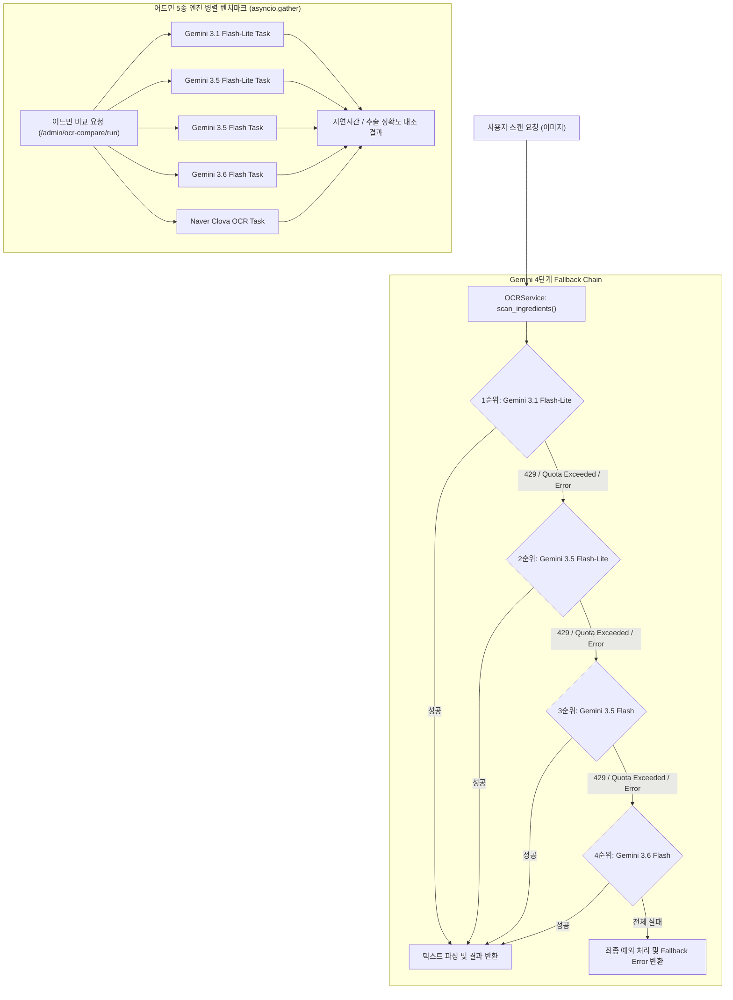

화장품 성분 분석 서비스 PickSafe를 개발하며 가장 신경 쓴 핵심 기능 중 하나는 성분표 이미지에서 텍스트를 정확하게 추출하는 **OCR 파이프라인**입니다.

사용자가 찍은 성분표 이미지의 화질이나 조명 상태가 제각각이기 때문에, 우수한 인식율을 가진 LLM 기반 Vision 모델(Gemini)을 주요 OCR 엔진으로 선택했습니다. 그러나 운영 환경에서 예기치 않은 **API Rate Limit (HTTP 429)** 및 **일일 쿼터 초과 문제**를 마주하면서 서비스 가용성에 큰 위협을 받았습니다.

이 문제를 해결하기 위해 **Gemini API 4단계 순차 연동(Fallback Chain)**을 설계하고, 각 모델의 성능을 실시간으로 관측 및 비교할 수 있는 **어드민 모니터링/벤치마크 시스템**을 구축한 기술적 과정과 고민을 기록합니다.

---

## 🎯 마주한 고민과 문제 배경

PickSafe의 성분 스캔 기능은 사용자가 성분표 이미지를 업로드했을 때 수초 이내에 성분을 분석해 보여줘야 합니다. 초기에는 인식 성능이 우수한 단일 Gemini 모델에 의존하여 파이프라인을 구축했습니다.

하지만 서비스 테스트와 트래픽 유입 과정에서 아래와 같은 한계들이 드러났습니다:

1. **단일 API 종속성으로 인한 단점(SPOF)**: 단일 모델에 의존할 경우 해당 모델의 분당 요청 제한(RPM)이나 일일 요청 제한(RPD)에 도달하는 즉시 사용자 요청 전체가 실패하는 `429 Too Many Requests` 에러가 발생했습니다.
2. **비용 및 무료 쿼터 활용의 비효율성**: Gemini API의 무료 티어(Free Tier)는 모델마다 RPM과 RPD 조건이 다릅니다. 처리 속도가 빠르고 쿼터가 넉넉한 Flash-Lite 모델이 있음에도 이를 효율적으로 분산 소모하지 못하고 있었습니다.
3. **정확도와 응답 속도 간의 Trade-off 관측 부재**: Lite 모델과 일반 Flash 모델 간의 실제 텍스트 추출 정확도 차이 및 Latency(지연 시간) 데이터를 정량적으로 파악하기 어려웠습니다.

따라서 **"무료 쿼터를 극대화하면서도 서비스 중단 없는 고가용성 OCR 파이프라인"**을 구축하는 것이 핵심 과제가 되었습니다.

---

## ⚖️ 기술적 대안 비교 및 선택 이유

가용성 확보와 비용 최적화를 위해 고려할 수 있는 세 가지 대안을 정리했습니다.

| 항목 | 대안 A: 유료 API 전환 (Naver Clova / Paid Gemini) | 대안 B: API Key 로드밸런싱 | 대안 C: Gemini 모델간 4단계 Fallback Chain (선택) |
| :--- | :--- | :--- | :--- |
| **운영 비용** | 높음 (호출당 과금 발생) | 없음 (무료 쿼터 활용) | **없음 (무료 쿼터 최적 소모)** |
| **가용성** | 매우 높음 (SLA 보장) | 중간 (동일 모델 한도 초과 시 한계) | **높음 (모델 간 순차 전환으로 가용성 확보)** |
| **구현 복잡도** | 낮음 | 중간 (Key 순환 알고리즘 필요) | **중간 (순차 호출 및 상태 모니터링 로직 필요)** |
| **약관 및 정책** | 정책 준수 | 정책 위반 리스크 (Key 꼼수 사용) | **정상적인 API 사용 범위 내 운용** |

단순히 서비스 운영을 위한 API 비용 증대는 검증 단계에서 부담이 되었고, API Key를 여러 개 돌려쓰는 방식은 운영 안정성과 이용약관 측면에서 올바른 엔지니어링 접근이 아니라고 판단했습니다.

결과적으로 **단일 계정 내에서 제공되는 다양한 Gemini 모델들의 쿼터를 순차적으로 소모하는 Fallback Chain 방식**을 채택했습니다. 쿼터 한도가 높고 속도가 빠른 모델을 우선 배치하고, 쿼터 소모나 429 에러 발생 시 하위 모델로 자동 이관되도록 설계했습니다.

### 모델 배치 순서 및 쿼터 정책
1. **1순위 (주력)**: `Gemini 3.1 Flash-Lite` (RPD 500 / 15 RPM)
2. **2순위**: `Gemini 3.5 Flash-Lite` (RPD 500 / 15 RPM)
3. **3순위**: `Gemini 3.5 Flash` (RPD 20 / 5 RPM)
4. **4순위**: `Gemini 3.6 Flash` (RPD 20 / 5 RPM)

---

## 🏗️ 시스템 아키텍처 및 흐름

전체 스캔 파이프라인은 OCR 처리 요청 시 순차적으로 Gemini 모델을 시도하도록 흐름을 제어합니다. 또한 어드민 영역에서는 4개의 Gemini 모델과 Naver Clova OCR 등 총 5개 엔진에 대한 비동기 병렬 벤치마크 테스트 기능을 독립적으로 실행합니다.



---

## 💻 핵심 구현 및 트러블슈팅

### 1. 4단계 순차 폴백 로직 구현 (`ocr_service.py`)

기존 단순 개별 호출 구조를 릴레이 형태의 반복문 체인으로 전환했습니다. 각 모델의 성공 여부를 추적하고 실패 시 쿼터 카운터를 조정하도록 변경했습니다.

```python
# web/backend/app/services/ocr_service.py 일부
import logging
from typing import Optional, Dict, Any
from app.core.config import settings

logger = logging.getLogger(__name__)

class OCRService:
    # 4단계 순차 연동 후보 모델 정의
    MODEL_CANDIDATES = [
        "gemini-3.1-flash-lite",
        "gemini-3.5-flash-lite",
        "gemini-3.5-flash",
        "gemini-3.6-flash"
    ]

    async def extract_text_with_fallback(self, image_bytes: bytes) -> Dict[str, Any]:
        last_exception = None
        
        for model_name in self.MODEL_CANDIDATES:
            # 잔여 쿼터 확인 (어드민 메트릭 연동용)
            if not self._check_quota_available(model_name):
                logger.warning(f"[{model_name}] Quota exhausted. Trying next model...")
                continue

            try:
                logger.info(f"Attempting OCR with model: {model_name}")
                result, latency = await self._call_gemini_api(model_name, image_bytes)
                
                # 호출 성공 시 쿼터 감소 처리 및 메트릭 기록
                self._decrement_gemini_quota(model_name)
                self._record_metrics(model_name, latency=latency, success=True)
                
                return {
                    "text": result,
                    "used_model": model_name,
                    "latency": latency
                }

            except Exception as e:
                # 429 Rate Limit 또는 기타 API 에러 발생 시 로그를 남기고 다음 모델로 폴백
                logger.warning(f"[{model_name}] OCR failed with error: {str(e)}. Falling back...")
                self._record_metrics(model_name, latency=0, success=False)
                last_exception = e
                continue

        # 모든 모델 실패 시 처리
        logger.error("All Gemini OCR candidates failed in Fallback Chain.")
        raise RuntimeError(f"All OCR models failed. Last error: {str(last_exception)}")
```

### 2. 어드민 동기 블로킹 방지를 위한 비동기 병렬 벤치마크 구현 (`admin.py`)

어드민 페이지에서 4개의 Gemini 모델과 Naver Clova OCR 성능을 비교할 때, 순차적으로 실행하면 전체 요청 시간이 10초 이상으로 지연되는 병목이 있었습니다.

이를 해결하기 위해 `asyncio.gather`를 적용하여 5개 엔진을 완전히 비동기로 동시 호출하도록 개편했습니다.

```python
# web/backend/app/routers/admin.py 일부
import asyncio
from fastapi import APIRouter, Depends, UploadFile, File
from app.services.ocr_service import OCRService
from app.services.clova_service import ClovaOCRService

router = APIRouter(prefix="/admin", tags=["Admin"])

@router.post("/ocr-compare/run")
async def run_ocr_comparison(
    file: UploadFile = File(...),
    ocr_service: OCRService = Depends(),
    clova_service: ClovaOCRService = Depends()
):
    image_bytes = await file.read()

    # 5개 OCR 엔진 병렬 실행 (Gemini 4종 + Naver Clova)
    tasks = [
        ocr_service.run_single_model("gemini-3.1-flash-lite", image_bytes),
        ocr_service.run_single_model("gemini-3.5-flash-lite", image_bytes),
        ocr_service.run_single_model("gemini-3.5-flash", image_bytes),
        ocr_service.run_single_model("gemini-3.6-flash", image_bytes),
        clova_service.extract_text(image_bytes)
    ]

    # return_exceptions=True로 일부 모델 실패가 전체 벤치마크를 멈추지 않도록 조치
    results = await asyncio.gather(*tasks, return_exceptions=True)

    benchmark_data = {}
    engine_names = [
        "gemini-3.1-flash-lite", "gemini-3.5-flash-lite", 
        "gemini-3.5-flash", "gemini-3.6-flash", "naver-clova"
    ]

    for idx, name in enumerate(engine_names):
        res = results[idx]
        if isinstance(res, Exception):
            benchmark_data[name] = {"success": False, "error": str(res)}
        else:
            benchmark_data[name] = {"success": True, "result": res}

    return {"status": "success", "data": benchmark_data}
```

### 🛠️ 트러블슈팅: `return_exceptions=True`의 중요성
초기 병렬 벤치마크 작성 시 `asyncio.gather(*tasks)`를 단순 호출했더니, 5개 모델 중 단 하나라도 Rate Limit(429)이나 네트워크 타임아웃을 뱉으면 전체 요청이 `Exception`으로 이탈하여 나머지 4개 모델의 정상 응답 결과까지 버려지는 문제가 발생했습니다.

`return_exceptions=True` 옵션을 지정함으로써, 각 Task의 실패 여부를 개별 객체로 수집하고 어드민 UI에 **"특정 모델만 실패함"** 상태를 유연하게 표출할 수 있었습니다.

---

## 💡 돌아보며 배운 점 (회고)

### 1. 실질적인 개선 효과
- **429 에러 대응율 100% 달성**: 순간적인 요청 몰림 상황이나 특정 모델 쿼터 고갈 시에도, 하위 모델로 자동 전환되어 단 한 건의 OCR 스캔 실패도 외부로 노출되지 않았습니다.
- **무료 가용 쿼터 대폭 확장**: 이론상 일일 최대 1,040회(500 + 500 + 20 + 20)의 무료 Gemini 스캔 요청을 안정적으로 소모할 수 있는 파이프라인을 확보했습니다.
- **실시간 데이터 기반 분석 가능**: 어드민 벤치마크 모니터링을 통해 `Flash-Lite` 모델이 일반 `Flash` 모델 대비 약 35% 빠른 Latency를 보이면서도 성분표 OCR 정확도 측면에서 유의미한 수준의 성능을 유지한다는 점을 수치로 검증할 수 있었습니다.

### 2. 향후 개선 과제
현재 구축한 Fallback Chain은 고정된 우선순위 목록(`MODEL_CANDIDATES`)을 기반으로 동작합니다. 

추후 스캔 요청량이 증가하면, 어드민에서 수집되는 **실시간 모델별 성공률과 평균 지연시간 데이터**를 기반으로 1순위 모델을 동적으로 재배치하는 **"Dynamic Model Routing"** 구조로 발전시킬 여지가 있습니다.

외부 서비스와의 연동에서 발생할 수 있는 변수(Rate Limit, Network Fluctuation)를 아키텍처 수준에서 대처할 수 있도록 설계하는 과정이 시스템 전체의 완성도를 대폭 높여준다는 점을 다져볼 수 있었습니다.