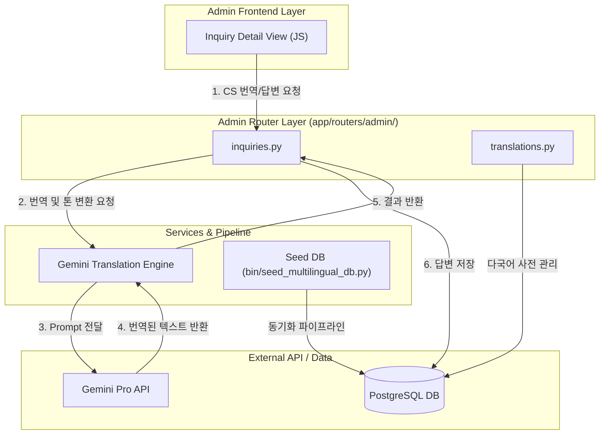

화장품 성분 분석 서비스 PickSafe를 운영하면서 최근 해외 사용자 유입이 늘어났습니다. 영어, 일본어, 중국어로 들어오는 1:1 고객 문의(성분 데이터 제보, 버그 신고 등)가 꾸준히 증가함에 따라, 이를 처리하는 어드민 시스템의 구조적 한계와 운영상의 병목이 명확히 드러나기 시작했습니다.

기존 어드민 코드의 유지보수성 저하 문제를 해결하고, 다국어 문의 응대 프로세스를 자동화하기 위해 진행했던 어드민 모듈 분리 작업과 Gemini Pro 기반 실시간 번역 파이프라인 구축 과정을 담담히 기록해 봅니다.

---

## 🎯 마주한 고민과 문제 배경

### 1. 비대해진 어드민 모놀리스 코드 (`admin.py`)
서비스 초기에 빠르게 구축했던 어드민 라우터(`admin.py`) 파일 하나에 사용자 관리, 성분 데이터 수정, 다국어 사전 관리, 1:1 문의 처리 로직이 모두 모여 있었습니다.
- 단일 파일이 2,000라인을 넘어가면서 비즈니스 로직 수정 시 사이드 이펙트를 예측하기 어려워졌습니다.
- 프론트엔드 자바스크립트와 HTML 템플릿 역시 비구조화되어 있어 특정 기능만 독립적으로 수정하거나 테스트하기가 까다로웠습니다.

### 2. 수동 다국어 문의 응대의 한계
외국어 문의가 들어올 때마다 일일이 외부 번역기에 원문을 복사해 한국어로 읽고, 한국어로 작성한 답변을 다시 해당 국어로 번역하여 전송하는 프로세스를 거쳤습니다.
- 번역 도구를 오가는 과정에서 1건당 평균 응대 시간이 15분 이상 소요되었습니다.
- 정중한 고객지원(CS) 톤앤매너가 유지되지 않거나, 외부 번역 서비스의 번역 어투가 어색해 전달력에 문제가 발생하는 일이 자주 생겼습니다.

---

## ⚖️ 기술적 대안 비교 및 선택 이유

### 1. 어드민 라우터 분리 방식
* **대안 A: 기존 `admin.py` 유지 및 내부 헬퍼 함수 분리**
  * 구현은 가장 쉽지만, 라우팅 및 템플릿 의존성이 한 파일에 얽혀 있어 근본적인 유지보수성 문제는 해결되지 않았습니다.
* **대안 B: 도메인 기반 백엔드/프론트엔드 모듈 분리 (최종 선택)**
  * `app/routers/admin/` 디렉터리 하위에 `translations.py`, `inquiries.py`, `visitors.py` 등 도메인별 라우터를 독립 구성했습니다.
  * 템플릿과 static 자산(`js/admin/`)도 라우터 구조와 1:1로 매핑하여 모듈 간 경계를 명확히 했습니다.

### 2. 다국어 번역 엔진 선택
* **대안 A: 클라이언트 단 외부 번역 위젯 적용**
  * 구현이 단순하지만 정중한 CS 전용 톤앤매너를 지정할 수 없었고, 데이터가 외부 클라이언트 단에서 파편화되는 한계가 있었습니다.
* **대안 B: Gemini Pro API 기반 서버 사이드 양방향 번역 서비스 구축 (최종 선택)**
  * 서버 단에서 프롬프트 제어를 통해 정중하고 일관된 고객 응대 톤앤매너를 강제할 수 있었습니다.
  * 답변 입력 시 사용자의 언어를 자동 감지하여 한국어 답변을 상대방 언어로 실시간 변환하는 비동기 파이프라인 구축이 용이했습니다.

---

## 🏗️ 시스템 아키텍처 및 흐름

어드민 레이어를 도메인별로 완전히 분리하고, 고객 문의 라우터에서 LLM 번역 서비스 및 다국어 사전 DB 파이프라인을 비동기로 호출하도록 구조화했습니다.



---

## 💻 핵심 구현 및 트러블슈팅

### 1. 도메인별 라우터 분리 및 Gemini 번역 서비스 연동

거대했던 `admin.py`를 분할하여 `inquiries.py` 내부에 실시간 AI 번역 엔드포인트를 구현했습니다. Gemini Pro 호출 시 CS 전용 시스템 프롬프트를 주입하여 정중한 어조를 유지하도록 했습니다.

```python
# app/routers/admin/inquiries.py
from fastapi import APIRouter, Depends, HTTPException, status
from pydantic import BaseModel
import google.generativeai as genai
from app.config import SETTINGS

router = APIRouter(prefix="/admin/inquiries", tags=["Admin Inquiries"])

# Gemini API 설정
genai.configure(api_key=SETTINGS.GEMINI_API_KEY)

class TranslationRequest(BaseModel):
    text: str
    target_language: str  # 예: 'ko', 'en', 'ja', 'zh'

class TranslationResponse(BaseModel):
    translated_text: str
    detected_language: str

@router.post("/translate", response_model=TranslationResponse)
async def translate_cs_message(payload: TranslationRequest):
    try:
        model = genai.GenerativeModel('gemini-pro')
        
        prompt = f"""
        You are a professional customer support translation engine for the cosmetic service 'PickSafe'.
        Translate the following text into target language: '{payload.target_language}'.
        
        Rules:
        1. Maintain a polite, empathetic, and professional customer service tone.
        2. Keep cosmetic-related ingredients and domain terms accurate.
        3. Do not include markdown code blocks or meta commentary. Return ONLY the translated string.

        Text to translate:
        {payload.text}
        """
        
        response = await model.generate_content_async(prompt)
        translated_result = response.text.strip()
        
        return TranslationResponse(
            translated_text=translated_result,
            detected_language=payload.target_language
        )
    except Exception as e:
        raise HTTPException(
            status_code=status.HTTP_500_INTERNAL_SERVER_ERROR,
            detail=f"Translation pipeline error: {str(e)}"
        )
```

### 2. 마주친 버그와 해결 과정: LLM 응답 포맷 불확실성

#### 문제 발생
초기 구현 시 Gemini가 응답에 마크다운 문법(예: ` ```text ... ``` `)이나 번역 이유에 대한 부연 설명을 붙여서 반환하는 현상이 있었습니다. 이로 인해 어드민 UI에 불필요한 서식이 함께 표시되는 버그가 발생했습니다.

#### 해결 방식
1. **프롬프트 제약 강화**: 프롬프트 상단과 하단에 `Return ONLY the translated string` 지침을 중복 배치했습니다.
2. **파싱 헬퍼 함수 도입**: LLM이 반환한 응답값에 마크다운 블록이 포함되어 올 경우 이를 정규식으로 정제하는 파싱 후처리 로직을 추가했습니다.

```python
import re

def clean_llm_response(raw_text: str) -> str:
    # 마크다운 코드블록 제거
    cleaned = re.sub(r'```[a-zA-Z]*\n?', '', raw_text)
    cleaned = cleaned.replace('```', '').strip()
    return cleaned
```

### 3. 다국어 사전 DB 시더 독립화 (`bin/seed_multilingual_db.py`)
기존에는 소스코드 내부 상수에 다국어 텍스트가 하드코딩되어 있어 사전 업데이트 시 재배포가 필요했습니다. 이를 해결하기 위해 독립 실행형 시더 스크립트를 작성하여 DB 기반의 동기화 파이프라인을 구축했습니다.

---

## 💡 돌아보며 배운 점

### 1. 실질적인 운영 지표 개선
* **응대 시간 단축**: 글로벌 고객 문의 1건당 평균 응대 시간이 **15분에서 3분 수준으로 80% 이상 단축**되었습니다.
* **코드 가독성 확보**: 비대했던 `admin.py`를 도메인별 라우터로 분할하면서, 기능 추가 시 영향을 받는 범위가 명확해졌고 코드 유지보수성이 크게 향상되었습니다.

### 2. 엔지니어링 측면의 교훈
* **도메인 모듈화의 중요성**: 모놀리스 코드베이스에서 라우팅과 비즈니스 로직을 미리 도메인별로 분리해두지 않으면, 새로운 기능(AI 번역 등)을 붙일 때 코드의 복잡도가 비선형적으로 증가한다는 점을 재확인했습니다.
* **운영 도구에서의 AI 활용**: 사용자용 서비스뿐만 아니라 어드민과 같은 내부 운영 도구에 AI 기술을 적재적소에 결합했을 때, 서비스 운영 생산성이 극대화되는 경험을 얻었습니다.

### 3. 향후 보완할 과제
현재는 매번 Gemini API를 직접 호출하고 있으나, 자주 인용되는 답변 패턴(Quick Replies)의 경우 Caching 레이어를 도입하여 API 호출 비용 및 응답 속도를 추가로 최적화할 계획입니다.