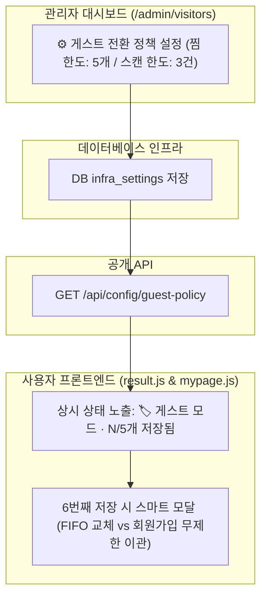

화장품 성분 분석 서비스 PickSafe를 운영하면서 마주한 가장 큰 고민 중 하나는 **"어떻게 하면 사용자의 진입 장벽을 낮추면서도, 자연스럽게 회원가입을 유도할 수 있을까"**였습니다. 

처음에는 강력한 기능 제한을 통해 로그인을 강제하는 방식을 검토했으나, 이는 서비스의 첫인상을 해치는 치명적인 요인이 될 수 있었습니다. 이번 글에서는 PickSafe에 적용한 게스트 및 회원 기능 차등화 정책과, 이를 구현하기 위한 시스템 아키텍처 설계 과정을 담담히 기록해봅니다.

---

## 🎯 마주한 고민과 문제 배경

PickSafe는 사용자가 라벨을 스캔하고 기피 성분을 곧바로 대조할 수 있는 속도가 생명인 서비스입니다. 따라서 회원가입 없이도 즉시 서비스를 이용할 수 있는 **게스트 모드(Guest Mode)**를 기본으로 제공하고 있습니다.

하지만 서비스의 핵심 가치를 무료로 전면 개방하다 보니, 게스트 상태로 편하게 이용만 하고 이탈하는 사용자가 많아졌습니다. 서비스에 애착을 가진 시점에 자연스러운 회원가입(Conversion)으로 이어지게 만드는 전환 퍼널이 턱없이 부족했던 것입니다.

여기서 엔지니어링 관점의 명확한 원칙을 세웠습니다. 
> **"핵심 기능은 절대 막지 않는다. 다만 저장과 이력 관리의 편의성 영역에서 손실 회피 심리를 자극한다."**

---

## ⚖️ 기술적 대안 비교 및 선택 이유

회원 전환 유도를 위해 검토한 대안과 최종 선택은 다음과 같습니다.

| 대안 | 방식 | 장단점 및 채택 여부 |
| :--- | :--- | :--- |
| **대안 A: 하드웨어/기능 차단형** | 특정 횟수 이상 스캔 시 로그인 모달 강제 띄우기 | ❌ 즉시 유입률(Bounce Rate) 급증 우려로 기각 |
| **대안 B: 완전 무료 개방형** | 모든 이력을 로컬에만 저장하고 회원 기능 미구현 | ❌ 비즈니스 지속 가능성 부족 및 기기 변경 시 데이터 소실 |
| **대안 C: 가치 차등화 및 동적 넛지형 (채택)** | 스캔은 무제한, 찜/기록은 제한하되 동적 정책과 스마트 모달로 자연스러운 전환 유도 | **◯ 첫 경험을 보장하면서 손실 회피 심리를 자극하여 전환율 극대화** |

대안 C를 구현하기 위해, 찜 한도나 스캔 기록 보관 개수를 코드에 하드코딩하지 않고 **관리자 페이지에서 실시간으로 튜닝할 수 있는 동적 정책(Dynamic Policy) 아키텍처**를 함께 설계했습니다.

---

## 🏗️ 시스템 아키텍처 및 흐름

관리자 대시보드에서 설정한 정책이 API를 통해 프론트엔드로 전달되고, 사용자의 행동 패턴에 따라 스마트 모달을 트리거하는 전체적인 구조는 아래와 같습니다.



---

## 💻 핵심 구현 및 트러블슈팅

### 1. 동적 정책 분기 처리를 위한 설정 API 연동
프론트엔드에서 하드코딩된 제한 숫자를 사용하면, 향후 마케팅이나 실험(A/B Test)에 따라 정책을 바꿀 때마다 클라이언트 앱을 재배포해야 하는 문제가 있었습니다. 이를 해결하기 위해 설정 값을 가져오는 경량 엔드포인트를 구성했습니다.

```python
# 예시: 백엔드 정책 제공 엔드포인트 구조
@app.route("/api/config/guest-policy", methods=["GET"])
def get_guest_policy():
    # 관리자 어드민 설정 테이블에서 실시간 조회
    policy = DB.infra_settings.find_one({"key": "guest_conversion_policy"})
    return jsonify({
        "max_saved_products": policy.get("max_saved_products", 5),
        "max_scan_history": policy.get("max_scan_history", 3)
    }), 200
```

### 2. 찜 목록 한도 초과 시 스마트 모달 UX 구현
게스트가 5개의 상품을 모두 채운 뒤 6번째 상품을 찜하려고 할 때, 단순히 "저장할 수 없습니다"라는 오류를 띄우는 대신 사용자가 선택할 수 있는 두 가지 경로를 제공했습니다.

- **옵션 A (FIFO 교체)**: 가장 오래된 상품을 교체하고 현재 상품 저장
- **옵션 B (회원가입)**: 기존에 공들여 담은 찜 목록과 스캔 이력을 서버 DB로 온전히 이관하며 회원가입

이 과정에서 사용자가 자신의 데이터를 잃어버릴 수 있다는 **손실 회피 심리**를 자연스럽게 자극하여, 강제적이지 않은 자발적 가입 전환을 유도할 수 있었습니다.

---

## 💡 돌아보며 배운 점 (회고)

이번 기능을 구현하면서 단순히 코드를 작성하는 것을 넘어, **제품의 비즈니스 지표와 사용자 경험(UX)이 어떻게 맞물려 돌아가는지** 깊이 고민해 볼 수 있었습니다.

1. **지표 기반 튜닝의 중요성**: 찜 한도(5개)와 스캔 기록(3건)을 고정값으로 두지 않고 관리자 어드민을 통해 실시간으로 조절할 수 있게 만든 덕분에, 향후 수집되는 이탈률(Drop-off) 데이터에 따라 유연하게 대응할 수 있는 기반을 마련했습니다.
2. **개발자의 오만 경계하기**: "사용자에게 기능을 막아버리면 가입하겠지"라는 안일한 생각 대신, "어떻게 하면 사용자가 불편함 없이 가치의 차이를 체감하게 할 것인가"에 집중하는 것이 장기적인 서비스 완성도에 훨씬 긍정적인 영향을 준다는 것을 배웠습니다.

앞으로도 PickSafe가 추구하는 빠르고 직관적인 사용자 경험을 해치지 않으면서, 시스템의 안정성과 비즈니스 성장을 함께 이뤄낼 수 있는 구조적 고민을 이어가고자 합니다.