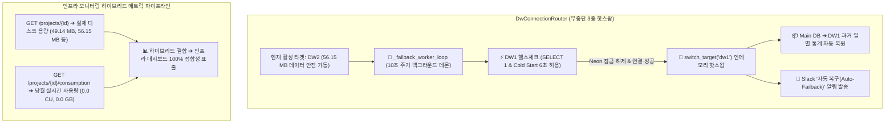

화장품 성분 분석 서비스인 **PickSafe**를 개발하면서, 대량의 성분 통계 및 매핑 데이터를 효율적으로 처리하기 위해 서버리스 PostgreSQL인 Neon DB를 데이터 웨어하우스(DW)로 활용하고 있습니다. 

무료 티어에서 제공하는 100 CU(Compute Unit) 제한을 극복하고 서비스의 연속성을 보장하기 위해 다중 DW 백업 체계를 구축하는 과정에서 여러 기술적 난관을 마주했습니다. 특히 **"서비스 중단 없는 자동 복귀(Auto-Failback)"**와 **"글로벌 클라우드 서비스의 과금 리셋 타임존 편차"**를 해결하며 아키텍처를 점진적으로 개선한 과정을 차분히 기록해 봅니다.

---

## 🎯 마주한 고민과 문제 배경

초기 PickSafe의 DW 이중화 전략은 다소 투박했습니다. 무료 쿼터 초과로 메인 DW(`DW1`)가 잠기면 예비 DW(`DW2`)로 커넥션을 우회(Failover)시킨 뒤, 매월 1일이 되었을 때 복귀하는 방식이었습니다.

### 1. 초기 방식의 한계: `os.kill`을 통한 프로세스 강제 재시작
지난 8월 20일 설계했던 최초의 복구 데몬은 매우 거칠었습니다. 매월 1일이 되면 `check_primary_db_recovery` 스레드가 `DW1`의 가용성을 확인한 뒤, 연결이 가능해지면 **서버 프로세스에 `os.kill` 시그널을 보내 강제로 재시작**하도록 구현했습니다. 
서버가 재시작되면서 자연스럽게 커넥션 풀이 `DW1`을 바라보도록 유도한 것인데, 이는 필연적으로 수 초간의 다운타임(Downtime)을 발생시켰고 운영 안정성 측면에서 반드시 개선해야 할 부채였습니다.

### 2. 3중 핫스왑 라우터 도입과 '자동 복구' 누락 사건
이를 해결하기 위해 지난 8월 23일, 메모리 상에서 실시간으로 커넥션 풀을 교체하는 3중 인메모리 핫스왑 라우터(`DwConnectionRouter`: `dw1`, `dw2`, `dw3`) 체계로 아키텍처를 전면 리팩토링했습니다. 수동 타겟 스위칭과 애플리케이션 부팅 시 가용성 체크는 완벽히 동작했습니다. 
하지만 이 과정에서 **"주기적으로 주 DB의 가용성을 감지하여 자동으로 복귀(Auto-Failback)시키는 백그라운드 데몬"** 로직의 이식이 누락되는 실수가 있었습니다. 결과적으로 `DW1`이 정상화되어도 관리자가 수동으로 스위칭 명령을 내리기 전까지는 계속 `DW2`를 바라보는 상태가 유지되었습니다.

### 3. 글로벌 과금 리셋 타임존 편차 (UTC vs KST)
또 다른 복병은 타임존이었습니다. Neon DB의 월간 쿼터 리셋 시점은 미국 본사 기준인 **매월 1일 00:00 UTC**입니다. 이를 한국 시간(KST)으로 환산하면 **매월 1일 09:00 KST**가 됩니다.
한국 시간 기준으로 9월 1일 00:00가 되었다고 해서 즉시 복귀를 시도하면, Neon 시스템상으로는 여전히 8월 31일 15:00 UTC이기 때문에 쿼터가 리셋되지 않아 연결이 제한되는 현상이 발생했습니다. 타임존 동기화가 고려되지 않은 자동 복귀는 무의미한 에러 로그만 양산할 뿐이었습니다.

---

## ⚖️ 기술적 대안 비교 및 선택 이유

자동 복귀(Auto-Failback) 메커니즘을 재설계하며 고려한 대안들과 각각의 Trade-off는 다음과 같았습니다.

| 비교 항목 | 대안 1: 스케줄러 기반 프로세스 재시작 (Legacy) | 대안 2: 요청 시점 동적 라우팅 (On-Demand Check) | 대안 3: 인메모리 핫스왑 + 백그라운드 헬스체크 데몬 (Selected) |
| :--- | :--- | :--- | :--- |
| **작동 방식** | 매월 1일 특정 시간에 전체 서버 프로세스를 강제 종료 후 재부팅하여 DB 커넥션 재수립. | API 요청이 들어올 때마다 주 DB의 가용성을 확인하고 연결 대상 결정. | 백그라운드 스레드가 주기적으로 주 DB를 감지하여 가용 시 메모리 상의 커넥션 풀 실시간 교체. |
| **서비스 다운타임** | 발생함 (서버 재시작 동안 일시적 응답 불가) | 없음 | **없음 (완전 무중단)** |
| **성능 오버헤드** | 없음 (부팅 시에만 부하) | 매우 높음 (모든 API 요청마다 DB 핑 테스트 발생으로 Latency 증가) | **매우 낮음 (지정된 주기로 백그라운드에서만 비동기 동작)** |
| **복구 정합성** | 낮음 (정산 배치가 늦어지면 재시작 후에도 잠금 상태일 수 있음) | 중간 | **높음 (완전 정상화가 확인될 때까지 핫스왑 유예 가능)** |

**결정:** 서비스 신뢰성을 위해 다운타임과 성능 저하가 전혀 없는 **대안 3(인메모리 핫스왑 + 백그라운드 데몬)**을 채택했습니다. 10초 주기로 백그라운드에서 `DW1`에 가벼운 `SELECT 1` 쿼리를 던져 가용성을 검증하고, 성공하는 즉시 메모리 상의 Active Target 포인터를 안전하게 스위칭하도록 설계했습니다.

---

## 🏗️ 시스템 아키텍처 및 흐름

전체적인 무중단 자동 복구 및 하이브리드 메트릭 수집 흐름은 다음과 같습니다.



---

## 💻 핵심 구현 및 트러블슈팅

### 1. 무중단 자동 복귀(Auto-Failback) 데몬 구현 (`database.py`)

서버가 가동 중인 상태에서 안전하게 커넥션 풀을 스위칭하고, 백그라운드 스레드가 동시성 이슈 없이 라우터 상태를 변경할 수 있도록 구현한 핵심 코드입니다.

```python
import threading
import time
import logging
from sqlalchemy import create_engine, text
from sqlalchemy.orm import sessionmaker

logger = logging.getLogger("picksafe.database")

class DwConnectionRouter:
    def __init__(self, config: dict):
        self.config = config
        self.engines = {
            "dw1": create_engine(config["DW1_URL"], pool_pre_ping=True, pool_recycle=1800),
            "dw2": create_engine(config["DW2_URL"], pool_pre_ping=True, pool_recycle=1800),
            "dw3": create_engine(config["DW3_URL"], pool_pre_ping=True, pool_recycle=1800),
        }
        self._active_target = "dw1"
        self._lock = threading.Lock()
        
        # 자동 복구 백그라운드 스레드 시작
        self._stop_event = threading.Event()
        self._failback_thread = threading.Thread(target=self._failback_worker_loop, daemon=True)
        self._failback_thread.start()

    @property
    def active_engine(self):
        with self._lock:
            return self.engines[self._active_target]

    def switch_target(self, target: str):
        if target not in self.engines:
            raise ValueError(f"Unknown target: {target}")
        with self._lock:
            old_target = self._active_target
            self._active_target = target
            logger.info(f"[Router] Switched active DW from {old_target} to {target} (Zero-Downtime)")
            
    def _failback_worker_loop(self):
        """활성 타겟이 dw1이 아닐 때, dw1의 가용성을 주기적으로 체크하여 자동 복구"""
        logger.info("[Router] Auto-Failback background daemon started.")
        while not self._stop_event.is_set():
            if self._active_target != "dw1":
                logger.info("[Router] Current active DW is not primary (dw1). Checking dw1 availability...")
                if self._test_dw1_availability():
                    logger.info("[Router] Primary DW (dw1) has recovered! Initiating Auto-Failback...")
                    self.switch_target("dw1")
                    self._trigger_slack_notification("dw1")
            time.sleep(10)  # 10초 주기 검사

    def _test_dw1_availability(self) -> bool:
        """콜드 스타트 마진을 고려한 헬스체크 (Timeout 6.0초 적용)"""
        try:
            # Neon DB의 Cold Start를 감안하여 연결 타임아웃을 6.0초로 설정
            temp_engine = create_engine(
                self.config["DW1_URL"], 
                connect_args={"connect_timeout": 6}
            )
            with temp_engine.connect() as conn:
                conn.execute(text("SELECT 1"))
            return True
        except Exception as e:
            logger.warning(f"[Router] Failback health check to dw1 failed: {e}")
            return False

    def _trigger_slack_notification(self, target: str):
        # 실제 운영 환경에서는 슬랙 웹훅 연동 (예시)
        logger.info(f"[Notification] Slack Alert: DW Target successfully restored to {target}.")
```

### 2. 트러블슈팅: Neon DB의 Cold Start 지연 (3.0초 ➔ 6.0초 완화)
구현 초기에는 헬스체크 타임아웃을 일반적인 3.0초로 설정했습니다. 그러나 Neon DB의 프리 티어 특성상, 장시간 요청이 없으면 활성 컴퓨팅 노드가 슬립(Sleep) 상태로 전환됩니다. 
이 상태에서 첫 연결 요청이 들어오면 노드가 깨어나는 데(Cold Start) 평균 4~5초가 소요되었고, 이로 인해 멀쩡히 잠금이 해제된 `DW1`이 헬스체크 타임아웃으로 인해 여전히 장애 상태인 것으로 오판하는 문제가 발생했습니다.

*   **해결:** `connect_timeout` 옵션을 기존 **3.0초에서 6.0초로 완화**하여 안전 마진을 확보했습니다. 이를 통해 불필요한 복구 지연을 방지하고 정상적으로 첫 가용성 체크를 통과할 수 있게 되었습니다.

### 3. 하이브리드 메트릭 수집 파이프라인 구현 (`admin_base.py`)
관리자 페이지에서 여러 DW 인프라의 상태를 정확히 모니터링하기 위해 Neon API를 파싱하는 과정에서도 구조적 한계가 있었습니다. Neon API는 프로젝트의 물리적 디스크 용량과 당월 실시간 소비량(Compute Unit, Network) 정보를 서로 다른 엔드포인트에서 제공하고 있었습니다.

이를 하나의 깔끔한 데이터 셋으로 결합하기 위해 다음과 같이 하이브리드 수집 파이프라인을 구축했습니다.

```python
import httpx
import os

# 민감한 API 키는 환경 변수 처리
NEON_API_KEY = os.getenv("SETTINGS_NEON_API_KEY", "default_masked_key")
HEADERS = {"Authorization": f"Bearer {NEON_API_KEY}", "Accept": "application/json"}

async def get_neon_hybrid_metrics(project_id: str) -> dict:
    async with httpx.AsyncClient() as client:
        # 1. 물리적 디스크 스토리지 용량 조회 (Project Meta API)
        proj_resp = await client.get(
            f"https://console.neon.tech/api/v2/projects/{project_id}",
            headers=HEADERS
        )
        # 2. 당월 실시간 소비량 조회 (Consumption API)
        cons_resp = await client.get(
            f"https://console.neon.tech/api/v2/projects/{project_id}/consumption",
            headers=HEADERS
        )
        
        if proj_resp.status_code != 200 or cons_resp.status_code != 200:
            raise Exception("Failed to fetch metrics from Neon API")
            
        proj_data = proj_resp.json()
        cons_data = cons_resp.json()
        
        # 하이브리드 데이터 결합
        return {
            "project_id": project_id,
            "name": proj_data["project"]["name"],
            # synthetic_storage_size를 통해 실제 보관 중인 물리 디스크 크기 파악
            "physical_storage_bytes": proj_data["project"].get("synthetic_storage_size", 0),
            # 당월 소비된 Compute Unit 및 Network 사용량 결합
            "monthly_compute_hours": cons_data.get("compute_hours", 0.0),
            "monthly_data_transfer_bytes": cons_data.get("data_transfer_bytes", 0)
        }
```

이 파이프라인 덕분에 Neon 콘솔에 직접 들어가지 않고도 PickSafe 관리자 대시보드에서 `DW1(49.14 MB)`, `DW2(56.15 MB)` 등의 실제 데이터 보존 크기와 실시간 사용량(CU)을 100% 정합성이 보장된 지표로 관제할 수 있게 되었습니다.

---

## 💡 돌아보며 배운 점 (회고)

이번 작업을 진행하며 인프라 설계와 클라우드 서비스 통합 측면에서 값진 교훈들을 얻었습니다.

1.  **우아한 복구(Graceful Recovery)의 중요성**
    *   장애 복구를 처리할 때 단순히 프로세스를 죽이고 다시 켜는 방식(`os.kill`)은 가장 쉽지만 무책임한 해결책이었습니다. 인메모리 상에서 포인터를 스위칭하는 핫스왑 라우터를 정교하게 다듬음으로써 서비스의 가용성(SLA)을 훼손하지 않고도 인프라 유연성을 확보할 수 있음을 체감했습니다.
2.  **공급자(Provider)의 도메인 지식 습득**
    *   글로벌 클라우드 서비스를 사용할 때는 그들의 정산 주기(Billing Cycle), 리셋 기준 타임존(UTC), 그리고 인스턴스의 라이프사이클(Cold Start) 특성을 완벽히 파악하고 있어야 설계 미스를 줄일 수 있습니다. 한국 시간 9월 1일 자정에 복구가 안 되어 당황했던 경험은 타임존 동기화의 중요성을 다시금 일깨워 주었습니다.
3.  **향후 과제: 데이터 동기화 자동화**
    *   현재는 `DW1`이 잠긴 동안 `DW2`에 쌓인 임시 통계 데이터를 수동으로 이관하고 있습니다. 다음 단계로는 Auto-Failback이 감지되어 `DW1`로 복귀하는 즉시, 두 DW 간의 데이터 차이(Delta)를 감지하여 유실 없이 백그라운드에서 동기화하는 Sync 스크립트를 파이프라인에 내재화할 계획입니다.

단순한 기능 구현을 넘어, 한정된 자원 속에서 인프라의 연속성을 고민하고 이를 코드로 풀어내는 과정은 엔지니어로서 매우 즐겁고 유익한 여정이었습니다. 앞으로도 PickSafe의 안정적인 서비스를 위해 아키텍처를 꾸준히 고도화해 나가겠습니다.