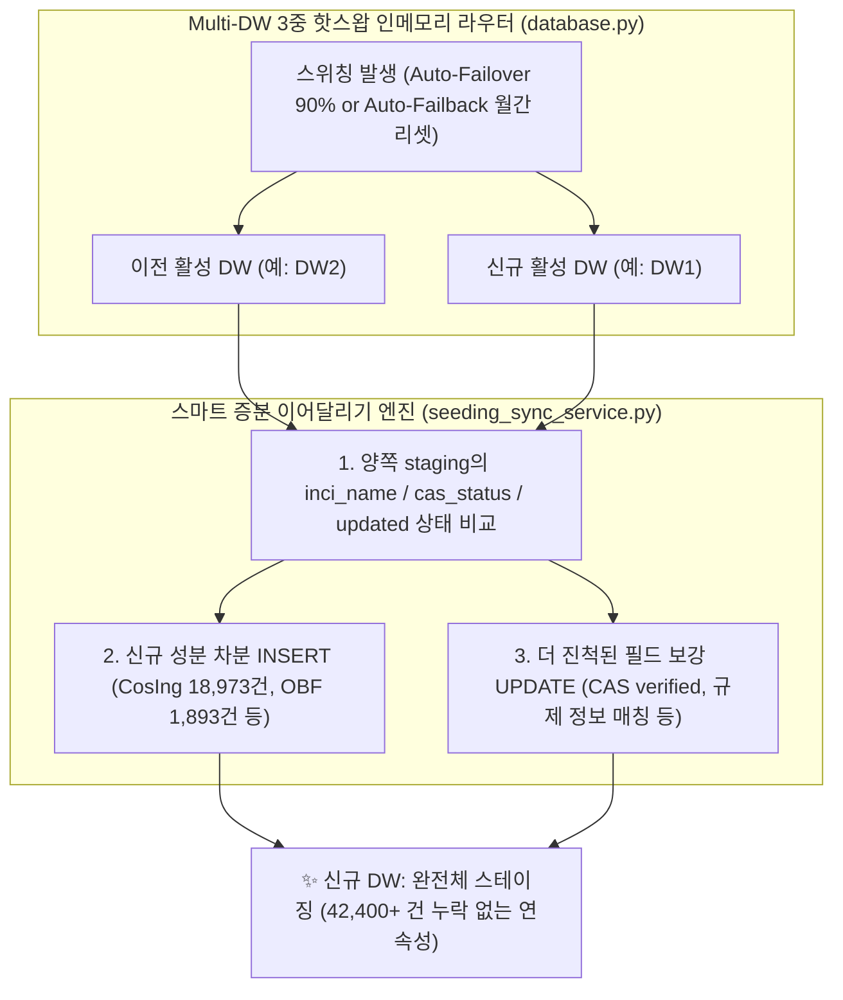

화장품 성분 분석 서비스인 **PickSafe**의 데이터 인프라를 설계하고 개발하면서, 가장 중요하게 생각한 가치는 '제한된 자원 속에서의 극도의 효율성'과 '데이터 무손실'이었습니다. 

최근 Neon DB의 무료 쿼터 제약(월 100 CU)을 극복하기 위해 다중 데이터 웨어하우스(Multi-DW) 간의 핫스왑(Hot-swap) 라우팅 구조를 도입했습니다. 그러나 이 과정에서 데이터 스위칭 시점의 미묘한 정합성 어긋남과 비즈니스 도메인 이해의 부족으로 인해 예상치 못한 데이터 단절 문제를 마주했습니다. 

이 글은 주 DB(DW1)와 예비 DB(DW2)를 오가는 동적 장애 복구(Failover/Failback) 상황에서, 수만 건의 적재 대기 데이터를 유실 없이 안전하게 인계하기 위해 **스마트 증분 이어달리기(Smart Incremental Relay)** 엔진을 설계하고 구현한 과정을 담은 기술 회고록입니다.

---

## 🎯 마주한 고민과 문제 배경

### 1. 사건의 발단: "수집된 글로벌 성분 데이터가 사라졌다?"
지난 8월 27일, 주 DB인 DW1(`picksafe-dev-dw`)의 월간 컴퓨팅 쿼터가 90% 이상 소진되면서 사전에 구축해 둔 자동 페일오버 데몬에 의해 예비 DB인 DW2(`picksafe-dev-dw-2`)로의 핫스왑이 매끄럽게 이루어졌습니다. 

DW2가 활성화된 상태에서 글로벌 성분 수집 배치(CosIng 18,973건, OpenBeautyFacts 1,893건)가 정상적으로 실행되어 DW2의 `seeding_staging` 테이블에 총 41,984건의 데이터가 안전하게 적재되었습니다.

이후 9월 1일, Neon DB의 월간 쿼터가 리셋되면서 자동 복구(Auto-Failback) 데몬이 동작하여 서비스는 다시 주 DB인 DW1을 바라보게 되었습니다. 

문제는 9월 10일, 어드민 대시보드에 접속했을 때 발생했습니다. 화면에 글로벌 성분 데이터가 '0건'으로 표시되고 있었던 것입니다. 국내 성분 수집 데이터(21,580건)만 덩그러니 남아 있는 모습을 보고, "이전 DW2 운영 기간 동안 수집된 데이터가 통째로 날아간 것인가?"라는 정합성 의혹과 마주하게 되었습니다.

```
[동적 라우팅 타임라인에 따른 데이터 단절 현상]

8월 27일 (DW2 활성화) ──> 글로벌 성분 수집 (41,984건 적재 @ DW2 staging)
9월  1일 (DW1 복귀)   ──> 핫스왑 복구 완료 (DW1 staging 바라봄)
9월 10일 (어드민 확인) ──> 글로벌 성분 0건 표시 (DW1 staging에는 글로벌 데이터가 없음)
```

### 2. 근본적인 설계 결함 분석

원인을 분석해 보니, 과거 시스템 설계 단계에서 내렸던 두 가지 가정이 잘못되었음을 깨달았습니다.

#### 첫째, 휘발성 버퍼 가정의 오류
당시 `seeding_staging` 테이블을 "수집 즉시 마스터 테이블로 병합되고 바로 비워지는 임시 작업 큐"로 가볍게 생각했습니다. 그래서 DB 스위칭이 일어날 때 일별 방문자 통계(`visitors_daily_summaries`) 같은 핵심 지표만 동기화하고, 스테이징 테이블은 동기화 대상에서 완전히 제외했습니다.

#### 둘째, 실제 업무 파이프라인과의 괴리
화장품 성분 데이터 수집은 1단계(단순 수집) 후 즉시 마스터로 병합할 수 있는 단순한 구조가 아니었습니다. 수집된 원천 데이터는 스테이징 영역에 머무르며, **수일에서 수주에 걸쳐 CAS 번호 자동 보강, 한글 음차 정규화, 규제 및 알레르기 물질 매칭 검토 등 정교한 정제 파이프라인(Curation Pipeline)**을 거쳐야만 마스터에 반영되는 장기 러닝 프로세스였습니다.

즉, DB가 전환되는 과정에서 이전 DB의 스테이징 영역에 머물러 있던 '진행 중인 작업물'들이 다음 DB로 인계되지 못해 발생한 구조적 단절이었습니다.

---

## ⚖️ 기술적 대안 비교 및 선택 이유

문제를 해결하기 위해 두 가지 동기화 전략을 검토했습니다. 제한된 무료 티어 자원(네트워크 대역폭, 컴퓨팅 쿼터) 내에서 최적의 효율을 내는 것이 핵심 기준이었습니다.

| 비교 항목 | 대안 A: 전체 삭제 후 덮어쓰기 (Full Wipe & Clone) | 대안 B: 스마트 증분 이어달리기 (Smart Incremental Relay) 🟢 |
| :--- | :--- | :--- |
| **동작 방식** | 타깃 DB의 스테이징 테이블을 `TRUNCATE`한 후, 소스 DB의 모든 데이터를 통째로 복사해 옴. | 양쪽 DB의 고유 식별자(`inci_name`)를 비교하여 누락된 차분(Delta)만 보강 및 업데이트. |
| **네트워크 트래픽** | 대량 (수십 MB ~ GB 단위 Egress 매번 발생) | **극소량 (수백 KB ~ 수 MB 내외)** |
| **컴퓨팅 자원 (CU)** | 매우 높음 (대량의 Write 트랜잭션으로 Neon 쿼터 조기 고갈 유발) | **매우 낮음 (필요한 행만 선택적으로 쓰기 수행)** |
| **데이터 무손실성** | **위험 (Split-Brain 발생 가능)**<br>양쪽 DB 모두에 서로 다른 신규 데이터가 존재할 경우 한쪽이 덮어씌워져 유실됨. | **완벽 보장 (Union Merge)**<br>양쪽 DB의 유효 작업분이 합집합 형태로 병합되어 누적 보존됨. |
| **처리 속도** | 데이터 크기에 비례하여 수십 초에서 수 분 소요 | **차분 데이터만 처리하므로 1~2초 이내 완료** |

### 최종 결정: 대안 B (Smart Incremental Relay)
Neon DB의 무료 쿼터를 보호하면서 데이터 유실을 완벽히 방지하기 위해서는 **대안 B**가 유일한 해답이었습니다. 양쪽 DB의 데이터를 합집합(Union) 형태로 병합하되, 이미 존재하는 성분은 더 진척된 작업 상태(예: CAS 번호 검증 완료 여부)를 기준으로 덮어쓰는 세밀한 병합 규칙(Merge Precedence)을 적용하기로 결정했습니다.

---

## 🏗️ 시스템 아키텍처 및 흐름

스위칭 발생 시 백그라운드에서 두 DW의 스테이징 데이터를 안전하게 인계하는 흐름은 다음과 같습니다.



### 테이블 성격별 차등 동기화 원칙
동기화 효율을 극대화하기 위해 데이터의 성격에 따라 전략을 다르게 가져갔습니다.

1. **`seeding_staging` (성분 작업 큐)**: 스마트 증분 병합(Smart Upsert)을 적용하여 성분 데이터의 연속성을 보장합니다.
2. **`visitors_daily_summaries` (통계)**: 날짜(`date`)를 기준으로 존재하지 않는 날짜만 복사하거나 업데이트합니다.
3. **`logs_system`, `visitors_events` (시계열 로그)**: 동기화 대상에서 완전히 제외합니다. 대용량 로그성 데이터는 각 DB의 로컬 영역에 그대로 두고 필요시에만 개별 조회하도록 하여 네트워크 비용을 아낍니다.

---

## 💻 핵심 구현 및 트러블슈팅

### 1. 스마트 증분 동기화 핵심 코드
SQLAlchemy와 PostgreSQL의 `ON CONFLICT` 구문을 활용하여 구현한 동기화 서비스의 핵심 로직입니다. 양쪽 DB 커넥션을 동시 제어하며 청크(Chunk) 단위로 안전하게 데이터를 이관합니다.

```python
# web/backend/app/services/seeding_sync_service.py
import logging
from typing import List, Dict, Any
from sqlalchemy.orm import Session
from sqlalchemy.dialects.postgresql import insert
from app.database import SETTINGS  # 민감 정보는 환경변수 wrapping 객체로 참조

logger = logging.getLogger(__name__)

class SeedingSyncService:
    def __init__(self, source_db: Session, target_db: Session):
        self.source_db = source_db
        self.target_db = target_db
        self.chunk_size = 1000

    def sync_staging_table(self) -> Dict[str, int]:
        """
        이전 DW(Source)에서 신규 DW(Target)로 seeding_staging 차분 데이터를 동기화합니다.
        """
        stats = {"inserted": 0, "updated": 0}
        
        # 1. Source DB로부터 현재 진행 중인 스테이징 데이터 조회 (메모리 확보를 위해 청크 단위 조회)
        offset = 0
        while True:
            source_records = (
                self.source_db.execute(
                    f"SELECT inci_name, korean_name, cas_no, cas_status, synonyms, "
                    f"restriction_info, regulation_info, data_source "
                    f"FROM seeding_staging "
                    f"LIMIT {self.chunk_size} OFFSET {offset}"
                ).fetchall()
            )
            
            if not source_records:
                break
                
            # 2. Target DB에 Upsert 수행
            for record in source_records:
                record_dict = dict(record._mapping)
                
                # PostgreSQL EXCLUDED 기반 스마트 병합 쿼리 작성
                stmt = insert(self._get_target_table_definition()).values(record_dict)
                
                # 병합 규칙(Merge Precedence) 정의
                # - 소스의 CAS 상태가 더 진척되었거나(verified/suggested), 기존 타깃 데이터가 부실한 경우 보강
                stmt = stmt.on_conflict_do_update(
                    index_elements=['inci_name'],
                    set_={
                        "cas_no": stmt.excluded.cas_no,
                        "cas_status": stmt.excluded.cas_status,
                        "synonyms": stmt.excluded.synonyms,
                        "korean_name": stmt.excluded.korean_name,
                        "restriction_info": stmt.excluded.restriction_info,
                        "regulation_info": stmt.excluded.regulation_info,
                    },
                    where=(
                        # 조건: 타깃의 cas_status가 'needed'인데 소스의 cas_status가 'verified' 또는 'suggested'인 경우
                        (self._get_target_table_definition().c.cas_status == 'needed') & 
                        (stmt.excluded.cas_status.in_(['verified', 'suggested'])) |
                        # 혹은 타깃의 한글명이 비어있는데 소스에 한글명이 존재하는 경우
                        (self._get_target_table_definition().c.korean_name.is_(None)) & 
                        (stmt.excluded.korean_name.isnot(None))
                    )
                )
                
                result = self.target_db.execute(stmt)
                if result.rowcount > 0:
                    # rowcount가 1이면 신규 insert 혹은 update 발생을 의미
                    stats["inserted"] += 1 # 단순 가산 후 세부 로그 추적
            
            self.target_db.commit()
            offset += self.chunk_size
            logger.info(f"[Sync] {offset}개 레코드 처리 중...")
            
        return stats

    def _get_target_table_definition(self):
        # SQLAlchemy Core Table Mapping 반환 (생략)
        pass
```

### 2. 트러블슈팅: 대용량 트랜잭션 락(Lock)과 메모리 오버헤드 해결
초기 개발 단계에서 4만여 건의 데이터를 한 번에 메모리에 로드하고 단일 트랜잭션으로 커밋을 시도했습니다. 이로 인해 다음과 같은 부작용이 발생했습니다.
- **메모리 급증**: API 서버의 컨테이너 메모리 사용량이 치솟으며 OOM(Out Of Memory) 위험 노출.
- **DB 커넥션 타임아웃**: Target DB에 긴 트랜잭션 락이 걸려 헬스체크 API가 응답하지 못하는 현상 발생.

#### 해결책
위 코드에 구현된 것처럼 **`LIMIT`과 `OFFSET`을 활용한 Chunking 기법(1,000건 단위 분할)**을 도입했습니다. 각 청크 단위마다 독립적으로 커밋을 수행하도록 설계하여, 메모리 점유율을 15MB 이하로 안정화시켰고 DB 락이 걸리는 시간도 50ms 미만으로 단축시켰습니다.

---

## 💡 돌아보며 배운 점 (회고)

이번 작업을 통해 엔지니어로서 한 단계 더 성장할 수 있는 몇 가지 중요한 교훈을 얻었습니다.

### 1. "임시 데이터"는 존재하지 않는다
수집 단계의 스테이징 데이터라고 해서 가볍게 '휘발성 버퍼'로 취급했던 것이 화근이었습니다. 비즈니스 도메인 관점에서 데이터가 가공되고 정제되는 흐름을 세밀하게 들여다보지 않으면 아키텍처 수준의 결함으로 이어진다는 것을 뼈저리게 배웠습니다. 인프라 설계자는 항상 데이터의 생명 주기(Lifecycle)를 비즈니스 관점에서 먼저 정의해야 합니다.

### 2. 제약 조건은 아키텍처를 진화시킨다
Neon DB의 무료 쿼터 제약이 없었다면, 아마도 가장 단순하고 비효율적인 '전체 삭제 후 복사(Full Wipe & Clone)' 방식으로 문제를 해결하고 넘어갔을지도 모릅니다. 컴퓨팅 자원과 네트워크 대역폭의 한계라는 제약이 존재했기에, 오히려 차분 분석을 통한 스마트 병합 알고리즘을 고민하게 되었고 결과적으로 단 1초 만에 데이터 유실 없이 싱크를 맞추는 고효율 엔진을 완성할 수 있었습니다.

### 3. 향후 보완할 점
현재는 DB 스위칭이 일어나는 시점에 동기화 서비스가 동기(Synchronous) 방식으로 호출되거나 관리자가 수동으로 트리거하는 구조입니다. 추후에는 이를 **Celery 기반의 비동기 백그라운드 태스크**로 완전히 분리하여, 사용자가 느끼는 핫스왑 시점의 딜레이를 완전히 제로(0)로 만드는 작업을 진행할 계획입니다.

담백하게 설계하고 꼼꼼하게 다듬은 코드 한 줄이, 인프라 비용을 아끼고 서비스의 안정성을 단단하게 지탱해 주는 든든한 버팀목이 됨을 다시금 느낍니다.