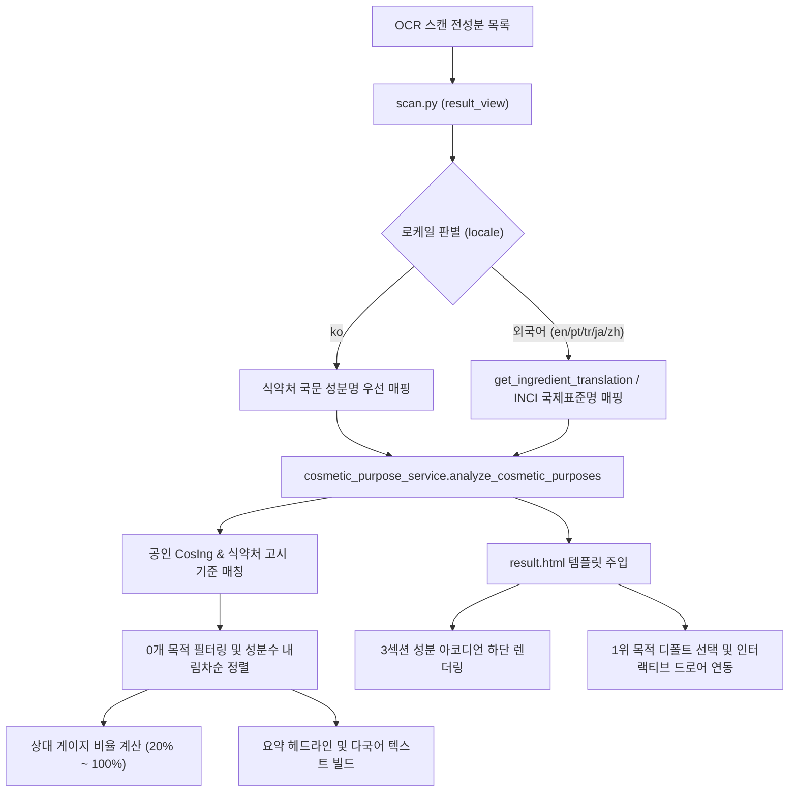

화장품 성분 분석 서비스인 **PickSafe**를 개발하면서 가장 오랫동안 유지해 온 메인 기능은 "알레르기 유발 물질 및 사용자 기피 성분 검출"이었습니다. 즉, 사용자에게 해가 될 수 있는 성분을 먼저 걸러내 주는 **'네거티브 가드(Negative Safety Guard)'** 역할이었습니다. 

하지만 서비스를 운영하며 사용자의 목소리를 관찰해 보니, 이들이 성분을 스캔할 때 알고 싶어 하는 것은 "무엇을 피해야 하는가?"뿐만이 아니었습니다. **"이 화장품이 내 피부의 보습, 진정, 미백 등 어떤 목적을 위해 만들어졌는가?"**라는 제품 본질의 긍정적인 정보(Positive Information) 역시 핵심적인 니즈였습니다.

이러한 문제를 해결하기 위해 공인 데이터를 기반으로 한 **'배합목적별 성분 분석 및 시각화 기능'**을 새롭게 설계하고 구현했습니다. 이 과정에서 마주했던 설계상의 제약 조건과 다국어 환경에서의 UI 깨짐 현상을 해결한 엔지니어링 과정을 차분히 기록해 둡니다.

---

## 🎯 마주한 고민과 문제 배경

새로운 기능을 추가하는 것은 간단해 보이지만, PickSafe가 가진 도메인의 특성상 두 가지 큰 장벽이 있었습니다.

### 1. 객관성과 법적 가이드라인의 충돌
처음에는 "지성 피부 추천 성분", "민감성 피부 비추천 성분"과 같이 피부 타입별 적합도 점수나 통계를 제공하는 방식을 고민했습니다. 그러나 이는 다음과 같은 치명적인 문제를 안고 있었습니다.
* **의료/피부과적 오판 유발 방지**: 특정 성분이 특정 피부 타입에 무조건 좋거나 나쁘다는 식의 자의적 규칙은 피부 반응의 개인차를 무시하며, 사용자의 오판을 유발할 수 있습니다.
* **법적 규제 리스크**: 화장품법 및 의약품 오인 방지 가이드라인에 저촉될 위험이 컸습니다.

### 2. 다국어 환경에서의 UI 레이아웃 붕괴
PickSafe는 한국어뿐만 아니라 영어, 포르투갈어, 터키어, 일본어, 중국어 등 총 7개 언어를 지원합니다. 성분 분석 결과를 시각화하는 과정에서 기둥 차트(Capsule Gauge Bar Chart)를 도입하기로 했는데, 언어별로 텍스트의 길이가 극단적으로 달라지면서 모바일 화면에서 레이아웃이 깨지거나 가로 스크롤이 무한정 늘어나는 문제가 예상되었습니다.

---

## ⚖️ 기술적 대안 비교 및 선택 이유

기획의 방향성을 잡고 아키텍처를 설계하면서 내린 몇 가지 핵심 결정 사항들입니다.

### 결정 1: '피부 타입별 적합도' 배제 및 '공인 배합목적 사실 데이터'에 100% 집중
특정 피부 타입에 대한 임의의 적합도 평점이나 통계는 범위에서 전면 배제했습니다. 대신 **식약처 기능성 화장품 고시, 유럽 CosIng 성분 기능 데이터베이스, 대한화장품협회 배합목적 사전**에 기재된 객관적 사실(Fact) 데이터만을 수집하여 9대 카테고리로 매핑하기로 했습니다.

또한, 화장품법을 준수하기 위해 상세 카드 하단에 다음과 같은 법적 면책 문구(Disclaimer)를 필수로 배치했습니다.
> *"목적별 성분 정보는 포함된 성분의 배합목적에 관한 객관적 사실 정보로서, 완제품인 화장품의 기능성 효능·효과에 관한 정보가 아니며, 해당 성분의 포함 사실만으로 관련 기능이 보장되지 않습니다."*

### 결정 2: 정보 위계(Information Hierarchy)의 엄격한 분리
성분 안전 판정(`[⚠️ 주의 성분]` ➔ `[✅ 이상없는 성분]` ➔ `[❓ 확인 불가 성분]`)은 사용자의 건강과 직결된 단일 정보 단위입니다. 이 흐름 중간에 배합 목적 카드를 끼워 넣으면 사용자의 인지 흐름이 깨질 수 있다고 판단했습니다. 

따라서 기존의 **3섹션 아코디언을 온전히 먼저 보여준 뒤, 그 바로 아래에 [✨ 화장품 핵심 배합 목적] 카드를 배치**하는 위계를 선택했습니다.

### 결정 3: 0개 목적 숨김 및 성분 많은 순(내림차순) 정렬
9개의 카테고리를 모두 고정된 가로 레이아웃으로 보여주면, 검출된 성분이 없는 빈 기둥들이 자리를 차지해 모바일 화면에서 불필요한 가로 스크롤을 유발합니다. 
과감하게 **실제 검출된 성분이 1개 이상인 목적만 필터링하고, 성분 개수가 많은 순서대로 내림차순 정렬**하여 노출하는 동적 레이아웃 방식을 채택했습니다.

---

## 🏗️ 시스템 아키텍처 및 흐름

스캔된 전성분 데이터가 다국어 로케일 판별을 거쳐 최종 시각화 카드로 렌더링되기까지의 데이터 흐름은 다음과 같습니다.



---

## 💻 핵심 구현 및 트러블슈팅

### 1. 배합목적 분석 및 다국어 템플릿 빌더 (Backend)
FastAPI 백엔드 서비스 레이어(`cosmetic_purpose_service.py`)에서 다국어 사전을 참조하여 동적으로 카드를 구성하는 로직의 핵심 요약본입니다. 단순 명사 접미사 결합 대신 언어별 문법 템플릿을 사용하여 비문을 방지했습니다.

```python
# web/backend/app/services/cosmetic_purpose_service.py

# 다국어 번역 템플릿 사전
MULTILINGUAL_TEMPLATES = {
    "ko": {
        "title": "화장품 핵심 배합 목적",
        "tap_hint": "목적을 탭하면 배합 성분을 볼 수 있어요",
        "sort_badge": "성분 많은 순",
        "drawer_title_tpl": "{category} 배합 성분",
    },
    "en": {
        "title": "Formulation Purpose Breakdown",
        "tap_hint": "Tap a purpose to view ingredients",
        "sort_badge": "Most frequent",
        "drawer_title_tpl": "{category} Ingredients",
    },
    "pt-BR": {
        "title": "Finalidade da Formulação",
        "tap_hint": "Toque para ver os ingredientes",
        "sort_badge": "Mais frequentes",
        "drawer_title_tpl": "Ingredientes de {category}",
    }
    # tr, ja, zh-CN, zh-TW 등 추가 정의...
}

def analyze_cosmetic_purposes(ingredients: list, locale: str = "ko") -> dict:
    # 1. 9대 목적 카테고리 초기화
    purpose_map = {
        "moisturizing": {"icon": "💧", "count": 0, "ingredients": []},
        "barrier": {"icon": "🛡️", "count": 0, "ingredients": []},
        "soothing": {"icon": "🌿", "count": 0, "ingredients": []},
        # ... 생략
    }
    
    # 2. 성분 매핑 및 카운팅 (로케일에 따른 다국어 성분명/INCI 매핑 적용)
    for ing in ingredients:
        matched_categories = match_ingredient_to_purposes(ing, locale)
        for cat in matched_categories:
            if cat in purpose_map:
                # 외국어 로케일일 경우 INCI 혹은 번역명 우선 노출
                display_name = ing.get("translation") or ing.get("inci_name") or ing.get("ko_name")
                purpose_map[cat]["ingredients"].append(display_name)
                purpose_map[cat]["count"] += 1

    # 3. 0개 목적 필터링 및 내림차순 정렬
    active_purposes = []
    for key, data in purpose_map.items():
        if data["count"] > 0:
            active_purposes.append({
                "key": key,
                "icon": data["icon"],
                "count": data["count"],
                "ingredients": list(set(data["ingredients"]))
            })
            
    active_purposes.sort(key=lambda x: x["count"], reverse=True)
    
    # 4. 차트 시각화를 위한 상대 비율 계산 (Max-Min 정규화 변형)
    if active_purposes:
        max_count = active_purposes[0]["count"]
        for p in active_purposes:
            # 최소 20% 높이는 보장하여 게이지 시각화 유지
            p["percentage"] = int(20 + (p["count"] / max_count) * 80) if max_count > 0 else 20
            
    # 5. 다국어 텍스트 빌드
    lang_pack = MULTILINGUAL_TEMPLATES.get(locale, MULTILINGUAL_TEMPLATES["en"])
    
    return {
        "title": lang_pack["title"],
        "tap_hint": lang_pack["tap_hint"],
        "sort_badge": lang_pack["sort_badge"],
        "purposes": active_purposes,
        "drawer_title_tpl": lang_pack["drawer_title_tpl"]
    }
```

### 2. 다국어 타이포그래피 깨짐 및 레이아웃 안정화 (CSS/Frontend)
가장 까다로웠던 부분은 포르투갈어(`pt-BR`)나 터키어(`tr`)처럼 단어가 길고 음절 분절이 잦은 언어에서의 레이아웃 대응이었습니다. 예를 들어, 포르투갈어로 '피부 보습'을 뜻하는 `Hidratação` 같은 단어는 가로 폭이 조금만 좁아져도 `Hidrataçã \n o` 처럼 낱글자가 강제로 개행되어 시각적으로 매우 지저분해 보였습니다.

이를 해결하기 위해 CSS에서 단어 단위 개행 정책을 엄격히 적용하고 가변 너비를 설정했습니다.

```css
/* web/frontend/static/css/result.css */

.purpose-chart-container {
    display: flex;
    justify-content: flex-start;
    gap: 8px;
    overflow-x: auto;
    -webkit-overflow-scrolling: touch;
    padding: 16px 4px;
}

.purpose-col {
    flex: 1 1 66px;
    min-width: 66px;
    max-width: 84px;
    display: flex;
    flex-direction: column;
    align-items: center;
    position: relative;
    cursor: pointer;
}

/* 다국어 텍스트 레이블 안정화 */
.purpose-label {
    margin-top: 8px;
    font-size: 0.64rem;
    line-height: 1.2;
    text-align: center;
    color: var(--text-secondary);
    
    /* 긴 라틴어 단어의 임의 철자 분절 방지 */
    overflow-wrap: normal;
    word-break: keep-all;
    hyphens: auto;
}

/* 활성화된 기둥 하단에 삼각형 포인터 배치하여 드로어와 연결 */
.purpose-col.active::after {
    content: '';
    position: absolute;
    bottom: -12px;
    left: 50%;
    transform: translateX(-50%);
    border-width: 6px;
    border-style: solid;
    border-color: transparent transparent var(--bg-drawer) transparent;
    z-index: 10;
}
```

---

## 💡 돌아보며 배운 점

이번 배합목적 시각화 기능을 개발하고 배포하면서, 엔지니어로서 몇 가지 중요한 교훈을 얻었습니다.

1. **도메인 제약(법적 규제)에 대한 깊은 이해**:
   단순히 "기술적으로 구현이 가능한가"나 "사용자가 좋아할 것인가"만 생각했다면 피부 타입별 점수화 기능을 섣불리 넣었다가 규제 리스크를 안게 되었을 것입니다. 서비스가 처한 도메인의 법적 한계를 명확히 인지하고, 이를 우회하여 **'100% 객관적 사실 기반 정보 제공'**으로 피벗한 결정은 서비스의 신뢰성을 지키는 데 결정적인 역할을 했습니다.

2. **다국어 지원(i18n)은 초기 설계 단계부터**:
   글로벌 다국어 처리를 단순한 번역 리소스 매핑 정도로 생각하면 큰코다친다는 것을 다시 한번 깨달았습니다. 언어별 문법 규칙(명사 결합의 순서 차이)과 폰트 렌더링 시 단어 분절 현상은 기획 단계부터 고려하지 않으면 프론트엔드 마크업을 완전히 새로 갈아엎어야 하는 참사로 이어집니다. 이번 기회에 가변 너비와 `word-break` 속성을 체계적으로 정의해 둔 덕분에, 향후 다른 다국어 화면을 개발할 때도 동일한 안정성을 확보할 수 있게 되었습니다.

부정적 탐지기로 시작했던 PickSafe가 화장품의 본질적 가치를 균형 있게 전달하는 성숙한 서비스로 한 단계 나아가는 디딤돌이 된 기록입니다.