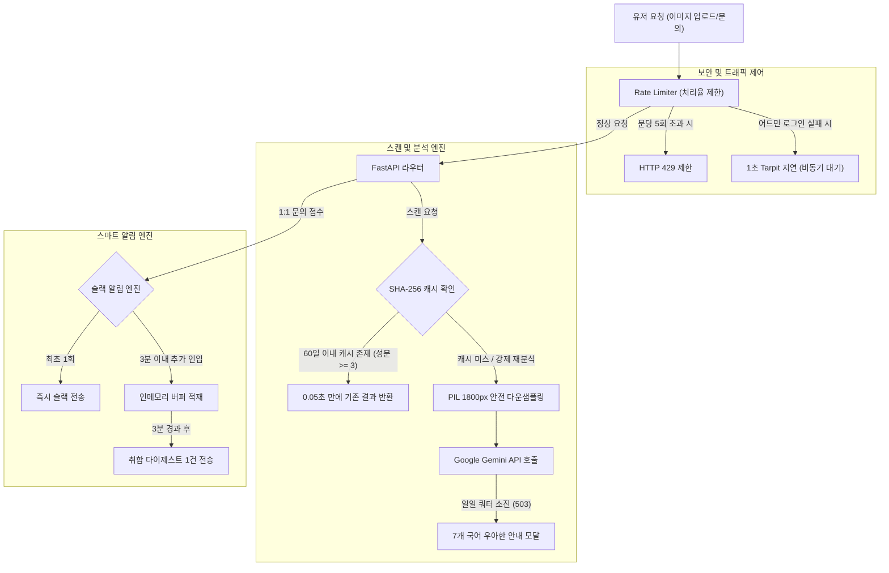

화장품 성분 분석 서비스인 **PickSafe**를 개발하고 배포를 준비하면서 가장 고심했던 부분은 '운영의 지속 가능성'이었습니다. 교대 근무를 서거나 실시간으로 모니터링 대시보드를 감시할 수 없는 상황에서, 서비스 오픈 후 몰려올 수 있는 트래픽과 오용(Abuse) 시도를 시스템 스스로 방어하도록 설계해야 했습니다.

특히 무료 티어 인프라(Render, Neon PostgreSQL, Google Gemini API)를 활용해 예산을 최소화하면서도, 상용 서비스 수준의 안정성과 보안을 확보하는 것은 까다로운 과제였습니다. 본 회고록에서는 시스템이 스스로를 보호하는 5대 자가 방어 가드레일을 설계하고 구현한 과정을 담백하게 기록합니다.

---

## 🎯 마주한 고민과 문제 배경

1인 운영 환경에서 맞닥뜨린 제약 조건은 명확했고, 타협할 수 없는 지점들이 존재했습니다.

1. **메모리(RAM 512MB) OOM 크래시**
   - 백엔드가 호스팅되는 Render 무료 티어는 메모리가 512MB로 제한됩니다. 모바일 기기로 촬영한 10MB 이상의 고화질 이미지가 그대로 서버로 업로드되어 디코딩되는 순간, 즉시 OOM(Out of Memory)으로 인해 컨테이너가 강제 종료되는 문제가 있었습니다.
2. **무료 AI API 쿼터의 조기 고갈**
   - Google Gemini API 무료 티어는 분당 15회(RPM), 일일 1,500회(RPD)라는 빡빡한 제약을 가집니다. 악의적인 무한 요청이나 동일 이미지에 대한 반복 분석 요청이 발생하면 정상적인 유저들이 서비스를 이용하지 못하게 됩니다.
3. **Neon PostgreSQL 절전 모드와 과금 이슈**
   - Neon DB는 일정 시간 요청이 없으면 Compute 인스턴스가 절전 모드로 들어갑니다. 이를 깨우기 위해 주기적으로 무차별 핑(Keep-Alive Ping)을 보내는 방식을 검토했으나, 이는 오히려 Compute 사용량을 급증시켜 무료 쿼터를 조기 소진시키는 결과를 낳았습니다.
4. **알림 피로(Alert Fatigue)와 무차별 대입 공격**
   - 1:1 고객 문의가 들어올 때 실시간으로 알림을 받는 것은 중요하지만, 특정 사용자가 매크로로 문의를 연타하거나 어드민 페이지에 로그인 브루트포스(Brute-force) 공격을 감행할 경우 내 휴대전화는 알림 폭탄으로 마비될 것이 뻔했습니다.

이러한 제약 속에서 **"관리자가 잠자고 있을 때도 시스템이 스스로 1차 방어하고, 정말 긴급한 장애 상황만 스마트하게 취합하여 슬랙으로 경보를 보내는 구조"**를 설계해야 했습니다.

---

## ⚖️ 기술적 대안 비교 및 선택 이유

### 1. 1:1 고객 문의 알림 폭탄 방어
* **대안 A: 문의 발생 시마다 즉시 개별 슬랙 알림 발송**
  * *장점*: 구현이 매우 단순함.
  * *단점*: 악의적 도배나 트래픽 폭증 시 슬랙 API 제한에 걸리거나 관리자의 알림 피로가 극에 달함.
* **대안 B: 인메모리 버퍼 기반의 3분 슬라이딩 윈도우 취합 발송 (선택)**
  * *장점*: 첫 번째 문의는 즉시 발송하여 실시간성을 확보하되, 이후 3분간 들어오는 문의는 메모리 버퍼에 적재했다가 한 장의 다이제스트(Digest) 리포트로 묶어 발송함. 알림 횟수를 획기적으로 줄이면서 맥락 파악이 가능함.
  * *단점*: 인메모리 상태 관리가 필요함. (1인 운영 규모에서는 백엔드 단일 인스턴스 메모리로 충분히 커버 가능하다고 판단)

### 2. Neon DB 연결 유지 전략
* **대안 A: 주기적 Dummy Query 실행으로 DB 활성화 유지**
  * *장점*: DB 콜드 스타트 지연(약 2~3초)을 완전히 제거할 수 있음.
  * *단점*: Neon DB 무료 티어의 Compute 사용량이 불필요하게 낭비되어 월말에 서비스가 정지될 위험이 있음.
* **대안 B: 자연스러운 절전 허용 및 `pool_pre_ping=True` 설정 (선택)**
  * *장점*: 사용하지 않을 때는 DB가 잠들도록 내버려 두어 리소스를 아끼고, 요청이 들어오는 시점에 SQLAlchemy가 유효 연결을 확인하고 안전하게 재연결을 맺음.
  * *단점*: 첫 요청 시 미세한 지연이 발생하나, 비영리 베타 서비스의 비용 안정성을 위해 이 장단점(Trade-off)을 수용함.

---

## 🏗️ 시스템 아키텍처 및 흐름

전체적인 요청 처리 흐름과 방어 가드레일은 아래와 같이 유기적으로 맞물려 동작합니다.



---

## 💻 핵심 구현 및 트러블슈팅

### 1. 알림 피로 방지를 위한 '스마트 윈도우 취합' 엔진
가장 공들여 구현한 부분은 슬랙 알림의 도배를 막는 취합 로직입니다. 비동기 락과 타이머를 활용하여 첫 알림은 즉시 보내고, 이후 요청은 버퍼링하도록 구현했습니다.

```python
# alert_service.py 일부 발췌 및 추상화
import asyncio
from typing import List, Dict, Any
from datetime import datetime

class AlertService:
    def __init__(self):
        self._inquiry_buffer: List[Dict[str, Any]] = []
        self._lock = asyncio.Lock()
        self._is_window_active = False
        self._window_duration = 180  # 3분(180초) 취합 윈도우
        self.webhook_url = "SETTINGS.SLACK_WEBHOOK_URL"  # 환경변수 추상화

    async def alert_new_customer_inquiry(self, inquiry_data: Dict[str, Any]):
        async with self._lock:
            if not self._is_window_active:
                # 윈도우가 닫혀있을 때 들어온 첫 문의는 즉시 발송
                await self._send_to_slack(
                    title="📬 [즉시 알림] 새로운 1:1 문의가 접수되었습니다.",
                    fields=[
                        {"title": "작성자", "value": inquiry_data["email"]},
                        {"title": "카테고리", "value": inquiry_data["category"]},
                        {"title": "내용 요약", "value": inquiry_data["content"][:100]}
                    ]
                )
                # 3분 취합 윈도우 가동
                self._is_window_active = True
                asyncio.create_task(self._start_aggregation_window())
            else:
                # 윈도우가 열려있는 동안은 버퍼에 적재
                self._inquiry_buffer.append(inquiry_data)

    async def _start_aggregation_window(self):
        await asyncio.sleep(self._window_duration)
        async with self._lock:
            if self._inquiry_buffer:
                # 버퍼에 쌓인 문의들을 하나의 다이제스트로 취합
                count = len(self._inquiry_buffer)
                summary_lines = []
                for idx, item in enumerate(self._inquiry_buffer, 1):
                    summary_lines.append(f"{idx}. [{item['category']}] {item['email']}: {item['content'][:30]}...")
                
                await self._send_to_slack(
                    title=f"📊 [취합 요약] 지난 3분간 추가 문의 {count}건이 접수되었습니다.",
                    text="\n".join(summary_lines)
                )
                self._inquiry_buffer.clear()
            self._is_window_active = False
```

이 구조 덕분에 특정 사용자가 악의적으로 문의 등록 버튼을 연속 클릭하더라도, 내 핸드폰에는 최초 1회 즉시 알림과 3분 뒤 요약 알림 딱 2번만 울리게 되었습니다.

### 2. 데이터 오염을 막는 OCR 오인식 방어 캐싱
동일 이미지에 대해 SHA-256 해시를 떠서 0.05초 만에 결과를 돌려주는 캐싱을 도입할 때, 한 가지 심각한 데이터 정합성 우려가 있었습니다. **"만약 흔들리거나 흐리게 찍힌 사진이 업로드되어 성분이 단 1~2개만 오인식된 결과가 캐시에 등록된다면?"** 

이후 동일한 제품 사진을 올리는 다른 사용자들도 영구적으로 잘못된 분석 결과를 받아보게 되는 치명적인 문제가 생깁니다. 이를 막기 위해 **4중 가드레일**을 적용했습니다.

```python
# scan_ocr_service.py 일부 발췌
async def process_ocr_and_cache(image_bytes: bytes, force_reanalysis: bool = False) -> Dict[str, Any]:
    # 1. SHA-256 해시 계산
    img_hash = calculate_sha256(image_bytes)
    
    if not force_reanalysis:
        # 캐시 조회
        cached_result = await db.get_cached_scan(img_hash)
        if cached_result:
            return cached_result  # 0.05초 만에 반환

    # Gemini API를 통한 분석 수행
    analysis_result = await call_gemini_api(image_bytes)
    
    # [오인식 방어 가드레일] 
    # 공식 성분 DB와 매칭된 성분이 최소 3개 이상인 신뢰할 수 있는 결과만 캐시에 등록한다.
    matched_count = len(analysis_result.get("matched_ingredients", []))
    if matched_count >= 3:
        await db.save_to_cache(img_hash, analysis_result, ttl_days=60)
    else:
        logger.warning(f"매칭 성분 수 부족({matched_count}개)으로 캐시 등록을 스킵합니다.")
        
    return analysis_result
```

이 필터링 덕분에 저품질 이미지의 분석 결과가 전체 캐시 데이터베이스를 오염시키는 문제를 원천 차단할 수 있었습니다.

### 3. 트러블슈팅: 12MB 스마트폰 원본 사진 업로드 시 서버 다운 현상
* **증상**: 모바일 기기로 직접 촬영한 고화질 원본 이미지(약 12MB)를 업로드하여 분석을 시도할 때, Render 서버가 응답을 멈추고 `Exit Code 137 (OOM Killed)`을 뿜으며 셧다운되는 현상이 발생했습니다.
* **원인**: 512MB RAM 환경에서 FastAPI 멀티파트 파일 업로드 버퍼와 Pillow 라이브러리가 원본 해상도(예: 4000x3000)를 메모리에 언패킹하는 과정에서 순간적으로 RAM 사용량이 임계치를 초과한 것이 원인이었습니다.
* **해결**:
  1. **클라이언트 단 1차 차단**: JS 단에서 파일 크기가 10MB를 초과하면 업로드를 차단하고 압축을 유도하는 모달을 띄웠습니다.
  2. **백엔드 2차 리사이징 가드**: 서버로 유입된 이미지가 가로/세로 1800px를 초과할 경우, 메모리를 적게 먹는 Pillow의 `thumbnail` 메서드를 활용해 비율을 유지하며 다운샘플링을 거치도록 했습니다.

```python
# scan_ocr_service.py 중 PIL 리사이징 가드
from PIL import Image
import io

def safe_resize_image(image_bytes: bytes, max_size: int = 1800) -> bytes:
    img = Image.open(io.BytesIO(image_bytes))
    
    # EXIF 회전 정보가 있다면 복원
    img = restore_exif_rotation(img)
    
    if img.width > max_size or img.height > max_size:
        img.thumbnail((max_size, max_size), Image.Resampling.LANCZOS)
        
        out_buf = io.BytesIO()
        # JPEG 85% 품질로 압축하여 저장 공간 및 전송 속도 최적화
        img.save(out_buf, format="JPEG", quality=85)
        return out_buf.getvalue()
        
    return image_bytes
```
이 조치 이후, 수십 번의 고용량 이미지 업로드 테스트에서도 메모리 사용량은 150MB 선을 안정적으로 유지하며 단 한 번의 OOM 크래시도 발생하지 않았습니다.

---

## 💡 돌아보며 배운 점

### 1. 하드웨어의 한계는 소프트웨어 아키텍처로 극복할 수 있다
무료 티어 인프라를 사용하는 것은 제약이 아니라, 오히려 더 튼튼하고 효율적인 코드를 작성하게 만드는 훌륭한 촉매제가 되었습니다. 
- 이미지 해싱 캐싱을 통해 **무료 Gemini API 호출 쿼터를 50% 이상 절약**했고, 
- 백엔드 리사이징 가드를 통해 **서버 자원 소모를 최소화**했습니다.
- Neon DB에 무차별 핑을 날리는 대신 `pool_pre_ping`을 활용하는 방식으로 전환하며 **불필요한 DB 과금 위험을 완전히 제거**했습니다.

### 2. 1인 운영일수록 '스마트한 알림'에 투자해야 한다
모든 에러와 이벤트를 실시간으로 전송받는 시스템은 결국 개발자를 지치게 만듭니다. 이번에 구축한 **3분 취합 윈도우 알고리즘**과 **5분 슬라이딩 윈도우 기반 500 에러 경보**는 불필요한 노이즈를 완벽히 걸러내 주었습니다. 모바일 화면에 찍히는 `[PROD 🟢]` 뱃지가 달린 슬랙 메시지 한 줄이 주는 심리적 안정감은 이루 말할 수 없습니다.

### 3. 향후 개선 과제
현재는 인메모리 버퍼를 통해 알림 취합과 Rate Limiting을 처리하고 있어, 향후 트래픽 증가로 인해 백엔드 인스턴스를 다중화(Scale-out)하게 된다면 데이터 정합성이 깨질 수 있습니다. 서비스 규모가 커지면 Redis나 클라우드 기반의 경량 큐(Queue) 서비스를 도입하여 상태 관리를 외부로 격리하는 설계를 검토할 예정입니다.

철저히 통제된 제약 조건 속에서 동작하는 견고한 시스템을 만드는 것. 이것이 1인 엔지니어로서 느낄 수 있는 가장 순수한 즐거움이 아닐까 싶습니다. 

---