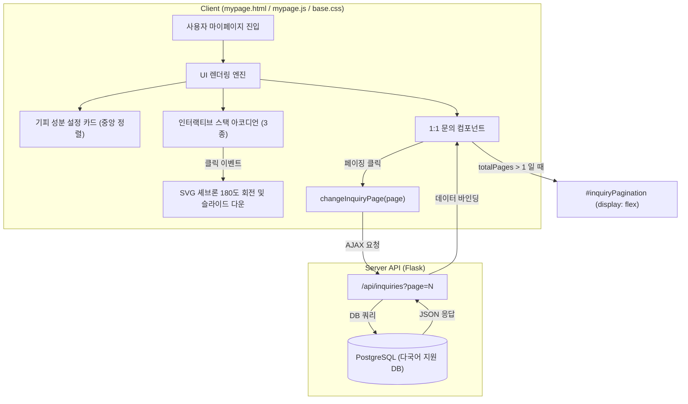

화장품 성분 분석 서비스인 PickSafe를 개발하면서, 마이페이지는 사용자의 개인화 경험이 집약되는 가장 핵심적인 공간이었습니다. 이곳에서 사용자는 자신이 기피하는 성분을 설정하고, 저장한 제품을 확인하며, 최근 스캔 기록과 1:1 문의 내역을 조회합니다. 

하지만 서비스를 운영하고 모니터링하는 과정에서 마이페이지의 여러 시각적 결함과 기능적 병목이 발견되었습니다. 모바일 뷰포트에서의 레이아웃 깨짐, 아코디언 컴포넌트의 인지적 단서(Affordance) 부족, 그리고 특정 조건에서 발생한 페이징 컨트롤 미노출 버그가 대표적이었습니다. 

이러한 문제들을 해결하기 위해 진행했던 UI/UX 개편 과정과 기술적 의사결정, 그리고 트러블슈팅의 기록을 담백하게 정리해 보았습니다.

---

## 🎯 마주한 고민과 문제 배경

기존 마이페이지는 기능 구현에 초점을 맞추다 보니, 실제 사용자가 모바일 환경에서 마주하는 디테일한 사용성 측면에서 다음과 같은 세 가지 한계점을 가지고 있었습니다.

### 1. 기피 성분 카드의 레이아웃 붕괴와 부자연스러운 시선 흐름
모바일 기기의 좁은 화면에서 우측 상단의 로그인 상태 뱃지(`Logged In`)가 가로 폭을 이기지 못하고 `Logged\nIn`으로 줄바꿈되어 깨지는 현상이 있었습니다. 또한, 기피 성분을 수정하는 버튼이 카드 상단에 애매하게 위치해 있어, 사용자가 등록된 성분을 먼저 훑어본 뒤 자연스럽게 하단에서 수정 단계로 진입하는 시선 흐름(F-Shape)을 방해하고 있었습니다.

### 2. 아코디언 컴포넌트의 낮은 클릭 유인 (Affordance 부재)
저장된 제품, 최근 스캔 기록, 1:1 문의 등 많은 정보를 깔끔하게 보여주기 위해 아코디언 구조를 채택했습니다. 그러나 초기 상태인 '닫혀 있는 아코디언'이 단순한 평면 텍스트 바 형태로 렌더링되어, 사용자가 "이 항목을 누르면 아래에 상세 내용이 숨겨져 있다"는 사실을 직관적으로 인지하기 어려웠습니다. 터치하고 싶게 만드는 시각적 매력과 입체감이 부족했습니다.

### 3. 1:1 고객 문의 내역의 페이징 컨트롤 실종 버그
가장 치명적인 기능적 결함이었습니다. 사용자가 등록한 1:1 문의 내역이 페이지당 제한 개수인 5건을 초과하여 6건이 되는 순간, 당연히 나타나야 할 하단의 페이징 네비게이션(`◀ 1 / 2 ▶`)이 화면에 표시되지 않았습니다. 이로 인해 사용자는 자신이 이전에 작성한 2페이지의 문의 글을 확인할 수 없는 상태에 빠졌습니다.

---

## ⚖️ 기술적 대안 비교 및 선택 이유

문제를 해결하기 위해 몇 가지 구현 대안을 검토하고, 서비스의 경량성과 유지보수 용이성을 기준으로 트레이드오프를 분석했습니다.

### 고민 1: 아코디언 컴포넌트에 입체감을 부여하는 방법

*   **대안 A: 외부 UI 라이브러리(Bootstrap 또는 Tailwind UI) 의존성 추가**
    *   *장점*: 완성도 높은 애니메이션과 스타일을 빠르게 적용할 수 있습니다.
    *   *단점*: 단 하나의 페이지, 몇 개의 아코디언을 위해 무거운 CSS/JS 라이브러리를 추가하는 것은 초기 로딩 속도에 악영향을 미칩니다.
*   **대안 B: 순수 CSS 다층 섀도우(Stacked Shadow)와 SVG 애니메이션 활용 (선택)**
    *   *장점*: 추가적인 외부 라이브러리 없이, 가벼운 CSS 속성(`box-shadow`)만으로 여러 장의 카드가 겹쳐 있는 듯한 입체적 스택(Stack) 효과를 구현할 수 있습니다. 성능 저하가 전혀 없으며 디자인 커스텀이 자유롭습니다.
    *   *단점*: 브라우저 호환성을 고려하여 그림자 값과 호버 트랜지션을 정교하게 직접 계산하고 작성해야 합니다.

**선택 이유**: PickSafe는 가볍고 빠른 성능을 지향하므로, 불필요한 번들 크기를 늘리기보다 순수 CSS의 잠재력을 최대한 활용하는 **대안 B**를 선택했습니다.

---

## 🏗️ 시스템 아키텍처 및 흐름

마이페이지 내부의 컴포넌트 구조와 사용자 인터랙션에 따른 데이터 흐름은 다음과 같이 정돈되었습니다.



---

## 💻 핵심 구현 및 트러블슈팅

### 1. 기피 성분 카드의 레이아웃 안정화 (CSS)
모바일 좁은 폭에서도 상태 뱃지가 깨지지 않도록 `white-space: nowrap`을 부여하고, 성분 편집 버튼을 카드 전체 흐름의 마지막 단계인 하단 정중앙에 배치했습니다.

```css
/* 상태 뱃지 깨짐 방지 */
.status-badge {
    white-space: nowrap;
    flex-shrink: 0;
    font-size: 0.8rem;
    padding: 4px 8px;
    border-radius: 12px;
}

/* 기피 성분 편집 버튼 중앙 정렬 레이아웃 */
.allergen-action-area {
    display: flex;
    justify-content: center;
    margin-top: 1.5rem;
    width: 100%;
}

.allergen-edit-btn {
    display: inline-flex;
    align-items: center;
    gap: 8px;
    padding: 10px 20px;
    border-radius: 20px;
    font-weight: 600;
}
```

### 2. 입체적 스택(Stack) 아코디언 효과 구현 (CSS)
아코디언이 닫혀 있을 때 아래에 정보가 쌓여 있는 듯한 시각적 단서를 주기 위해, 다층 그림자 기법을 적용했습니다. 호버 시에는 카드가 살짝 떠오르는 부드러운 트랜지션을 가미했습니다.

```css
/* 닫혀 있는 상태의 아코디언 카드에 다층 스택 그림자 적용 */
.mypage-accordion-card:not(.open) {
    background: #ffffff;
    border: 1px solid #e5e7eb;
    border-radius: 16px;
    box-shadow: 
        0 2px 5px rgba(0, 0, 0, 0.04), 
        0 6px 0 -2px #f3f4f6, 
        0 6px 5px -2px rgba(0, 0, 0, 0.03),
        0 12px 0 -4px #e5e7eb,
        0 12px 5px -4px rgba(0, 0, 0, 0.02);
    transition: transform 0.2s cubic-bezier(0.16, 1, 0.3, 1), box-shadow 0.2s ease;
}

/* 호버 시 촉각적 피드백 제공 */
.mypage-accordion-card:not(.open):hover {
    transform: translateY(-2px);
    box-shadow: 
        0 4px 8px rgba(0, 0, 0, 0.06), 
        0 8px 0 -2px #f3f4f6, 
        0 14px 0 -4px #e5e7eb;
}
```

### 3. 1:1 고객 문의 페이징 UI 누락 버그 해결 (JS)
기존 코드에서는 페이징 데이터를 정상적으로 계산하고 있었음에도, 화면에 페이징 컨테이너를 다시 노출시키는 DOM 조작 코드가 누락되어 있었습니다. CSS 초기값으로 `#inquiryPagination { display: none; }`이 설정되어 있었기 때문에 발생한 현상이었습니다.

데이터 렌더링 함수 내에 조건부로 `display = 'flex'`를 적용하는 코드를 추가하여 버그를 해결했습니다. 또한, 동적으로 생성된 HTML 버튼의 `onclick` 이벤트가 스코프 문제로 동작하지 않는 현상을 예방하기 위해 페이지 전환 함수를 `window` 전역 객체에 안전하게 바인딩했습니다.

```javascript
// web/frontend/static/js/mypage.js

/**
 * 1:1 문의 목록 및 페이징 렌더링 함수
 */
function renderInquiryListPage(data) {
    const listContainer = document.getElementById('inquiryListContainer');
    const pagContainer = document.getElementById('inquiryPagination');
    
    // 1. 문의 내역 목록 템플릿 생성 및 삽입
    listContainer.innerHTML = buildInquiryHtml(data.items);
    
    // [트러블슈팅] totalPages가 1을 초과할 때 컨테이너를 다시 보이도록 명시적 처리
    if (data.totalPages > 1) {
        pagContainer.style.display = 'flex'; 
        pagContainer.innerHTML = buildPaginationControls(
            data.currentPage, 
            data.totalPages, 
            'changeInquiryPage'
        );
    } else {
        pagContainer.style.display = 'none';
    }
}

/**
 * 페이지 전환 함수 및 전역 스코프 바인딩
 */
function changeInquiryPage(targetPage) {
    // API 요청 및 재렌더링 로직 수행
    fetchInquiries(targetPage)
        .then(data => renderInquiryListPage(data))
        .catch(err => console.error("Failed to load inquiry page:", err));
}

// 동적 onclick 이벤트 바인딩을 위해 window 객체에 노출
window.changeInquiryPage = changeInquiryPage;
```

---

## 💡 돌아보며 배운 점 (회고)

이번 마이페이지 개편 작업을 통해 다음과 같은 소중한 엔지니어링 교훈을 얻을 수 있었습니다.

1.  **디테일이 곧 신뢰성이다**: 
    모바일 화면에서 텍스트가 부자연스럽게 줄바꿈되거나, 당연히 작동해야 할 페이징 버튼이 보이지 않는 현상은 서비스 전체의 신뢰도를 갉아먹는 요인이 됩니다. 기획 단계뿐만 아니라 실제 구현 후 다양한 디바이스 크기에서 엣지 케이스(Edge Case) 데이터를 넣고 직접 검증하는 QA 과정의 중요성을 다시 한번 절감했습니다.
2.  **화려한 라이브러리보다 본질적인 CSS/JS의 힘**: 
    외부 UI 라이브러리를 도입하면 일시적으로 편할 수 있지만, 장기적으로는 프로젝트의 무거움과 커스텀의 한계를 초래합니다. 단순한 `box-shadow` 조합과 정교한 CSS 트랜지션만으로도 충분히 매력적이고 직관적인 사용자 경험을 선사할 수 있음을 확인했습니다.
3.  **다국어 환경을 고려한 방어적 레이아웃 설계**: 
    7개 국어 시딩 데이터를 지원하는 다국어 사이트의 특성상, 언어별로 텍스트 길이가 달라질 수밖에 없습니다. 레이아웃을 설계할 때 고정 폭 대신 유연한 Flexbox 구조와 `white-space: nowrap` 같은 방어적 CSS 기법을 적극 활용해야 레이아웃 깨짐을 미연에 방지할 수 있습니다.

앞으로도 단순히 기능을 완성하는 데 그치지 않고, 사용자가 서비스를 이용하는 매 순간 부드럽고 완성도 높은 경험을 할 수 있도록 디테일에 집중하여 서비스를 다듬어나가겠습니다.