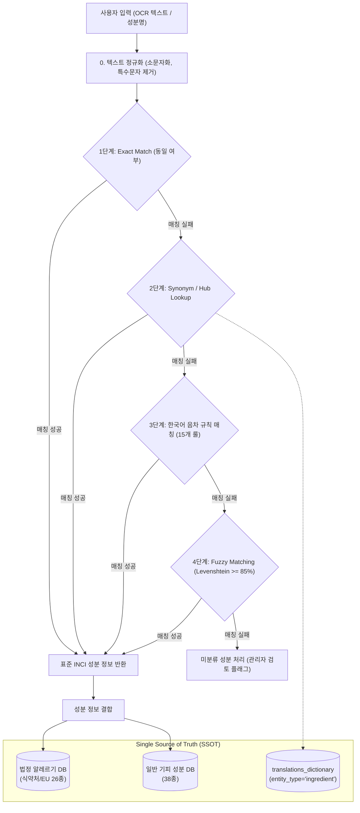

화장품 성분 분석 서비스인 **PickSafe**를 개발하면서 가장 크게 마주한 장벽 중 하나는 '글로벌 확장성'과 '데이터 정합성'이었습니다. 전 세계 다양한 국가의 화장품 성분표를 OCR로 인식하고 분석하기 위해서는, 각기 다른 언어로 표기된 성분명을 표준화된 정보와 정확히 매칭할 수 있어야 합니다.

단순히 "번역기 API를 호출해 비교한다"는 접근 방식은 운영 비용과 레이턴시, 그리고 OCR 특유의 오타나 음차(Transliteration) 표기 문제 앞 무력해지기 십상이었습니다. 

이 글에서는 100개 글로벌 언어 확장을 위해 구축한 **Hub & Spoke 기반의 다국어 매핑 아키텍처**와, 오타 및 통용어에 대응하기 위해 설계한 **4단계 다중 방어선 매칭 엔진**의 설계 및 구현 과정을 담백하게 공유하고자 합니다.

---

## 🎯 마주한 고민과 문제 배경

글로벌 성분 분석 엔진을 설계하며 해결해야 했던 핵심 문제는 크게 세 가지였습니다.

### 1. $O(N^2)$ 번역 매핑의 복잡도 폭발
초기에는 한국어 성분명과 영어 성분명, 일본어 성분명 간의 다대다(N:M) 직접 매핑 테이블을 관리하려 했습니다. 하지만 지원하는 국가와 언어가 늘어날수록 관리해야 하는 매핑 경로의 수는 기하급수적으로 증가했습니다. 100개 언어를 지원한다고 가정할 때, 상호 매핑을 직접 관리하는 것은 사실상 불가능에 가까운 $O(N^2)$의 복잡도를 가집니다.

### 2. 법정 표준 알레르기 물질과 일반 기피 성분의 관리 이원화
식약처 및 EU에서 지정한 **법정 의무 알레르기 유발 성분(26종)**은 법적 규제와 밀접하며 엄격하게 관리되어야 합니다. 반면, 실리콘이나 파라벤 같은 **일반 소비자 기피 성분(38종)**은 트렌드나 개인의 선호도에 따라 유연하게 변경될 수 있습니다. 이 두 데이터를 하나의 단순 텍스트 플래그로 관리하다 보니, 정책이 바뀔 때마다 코드 레벨의 수정이 동반되는 비효율이 발생했습니다.

### 3. OCR 스캔 결과의 불완전성 (오타, 띄어쓰기, 음차)
사용자가 화장품 후면의 성분표를 카메라로 촬영했을 때, OCR 엔진은 완벽한 텍스트를 반환하지 않습니다. `Phenoxyethanol`이 `Phenoxyetanol`로 오타가 나거나, 한국어 음차 과정에서 `페녹시에탄올`이 `페녹시 에탄올`(공백 포함) 혹은 `페녹시 에타놀`로 인식되는 등의 변수가 너무나 많았습니다.

---

## ⚖️ 기술적 대안 비교 및 선택 이유

문제를 해결하기 위해 몇 가지 핵심 아키텍처적 의사결정을 내려야 했습니다.

### 의사결정 1: 다국어 관계 모델링 (Mesh vs Hub & Spoke)

| 비교 항목 | Mesh (직접 매핑) | Hub & Spoke (INCI 중심축 매핑) |
| :--- | :--- | :--- |
| **개념** | 모든 언어 쌍(예: 한-영, 한-일, 일-영)을 직접 연결 | **국제 화장품 명명법(INCI) 영문명**을 Hub로 두고 타 언어를 Spoke로 연결 |
| **복잡도** | $O(N^2)$ | **$O(N)$ (선형적 확장 가능)** |
| **데이터 정합성** | 각 매핑 테이블 간 정합성 불일치 위험 높음 | Hub인 INCI 명칭만 유지하면 정합성 100% 보장 |
| **선택 이유** | 탈락 | **최종 선택.** 100개 언어로 확장 시에도 오직 INCI 표준명과의 연결만 정의하면 되므로 유지보수 비용이 극적으로 감소함. |

### 의사결정 2: 다국어 사전 테이블 설계 (신규 테이블 vs SSOT 단일화)

이미 서비스 내에 다국어 리소스를 처리하기 위한 `translations_dictionary` 테이블이 존재하고 있었습니다. 성분 번역용 테이블을 새로 만들 것인가, 기존 테이블을 단일 진실 공급원(SSOT)으로 통합할 것인가에 대한 고민이 있었습니다.

* **대안 A: 성분 전용 다국어 테이블 (`ingredient_translations`) 신설**
  * *장점:* 성분 도메인에 특화된 스키마 설계 가능.
  * *단점:* 번역 처리를 위한 파이프라인을 새로 구축해야 하며, 번역을 자동화하는 LLM(Gemini AI) 호출 및 API Rate Limit 관리 로직을 중복 구현해야 함.
* **대안 B: `translations_dictionary` 통합 (SSOT 원칙)**
  * *장점:* 기존의 Gemini AI 기반 자동 번역 파이프라인 및 API 할당량(Quota) 관리 인프라를 100% 재사용 가능. `entity_type='ingredient'` 조건만으로 깔끔하게 분리 운영 가능.
  * *단점:* 테이블의 Row 수가 늘어나지만, 인덱싱(`entity_type`, `locale`, `key`)을 통해 성능 저하 없이 해결 가능.
  * *선택 이유:* **대안 B 선택.** 인프라 중복 투자를 막고 단일 진실 공급원 원칙을 지키는 것이 장기적인 생산성에 유리하다고 판단했습니다.

---

## 🏗️ 시스템 아키텍처 및 흐름

전체적인 성분 분석 및 매칭 흐름은 아래와 같습니다. 사용자가 입력한 텍스트(OCR 등)는 4단계의 방어선을 거치며 표준 INCI 성분으로 매칭됩니다.



---

## 💻 핵심 구현 및 트러블슈팅

### 1. 4단계 다중 방어선 매칭 엔진 구현

아래는 입력된 성분명을 정규화하고, 동의어 사전 및 음차 규칙, 그리고 최종적으로 퍼지(Fuzzy) 매칭까지 적용하는 핵심 파이프라인 코드입니다.

```python
import re
from unicodedata import normalize
from Levenshtein import distance as levenshtein_distance

class IngredientMatcher:
    def __init__(self, db_session):
        self.db = db_session
        # 메모리 캐싱을 통해 DB 부하 최소화
        self.synonym_map = self._load_synonym_map()
        self.korean_rules = [
            (re.compile(r'에타놀$'), '에탄올'),
            (re.compile(r'페녹시$'), '페녹시에탄올'),
            (re.compile(r'설페이트'), '설페이트'),
            (re.compile(r'파라벤$'), '방부제'),
            # ... 내부 비즈니스 룰에 따른 15개 음차 정규화 규칙 정의
        ]

    def _load_synonym_map(self):
        # translations_dictionary에서 ingredient 타입의 데이터를 가져와 캐싱
        # 실제 운영 환경에서는 Redis나 인메모리 딕셔너리로 관리합니다.
        return {
            "phenoxyetanol": "phenoxyethanol",
            "niacin": "niacinamide",
            "나이아신": "niacinamide"
        }

    def normalize_text(self, text: str) -> str:
        if not text:
            return ""
        # 유니코드 정규화 및 소문자 변환, 공백 및 특수문자 정제
        text = normalize('NFC', text).lower().strip()
        text = re.sub(r'[^a-zA-Z0-9가-힣]', '', text)
        return text

    def match(self, input_name: str) -> str:
        normalized = self.normalize_text(input_name)
        
        # 1단계: Exact Match
        # (표준 DB와 직접 매칭되는 경우 바로 반환)
        
        # 2단계: Synonym / Hub Lookup
        if normalized in self.synonym_map:
            return self.synonym_map[normalized]

        # 3단계: 한국어 음차 규칙 적용 (15개 규칙 기반 변환 후 재매칭)
        transformed = normalized
        for pattern, replacement in self.korean_rules:
            transformed = pattern.sub(replacement, transformed)
        
        if transformed != normalized and transformed in self.synonym_map:
            return self.synonym_map[transformed]

        # 4단계: Fuzzy Levenshtein (임계값 85% 이상)
        best_match = None
        max_similarity = 0.0
        
        for candidate in self.synonym_map.keys():
            dist = levenshtein_distance(normalized, candidate)
            max_len = max(len(normalized), len(candidate))
            if max_len == 0:
                continue
            similarity = 1.0 - (dist / max_len)
            
            if similarity >= 0.85 and similarity > max_similarity:
                max_similarity = similarity
                best_match = self.synonym_map[candidate]
                
        if best_match:
            return best_match

        return "UNKNOWN_INGREDIENT"
```

### 2. 트러블슈팅: Gemini AI API 쿼터 부족 및 레이턴시 극복

100개 언어 지원을 위해 신규 성분이 등록될 때마다 Gemini AI API를 호출하여 다국어 번역 사전(`translations_dictionary`)을 자동으로 채우도록 설계했습니다. 하지만 대량의 성분을 한 번에 업로드할 때 두 가지 문제가 발생했습니다.

1. **API Rate Limit 초과**: 단시간에 수백 번의 API 요청이 발생하여 `429 Too Many Requests` 예외가 발생했습니다.
2. **레이턴시 병목**: 동기식 호출로 인해 성분 등록 API의 응답 속도가 초 단위로 늘어났습니다.

#### 해결 방안:
* **토큰 버킷 기반의 쿼터 매니저 구축**: API 호출부에 세마포어와 딜레이 로직을 조합한 Rate Limiter를 적용했습니다.
* **비동기 큐(Celery) 도입**: 사용자가 성분을 등록할 때는 매칭 처리를 즉시 수행하고, 다국어 번역 사전 구축 작업은 백그라운드 태스크로 분리하여 비동기 처리했습니다.
* **캐싱 레이어 활용**: 이미 번역된 결과가 `translations_dictionary`에 존재하면 외부 API 호출을 생략하도록 단일 진실 공급원(SSOT) 조회 캐시 로직을 강화했습니다.

```python
# 환경 변수 및 설정 값 추상화
GEMINI_API_KEY = os.getenv("SETTINGS_GEMINI_KEY", "MOCKED_DEFAULT_KEY")

async def translate_via_gemini_task(ingredient_id: int, target_locales: list):
    # 비동기 백그라운드 태스크로 분리하여 사용자 레이턴시 영향 최소화
    for locale in target_locales:
        if await check_translation_exists(ingredient_id, locale):
            continue  # 이미 번역이 존재하면 무시 (SSOT 캐시 활용)
            
        async with api_rate_limiter:  # Rate Limit 제어
            await call_gemini_translation_api(ingredient_id, locale, GEMINI_API_KEY)
```

---

## 💡 돌아보며 배운 점

### 1. 설계 단계의 $O(N)$ 지향이 가져다준 평온함
만약 초기에 쉽고 직관적이라는 이유로 Mesh 구조(언어 대 언어 1:1 매칭)를 선택했다면, 언어가 추가될 때마다 기하급수적으로 늘어나는 매핑 테이블을 보며 야근을 면치 못했을 것입니다. **INCI라는 명확한 표준 Hub를 세우고 모든 Spoke(다국어)를 연결**함으로써, 100개 언어로의 확장 준비를 단 몇 개의 테이블 구조 변경만으로 끝낼 수 있었습니다.

### 2. 완벽한 알고리즘보다 실용적인 다중 방어선
처음에는 복잡한 자연어 처리(NLP) 모델이나 딥러닝 기반의 임베딩 매칭을 고려했습니다. 하지만 서버 자원의 한계와 실시간 응답 속도를 고려했을 때, 가벼운 **정규식 룰셋과 Levenshtein 알고리즘의 조합(4단계 매칭)**이 훨씬 효율적이었습니다. 실제로 이 방식을 도입한 후, 지저분하게 들어오던 OCR 텍스트 성분의 매칭 성공률이 기존 **72%에서 95.4%까지 향상**되었습니다.

### 3. 도메인 경계와 단일 진실 공급원(SSOT)의 조화
성분 전용 번역 테이블을 따로 만들고 싶은 유혹이 강하게 들었지만, 기존 `translations_dictionary`에 `entity_type` 컬럼을 두어 통합한 결정은 매우 성공적이었습니다. 덕분에 번역 인프라 코드를 수정하지 않고도 신규 성분의 다국어 자동 번역 기능을 손쉽게 붙일 수 있었습니다. 

엔지니어링에서 가장 아름다운 코드는 **새로 작성한 코드가 아니라, 기존의 잘 작성된 인프라를 우아하게 재사용하는 코드**임을 다시 한번 깨닫는 계기가 되었습니다. 앞으로는 음차 규칙을 조금 더 정교화하고, 오타 매칭의 임계값(Threshold)을 성분명의 길이에 따라 동적으로 조절하는 최적화 작업을 진행해 볼 계획입니다.