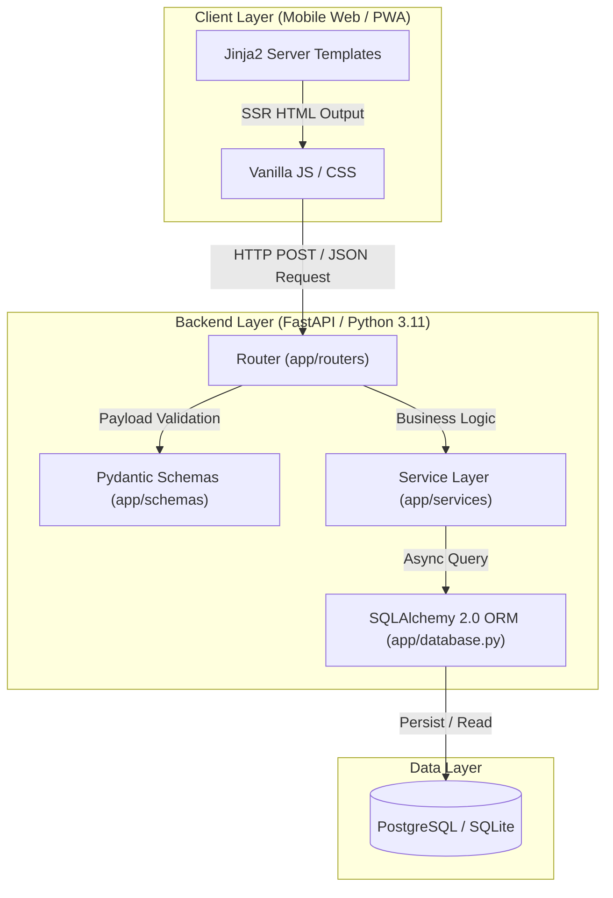

화장품 전성분 표시는 복잡하고 전문 용어가 많아 민감성 피부를 가졌거나 특정 성분에 알레르기가 있는 소비자가 자신에게 맞는 제품을 찾기 어렵습니다. **PickSafe(픽세이프)**는 소비자가 성분표를 촬영하면 식약처 공인 26대 알레르기 유발 성분 및 개인 기피 성분을 1초 내로 정밀 감지해 주는 모바일 웹 서비스를 목표로 시작한 프로젝트입니다.

프로젝트의 첫 커밋(`01baba3`)을 진행하며 초기 기술 스택과 백엔드 아키텍처의 기본 골격을 확립했던 과정, 그 과정에서 마주했던 고민과 기술적 판단을 정리해 둡니다.

---

## 🎯 마주한 고민과 문제 배경

프로젝트 초기 설계 단계에서 가장 크게 고민했던 지점은 **"초기 진입 장벽을 낮추기 위한 모바일 웹의 첫 로딩 속도"**와 **"향후 확장될 OCR 및 외부 API 비동기 처리 성능"** 간의 균형이었습니다.

1. **모바일 첫 로딩 속도(First Contentful Paint)의 한계**  
   사용자가 현장에서 화장품을 구매할 때 빠르게 성분을 조회해야 하는 서비스 특성상, 초기 접속 시 수백 KB 이상의 JavaScript 번들을 다운로드받아야 하는 대규모 SPA(Single Page Application) 구조는 부담스러웠습니다. 모바일 네트워크 환경에서도 0.5초 이내에 첫 화면 조작이 가능하도록 초기 렌더링 오버헤드를 줄여야 했습니다.

2. **I/O 바운드 작업 중심의 백엔드 특성**  
   성분 분석 요청은 이미지 업로드, OCR 라이브러리 연동, 성분 마스터 DB 조회 등 I/O 병목이 발생하기 쉬운 구조를 가지고 있습니다. 기존 동기식(WSGI) 프레임워크로는 다중 요청이 몰릴 때 요청 스레드가 쉽게 블록될 위험이 있었습니다.

3. **초기 스케일링에 적합한 구조 단순화**  
   개발 초기 단계에서 지나치게 복잡한 빌드 파이프라인(Webpack, Vite 등)이나 지나치게 파편화된 서비스 아키텍처를 도입하면 코드 유지보수 생산성이 저하될 수 있다고 판단했습니다.

---

## ⚖️ 기술적 대안 비교 및 선택 이유

백엔드 프레임워크와 프론트엔드 렌더링 방식을 결정하기 위해 몇 가지 대안을 비교 검토했습니다.

| 기술 스택 조합 | 장점 | 단점 | 최종 선택 |
| :--- | :--- | :--- | :--- |
| **Django + React (SPA)** | 생태계가 풍부하고 데이터베이스 모델링 및 관리자 페이지 구축이 신속함 | 초기 JS 클라이언트 번들 크기로 인한 초기 로딩 지연, API 및 SPA 2개 프로젝트 관리 공수 발생 | X |
| **Flask + Jinja2** | 가볍고 단순하며 템플릿 렌더링 파이프라인 구축이 매우 직관적임 | 동기 기반(WSGI) 구조로 비동기 I/O 처리가 어렵고, Pydantic 수준의 데이터 유효성 검증을 직접 구현해야 함 | X |
| **FastAPI + Jinja2 + Vanilla JS** | **ASGI 기반 비동기 처리, Pydantic 유효성 검증, OpenAPI 자동 문서화 제공. SSR로 0.5초 내 첫 로딩 달성 가능** | 복잡한 클라이언트 상태 관리가 어렵지만, 초기 모바일 UI 단계에서는 오버헤드가 적음 | **O (선택)** |

### 선택 이유
* **FastAPI**: Python 3.11의 비동기(async/await) 기능을 적극적으로 활용하여 OCR API 호출 및 DB 조회를 비동기로 처리할 수 있으며, Pydantic을 통해 API 입력값 검증과 스키마 타입을 런타임 수준에서 안정적으로 통제할 수 있습니다.
* **Jinja2 + Vanilla JS**: 불필요한 JS 번들링 단계와 클라이언트 사이드 렌더링(CSR) 시간을 제거했습니다. 서버에서 HTML을 경량 렌더링하여 반환하고, 필요한 인터랙션은 모던 바닐라 자바스크립트로 처리함으로써 초기 진입 로딩을 0.5초 이내로 단축하는 전략을 취했습니다.

---

## 🏗️ 시스템 아키텍처 및 흐름

백엔드 계층 간 의존성을 명확히 분리하고, 서버사이드 템플릿 렌더링과 JSON REST API가 공존할 수 있도록 레이어를 구성했습니다.



### 디렉토리 구조 표준화
백엔드 로직과 프론트엔드 자산을 명확하게 구분하여 향후 커스텀 빌드 도구를 도입하더라도 백엔드 코드가 영향을 받지 않도록 분리했습니다.

```
PickSafe/
├── web/
│   ├── backend/
│   │   └── app/
│   │       ├── main.py          # FastAPI 애플리케이션 진입점
│   │       ├── config.py        # 환경변수 및 설정 관리
│   │       ├── database.py      # SQLAlchemy DB 엔진 및 세션 관리
│   │       ├── routers/         # API 및 Page 엔드포인트 라우터
│   │       ├── models/          # SQLAlchemy ORM 모델 definition
│   │       ├── schemas/         # Pydantic 데이터 검증 스키마
│   │       └── services/        # 비즈니스 로직 처리 계층
│   └── frontend/
│       ├── templates/           # Jinja2 HTML 템플릿 파일
│       └── static/              # 경량 CSS, JS, 이미지 자산
└── bin/                         # 마스터 데이터 시딩 및 CLI 작업 스크립트
```

---

## 💻 핵심 구현 및 트러블슈팅

### 1. 비동기 SQLAlchemy 세션 및 엔진 설정
비동기 환경에서 SQLAlchemy 2.0을 다룰 때, 데이터베이스 커넥션 생성 과정에서의 락(Lock)이나 blocking 호출을 방지하기 위해 `create_async_engine` 및 `async_sessionmaker`를 적용했습니다.

```python
# web/backend/app/database.py
from typing import AsyncGenerator
from sqlalchemy.ext.asyncio import create_async_engine, AsyncSession, async_sessionmaker
from sqlalchemy.orm import DeclarativeBase
from app.config import SETTINGS

# 사내 비밀번호 및 접근 URI는 변수로 추상화
engine = create_async_engine(
    SETTINGS.DATABASE_URL,
    echo=SETTINGS.DEBUG,
    future=True,
    pool_pre_ping=True
)

AsyncSessionLocal = async_sessionmaker(
    bind=engine,
    class_=AsyncSession,
    expire_on_commit=False
)

class Base(DeclarativeBase):
    pass

async def get_db() -> AsyncGenerator[AsyncSession, None]:
    async with AsyncSessionLocal() as session:
        try:
            yield session
        finally:
            await session.close()
```

### 2. Pydantic 스키마를 통한 엄격한 파라미터 유효성 검증
성분 검사 데이터 요청 시 들어오는 유저 입력 파라미터가 유효한지 런타임에서 빠르게 필터링하도록 검증 클래스를 작성했습니다.

```python
# web/backend/app/schemas/ingredient.py
from pydantic import BaseModel, Field
from typing import List, Optional

class IngredientAnalyzeRequest(BaseModel):
    raw_ocr_text: str = Field(..., min_length=2, description="OCR로 추출된 성분 텍스트")
    user_blacklist: Optional[List[str]] = Field(default=[], description="사용자 지정 기피 성분 목록")

    class Config:
        json_schema_extra = {
            "example": {
                "raw_ocr_text": "정제수, 글리세린, 나이아신아마이드, 페녹시에탄올",
                "user_blacklist": ["페녹시에탄올"]
            }
        }
```

### 💬 트러블슈팅: Jinja2 static 파일 마운트와 REST API 경로 충돌
초기 세팅 과정에서 `FastAPI StaticFiles`를 마운트할 때, API 라우터(`app.include_router`)보다 정적 파일 마운트 라우트(`app.mount("/static", ...)`)가 상위에 위치하거나 예외 처리가 미비하여 특정 API 요청이 Static 파일 검색으로 전파되는 경로 간섭 현상을 경험했습니다.

* **원인**: FastAPI/Starlette의 라우팅 매칭 순서 특성상, 와일드카드나 static 경로가 앞단에 선언될 경우 API 엔드포인트 파싱 성능 및 의도치 않은 static file lookup이 발생하는 문제.
* **해결**: `main.py` 내에서 API 라우터를 우선 등록한 뒤, 정적 자산 마운팅과 Jinja2 템플릿 페이지 라우터를 차례대로 명시적으로 배치함으로써 결합도를 낮췄습니다.

```python
# web/backend/app/main.py
from fastapi import FastAPI
from fastapi.staticfiles import StaticFiles
from app.routers import api_v1, pages

app = FastAPI(title="PickSafe Core Service")

# 1. API 라우터 우선 등록 (JSON API 엔드포인트)
app.include_router(api_v1.router, prefix="/api/v1")

# 2. 정적 데이터 파일 마운트
app.mount("/static", StaticFiles(directory="web/frontend/static"), name="static")

# 3. Jinja2 SSR 페이지 라우터 등록
app.include_router(pages.router)
```

---

## 💡 돌아보며 배운 점 (회고)

프로젝트 스캐폴딩을 마치며 단순한 최신 기술 트렌드 추종보다 **"현재 풀어야 하는 문제의 성격에 적합한 아키텍처를 선택하는 것"**이 얼마나 중요한지 다시금 깨달았습니다.

1. **과도한 엔지니어링 지양**  
   처음에는 SPA 기반의 프레임워크 도입을 당연하게 생각했으나, 빠른 모바일 로딩 시간이라는 목적을 정의하고 나니 Jinja2와 Vanilla JS 조합이 초기 개발 단계에서 매우 효율적인 대안이 되었습니다. 빌드 설정 시간을 대폭 절감하고 서비스 핵심 로직 개발에 집중할 수 있었습니다.

2. **레이어 분리의 중요성**  
   FastAPI 서비스 레이어(`app/services`)와 데이터베이스 계층(`app/models`, `database.py`)을 명확히 분리해 두었기 때문에, 향후 모바일 웹에서 모바일 앱(React Native/Flutter)으로 확장하거나 백엔드에 대용량 성분 OCR 모델을 비동기 Worker(Celery/Arq)로 분리해야 할 시점이 오더라도 백엔드 코드를 최소한의 손실로 재사용할 수 있는 기반을 구축했습니다.

3. **향후 보완 과제**  
   현재는 경량 렌더링 방식이 효율적이지만, 추후 성분 상세 비교 화면이나 복잡한 그래프/차트 UI가 추가된다면 Vanilla JS만으로는 DOM 상태 관리가 번잡해질 가능성이 있습니다. UI 복잡도가 일정 수준 이상 증가할 경우, Alpine.js나 HTMX 같은 lightweight 클라이언트 도구를 부분적으로 채택하여 서버 렌더링과의 시너지를 이끌어내는 방향을 고민해 볼 예정입니다.

PickSafe의 기초 뼈대를 잡은 이번 작업을 바탕으로, 다음 단계에서는 본격적인 식약처 알레르기 성분 데이터베이스 구축 및 OCR Parsing 알고리즘 고도화를 진행하려 합니다.