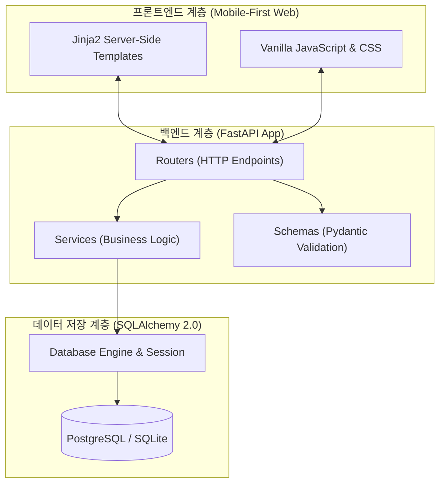

## 🎯 마주한 고민과 문제 배경

화장품의 전성분 표시는 화학 성분명과 긴 라틴어 학명이 빽빽하게 나열되어 있어, 민감성 피부나 특정 알레르기를 가진 소비자가 이를 현장에서 직접 읽고 안전성을 판단하기란 매우 어렵습니다. 복잡한 성분표 이미지를 스마트폰으로 촬영하면, 공인 알레르기 유발 성분과 사용자 맞춤 기피 성분을 즉시 감지하여 신속하게 안전성을 판별해 주는 서비스를 구상하며 PickSafe 개발을 시작했습니다.

프로젝트의 초기 스캐폴딩을 설계하면서 가장 먼저 마주한 질문은 **"초기 리소스가 제한적인 상황에서 어떻게 해야 모바일 사용자 경험과 I/O 처리 성능을 동시에 확보할 수 있을 것인가?"**였습니다.

1. **I/O 바운드 작업에 대한 비동기 처리 요구**: 추후 OCR 엔진 호출, 대량의 성분 텍스트 파싱 및 외부 API 통신 등 네트워크 I/O 작업이 주를 이룰 것으로 예상되었습니다.
2. **모바일 웹 진입 속도(FCP) 최적화**: 사용자가 매장에서 제품을 들고 스마트폰으로 접속했을 때 무거운 자바스크립트 번들 다운로드로 인한 화면 렌더링 지연이 없어야 했습니다.
3. **간결하면서도 확장 가능한 계층 분리**: 첫 출발은 가볍게 가져가되, 향후 복잡한 성분 정규화 알고리즘이나 다국어 지원이 추가되더라도 구조가 무너지지 않아야 했습니다.

---

## ⚖️ 기술적 대안 비교 및 선택 이유

핵심 기술 스택을 선정하기 위해 프론트엔드와 백엔드 영역에서 실질적인 Trade-off를 비교했습니다.

### 1. 백엔드 프레임워크: Django vs Flask vs FastAPI

| 비교 항목 | Django | Flask | FastAPI |
| :--- | :--- | :--- | :--- |
| **비동기(ASGI) 지원** | 부분적 지원 (다소 무거움) | WSGI 기본 (별도 확장 필요) | **기본 비동기 네이티브 지원** |
| **데이터 유효성 검증** | Forms / Serializers | 수동 검증 또는 외부 라이브러리 | **Pydantic 기반 강력한 타입 검증** |
| **I/O 처리 성능** | 보통 | 보통 | **매우 높음 (Starlette 기반)** |
| **초기 오버헤드** | 무거운 배터리 포함 구조 | 매우 가벼움 | **가벼우면서도 현대적인 구조** |

Django는 관리자 도구와 ORM이 강력하지만 초기 서비스 단계에서는 불필요하게 무거웠고, Flask는 단순하지만 비동기 처리와 타입 검증을 위해 추가적인 의존성을 계속 붙여야 했습니다. 결과적으로 비동기 I/O 처리가 기본으로 내장되어 있고 Pydantic을 통해 엄격한 입출력 검증이 가능한 **FastAPI(Python 3.11)**를 최종 채택했습니다.

### 2. 프론트엔드 렌더링: SPA(React/Next.js) vs 경량 SSR(Jinja2 + Vanilla JS)

모바일 환경에서의 초기 로딩 성능을 최적화하기 위해 무거운 SPA 프레임워크 빌드 과정을 과감히 걷어냈습니다.

* **복잡한 빌드 파이프라인 배제**: Node.js 빌드 체인과 상태 관리 라이브러리의 오버헤드를 줄여 백엔드와 단일 배포 파이프라인으로 묶었습니다.
* **초기 렌더링 속도 확보**: 서버사이드 템플릿 렌더링(Jinja2)을 통해 첫 화면(First Contentful Paint)을 최소화하고, 필수 인터랙션만 경량 바닐라 자바스크립트로 처리하는 모바일 뷰 구조를 택했습니다.

---

## 🏗️ 시스템 아키텍처 및 흐름

초기 시스템은 복잡한 마이크로서비스 대신 단일 애플리케이션 내에서 책임이 명확히 나뉘는 모놀리식 레이어드 아키텍처로 구성했습니다.



### 디렉토리 구조 표준화

유지보수성과 역할 분리를 위해 백엔드와 프론트엔드 자산을 깔끔하게 격리했습니다.

```text
├── web/
│   ├── backend/
│   │   └── app/
│   │       ├── database.py       # DB 커넥션 및 세션 수명 주기 관리
│   │       ├── models/           # SQLAlchemy 엔티티 모델
│   │       ├── routers/          # API 및 템플릿 렌더링 라우터
│   │       ├── schemas/          # Pydantic 입출력 DTO
│   │       └── services/         # 핵심 비즈니스 로직
│   └── frontend/
│       ├── static/               # 정적 자산 (JS, CSS, Images)
│       └── templates/            # Jinja2 템플릿
└── bin/                          # 시딩 및 관리용 CLI 스크립트
```

---

## 💻 핵심 구현 및 트러블슈팅

### 1. 데이터베이스 세션 관리 및 SQLAlchemy 2.0 설정

로컬 환경(SQLite)과 배포 환경(PostgreSQL)을 매끄럽게 전환하면서, 세션 누수 없이 안전하게 트랜잭션을 관리할 수 있는 의존성 주입 구조를 구축했습니다.

```python
# web/backend/app/database.py
from typing import Generator
from sqlalchemy import create_engine
from sqlalchemy.orm import declarative_base, sessionmaker, Session
import os

DATABASE_URL = os.getenv("DATABASE_URL", "sqlite:///./local_dev.db")

# SQLite 사용 시 멀티스레드 접근 설정 처리
connect_args = {"check_same_thread": False} if DATABASE_URL.startswith("sqlite") else {}

engine = create_engine(DATABASE_URL, connect_args=connect_args, pool_pre_ping=True)
SessionLocal = sessionmaker(autocommit=False, autoflush=