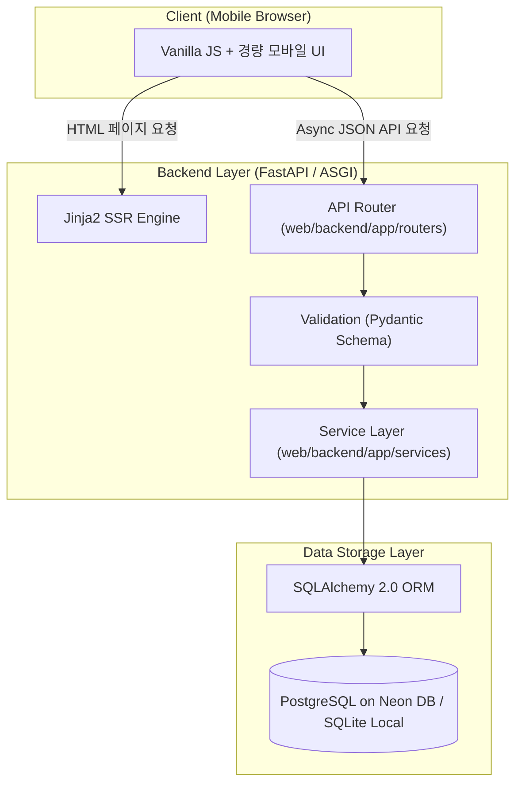

화장품 성분표의 복잡한 화학 명칭과 정보의 비대칭성은 민감성 피부나 특정 알레르기를 가진 사용자가 제품을 안심하고 구매하는 데 지속적인 진입장벽이 되곤 합니다. 식약처 지정 26대 알레르기 유발 성분과 사용자가 직접 설정한 기피 성분을 모바일 화면에서 빠르게 판별해 주는 **PickSafe** 서비스를 구상하면서, 프로젝트 초기에 다져야 할 백엔드 및 프론트엔드 기초 아키텍처를 어떻게 가져갈지 깊이 고민했습니다.

초기 스캐폴딩 단계에서 마주했던 기술적 고민과 이를 극복하기 위해 결정한 구조적 대안, 그리고 데이터베이스 및 웹 레이어 설정 과정을 담담하게 정리해 봅니다.

---

## 🎯 마주한 고민과 문제 배경

프로젝트의 핵심 기능은 스마트폰 카메라인 OCR 스캔이나 이미지 업로드를 통해 추출된 전성분 텍스트를 식약처 마스터 성분 데이터베이스와 대조하고 사용자 맞춤형 기피 성분을 판별해 내는 것입니다. 이 과정에서 아키텍처 관점의 두 가지 주요 요구사항과 문제 배경이 존재했습니다.

1. **모바일 네트워크 환경에서의 초기 진입 속도 (First Contentful Paint, FCP)**
   모바일 웹 UI 환경에서 소비자가 매장에서 화장품을 집어 들고 바로 접속했을 때, 무거운 React/Vue 기반 SPA(Single Page Application) 번들 파일 다운로드 오버헤드는 초기 진입 진입장벽을 높일 위험이 있었습니다.
2. **I/O 병목이 예상되는 비동기 성분 검증 프로세스**
   성분 텍스트 파싱, 외부 번역 및 OCR API 연동, DB 내 성분 맵핑 작업은 네트워크 및 데이터베이스 I/O 연산이 주를 이룹니다. 블로킹(Blocking) 방식의 전통적인 WSGI 기반 프레임워크로는 제한된 서버 리소스 내에서 다수의 동시 파싱 요청을 유연하게 처리하기 어렵다는 점을 마주했습니다.

결국 **"프론트엔드 초기 번들 오버헤드를 최소화하면서, 백엔드에서는 비동기 I/O 처리가 유연한 구조"**를 초기 스캐폴딩의 핵심 목표로 설정하게 되었습니다.

---

## ⚖️ 기술적 대안 비교 및 선택 이유

### 1. 백엔드 프레임워크: FastAPI vs Django vs Flask

초기 백엔드 프레임워크 후보군으로 Python 생태계의 대표적인 세 가지 프레임워크를 비교 검토했습니다.

| 항목 | FastAPI | Django | Flask |
| :--- | :--- | :--- | :--- |
| **I/O 처리 방식** | ASGI 기반 native async/await 지원 | WSGI/ASGI 혼용 (설정 복잡도 높음) | WSGI 중심 (비동기 지원 제약) |
| **데이터 검증** | Pydantic 기반 스키마 자동 검증 | Form/Serializer 기반 | 외부 라이브러리 추가 필요 |
| **문서화** | OpenAPI(Swagger) 자동 생성 | 별도 제3자 라이브러리 필요 | 별도 제3자 라이브러리 필요 |
| **초기 오버헤드** | 가볍고 필요한 모듈만 조립 가능 | ORM, Admin 등 비대함 | 매우 가벼우나 스키마 검증 부재 |

* **선정 이유**: OCR 이미지 분석과 DB 쿼리 조합 처리를 위해 비동기(ASGI) 성능이 우수하고, 요청/응답 데이터의 엄격한 유효성 검증을 `Pydantic`으로 명확히 수행할 수 있는 **FastAPI**를 최종 선택했습니다.

### 2. 프론트엔드 및 렌더링 전략: Jinja2 서버사이드 렌더링 + Vanilla JS

* **SPA 번들 오버헤드 배제**: React나 Vue 기반 툴체인을 도입할 경우 빌드 파이프라인 관리가 복잡해지고 모바일 환경에서 번들 파싱 시간으로 인해 초간단 화면 노출까지의 FCP가 지연될 우려가 있었습니다.
* **Jinja2 + Vanilla JS**: FastAPI 내장 `Jinja2Templates`를 통해 초기 HTML 렌더링은 서버에서 즉시 완성하여 전달하고, 화면 내 성분 스캔 결과 동적 업데이트는 경량 Vanilla JavaScript fetch API로 처리하는 구조를 택했습니다.

---

## 🏗️ 시스템 아키텍처 및 흐름

선정한 기술 스택을 바탕으로 정립한 초기 PickSafe 아키텍처 레이어는 다음과 같습니다. 백엔드 코어는 서비스 레이어와 라우터 계층을 분리하여 향후 OCR 처리 로직이나 대용량 성분 DB 조회 알고리즘이 고도화되어도 상호 영향을 줄이도록 설계했습니다.



---

## 💻 핵심 구현 및 트러블슈팅

### 1. 디렉토리 구조의 표준화

프론트엔드 자산과 백엔드 애플리케이션 코드를 구별하면서도 단일 리포지토리 내에서 깔끔하게 관리할 수 있도록 다음과 같이 디렉토리를 구체화했습니다.

```text
├── bin/                       # 마스터 데이터 시딩 및 CLI 스크립트
├── web/
│   ├── backend/
│   │   └── app/
│   │       ├── database.py    # SQLAlchemy 2.0 세션 및 엔진 설정
│   │       ├── main.py        # FastAPI 앱 인스턴스 및 라우터 등록
│   │       ├── models/        # DB ORM 모델 (성분, 사용자 등)
│   │       ├── routers/       # 엔드포인트 라우팅 레이어
│   │       └── services/      # 핵심 비즈니스 로직
│   └── frontend/
│       ├── static/            # CSS, JS, Images
│       └── templates/         # Jinja2 HTML 템플릿
```

### 2. FastAPI 메인 진입점 및 템플릿/정적 파일 마운트

`web/backend/app/main.py` 파일에서 정적 파일 및 템플릿 경로를 바르게 매핑하고, 비동기 세션을 처리하기 위한 기본 구조를 작성했습니다.

```python
import os
from pathlib import Path
from fastapi import FastAPI, Request
from fastapi.staticfiles import StaticFiles
from fastapi.templating import Jinja2Templates

# 프로젝트 루트 및 경로 설정
BASE_DIR = Path(__file__).resolve().parent.parent.parent

app = FastAPI(
    title="PickSafe API",
    description="화장품 성분 분석 및 알레르기 감지 API",
    version="0.1.0"
)

# 정적 파일 및 Jinja2 템플릿 경로 연동
static_dir = BASE_DIR / "frontend" / "static"
templates_dir = BASE_DIR / "frontend" / "templates"

app.mount("/static", StaticFiles(directory=str(static_dir)), name="static")
templates = Jinja2Templates(directory=str(templates_dir))

@app.get("/", summary="메인 스캔 페이지")
async def render_main_page(request: Request):
    """
    모바일 메인 진입 화면을 SSR 방식으로 빠르게 제공합니다.
    """
    return templates.TemplateResponse(
        "index.html", 
        {"request": request, "app_name": "PickSafe"}
    )
```

### 3. 데이터베이스 세션 관리 트러블슈팅

개발 초기, SQLAlchemy 2.0 ORM 세션을 동기식으로 사용할지 비동기(`AsyncSession`)로 처리할지에 대한 고민이 있었습니다. Cloud PostgreSQL 서비스인 Neon DB 환경과 로컬 SQLite 환경 간 호환성을 유지하면서, 세션 누수를 방지하기 위해 컨텍스트 매니저 방식의 세션 주입 패턴을 적용했습니다.

```python
# web/backend/app/database.py
import os
from sqlalchemy import create_engine
from sqlalchemy.orm import sessionmaker, declarative_base

# 환경변수를 통한 DB 접속 정보 추상화
DATABASE_URL = os.getenv("DATABASE_URL", "sqlite:///./local_dev.db")

# Neon DB(PostgreSQL) 접속 시 sslmode 요구사항 처리
if DATABASE_URL.startswith("postgres://"):
    DATABASE_URL = DATABASE_URL.replace("postgres://", "postgresql://", 1)

engine = create_engine(
    DATABASE_URL,
    pool_pre_ping=True,  # 끊어진 커넥션 자동 재연결
    pool_size=5,
    max_overflow=10
)

SessionLocal = sessionmaker(autocommit=False, autoflush=False, bind=engine)
Base = declarative_base()

def get_db():
    """
    FastAPI Dependency Injection을 위한 DB 세션 제너레이터
    """
    db = SessionLocal()
    try:
        yield db
    finally:
        db.close()
```

**트러블슈팅 포인트:**
서버리스 PostgreSQL(Neon) DB 사용 시 클라우드 데이터베이스의 소켓 커넥션 타임아웃 문제로 인해 `OperationalError`가 간헐적으로 발생하는 현상이 나타났습니다. 이를 해결하기 위해 `create_engine` 생성 시 `pool_pre_ping=True` 옵션을 부여하여 쿼리 실행 전 커넥션 유효성을 미리 검증하도록 처리했습니다.

---

## 💡 돌아보며 배운 점

프로젝트 초기 스캐폴딩과 기본 아키텍처를 잡는 과정에서 다음과 같은 실질적인 엔지니어링 경험을 얻었습니다.

1. **목적에 맞는 적정 기술의 가치**
   무조건적인 최신 SPA 프레임워크 도입 대신, 모바일 사용자의 빠른 접속(FCP)을 위해 Jinja2 SSR과 Vanilla JS를 결합한 선택은 초기 모바일 웹 UI 로딩 속도를 최적화하는 데 매우 효과적이었습니다.
2. **레이어 분리의 중요성**
   FastAPI의 라우터, 서비스, ORM 모델을 초기부터 명확히 분리해 두었기에, 추후 성분 마스터 데이터 구축 스크립트(`bin/`) 작업을 병행하면서도 웹 서비스 로직을 안정적으로 유지할 수 있었습니다.

### 추후 보완 과제
* 현재는 기본 DB 커넥션 풀을 통한 세션 관리를 적용했으나, 추후 카메라 OCR을 통한 복잡한 문자열 정규화 및 대용량 성분 매칭 요청이 늘어날 경우를 대비해 **성분 매칭 결과 인메모리 캐싱 레이어** 도입을 검토할 계획입니다.
* 또한 식약처 DB 업데이트 배치 스크립트 실행 시 백엔드 API 서비스 응답에 영향을 주지 않도록 트랜잭션 격리 수준을 점검하는 작업이 이어져야 할 것입니다.