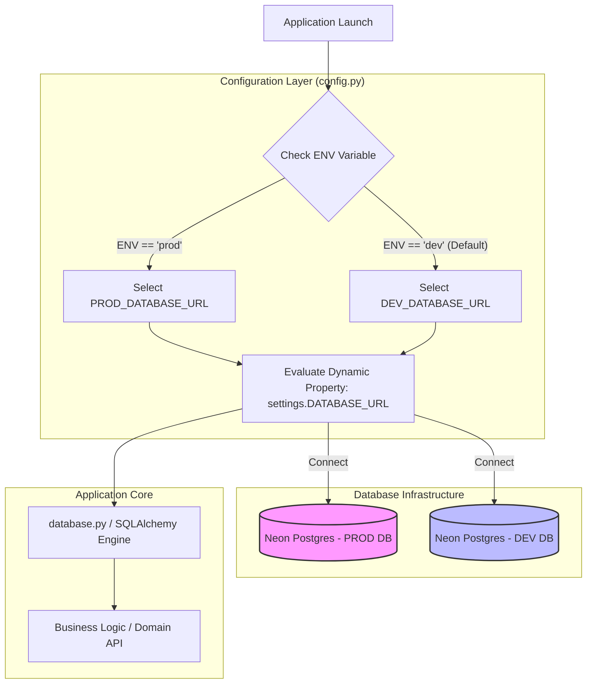

> "로컬 개발 환경에서 테스트 데이터를 삭제한다는 것이, 알고 보니 실제 운영 데이터베이스였습니다."

초기 스타트업에서 속도를 내다 보면 한 번쯤 직면하거나 들어보았을 섬뜩한 이야기입니다. 서비스 초기에는 단일 데이터베이스 연결 문자열(`DATABASE_URL`)만으로 빠르게 서비스를 구축하곤 합니다. 하지만 서비스가 성장하고 트래픽과 데이터가 누적됨에 따라, 개발(Dev)과 운영(Prod) 데이터베이스의 물리적·논리적 격리는 선택이 아닌 **필수적인 안보 장치**가 됩니다.

오늘 포스팅에서는 저희 **PickSafe** 팀이 단일 DB 인프라 체제에서 발생할 수 있는 휴먼 에러와 서버리스 DB(Neon Postgres)의 리소스 한계를 극복하기 위해, **어떻게 비즈니스 코드 수정 없이 깔끔하고 안전하게 개발/운영 DB를 분리했는지** 그 엔지니어링 여정을 공유합니다.

---

## 🎯 문제 정의: 왜 지금 환경 분리가 필요했는가?

저희 팀은 초기 개발 속도를 확보하기 위해 단일 `DATABASE_URL` 환경 변수를 사용하고 있었습니다. 하지만 다음과 같은 실질적인 위험 요소들이 인프라와 개발 생산성을 위협하기 시작했습니다.

1. **데이터 오염 및 휴먼 에러 위험 증가**
   * 개발자 로컬 환경에서 마이그레이션(Alembic)이나 대규모 테스트 데이터를 생성/삭제하는 과정에서, 환경 변수 설정 실수 하나로 운영 데이터가 오염될 수 있는 아슬아슬한 구조였습니다.
2. **서버리스 데이터베이스(Neon Postgres)의 리소스 제약**
   * PickSafe는 서버리스 Postgres 서비스인 **Neon DB**를 활용하고 있습니다. Neon의 무료/스타터 티어는 연결 수(Connection Count), 컴퓨트 시간(Compute Hours), 스토리지에 엄격한 제약이 존재합니다.
   * 개발용 테스트 쿼리나 오토 스케일링 테스트가 운영 DB 리소스를 고갈시켜, 실제 유저에게 서비스 장애로 이어질 위험이 존재했습니다.
3. **배포 파이프라인의 불확실성**
   * 배포 시마다 환경 변수를 강제로 오버라이딩하거나 코드를 수정해야 한다면 배포 안정성이 크게 떨어집니다.

따라서 저희는 **"비즈니스 로직 코드는 단 한 줄도 바꾸지 않으면서, 환경(ENV)에 따라 자동으로 정확한 DB를 바라보도록 만드는 아키텍처"**를 목표로 설정했습니다.

---

## 🏗️ 핵심 아키텍처 및 다이어그램

저희가 설계한 핵심은 **Pydantic의 동적 프로퍼티(Dynamic Property) 패턴**을 활용한 라우팅 레이어입니다.

어플리케이션이 로드될 때, `ENV` 환경 변수(`dev` 또는 `prod`)를 감지하여 적절한 DB 연결 문자열을 동적으로 추상화합니다. DB 세션을 생성하는 `database.py`나 비즈니스 로직은 그저 기존처럼 `settings.DATABASE_URL`을 바라보기만 하면 됩니다.

### 시스템 아키텍처 흐름도



---

## ⚖️ 대안 비교 및 Trade-off 분석

문제 해결을 위해 팀 내에서 3가지 대안을 검토했습니다.

| 비교 항목 | 대안 1: 배포 시 환경 변수 오버라이딩 | 대안 2: Multi-file Config (`.env.dev`, `.env.prod`) | **선택안: 단일 `.env` + Pydantic Dynamic Property** |
| :--- | :--- | :--- | :--- |
| **방식** | CI/CD 파이프라인에서 `DATABASE_URL` 자체를 덮어씀 | 환경별 `.env` 파일을 따로 두고 실행 시점에 로드 파일 교체 | `.env`에 두 URL을 모두 정의하고 애플리케이션 코드가 동적 분기 |
| **장점** | 코드 변경이 전혀 없음 | 환경별 파일이 명확히 분리됨 | **안전성 최고**: 기본값이 `dev`로 설정되어 `prod` 명시 없이는 절대 상용 DB에 붙지 않음 |
| **단점** | 로컬 개발 시 실수로 운영 DB URL을 실수로 넣을 위험 존재 | 파일 관리 복잡도 증가 및 실수로 배포 파일 누락 가능성 | 파이썬 설정 파일(`config.py`) 내 약간의 로직 추가 필요 |
| **휴먼 에러 방지**| ❌ 낮음 | ⚠️ 보통 | **⭕ 매우 높음 (Fail-Safe 구조)** |

**💡 선택 이유:**
대안 3을 선택함으로써 **"디폴트는 항상 안전한 Dev 환경"**이라는 **Fail-Safe** 원칙을 달성할 수 있었습니다. CI/CD 배포 환경에서 명시적으로 `ENV=prod`를 주입하지 않는 한, 시스템은 어떠한 경우에도 운영 DB에 접근하지 않습니다.

---

## 🚀 구현 핵심 코드 및 트러블슈팅 경험

### 1. 설정 레이어 구현 (`app/config.py`)

Pydantic `BaseSettings`의 `@property` 데코레이터를 활용하여, 내부 구현은 분기 처리하되 외부 인터페이스는 기존의 단일 속성(`settings.DATABASE_URL`)을 유지하도록 구현했습니다.

```python
from typing import Literal
from pydantic import Field
from pydantic_settings import BaseSettings, SettingsConfigDict

class Settings(BaseSettings):
    # 환경 구분 (기본값은 무조건 'dev'로 설정하여 안전성 확보)
    ENV: Literal["dev", "prod"] = Field(default="dev", alias="ENV")
    
    # 두 개의 격리된 DB URL 수집 (민감 정보는 런타임 환경변수에서 로드)
    DEV_DATABASE_URL: str = Field(..., alias="DEV_DATABASE_URL")
    PROD_DATABASE_URL: str = Field(..., alias="PROD_DATABASE_URL")
    
    # Pydantic v2 설정
    model_config = SettingsConfigDict(
        env_file=".env",
        env_file_encoding="utf-8",
        extra="ignore"
    )

    @property
    def DATABASE_URL(self) -> str:
        """
        ENV 상태에 따라 적절한 DB 연결 문자열을 동적으로 반환합니다.
        외부 코드는 settings.DATABASE_URL로 동일하게 접근합니다.
        """
        if self.ENV == "prod":
            # Prod 환경 검증 로직 추가 (Fail-Fast)
            if not self.PROD_DATABASE_URL:
                raise ValueError("🚨 [CRITICAL] ENV가 'prod'로 설정되었으나 PROD_DATABASE_URL이 누락되었습니다.")
            return self.PROD_DATABASE_URL
        
        return self.DEV_DATABASE_URL

# 싱글톤 객체 생성
settings = Settings()
```

### 2. 비즈니스 연결 레이어 (`app/database.py`)

기존 비즈니스 로직 및 ORM 설정 코드는 **단 한 줄도 수정할 필요가 없었습니다.** (개방-폐쇄 원칙 OCP 준수)

```python
from sqlalchemy import create_engine
from sqlalchemy.orm import sessionmaker
from app.config import settings

# settings.DATABASE_URL 호출 시 내부적으로 ENV를 평가하여 올바른 DB URL을 반환함
engine = create_engine(
    settings.DATABASE_URL, 
    pool_pre_ping=True,
    pool_size=10,
    max_overflow=20
)

SessionLocal = sessionmaker(autocommit=False, autoflush=False, bind=engine)
```

### 🛠️ 트러블슈팅 경험: 서버리스 DB(Neon)의 SSL 및 Connection Pool 이슈

환경을 분리한 후 로컬 환경(`dev`)에서 Neon Postgres Dev 인스턴스로 연결할 때 `sslmode` 미설정으로 인한 연결 거부 에러(`psycopg2.OperationalError: FATAL: no pg_hba.conf entry...`)가 발생했습니다.

**해결 방법:**
환경 변수 URL 끝에 SSL 모드를 명시적으로 강제하거나, Pydantic 프로퍼티 단에서 Neon DB 특화 파라미터를 동적으로 인코딩해 주는 방식을 도입했습니다.

```python
@property
def DATABASE_URL(self) -> str:
    target_url = self.PROD_DATABASE_URL if self.ENV == "prod" else self.DEV_DATABASE_URL
    
    # Neon Postgres 필수 쿼리 파라미터 자동 보장
    if "sslmode" not in target_url:
        delimiter = "&" if "?" in target_url else "?"
        target_url = f"{target_url}{delimiter}sslmode=require"
        
    return target_url
```

---

## 💡 도입 성과 및 엔지니어링 교훈

### 1. 정량적/정성적 성과
* **휴먼 에러 0건 달성**: DB 분리 적용 이후, 개발/테스트 작업 중 운영 DB 데이터에 영향을 준 사고가 전무합니다.
* **코드 수정 최소화 (Zero Impact)**: Configuration 단에서의 추상화 덕분에 `database.py`, Alembic 마이그레이션 스크립트, Router 코드 등 기존 비즈니스 로직을 **0줄** 수정했습니다.
* **Neon DB 비용 및 리소스 최적화**: Dev 환경의 쿼리スパイク가 Prod 환경의 Compute Unit을 소비하지 않게 되어 운영 인프라의 안정성이 크게 향상되었습니다.

### 2. 엔지니어링 교훈
* **Fail-Safe & Fail-Fast 디자인의 중요성**: 시스템의 기본값(Default)은 항상 가장 안전한 상태(Dev)여야 합니다. 또한, 설정 오류(예: `prod`인데 Prod URL 누락)가 있다면 어플리케이션은 즉시 기동을 실패(Fail-Fast)해야 더 큰 장애를 막을 수 있습니다.
* **단순함 속에 숨겨진 객체지향