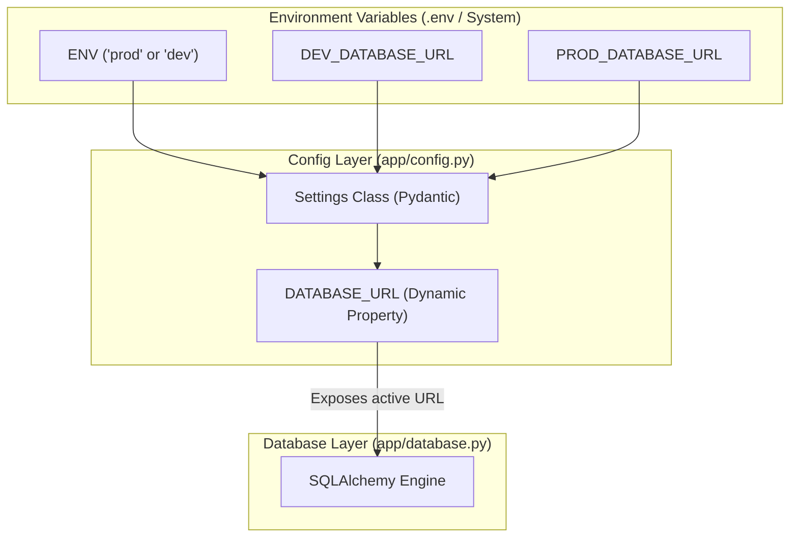

화장품 성분 분석 서비스인 **PickSafe**를 개발하면서, 초기에는 빠른 기능 구현을 위해 단일 데이터베이스 환경에서 개발과 간단한 테스트를 병행했습니다. 그러나 서비스 런칭 단계가 가까워지고 실제 데이터가 쌓이기 시작하면서, 개발 과정의 실수가 운영 데이터에 영향을 미칠 수 있다는 불안감이 커졌습니다. 

특히 PickSafe의 백엔드 데이터베이스로 채택한 **Neon Postgres**의 무료 티어는 컴퓨팅 리소스와 동시 커넥션 수, 스토리지 용량에 엄격한 제한이 있습니다. 로컬에서 무거운 테스트 쿼리를 실행하거나 마이그레이션을 수행할 때 운영 중인 서비스가 일시적으로 먹통이 되거나 쿼터 초과로 차단될 위험이 존재했습니다.

이 문제를 근본적으로 해결하기 위해 개발(DEV)과 운영(PROD) 데이터베이스를 아키텍처 레벨에서 완전히 분리하고, 코드의 수정 없이 환경 변수 설정만으로 안전하게 전환되도록 설정을 개선했습니다. 그 과정에서의 고민과 구현 방식을 기록으로 남깁니다.

---

## 🎯 마주한 고민과 문제 배경

기존에는 `.env` 파일에 단 하나의 `DATABASE_URL`만 정의해 두고 로컬 개발과 서버 배포 환경에서 공통으로 사용했습니다. 이 방식은 구조가 단순하다는 장점이 있지만, 다음과 같은 치명적인 한계가 있었습니다.

1. **데이터 오염 및 유실 위험**: 로컬에서 더미 데이터를 적재하거나 테스트 코드를 수행할 때, 실수로 운영 환경의 데이터베이스 연결 상태를 유지하고 있다면 실제 사용자 데이터가 훼손될 수 있습니다.
2. **Neon Postgres 리소스 제약**: 무료 티어 환경에서는 동시 연결 수(Connection Limit)와 월간 활성 시간(Active Hours)에 제한이 있습니다. 개발 중에 커넥션을 방치하거나 대량의 데이터를 로컬로 가져오는 작업이 운영 환경의 리소스를 고갈시키는 원인이 되었습니다.
3. **배포 시의 휴먼 에러**: 배포 환경마다 매번 설정 파일의 연결 문자열을 수동으로 변경해야 한다면, 언젠가는 반드시 실수가 발생하기 마련입니다.

따라서 코드를 전혀 건드리지 않고, 시스템 환경 변수(`ENV`)의 값에 따라 알맞은 데이터베이스 인스턴스를 동적으로 바라보도록 설계할 필요가 있었습니다.

---

## ⚖️ 기술적 대안 비교 및 선택 이유

이 문제를 해결하기 위해 크게 두 가지 접근 방식을 고민했습니다.

| 비교 항목 | 대안 1: 여러 `.env` 파일 관리 (`.env.dev`, `.env.prod`) | 대안 2: 단일 Config 클래스 내 동적 프로퍼티 분기 (선택) |
| :--- | :--- | :--- |
| **작동 방식** | 실행 시점에 스크립트를 통해 로드할 환경 변수 파일을 교체함. | 단일 `.env` 파일에 필요한 변수를 모두 적재하고, 애플리케이션 내부에서 `ENV` 값에 따라 동적으로 선택함. |
| **장점** | 환경별 설정 파일이 명확히 분리되어 뇌 용량을 아낄 수 있음. | 소스 코드 내부에서 유효성 검증을 수행할 수 있고, 배포 플랫폼(PaaS 등)의 환경 변수 관리 도구와 호환성이 높음. |
| **단점** | CI/CD 파이프라인에서 파일 복사/이름 변경 단계가 추가되어 설정이 번거로워짐. | `.env` 파일 하나에 개발용과 운영용 연결 정보가 함께 들어가므로 관리에 유의해야 함. |
| **결정 이유** | 파일 관리의 번거로움보다, **애플리케이션 진입점의 단순함과 유연성**이 더 중요하다고 판단하여 **대안 2**를 선택했습니다. |

대안 2를 선택함으로써 `database.py`와 같이 실제 커넥션을 맺는 모듈은 상위 설정 클래스가 어떤 URL을 반환하는지 알 필요 없이, 기존처럼 `settings.DATABASE_URL`만 참조하면 되는 투명성을 확보할 수 있습니다.

---

## 🏗️ 시스템 아키텍처 및 흐름

전체적인 환경 변수 로드 및 데이터베이스 연결 흐름은 다음과 같습니다. 애플리케이션 구동 시 `ENV` 변수를 판별하여 적절한 데이터베이스 URL 프로퍼티를 동적으로 바인딩합니다.



---

## 💻 핵심 구현 및 트러블슈팅

### 1. 동적 프로퍼티를 활용한 `config.py` 구현

FastAPI 생태계에서 널리 쓰이는 `pydantic-settings`를 활용하여 설정 클래스를 정의했습니다. `DATABASE_URL`을 일반 필드가 아닌 `@property`로 선언하여, 호출 시점에 `ENV` 값에 따라 알맞은 URL을 반환하도록 구현했습니다.

```python
# app/config.py
from pydantic_settings import BaseSettings
from pydantic import Field, model_validator
from typing import Optional

class Settings(BaseSettings):
    ENV: str = Field(default="dev", env="ENV")
    
    # 개발 및 운영 DB 연결 정보
    DEV_DATABASE_URL: str = Field(..., env="DEV_DATABASE_URL")
    PROD_DATABASE_URL: Optional[str] = Field(None, env="PROD_DATABASE_URL")

    class Config:
        env_file = ".env"
        env_file_encoding = "utf-8"

    @property
    def DATABASE_URL(self) -> str:
        """
        ENV 환경 변수에 따라 적절한 데이터베이스 URL을 반환합니다.
        """
        if self.ENV.lower() == "prod":
            if not self.PROD_DATABASE_URL:
                raise ValueError("운영 환경(prod)이지만 PROD_DATABASE_URL이 설정되지 않았습니다.")
            return self.PROD_DATABASE_URL
        return self.DEV_DATABASE_URL

settings = Settings()
```

이렇게 구성하면 외부(예: `app/database.py`)에서는 아래와 같이 기존 코드를 단 한 줄도 수정하지 않고 그대로 사용할 수 있습니다.

```python
# app/database.py
from sqlalchemy import create_engine
from sqlalchemy.orm import sessionmaker
from app.config import settings

# settings.DATABASE_URL은 ENV 값에 따라 동적으로 올바른 URL을 제공함
engine = create_engine(
    settings.DATABASE_URL,
    pool_pre_ping=True,  # Neon Postgres의 연결 끊김 방지를 위한 설정
)
SessionLocal = sessionmaker(autocommit=False, autoflush=False, bind=engine)
```

### 2. 트러블슈팅: 운영 환경 배포 시 누락 검증

처음 이 구조를 적용했을 때, 로컬 환경에서는 잘 작동했으나 스테이징 배포 시 `PROD_DATABASE_URL` 환경 변수가 누락되어 애플리케이션이 런타임 중에 에러를 뿜으며 죽는 현상이 있었습니다. 

단순히 `@property` 내부에서 `ValueError`를 던지는 것만으로는, 애플리케이션이 구동되어 실제로 DB 커넥션을 맺기 전까지는 누락 여부를 알기 어려웠습니다. 이를 방지하기 위해 Pydantic의 `model_validator`를 활용하여 **애플리케이션 초기화 시점에 미리 검증**하도록 방어 코드를 추가했습니다.

```python
    @model_validator(mode="after")
    def validate_prod_db_url(self) -> "Settings":
        if self.ENV.lower() == "prod" and not self.PROD_DATABASE_URL:
            raise ValueError(
                "CRITICAL: 배포 환경(prod)을 시작하려면 PROD_DATABASE_URL 환경 변수가 필수적으로 정의되어야 합니다."
            )
        return self
```

이 검증 로직 덕분에, 배포 설정 실수로 운영 DB URL이 누락되었을 때 컨테이너가 뜬 직후 즉시 예외를 발생시키며 롤백되므로, 잘못된 상태로 서비스가 시작되는 것을 원천 차단할 수 있었습니다.

---

## 💡 돌아보며 배운 점 (회고)

이번 개편을 통해 얻은 가장 큰 소득은 **"심리적 안정감"**입니다. 

기존에는 로컬에서 테스트 쿼리를 날리거나 스키마 마이그레이션 도구(Alembic)를 실행할 때마다 '혹시 실서버 DB에 영향을 주는 것은 아닐까' 매번 콘솔 창의 환경 변수를 확인하느라 불필요한 에너지를 소모했습니다. 이제는 로컬 환경에서는 기본값으로 안전하게 개발 DB(`DEV_DATABASE_URL`)에 연결되고, 배포 파이프라인에서 `ENV=prod` 주입만으로 상용 DB에 완벽히 격리된 채 연동되므로 개발 속도와 안정성이 동시에 향상되었습니다.

또한, 아키텍처 내부의 의존성을 깔끔하게 격리하는 것이 얼마나 중요한지 다시금 깨달았습니다. 데이터베이스 연결 주소를 바꾸는 큰 변화였음에도 불구하고, `config.py` 내부의 인터페이스(`settings.DATABASE_URL`)를 그대로 유지한 덕분에 실제 연결을 담당하는 `database.py`나 비즈니스 로직 레이어는 단 한 줄도 수정할 필요가 없었습니다. 

앞으로 서비스 규모가 커져 캐시 계층(Redis)이나 메세지 큐 등을 추가하게 되더라도, 이번에 구축해 둔 환경 분리 원칙과 Pydantic 기반의 검증 아키텍처를 활용하여 안전하고 유연하게 확장해 나갈 수 있을 것입니다.