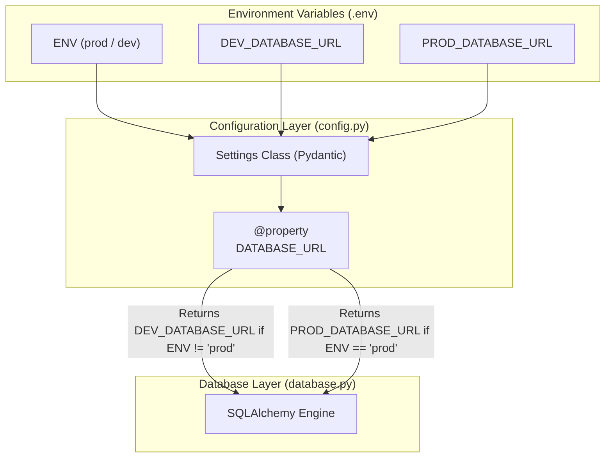

화장품 성분 분석 서비스인 **PickSafe**를 개발하면서, 초기 프로토타입 단계에서는 빠른 기능 구현에 집중하느라 단일 데이터베이스 연결 설정을 사용하고 있었습니다. 로컬 개발 환경과 배포 환경 모두에서 하나의 데이터베이스 설정을 공유하거나, 배포 시점에 환경 변수를 수동으로 변경하는 방식을 취하곤 했습니다.

그러나 서비스가 점차 구체화되고 실제 운영 데이터베이스를 준비하는 과정에서, 이러한 방식은 심각한 운영 리스크와 비효율을 초래한다는 것을 깨달았습니다. 안정적인 서비스를 제공하기 위해 가장 먼저 선행되어야 할 작업은 **개발(DEV)과 운영(PROD) 데이터베이스 환경의 철저한 격리**였습니다. 

이번 글에서는 단일 데이터베이스 설정의 한계를 어떻게 극복하고, 코드의 결합도를 낮추면서 안전하게 환경을 분리했는지 그 고민과 해결 과정을 담백하게 기록해 보고자 합니다.

---

## 🎯 마주한 고민과 문제 배경

초기에는 하나의 데이터베이스 환경 변수(`DATABASE_URL`)에만 의존하여 작업을 진행했습니다. 하지만 서비스 오픈을 준비하면서 다음과 같은 세 가지 현실적인 문제에 직면했습니다.

1. **데이터 오염 및 유실 위험 (Environment Isolation)**
   로컬에서 테스트 코드를 실행하거나 더미 데이터를 적재할 때, 실수로 운영 데이터베이스에 연결되어 있다면 실제 사용자 데이터가 훼손되거나 테스트 데이터와 뒤섞이는 대형 사고가 발생할 수 있습니다. 시스템적으로 이 둘을 완전히 격리해야만 했습니다.

2. **인프라 리소스의 한계 대응 (Neon Postgres 제약)**
   PickSafe는 서버리스 PostgreSQL 서비스인 Neon Postgres를 활용하고 있습니다. 무료 티어 특성상 스토리지 용량과 동시 커넥션 수, 연산량에 엄격한 제한이 있습니다. 개발 과정에서 발생하는 빈번한 쿼리 테스트와 마이그레이션 시도가 운영 환경의 리소스 할당량에 영향을 주지 않도록 물리적/논리적 분리가 필수적이었습니다.

3. **휴먼 에러 유발 가능성**
   배포할 때마다 매번 수동으로 환경 변수 파일을 수정하거나 연결 정보를 교체하는 방식은 언젠가 반드시 실수를 유발합니다. 빌드 및 런타임 시점에 주입되는 환경 변수(`ENV`) 값 하나만으로 시스템이 알아서 안전한 대상을 가리키도록 자동화해야 했습니다.

---

## ⚖️ 기술적 대안 비교 및 선택 이유

이 문제를 해결하기 위해 세 가지 접근 방식을 검토했습니다.

| 대안 | 장점 | 단점 | 선택 여부 |
| :--- | :--- | :--- | :--- |
| **1. 수동 환경 변수 스와핑**<br>(배포 시 `.env` 파일 직접 수정) | 설정이 매우 단순함. | 배포 시 실수가 발생할 확률이 매우 높음. 자동화 파이프라인에 부적합. | **탈락** |
| **2. 다중 설정 파일 구조**<br>(`config_dev.py`, `config_prod.py` 분리) | 각 환경별 설정이 완전히 독립된 파일로 관리되어 직관적임. | 공통 설정 항목의 중복이 발생하고, 환경이 추가될 때마다 관리 포인트가 늘어남. | **탈락** |
| **3. 동적 프로퍼티 기반 분기**<br>(단일 `Settings` 클래스 내 동적 처리) | 단일 진입점(`settings.DATABASE_URL`)을 유지하여 의존성을 낮추고, `ENV` 변수에 따라 동적으로 연결 문자열을 반환함. | 설정 클래스 내부에 약간의 조건문 로직이 포함됨. | **최종 선택** |

### 선택 이유
**대안 3** 방식을 선택한 가장 큰 이유는 **기존 비즈니스 로직 및 DB 커넥션 코드의 수정 최소화**였습니다. 데이터베이스 엔진을 생성하는 `database.py`나 기타 모듈에서는 현재 환경이 개발인지 운영인지 알 필요 없이, 기존처럼 `settings.DATABASE_URL`이라는 단일 인터페이스만 참조하면 되기 때문입니다. 느슨한 결합(Loose Coupling)을 유지하면서도 환경 분리의 안전성을 확보할 수 있는 가장 우아한 방법이라고 판단했습니다.

---

## 🏗️ 시스템 아키텍처 및 흐름

설계한 환경 분리 아키텍처의 데이터 흐름은 다음과 같습니다. 애플리케이션이 구동될 때 시스템 환경 변수(`ENV`)를 읽어와 적절한 데이터베이스 엔드포인트를 동적으로 결정합니다.



---

## 💻 핵심 구현 및 트러블슈팅

구현에는 Python의 대표적인 설정 관리 라이브러리인 `pydantic-settings`를 활용했습니다. 이를 통해 환경 변수의 타입 검증을 수행하고, 안전하게 기본값을 제어할 수 있었습니다.

### 1. `config.py` 구현 (동적 프로퍼티 적용)

다음은 실제 프로젝트에 적용한 설정 클래스의 핵심 구조입니다. 보안을 위해 민감한 접속 정보는 제외하고 추상화된 형태로 구성했습니다.

```python
from typing import Optional
from pydantic_settings import BaseSettings, SettingsConfigDict

class Settings(BaseSettings):
    # 환경 구분 (기본값은 안전을 위해 'dev'로 설정)
    ENV: str = "dev"
    
    # 개발 및 운영 데이터베이스 URL
    DEV_DATABASE_URL: str
    PROD_DATABASE_URL: Optional[str] = None

    model_config = SettingsConfigDict(
        env_file=".env",
        env_file_encoding="utf-8",
        extra="ignore"  # 정의되지 않은 환경 변수는 무시
    )

    @property
    def DATABASE_URL(self) -> str:
        """
        ENV 환경 변수 값에 따라 적절한 데이터베이스 URL을 반환합니다.
        """
        if self.ENV.lower() == "prod":
            if not self.PROD_DATABASE_URL:
                raise ValueError("운영 환경(PROD)이지만 PROD_DATABASE_URL이 설정되지 않았습니다.")
            return self.PROD_DATABASE_URL
        return self.DEV_DATABASE_URL

settings = Settings()
```

### 2. `database.py`에서의 호출 방식

데이터베이스 커넥션을 맺는 모듈에서는 환경 분리 로직을 전혀 신경 쓰지 않고, 오직 `settings.DATABASE_URL`만을 바라봅니다.

```python
from sqlalchemy import create_engine
from sqlalchemy.orm import sessionmaker
from app.config import settings

# 동적으로 결정된 DATABASE_URL을 바탕으로 엔진 생성
engine = create_engine(
    settings.DATABASE_URL,
    pool_pre_ping=True,  # 연결 유효성 검증 옵션
    pool_recycle=300     # 커넥션 유지 시간 설정
)

SessionLocal = sessionmaker(autocommit=False, autoflush=False, bind=engine)
```

### 🛠️ 트러블슈팅: 로컬 개발 환경에서의 유효성 검증 예외

초기 구현 시, `PROD_DATABASE_URL` 필드를 필수 값(`str`)으로 선언해 두었더니 로컬 개발 환경에서 문제가 발생했습니다. 로컬 `.env` 파일에는 굳이 운영계 DB 주소를 적어두지 않았는데, Pydantic이 초기화 과정에서 `PROD_DATABASE_URL` 누락을 이유로 유효성 검증 에러(`ValidationError`)를 뱉으며 애플리케이션 실행을 거부한 것입니다.

*   **해결 방법**: `PROD_DATABASE_URL`을 `Optional[str] = None`으로 선언하여 로컬 개발 시에는 이 값이 없어도 에러가 나지 않도록 조정했습니다. 대신, 실제 운영 서버가 뜰 때(`ENV="prod"`) 해당 값이 누락되어 있다면 `@property` 내부에서 명시적인 `ValueError`를 발생시켜 잘못된 연결로 구동되는 상황을 런타임 진입 단계에서 즉시 차단하도록 안전장치를 마련했습니다.

---

## 💡 돌아보며 배운 점 (회고)

이번 작업을 거치면서 인프라와 코드가 만나는 지점을 어떻게 격리하고 설계해야 하는지에 대해 깊이 고민할 수 있었습니다.

*   **심리적 안정감 확보**: 이제 로컬에서 테스트 쿼리를 날리거나 DB 마이그레이션 스크립트를 실행할 때, "혹시 상용 DB에 반영되는 것 아닌가?" 하는 불안감이 완벽히 사라졌습니다. 개발자는 안심하고 코딩할 수 있는 환경이 조성되어야 생산성이 올라간다는 것을 다시금 체감했습니다.
*   **결합도 완화의 가치**: 데이터베이스 연결을 담당하는 `database.py`가 구체적인 환경 분기 로직을 알지 못하도록 설계한 덕분에, 추후 테스트 환경(STAGE)이나 QA 환경이 추가되더라도 `config.py` 내부의 프로퍼티 로직만 확장하면 됩니다. 인터페이스를 단순하게 유지하는 것이 유지보수에 얼마나 큰 이점을 주는지 배웠습니다.
*   **향후 과제**: 현재는 단일 서버 환경에서의 데이터베이스 분리에 초점을 맞추었지만, 추후 트래픽이 증가하고 마이그레이션 자동화(Alembic)를 고도화할 때 각 환경별 마이그레이션 이력을 정교하게 추적하고 검증하는 파이프라인 구축을 추가로 고민해 볼 계획입니다.