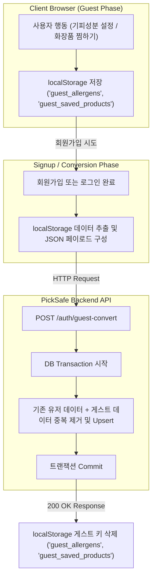

화장품 성분 분석 서비스 PickSafe를 개발하며 서비스 초기 진입 장벽을 낮추기 위한 게스트 모드(Guest Mode) 데이터 처리 아키텍처를 고민했습니다. 이번 글에서는 가입 없는 즉시 체험 경험을 제공하는 과정에서 마주한 기술적 고민, 서버 데이터베이스 오버헤드를 줄이기 위해 **클라이언트 로컬 스토리지(`localStorage`)**를 활용한 이유, 그리고 정식 회원가입 시 데이터를 유실 없이 병합하는 데이터 전이 파이프라인 구축 과정을 담담하게 정리해 봅니다.

---

## 🎯 마주한 고민과 문제 배경

화장품 성분 분석 서비스의 특성상, 성분 카메라 스캔이나 성분 진단 기능을 이용하려는 사용자는 첫 방문 시점에 즉각적인 결과를 얻길 원합니다. 이 타이밍에 소셜 로그인이나 이메일 가입 폼을 강제하면 상당수의 사용자가 이탈하게 됩니다.

초기 진입 허들을 낮추기 위해 **로그인 없이 즉시 서비스를 이용할 수 있는 '게스트 모드'** 도입을 결정했습니다. 하지만 사용자별 '기피 성분 설정'이나 '찜한 화장품 목록' 같은 개인화 데이터는 방문 중 지속해서 유지되어야 했습니다.

이 기능을 구현할 때 처음 떠올린 방식은 **서버 측 임시 회원(Anonymous User) 계정 생성**이었습니다. 세션 쿠키를 발급하고 서버 DB에 임시 UUID 사용자를 생성해 데이터를 기록하는 구조였습니다.

그러나 이 방식은 다음과 같은 명확한 문제점들을 안고 있었습니다.

1. **DB 가비지 데이터 누적**: 단순 일회성 탐색 후 재방문하지 않는 수많은 비회원 데이터가 DB 테이블을 차지합니다.
2. **커넥션 및 Write IOPS 낭비**: 비회원의 유입 시마다 단순 설정 저장을 위해 서버 데이터베이스 IOPS가 소비됩니다.
3. **만료 데이터 정기 삭제 배치 부담**: 주기적으로 유효기간이 지난 임시 데이터를 정리(Cleanup)하는 스케줄링 로직을 추가로 관리해야 합니다.

결국 **"서버 자원을 소모하지 않으면서 비회원 데이터를 유지하고, 회원가입 시점에 매끄럽게 서버로 통합할 수 없는가?"**라는 질문으로 이어졌습니다.

---

## ⚖️ 기술적 대안 비교 및 선택 이유

비회원 데이터를 저장하고 관리하기 위한 세 가지 기술 대안을 검토했습니다.

| 항목 | 대안 A: 서버 측 임시 사용자 (DB 저장) | 대안 B: 쿠키 (Cookie) 저장 | 대안 C: 로컬 스토리지 + 회원가입 시 API 전이 |
| :--- | :--- | :--- | :--- |
| **저장 위치** | 서버 DB | 클라이언트 브라우저 (HTTP Header) | 클라이언트 브라우저 (`localStorage`) |
| **서버 부하** | 높음 (Write IOPS 및 주기적 삭제 작업) | 낮음 (네트워크 오버헤드 존재) | **없음 (회원가입 전까지 서버 통신 없음)** |
| **저장 용량** | 제한 없음 | 4KB 제한 (데이터 확장에 불리) | **최대 5MB~10MB (충분한 공간)** |
| **구현 복잡도** | 중 (서버 Cleanup 로직 필요) | 하 | **중 (회원가입 시 데이터 병합 API 개발 필요)** |
| **데이터 안정성**| 높음 | 브라우저 설정에 따라 손실 가능 | 브라우저 캐시 삭제 시 손실 가능 |

### 최종 선택: 대안 C (로컬 스토리지 + `/auth/guest-convert` 데이터 전이)

비회원 상태에서의 데이터 손실 위험(브라우저 캐시 청소 등)은 사용자에게 "가입 시 데이터가 안전하게 보존됩니다"라는 안내 UX로 보완할 수 있다고 판단했습니다. 

반면, 불필요한 서버 쓰기 작업을 전면 차단하고 데이터베이스 커넥션을 보존할 수 있다는 엔지니어링적 이점이 훨씬 컸습니다. 따라서 클라이언트의 `localStorage`에 데이터를 적재하고, 가입 폼 제출 또는 로그인 성공 직후 `/auth/guest-convert` API를 통해 서버 데이터베이스로 일괄 전송·병합(Merge)하는 방식을 선택했습니다.

---

## 🏗️ 시스템 아키텍처 및 흐름

전체적인 게스트 데이터의 생애주기(Lifecycle)와 가입 전환 시의 동기화 흐름을 시각화한 아키텍처입니다.



---

## 💻 핵심 구현 및 트러블슈팅

### 1. 프론트엔드: 데이터 수집 및 전송 함수 (`auth.js`)

회원가입 시점에 `localStorage`에 남아 있는 게스트 데이터를 읽어와 API 요청 바디에 포함시키는 구조로 작성했습니다.

```javascript
// static/js/auth.js

/**
 * 로컬 스토리지의 게스트 데이터를 읽어와 서버 동기화 페이로드를 생성합니다.
 */
function getGuestDataPayload() {
    const guestAllergens = JSON.parse(localStorage.getItem('guest_allergens') || '[]');
    const guestSavedProducts = JSON.parse(localStorage.getItem('guest_saved_products') || '[]');

    return {
        guest_allergens: guestAllergens,
        guest_saved_products: guestSavedProducts
    };
}

/**
 * 회원가입 성공 후 게스트 데이터를 서버로 이관합니다.
 */
async function convertGuestData(accessToken) {
    const payload = getGuestDataPayload();

    // 이관할 데이터가 없으면 실행하지 않음
    if (payload.guest_allergens.length === 0 && payload.guest_saved_products.length === 0) {
        return;
    }

    try {
        const response = await fetch('/auth/guest-convert', {
            method: 'POST',
            headers: {
                'Content-Type': 'application/json',
                'Authorization': `Bearer ${accessToken}`
            },
            body: JSON.stringify(payload)
        });

        if (response.ok) {
            // 이관 성공 시 로컬 스토리지 정리
            localStorage.removeItem('guest_allergens');
            localStorage.removeItem('guest_saved_products');
        } else {
            console.warn('게스트 데이터 동기화 실패:', response.statusText);
        }
    } catch (error) {
        console.error('게스트 데이터 전송 중 네트워크 오류 발생:', error);
    }
}
```

### 2. 백엔드: 중복 방지 데이터 병합 트랜잭션 (Python/FastAPI)

이관 처리 시 핵심은 **중복 데이터 처리(Idempotency)**였습니다. 기존에 이미 가입된 계정으로 로그인하면서 게스트 데이터를 병합하는 경우, 동일한 기피 성분 ID나 이미 찜한 화장품 ID가 중복 입력되어 `UniqueConstraint` 예외를 발생시킬 위험이 있었습니다.

```python
# app/routers/auth.py
from fastapi import APIRouter, Depends, HTTPException, status
from sqlalchemy.orm import Session
from app.database import get_db
from app.models import User, UserAllergen, SavedProduct
from app.schemas import GuestConvertRequest

router = APIRouter(prefix="/auth", tags=["Auth"])

@router.post("/guest-convert", status_code=status.HTTP_200_OK)
def convert_guest_data(
    payload: GuestConvertRequest,
    current_user: User = Depends(get_current_user),
    db: Session = Depends(get_db)
):
    try:
        # 1. 기피 성분 병합 (중복 제외)
        existing_allergen_ids = {
            a.ingredient_id for a in db.query(UserAllergen.ingredient_id)
            .filter(UserAllergen.user_id == current_user.id).all()
        }
        
        new_allergens = [
            UserAllergen(user_id=current_user.id, ingredient_id=ing_id)
            for ing_id in set(payload.guest_allergens)
            if ing_id not in existing_allergen_ids
        ]
        db.add_all(new_allergens)

        # 2. 찜한 화장품 병합 (중복 제외)
        existing_product_ids = {
            p.product_id for p in db.query(SavedProduct.product_id)
            .filter(SavedProduct.user_id == current_user.id).all()
        }
        
        new_saved_products = [
            SavedProduct(user_id=current_user.id, product_id=prod_id)
            for prod_id in set(payload.guest_saved_products)
            if prod_id not in existing_product_ids
        ]
        db.add_all(new_saved_products)

        db.commit()
        return {"message": "게스트 데이터가 성공적으로 이관되었습니다."}

    except Exception as e:
        db.rollback()
        raise HTTPException(
            status_code=status.HTTP_500_INTERNAL_SERVER_ERROR,
            detail="데이터 이관 중 오류가 발생했습니다."
        )
```

### 🛠️ 트러블슈팅: 이관 실패 시 데이터 유실 문제

구현 초기에는 회원가입 API 호출 성공 시 즉시 `localStorage.clear()`를 수행했습니다. 하지만 회원가입은 성공했으나 network instability로 인해 `/auth/guest-convert` API 호출이 실패할 경우, 사용자가 게스트 상태에서 설정한 기피 성분 정보가 날아가는 문제가 있었습니다.

**해결 방안:**
1. 데이터 이관 API의 응답(`response.ok`)을 명확히 확인한 후 성공시에만 해당 키(`guest_allergens`, `guest_saved_products`)를 삭제하도록 로직을 세분화했습니다.
2. 만약 이관 API 호출이 실패하더라도 로컬 스토리지에 데이터가 유지되어, 사용자가 마이페이지 진입 시 재동기화를 시도할 수 있도록 프론트엔드 예외 처리를 정교화했습니다.

---

## 💡 돌아보며 배운 점 (회고)

이번 게스트 모드 데이터 구조 설계와 이관 파이프라인 구축을 통해 얻은 기술적 레슨은 다음과 같습니다.

1. **클라이언트 자원의 적극적 활용과 서버 비용 최적화**
   모든 데이터를 서버 DB에 저장을 시도하는 것은 비효율적입니다. 일회성 유저의 데이터는 클라이언트 브라우저 스토리지에 위임하고, 의미 있는 시점(회원가입)에만 서버 상태로 승격시키는 구조를 통해 DB 쓰기 부하와 가비지 데이터 청소 스케줄러의 필요성을 완전히 제거할 수 있었습니다.

2. **데이터 이관 시 예외 상황과 멱등성(Idempotency)의 중요성**
   네트워크 오류로 인한 전이 실패 상황이나, 이미 가입된 계정으로의 데이터 병합 시 발생할 수 있는 DB Unique 제약 조건 위반 문제 등을 고려하며 **백엔드 트랜잭션의 멱등성**을 확보하는 것이 얼마나 중요한지 다시금 깨달았습니다.

3. **향후 보완할 점**
   현재 구조는 단일 브라우저 내에서의 게스트 데이터 유지에는 완벽히 동작합니다. 다만 사용자가 모바일 브라우저로 탐색하다가 데스크톱 브라우저로 가입하는 '이종 기기' 간 게스트 데이터 전환은 불가능하다는 한계가 있습니다. 향후에는 수동 코드를 입력받아 이관하거나 세션 링크를 발급하는 방식을 선택적으로 보완해볼 계획입니다.

설계 단계에서의 작은 아키텍처적 선택이 서버 운영 비용과 데이터베이스의 정갈함에 얼마나 큰 영향을 미치는지 경험할 수 있었던 담백하고 의미 있는 작업이었습니다.