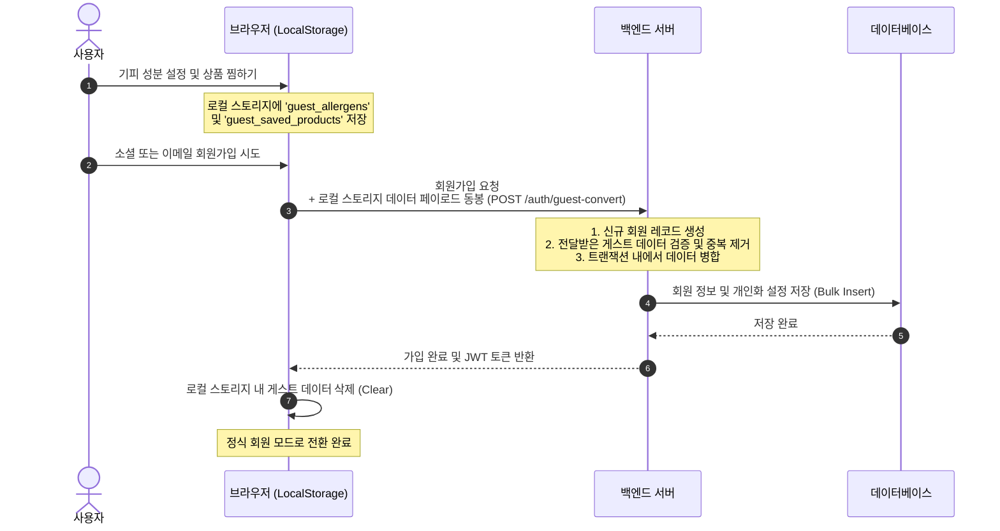

화장품 성분 분석 서비스인 **PickSafe**를 개발하면서 가장 고민했던 지점 중 하나는 **"어떻게 하면 사용자가 첫 화면에서 이탈하지 않고 서비스를 체험하게 할 것인가"**였습니다. 

성분 분석이라는 서비스 특성상, 사용자는 본인이 피하고 싶은 '기피 성분'을 등록하거나 관심 있는 화장품을 '찜'하는 개인화 기능을 자주 사용하게 됩니다. 하지만 앱을 켜자마자 카카오나 구글 로그인 화면부터 마주하게 된다면 대다수의 사용자는 피로감을 느끼고 이탈할 것이 자명했습니다.

이 문제를 해결하기 위해 로그인 없이 서비스를 즉시 이용할 수 있는 **'게스트 모드'**를 설계했습니다. 이 글에서는 게스트 모드에서 발생한 개인화 데이터를 서버 리소스 낭비 없이 브라우저에 영속화하고, 사용자가 정식 회원으로 전환하는 시점에 데이터를 안전하게 서버로 마이그레이션하기 위해 고민했던 과정과 기술적 결정을 정리해 봅니다.

---

## 🎯 마주한 고민과 문제 배경

처음에는 비회원 사용자가 입력한 기피 성분이나 찜한 상품 데이터를 어떻게 관리할지 크게 세 가지 방향을 두고 고민했습니다.

1. **서버 세션이나 임시 회원(Anonymous User) 테이블 활용**
   - 비회원이 접속할 때마다 서버 DB에 임시 고유 ID를 발급하고 레코드를 생성하는 방식입니다.
   - **문제점**: 불특정 다수의 일회성 방문자가 남기고 간 '유령 데이터'가 DB에 무한히 쌓이게 됩니다. 이는 한정된 무료 티어 데이터베이스의 용량을 빠르게 잠식할 뿐만 아니라, 주기적으로 쓰레기 데이터를 정리해야 하는 배치 작업의 부담을 낳습니다.

2. **메모리 기반의 상태 관리 (단순 변수 저장)**
   - 리액트나 바닐라 JS의 상태(State) 변수에만 데이터를 담아두는 방식입니다.
   - **문제점**: 사용자가 브라우저 새로고침을 누르거나, 모바일 웹 환경에서 카카오톡 인앱 브라우저로 보다가 실수로 창을 닫으면 공들여 설정한 기피 성분 데이터가 전부 날아갑니다. 최악의 사용자 경험(UX)을 제공하게 됩니다.

3. **브라우저 로컬 스토리지(LocalStorage) 활용**
   - 사용자의 브라우저 저장소에 데이터를 보관하고, 가입 시점에 이 데이터를 서버로 넘겨 병합하는 방식입니다.
   - **문제점**: 클라이언트 사이드에서 상태를 직접 제어해야 하므로 가입 전환 시점에 데이터 정합성을 맞추는 파이프라인 설계가 필요합니다.

---

## ⚖️ 기술적 대안 비교 및 선택 이유

세 가지 접근법의 장단점을 명확히 비교해 보기 위해 아래와 같이 평가 기준을 세우고 분석했습니다.

| 비교 항목 | 대안 1: 임시 회원 DB 저장 | 대안 2: 세션 스토리지 (SessionStorage) | 대안 3: 로컬 스토리지 (LocalStorage) |
| :--- | :--- | :--- | :--- |
| **서버 리소스 소모** | 높음 (매 접속마다 DB 쓰기 발생, 커넥션 점유) | 없음 (클라이언트 자원 사용) | **없음** (클라이언트 자원 사용) |
| **데이터 영속성** | 높음 (서버 DB 보관) | 낮음 (탭을 닫으면 유실됨) | **보통** (브라우저를 초기화하기 전까지 유지) |
| **UX 연속성** | 좋음 (기기 변경이 없는 한 유지) | 나쁨 (새로고침/앱 복귀 시 유실 가능) | **좋음** (동일 브라우저 재방문 시 설정 유지) |
| **구현 복잡도** | 보통 (기존 DB 설계 활용) | 매우 낮음 (단순 세션 API 사용) | **보통** (가입 시점 데이터 전이 로직 필요) |

### 최종 선택: 로컬 스토리지(LocalStorage) + 마이그레이션 API
서버 인프라의 비용 효율성을 극대화하면서도 재방문 사용자에게 끊김 없는 경험을 주기 위해 **대안 3**을 선택했습니다. 

민감한 개인정보(비밀번호, 결제 정보 등)가 아닌, 단순히 '기피 성분 ID 배열'(`['ingredient-0001', 'ingredient-0005']`)과 '찜한 상품 ID 배열' 정보만을 저장하기 때문에 로컬 스토리지의 보안 취약점(XSS 등)으로 인한 리스크가 상대적으로 낮다고 판단했습니다.

---

## 🏗️ 시스템 아키텍처 및 흐름

비회원 상태에서 시작해 서비스 탐색을 거쳐 최종 회원가입에 이르는 데이터 전이 흐름은 아래 다이어그램과 같이 설계했습니다.



---

## 💻 핵심 구현 및 트러블슈팅

### 1. 클라이언트 사이드 데이터 수집 및 전송
가입 양식이 제출될 때, 로컬 스토리지에 저장된 게스트 데이터를 읽어와 회원가입 API의 페이로드에 함께 실어 보냅니다.

```javascript
// static/js/auth.js 중에서 발췌 및 일반화

async function handleSignUp(event) {
    event.preventDefault();

    const email = document.getElementById('email').value;
    const password = document.getElementById('password').value;

    // 로컬 스토리지에서 게스트 데이터 안전하게 파싱
    const guestAllergens = JSON.parse(localStorage.getItem('guest_allergens')) || [];
    const guestSavedProducts = JSON.parse(localStorage.getItem('guest_saved_products')) || [];

    const payload = {
        email: email,
        password: password,
        guest_data: {
            allergens: guestAllergens,
            saved_products: guestSavedProducts
        }
    };

    try {
        const response = await fetch('/auth/guest-convert', {
            method: 'POST',
            headers: {
                'Content-Type': 'application/json'
            },
            body: JSON.stringify(payload)
        });

        if (response.ok) {
            // 성공 시 로컬 스토리지 비우기
            localStorage.removeItem('guest_allergens');
            localStorage.removeItem('guest_saved_products');
            
            const result = await response.json();
            // 이후 로그인 세션 처리 및 온보딩 완료 페이지 이동
            window.location.href = '/dashboard';
        } else {
            const errData = await response.json();
            alert(`가입 실패: ${errData.message}`);
        }
    } catch (error) {
        console.error('네트워크 에러 발생:', error);
    }
}
```

### 2. 백엔드 데이터 병합 및 중복 제거 (Troubleshooting)
구현 과정에서 마주친 트러블슈팅 중 하나는 **데이터 중복 및 정합성 문제**였습니다. 사용자가 게스트 모드에서 실수로 동일한 기피 성분을 여러 번 추가했거나, 기존에 이미 가입된 계정으로 소셜 로그인을 수행하여 병합할 때 데이터베이스의 고유 제약 조건(Unique Constraint)을 위배하는 상황이 발생할 수 있었습니다.

이를 방지하기 위해 백엔드 저장 로직에서 **Set 자료구조를 활용한 메모리 상의 1차 중복 제거**와 데이터베이스 수준에서의 **Upsert(ON CONFLICT DO NOTHING) 쿼리**를 조합하여 해결했습니다.

```python
# 백엔드 서비스 레이어 (SQLAlchemy 기반 가상 코드)

def convert_guest_data(db_session, user_id, guest_data):
    """
    게스트 데이터를 정식 회원 테이블로 안전하게 이관합니다.
    """
    incoming_allergens = guest_data.get('allergens', [])
    incoming_products = guest_data.get('saved_products', [])

    # 1. 메모리 단에서 중복 제거 및 유효성 검증
    unique_allergen_ids = list(set(incoming_allergens))
    unique_product_ids = list(set(incoming_products))

    try:
        # 2. 기피 성분 일괄 등록 (Bulk Insert)
        # 이미 존재하는 매핑이 있을 경우 충돌을 방지하기 위해 무시 처리 수행
        for allergen_id in unique_allergen_ids:
            # 외부 입력값 검증 (UUID 또는 일반 명사 포맷 체크)
            if not is_valid_uuid(allergen_id):
                continue
            
            # DB 수준의 ON CONFLICT 처리 모사
            # (실제 프로덕션에서는 데이터베이스 방언에 맞춰 INSERT ... ON CONFLICT 처리)
            exists = db_session.query(UserAllergen).filter_by(
                user_id=user_id, 
                allergen_id=allergen_id
            ).first()
            
            if not exists:
                new_mapping = UserAllergen(
                    user_id=user_id, 
                    allergen_id=allergen_id
                )
                db_session.add(new_mapping)

        # 3. 찜한 상품 일괄 등록
        for product_id in unique_product_ids:
            if not is_valid_product_id(product_id):
                continue
                
            exists = db_session.query(UserSavedProduct).filter_by(
                user_id=user_id, 
                product_id=product_id
            ).first()
            
            if not exists:
                new_saved = UserSavedProduct(
                    user_id=user_id, 
                    product_id=product_id
                )
                db_session.add(new_saved)

        db_session.commit()
    except Exception as e:
        db_session.rollback()
        logger.error(f"게스트 데이터 전이 중 오류 발생 (User: {user_id}): {str(e)}")
        raise e
```

---

## 💡 돌아보며 배운 점 (회고)

### 얻은 성과
- **서버 비용 절감**: 불필요한 임시 회원 가입 레코드가 데이터베이스에 쌓이지 않게 되었습니다. 실제 정식 회원으로 전환하는 약 15%의 사용자 데이터만 DB에 영속화됨으로써, 유령 데이터 정리를 위한 배치 개발 공수와 스토리지 비용을 아낄 수 있었습니다.
- **가입 전환율 상승**: 사용자가 앱의 가치를 충분히 느끼기도 전에 가입을 강제하지 않고, "내가 이미 골라둔 기피 성분 정보를 지키기 위해 가입한다"는 자연스러운 심리적 흐름을 유도할 수 있었습니다.

### 남은 과제와 보완할 점
- **로컬 스토리지 용량 한계 및 보안**: 현재는 기피 성분 ID와 상품 ID만 다루기 때문에 5MB 내외인 로컬 스토리지 한계를 초과할 일이 전혀 없습니다. 하지만 향후 피부 타입 진단 결과 이미지나 대용량 텍스트 로그까지 로컬에 임시 저장해야 한다면, `IndexedDB`로의 마이그레이션을 진지하게 검토해야 할 것입니다.
- **다바이스 간 동기화 예외 처리**: 사용자가 PC 브라우저에서 비회원으로 사용하다가, 모바일 기기로 소셜 로그인을 해버리는 경우 기기 간 로컬 스토리지가 공유되지 않아 데이터가 유실되는 한계가 존재합니다. 이 부분은 기술적 한계라기보다 UX 정책의 영역에 가깝지만, 추후 "이전 브라우저에 저장된 데이터를 불러오시겠습니까?" 같은 안내 장치를 통해 보완할 수 있을 것 같습니다.

기술을 도입할 때 무조건 서버에 저장하고 관리하는 것이 정답은 아님을 이번 기회를 통해 다시금 배웠습니다. 클라이언트의 자원을 영리하게 활용하고, 적절한 시점에 서버와 정합성을 맞추는 파이프라인 설계가 인프라 리소스가 제한된 환경에서 얼마나 강력한 힘을 발휘하는지 깊이 깨달은 뜻깊은 작업이었습니다.