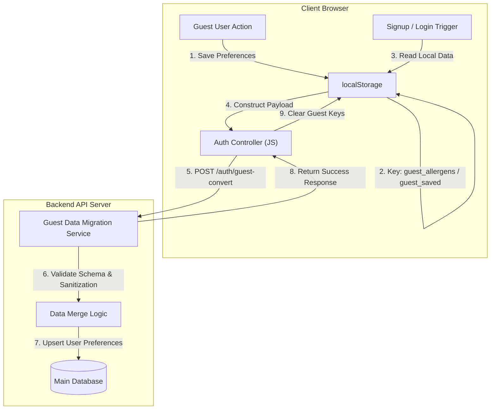

화장품 성분 분석 서비스인 PickSafe를 개발하면서 가장 크게 신경 쓴 지점 중 하나는 **"유저가 앱을 처음 접했을 때의 진입 장벽을 어디까지 낮출 것인가"**였습니다.

성분 분석이나 스캔 기능을 이용하기 위해 처음 방문한 유저에게 즉시 회원가입이나 소셜 로그인을 요구하면 초기 이탈률이 급격히 높아집니다. 이를 막기 위해 가입 절차 없이 핵심 기능을 즉시 체험할 수 있는 **게스트 모드**를 제공하기로 결정했습니다.

하지만 게스트 모드 도입 과정에서 데이터 관리 방식을 두고 기술적 고민이 생겼습니다. 비회원 유저가 설정한 기피 성분이나 찜해둔 화장품 리스트를 어떻게 관리해야 서버 자원을 아끼면서도, 추후 회원가입 시 데이터 유실 없이 매끄럽게 연결할 수 있을지에 대한 문제였습니다.

---

## 🎯 마주한 고민과 문제 배경

초기 구상에서는 비회원 유저가 접속하는 즉시 백엔드에서 임시 식별자(Anonymous User ID)를 발급하고, 데이터베이스에 게스트 레코드를 생성하여 데이터를 저장하는 방식을 고려했습니다. 하지만 이 방식은 운영 측면에서 다음과 같은 명확한 문제점들을 안고 있었습니다.

1. **데이터베이스 쓰레기 레코드 누적**: 단 한 번 방문하고 이탈하는 불특정 다수의 일회성 유저 데이터가 DB에 지속적으로 적재됩니다. 이를 주기적으로 청소하는 배치 작업(Cron Job)을 별도로 관리해야 하는 운영 부담이 생깁니다.
2. **커넥션 및 트랜잭션 비용 낭비**: 단순한 온보딩 설정이나 찜하기 동작마다 서버 API를 호출하고 DB 트랜잭션을 발생시키는 것은 제한된 인프라 리소스 환경에서 불필요한 부하를 초래합니다.
3. **가입 전환 시의 비효율**: 비회원 데이터와 정식 회원 데이터를 백엔드 내에서 찾아 병합하고 임시 레코드를 삭제하는 과정에서 불필요한 DB 쓰기 작업이 중복으로 발생합니다.

결국 **"가입 전까지는 서버 자원을 일절 소모하지 않고, 가입하는 시점에만 선택적으로 데이터를 서버로 이관할 수 없을까?"**라는 문제 의식에 도달했습니다.

---

## ⚖️ 기술적 대안 비교 및 선택 이유

게스트 유저의 개인화 데이터를 클라이언트 측에서 관리하기 위해 고려한 대안은 크게 세 가지였습니다.

| 구분 | A. 백엔드 임시 세션 (Redis/DB) | B. 클라이언트 Cookie | C. Client localStorage (선택) |
| :--- | :--- | :--- | :--- |
| **저장 위치** | 서버 측 메모리/데이터베이스 | 브라우저 쿠키 | 브라우저 로컬 스토리지 |
| **서버 리소스 사용** | 접속 시마다 세션/DB 자원 소비 | 요청 헤더마다 데이터 동시 전송 (대역폭 소모) | **가입 전환 시 전송 (평소 0바이트)** |
| **저장 용량 제한** | 서버 용량에 비례 | 약 4KB 제한 | **약 5MB (충분한 공간)** |
| **운영 복잡도** | 만료 세션 정기 삭제 로직 필요 | 데이터 크기 제한으로 인한 파싱 복잡성 | **JS 단순 CRUD 및 가입 시 통합 전송** |

### 최종 선택: `localStorage` 기반 파이프라인

`localStorage`를 활용하면 백엔드 리소스를 전혀 사용하지 않고도 유저의 브라우저에 기피 성분 목록이나 찜한 제품 식별자를 영속적으로 보관할 수 있습니다. 

유저가 추후 소셜 가입이나 이메일 회원가입을 진행하는 시점에 로컬 스토리지에 쌓여 있던 페이로드를 단 한 번의 전환 API(`/auth/guest-convert` 형태) 호출로 백엔드에 전달하면, 서버는 이를 검증한 뒤 회원 DB 레코드에 병합(`Merge`)하는 방식을 채택했습니다.

---

## 🏗️ 시스템 아키텍처 및 데이터 흐름

전체 데이터 흐름은 **[게스트 데이터 적재] $\rightarrow$ [회원가입/로그인 발생] $\rightarrow$ [서버 전이 및 동기화] $\rightarrow$ [로컬 스토리지 정동]**의 4단계 라이프사이클로 구성됩니다.



---

## 💻 핵심 구현 및 트러블슈팅

### 1. 클라이언트 측 게스트 데이터 수집 및 이관 요청

클라이언트 JS에서는 비회원 상태일 때 발생하는 이벤트(성분 설정, 찜하기 등)를 감지하여 지정된 로컬 스토리지 키에 JSON 형태로 저장합니다. 이후 회원가입이나 로그인 폼 제출 시 해당 데이터를 수집하여 전환 엔드포인트로 전송합니다.

```javascript
// static/js/auth.js (일부 추출 및 추상화)
const GUEST_STORAGE_KEYS = {
  ALLERGENS: 'guest_allergens',
  SAVED_PRODUCTS: 'guest_saved_products'
};

// 게스트 데이터 추출 함수
function getGuestPayload() {
  const allergens = JSON.parse(localStorage.getItem(GUEST_STORAGE_KEYS.ALLERGENS) || '[]');
  const savedProducts = JSON.parse(localStorage.getItem(GUEST_STORAGE_KEYS.SAVED_PRODUCTS) || '[]');
  
  return {
    allergens: allergens,
    saved_product_ids: savedProducts
  };
}

// 회원가입 성공 후 전환 API 호출
async function syncGuestDataToServer(authToken) {
  const payload = getGuestPayload();
  
  // 전달할 게스트 데이터가 없으면 진행하지 않음
  if (payload.allergens.length === 0 && payload.saved_product_ids.length === 0) {
    return;
  }

  try {
    const response = await fetch('/auth/guest-convert', {
      method: 'POST',
      headers: {
        'Content-Type': 'application/json',
        'Authorization': `Bearer ${authToken}`
      },
      body: JSON.stringify(payload)
    });

    if (response.ok) {
      // 이관 성공 시 로컬 스토리지의 게스트 전용 키 삭제
      localStorage.removeItem(GUEST_STORAGE_KEYS.ALLERGENS);
      localStorage.removeItem(GUEST_STORAGE_KEYS.SAVED_PRODUCTS);
    }
  } catch (error) {
    console.error('Guest data migration failed:', error);
  }
}
```

### 2. 백엔드 데이터 병합(Merge) 및 트러블슈팅

백엔드에서는 클라이언트가 보낸 데이터를 무조건 신뢰해서는 안 됩니다. 데이터 정규화 및 기존 유저 데이터와의 중복 처리를 안전하게 수행해야 합니다.

#### 🚨 마주친 이슈: 중복 데이터 및 데이터 오염 가능성
클라이언트에서 조작된 잘못된 성분 ID나 이미 DB에 존재하는 찜 목록과 중복되는 값이 넘어오는 경우가 발생할 수 있었습니다.

#### 🛠️ 해결 방식: Set 기반 집합 병합 및 스키마 검증
서버 처리 로직에서 전달받은 배열을 Python의 `set` 자료구조로 변환하여 중복을 제거하고, DB에 존재하는 유효한 식별자인지 검증한 후 기존 유저 레코드에 병합(`Upsert`)하도록 구현했습니다.

```python
# 서비스 레이어 전환 처리 예시 (개념적 코드)
from typing import List, Dict, Any

class GuestDataMigrationService:
    def convert_guest_data(self, user_id: str, payload: Dict[str, Any]) -> None:
        incoming_allergens = set(payload.get("allergens", []))
        incoming_products = set(payload.get("saved_product_ids", []))

        # 1. 기존 유저의 설정값 조회
        user_preference = self.user_repo.find_by_id(user_id)

        # 2. 데이터 병합 (중복 원소 자동 제거)
        updated_allergens = set(user_preference.allergens) | incoming_allergens
        updated_products = set(user_preference.saved_products) | incoming_products

        # 3. 유효성 검증 거친 후 단일 트랜잭션으로 저장
        user_preference.allergens = list(updated_allergens)
        user_preference.saved_products = list(updated_products)
        
        self.user_repo.save(user_preference)
```

---

## 💡 돌아보며 배운 점 (회고)

### 얻은 성과
1. **서버 리소스 절감**: 서비스 초기 진입 단계에서 불필요하게 생성될 뻔했던 비회원 임시 DB 레코드 생성을 100% 방지할 수 있었습니다.
2. **이탈률 감소 및 UX 연관성 유지**: 유저는 회원가입 압박 없이 서비스를 충분히 체험할 수 있고, 가입을 결정한 순간 자신이 설정했던 온보딩 데이터와 찜 목록이 그대로 유지되는 매끄러운 경험을 얻었습니다.

### 아쉬운 점과 추후 개선 방향
* **브라우저 변경 시 데이터 분리 문제**: 사용자가 비회원 상태로 모바일 웹 브라우저에서 사용하다가, 회원가입을 PC 브라우저에서 진행하는 경우 모바일 `localStorage` 데이터가 이관되지 않는 한계가 존재합니다.
* **클라이언트 데이터 변조 위험성**: 클라이언트 스토리지에 접근 가능한 스크립트 오염 가능성을 염두에 두고, 백엔드 수신 시점에 데이터 타입 검증 및 수량 제한(Max Limit) 파이프라인을 더욱 견고히 보강할 필요성을 느꼈습니다.

무조건 모든 상태 변화를 서버 DB에 기록하려 하기보다, **데이터의 생명주기와 전환 시점**을 명확히 정의하고 클라이언트 자원을 적절히 배분하는 것이 인프라 효율성과 유저 경험 모두를 챙길 수 있는 현명한 아키텍처적 선택임을 배울 수 있었습니다.