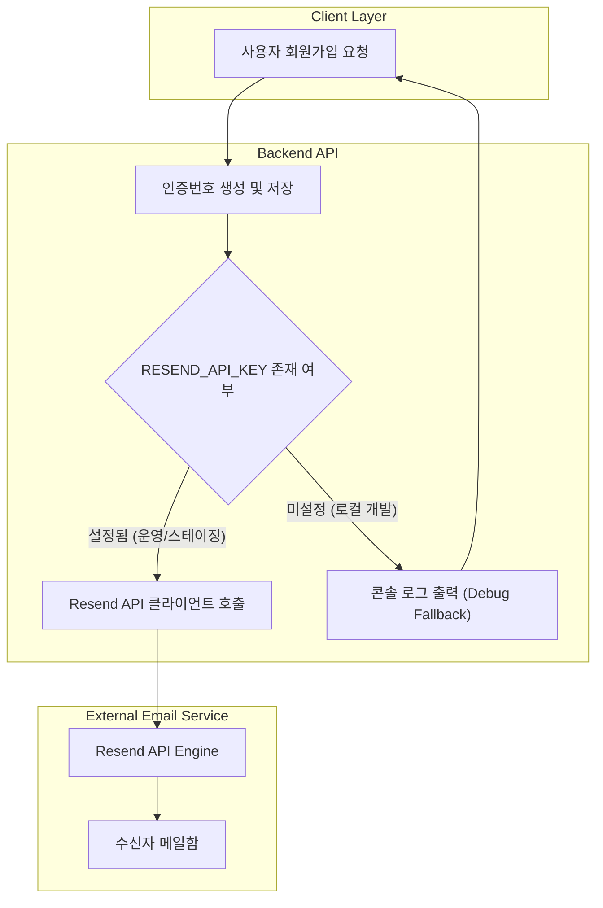

화장품 성분 분석 서비스 PickSafe를 개발하면서 회원가입 흐름 중 가장 기본이 되는 **이메일 인증 시스템**을 구축하게 되었습니다. 초기 개발 단계에서는 구현의 용이함을 위해 일반 Gmail SMTP 방식을 활용했으나, 운영 및 확장 단계로 접어들며 전달률 문제와 보안 리스크가 명확해졌습니다. 

이 글에서는 인증 메일 발송 체계를 **Resend API**로 전환하게 된 배경과 개발 편의성을 향상시키기 위해 적용한 디버깅 폴백(Fallback) 구조에 대해 담담히 기록해 봅니다.

---

## 🎯 마주한 고민과 문제 배경

초기 프로토타입 개발 시에는 개인 혹은 테스트용 구글 계정의 앱 비밀번호를 활용한 **Gmail SMTP** 방식을 사용했습니다. 코드 몇 줄로 빠르게 이메일 발송 기능을 덧붙일 수 있어 단순 검증에는 유용했으나, 점차 서비스 형태를 갖춰가면서 다음과 같은 구조적 한계에 부딪혔습니다.

1. **발신자 평판과 스팸 분류 리스크**
   - Gmail SMTP를 통해 발송되는 메일은 발신 주소가 `@gmail.com` 형태로 제한됩니다. 이로 인해 수신측 메일 서버의 스팸 필터링 기준에 쉽게 걸려 인증 메일이 스팸함으로 들어가거나 발송이 차단되는 현상이 발생했습니다.
2. **계정 보안 관리의 어려움**
   - 구글 계정의 앱 비밀번호를 애플리케이션 환경변수로 관리하는 방식은 해당 구글 계정의 보안 리스크와 직접적으로 연결됩니다. 비밀번호 주기적 순환(Rotation)이나 키 폐기 관리가 번거로워 최소 권한 원칙(Principle of Least Privilege)에 위배되었습니다.
3. **로컬 개발 환경에서의 병목**
   - 로컬 기능 테스트 시 매번 실제로 이메일이 발송되는 구조는 외부 API/SMTP 네트워크 지연을 유발하고, 테스트 계정의 메일함을 매번 확인해야 하는 개발 흐름의 단절을 가져왔습니다.

---

## ⚖️ 기술적 대안 비교 및 선택 이유

메일 발송 체계 개선을 위해 트랜잭션 메일(Transactional Email) 전문 서비스들을 검토했습니다. MVP 단계의 연산 리소스 및 무료 티어 효율성을 함께 고려하여 대안을 비교했습니다.

| 비교 항목 | 기존: Gmail SMTP | 대안 A: AWS SES | 선택: Resend API |
| :--- | :--- | :--- | :--- |
| **발신자 주소 설정** | `@gmail.com` 고정 | 자체 도메인 지원 | 자체 도메인 및 테스트 도메인 지원 |
| **키 보안 및 권한 분리** | 개인 계정 앱 비밀번호 (위험도 높음) | IAM 정책 기반 분리 | 프로젝트/환경별 API Key 발급·폐기 |
| **전달률 및 평판 관리** | 낮음 (스팸함 분류 빈번) | 높음 (자체 DKIM/SPF 설정 필요) | 높음 (기본 설정 용이, 전문 전달 엔진) |
| **초기 연동 난이도** | 매우 쉬움 | 연동 절차 및 Sandbox 해제 필요 | SDK 및 Rest API 지원으로 단순함 |
| **무료 티어 제공량** | 개인 계정 제한 존재 | AWS 인프라 연동 시 유용 | 초기 MVP 요구량을 충분히 수용 |

### 선택 이유
- **Resend API**는 개발자 친화적인 API 규격을 제공하며, 초기 구축 비용이 매우 적습니다.
- 추후 커스텀 도메인 확보 시 간단한 DNS 설정(DKIM/SPF)만으로 `noreply@...` 형태의 전문 발신 주소를 바로 적용할 수 있는 유연성을 제공합니다.
- 우선은 기본 제공되는 테스트 도메인으로 연동을 완료하고, 설정값 분리를 통해 코드 수정 없이 발신 주소를 변경할 수 있도록 아키텍처를 구성하기로 결정했습니다.

---

## 🏗️ 시스템 아키텍처 및 흐름

인증 메일 발송 아키텍처는 운영 환경(Production/Staging)과 로컬 개발 환경(Local Dev)에서의 동작 모드를 다르게 가져가도록 구성했습니다. 

로컬 환경에 API 키가 설정되지 않은 상황에서도 전체 회원가입 개발 및 테스트 흐름이 끊기지 않도록 **디버깅 폴백 모드**를 내장했습니다.



---

## 💻 핵심 구현 및 트러블슈팅

핵심은 **설정 분리**와 **안전한 폴백 처리**입니다. 시스템 내부 API 키 및 도메인 정보는 추상화하여 환경 변수를 통해 주입되도록 설계했습니다.

### 1. 환경 변수 추상화 및 설정
환경 변수 파일에 발신자 주소와 API 키를 정의하여, 코드 내부에 발신자 정보나 자격 증명이 하드코딩되지 않도록 분리했습니다.

```bash
# 이메일 발송 관련 환경 변수 예시
RESEND_API_KEY=re_xxxxxxxxxxxx
EMAIL_FROM_ADDRESS=noreply@domain.com
```

### 2. 발송 서비스 및 디버깅 폴백 구현
아래 코드는 비즈니스 경쟁우위 알고리즘을 제외하고, Resend 연동 및 개발용 폴백 로직의 구조적 개념만을 나타낸 축약 예시입니다.

```python
import os
import logging

logger = logging.getLogger("email_service")

class EmailService:
    def __init__(self):
        self.api_key = os.getenv("RESEND_API_KEY")
        self.from_address = os.getenv("EMAIL_FROM_ADDRESS", "onboarding@resend.dev")

    def send_verification_code(self, to_email: str, code: str) -> bool:
        # API 키가 설정되어 있지 않은 로컬 개발 환경 처리
        if not self.api_key:
            logger.warning("[DEV FALLBACK] RESEND_API_KEY가 설정되지 않았습니다.")
            logger.info(f"[DEV FALLBACK] 수신자: {to_email} | 생성된 인증코드: {code}")
            # 개발 환경에서는 메일 발송을 성공한 것으로 간주하여 테스트를 계속 진행함
            return True

        try:
            # Resend API 연동 메일 발송 (개념적 예시)
            response = self._call_resend_api(
                from_addr=self.from_address,
                to_addr=to_email,
                subject="PickSafe 회원가입 인증번호 안내",
                html_body=f"<p>인증번호: <strong>{code}</strong></p>"
            )
            return response.is_success
        except Exception as e:
            logger.error(f"이메일 발송 실패: {str(e)}")
            return False

    def _call_resend_api(self, from_addr: str, to_addr: str, subject: str, html_body: str):
        # 실제 Resend SDK / HTTP Client 호출부
        pass
```

### 💡 트러블슈팅: 개발 생산성 향상
초기에는 개발 환경에서도 실제 Resend API를 호출하게 하여 테스트 메일을 발송했습니다. 그러나 이로 인해 다음과 같은 세 가지 소소한 문제가 있었습니다.

1. 로컬 환경에서 테스트 시 발송 완료까지 약 1~2초의 API 대기 시간 발생
2. 테스트 도메인 발송 제한(Rate Limit)에 걸릴 위험
3. 메일함을 매번 탭을 전환하여 확인해야 하는 비효율

이를 해결하기 위해 **`RESEND_API_KEY`가 없을 때 동작하는 디버깅 폴백 모드**를 도입했습니다. 로컬 터미널에 인증코드가 직접 출력되도록 조치함으로써, 별도의 외부 통신 없이 즉각적으로 인증번호를 확인하고 프론트엔드 연동 테스트를 이어갈 수 있게 되었습니다.

---

## 💡 돌아보며 배운 점

1. **외부 서비스 의존성 관리의 중요성**
   - 단순한 이메일 발송 기능이라도 SMTP 대신 관리형 API를 사용함으로써 얻는 안정성과 보안적 이점이 컸습니다. 특히 API Key 단위로 권한을 관리하고 쉽게 재발급할 수 있어 운용 안정성이 증대되었습니다.

2. **환경별 디버깅 경험(DX) 개선**
   - 개발 환경에서 외부 API에 매번 직접 의존하지 않도록 폴백 구성을 마련해둔 것이 개발 속도 향상에 큰 도움이 되었습니다. 환경 변수의 유무나 설정값에 따라 유연하게 제어 흐름을 가져가는 구조의 필요성을 재확인했습니다.

3. **향후 보완할 점**
   - 현재는 설정값 분리와 디버깅 폴백에 집중되어 있으나, 추후 정식 도메인 연결 시 DKIM/SPF 레코드를 올바르게 등록하고 수신 거부(Bounce) 이벤트를 웹훅(Webhook)으로 수신하여 가짜 계정 생성을 방지하는 로직을 보완할 계획입니다.