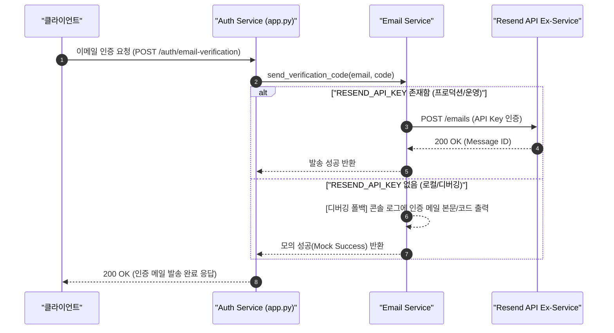

화장품 성분 분석 서비스 PickSafe를 개발하며 회원가입 단계의 이메일 인증 기능을 구현했습니다. 초기에는 익숙하고 별도 서비스 가입이 필요 없는 Gmail SMTP 방식을 활용해 빠르게 기능을 붙였으나, 실제 테스트 및 운영 관점에서 몇 가지 구조적인 한계와 운영 리스크를 마주했습니다. 

이번 글에서는 기존 Gmail SMTP 방식의 문제를 진단하고, 트랜잭션 메일 전용 서비스인 **Resend API**로 전환하면서 고민했던 아키텍처적 선택과 구현 과정을 정리합니다.

---

## 🎯 마주한 고민과 문제 배경

회원가입 흐름에서 이메일 인증은 사용자 경험의 첫 단추이자 서비스 보안의 기본 요소입니다. 그러나 초기에 적용한 Gmail SMTP 연동은 다음과 같은 한계점을 명확히 드러냈습니다.

1. **발신 주소의 신뢰도 및 스팸 분류 문제**  
   Gmail SMTP를 사용하면 발신자 주소가 개인 구글 계정(`xxx@gmail.com`)으로 제한됩니다. 수신자 입장에서는 서비스의 공식 메일로 인식하기 어려우며, 주요 메일 서비스(Gmail, Outlook 등)에서 스팸 메일함으로 자동 분류되는 비율이 높았습니다.
2. **계정 보안 및 접근 권한 노출 리스크**  
   Gmail SMTP 연동을 위해서는 구글 계정의 '앱 비밀번호'를 발급받아 애플리케이션 환경 변수에 저장해야 했습니다. 만에 하나 환경 변수나 설정이 유출될 경우 개인 구글 계정 전체의 보안 위험으로 이어질 수 있어, 전용 API 키 기반의 권한 분리가 필요했습니다.
3. **로컬 개발 환경의 의존성 및 제약**  
   개발/테스트 단계에서 매번 실제 메일을 전송하는 것은 발송 할당량을 소모할 뿐만 아니라, 네트워크 지연으로 인해 로컬 디버깅 속도를 떨어뜨리는 원인이 되었습니다. 개발 환경과 운영 환경에서 메일 발송 로직을 유연하게 분리할 수 있는 구조가 필요했습니다.

---

## ⚖️ 기술적 대안 비교 및 선택 이유

메일 발송 인프라 개선을 위해 **Gmail SMTP**, **AWS SES**, **Resend API** 세 가지 대안을 비교 검토했습니다.

| 검토 항목 | Gmail SMTP | AWS SES | Resend API |
| :--- | :--- | :--- | :--- |
| **발신자 신뢰도** | 낮음 (`@gmail.com` 강제) | 높음 (커스텀 도메인 연동) | 높음 (커스텀 도메인 연동) |
| **보안 및 권한 관리** | 개인 앱 비밀번호 사용 (위험) | IAM Role / Credentials | 서비스 전용 API Key 관리 |
| **연동 편의성** | 단순 (Nodemailer/SMTP) | AWS SDK 설정 및 샌드박스 해제 필요 | 현대적인 REST API 및 간단한 SDK |
| **무료 티어 및 비용** | 일일 제한 존재, 프로덕션 미적합 | 1,000건/월 무료 (비용 저렴) | 3,000건/월 무료 (MVP 적합) |

### 최종 선택: Resend API
- **트랜잭션 메일 특화 및 높은 수신율**: Resend는 스팸 회피율이 높고 도메인 연동(DKIM, SPF 설정)이 매우 간편하여 `noreply@picksafe.com`과 같은 전문 발신 주소를 안정적으로 확보할 수 있습니다.
- **환경 변수 기반의 유연한 도메인 전환**: 초기 개발 및 MVP 단계에서는 테스트 도메인(`onboarding@resend.dev`)을 사용하되, 추후 자체 도메인 확보 시 코드 변경 없이 환경 변수(`EMAIL_FROM_ADDRESS`) 수정만으로 발신 주소를 바꿀 수 있도록 설계했습니다.
- **적절한 무료 티어**: MVP 운영 단계의 초기 트래픽을 충분히 소화할 수 있는 월 3,000건의 무료 발송을 제공합니다.

---

## 🏗️ 시스템 아키텍처 및 흐름

메일 발송 요청 처리 시, 프로덕션 환경의 실제 API 호출과 로컬 개발 환경의 디버깅 폴백(Fallback) 흐름을 분리하여 설계했습니다.



---

## 💻 핵심 구현 및 트러블슈팅

### 1. 환경 변수 설정 분리
`.env` 파일에 API 키와 발신자 주소를 분리하여 정의했습니다.

```env
# Email Configuration
RESEND_API_KEY="re_123456789_your_api_key_here"
EMAIL_FROM_ADDRESS="PickSafe <onboarding@resend.dev>"
```

### 2. 디버깅 폴백 모드가 적용된 이메일 서비스 구현
개발 환경에서 API 키가 설정되지 않았더라도 개발 작업이 중단되지 않도록 **디버깅 폴백 모드(Debugging Fallback Mode)**를 구현했습니다.

```python
import os
import logging
import resend

logger = logging.getLogger(__name__)

class EmailService:
    def __init__(self):
        self.api_key = os.getenv("RESEND_API_KEY")
        self.from_address = os.getenv("EMAIL_FROM_ADDRESS", "onboarding@resend.dev")
        
        if self.api_key:
            resend.api_key = self.api_key

    def send_verification_code(self, to_email: str, code: str) -> bool:
        subject = "[PickSafe] 회원가입 이메일 인증 코드입니다."
        html_content = f"""
        <div style="font-family: Arial, sans-serif; padding: 20px;">
            <h2>PickSafe 이메일 인증</h2>
            <p>아래의 인증 코드를 입력하여 회원가입을 완료해 주세요.</p>
            <h3 style="color: #4CAF50;">{code}</h3>
        </div>
        """

        # 1. API 키가 없는 경우: 디버깅 폴백 모드 동작
        if not self.api_key:
            logger.warning("[FALLBACK MODE] RESEND_API_KEY가 설정되지 않았습니다.")
            logger.info(f"[MOCK EMAIL SENT] To: {to_email} | Code: {code}")
            print(f"\n================ [DEBUG EMAIL] ================")
            print(f"To: {to_email}")
            print(f"Subject: {subject}")
            print(f"Verification Code: {code}")
            print(f"===============================================\n")
            return True

        # 2. API 키가 있는 경우: 실제 Resend API 호출
        try:
            params = {
                "from": self.from_address,
                "to": [to_email],
                "subject": subject,
                "html": html_content,
            }
            response = resend.Emails.send(params)
            logger.info(f"Email successfully sent via Resend. ID: {response.get('id')}")
            return True
        except Exception as e:
            logger.error(f"Failed to send email via Resend: {str(e)}")
            return False
```

### 트러블슈팅: 로컬 개발 생산성 보장
초기 연동 시 API 키를 로컬 환경 변수에 넣지 않은 상태에서 인증 로직을 테스트할 때 예외가 발생하여 전체 회원가입 흐름이 차단되는 현상이 있었습니다. 

이를 해결하기 위해 단순 예외 던지기 대신 `if not self.api_key:` 분기를 두어, 키가 없을 때는 터미널 콘솔에 인증 코드를 명확히 출력하고 성공 결과를 반환하도록 만들었습니다. 덕분에 인터넷 연결이 불안정하거나 API 키를 설정하지 않은 외부 환경에서도 로컬 회원가입 테스트를 막힘없이 진행할 수 있게 되었습니다.

---

## 💡 돌아보며 배운 점 (회고)

단순히 "이메일을 보낸다"는 기능 하나도 운영 안정성, 보안, 개발 편의성이라는 세 가지 축에서 다르게 접근할 수 있음을 배웠습니다.

1. **외부 서비스 의존성 격리의 중요성**  
   구글 개인 계정에 직접 연결되어 있던 기존 방식을 전용 API Key 기반의 백엔드 서비스로 이전하면서, 인프라 보안과 발신 신뢰도를 동시에 확보할 수 있었습니다.
2. **개발 환경(DX)을 고려한 아키텍처 설계**  
   개발 단계에서 외부 API 호출을 강제하면 디버깅 속도가 느려지고 테스트 비용이 발생합니다. 디버깅 폴백 모드를 도입함으로써 외부 서비스 상태와 무관하게 로컬 개발 흐름을 유지할 수 있었습니다.
3. **향후 보완 과제**  
   현재는 기본 테스트 도메인(`onboarding@resend.dev`)을 사용 중이지만, 서비스 오픈 전 커스텀 도메인 DNS 레코드(SPF, DKIM) 설정을 마치고 `noreply@picksafe.com`으로 발신 주소를 최종 전환할 예정입니다. 또한, 필요시 Resend Webhook을 연동하여 메일 수신 거부나 반송(Bounce) 이벤트를 감지하는 로직도 추가 검토하고자 합니다.