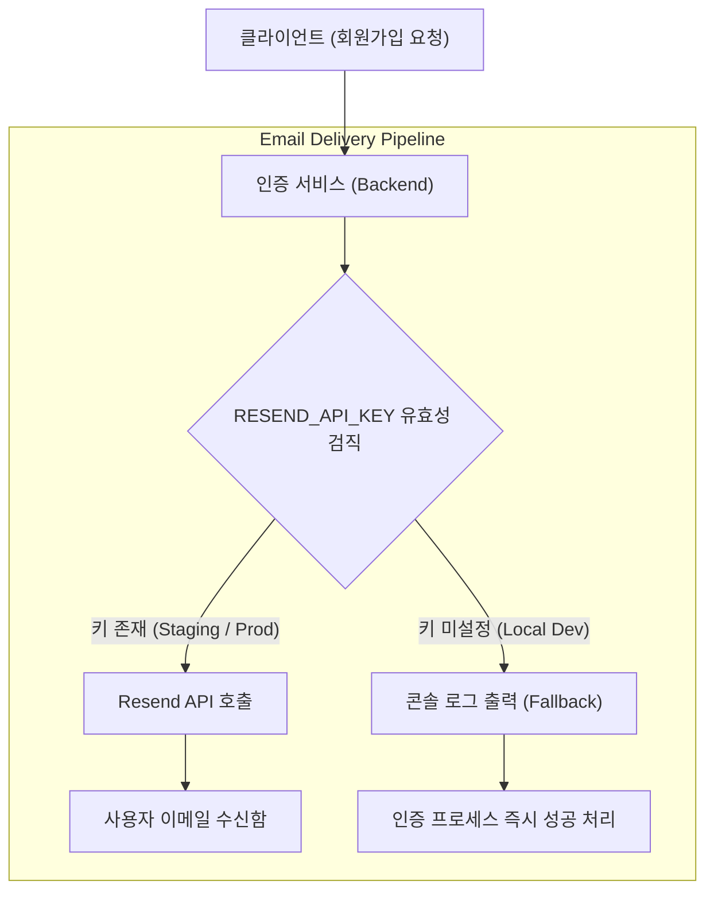

화장품 성분 분석 서비스 **PickSafe**를 개발하며 회원가입 및 사용자 인증 절차의 기반을 마련하던 중, 예상치 못한 도메인 수신율 저하 문제와 개발 환경상의 불편함을 마주했습니다. 

서비스 초기에 가장 쉽고 보편적으로 접근할 수 있는 Gmail SMTP 연동 방식을 사용해 인증 메일 발송을 구현했으나, 실제 테스트를 거치며 메일 서비스의 신뢰성과 계정 보안, 그리고 로컬 개발 환경의 독립성 측면에서 한계가 명확히 드러났습니다.

이 글은 메일 발송 인프라를 **Resend API** 기반으로 전환하고, 개발 편의성을 높이기 위한 **디버깅 폴백(Fallback) 모드**를 도입했던 과정과 엔지니어링 고민을 담담히 기록한 회고입니다.

---

## 🎯 마주한 고민과 문제 배경

초기 구현에서는 단순하게 Gmail 계정의 앱 비밀번호(App Password)를 활용한 SMTP 연결 방식을 사용했습니다. 코드 몇 줄과 설정값만으로 빠르게 메일을 발송할 수 있어 초기 구현에는 적합했지만, 실제 동작 흐름을 검증하면서 세 가지 주요 병목과 리스크를 확인했습니다.

1. **발신자 주소의 신뢰도 및 스팸 분류 문제**  
   Gmail SMTP를 이용하면 메일 발신자가 `@gmail.com` 형태로 지정됩니다. 트랜잭션 메일(인증번호, 비밀번호 재설정 등)이 수신자 측의 메일 서버(Naver, Daum, Kakao 등)로 들어갈 때, 이메일 인증 기술 표준인 **SPF/DKIM 레코드**가 일치하지 않거나 불명확하여 스팸함으로 직행하거나 수신 거부되는 현상이 빈번했습니다.
2. **계정 보안 및 접근 권한 분리의 한계**  
   개인 구글 계정 기반의 앱 비밀번호를 활용하는 방식은 계정 보안 정책 변경 시 메일 서비스 전체가 마비될 위험이 있었습니다. 또한, API 키처럼 세분화된 권한 부여나 발송 로그 모니터링이 불가능하여 운영 관점에서의 안정성이 낮았습니다.
3. **로컬 개발 환경의 외부 서비스 의존성**  
   로컬 개발 환경에서 API 엔드포인트를 테스트할 때마다 실제 외부 메일 서버를 경유하게 되면, 네트워크 지연이 발생할 뿐만 아니라 메일 발송 API의 할당량(Quota)을 불필요하게 소모하게 됩니다. API 키가 설정되지 않은 환경에서 로컬 서버가 동작하지 않거나 에러를 발생시키는 문제도 해결해야 했습니다.

---

## ⚖️ 기술적 대안 비교 및 선택 이유

메일 발송 인프라를 전면 재검토하면서 구글 SMTP의 한계를 극복할 수 있는 전용 API 서비스들을 비교 검토했습니다.

| 항목 | Gmail SMTP (기존) | AWS SES | Resend API (최종 채택) |
| :--- | :--- | :--- | :--- |
| **발신 도메인 연동** | 불가능 (`@gmail.com` 고정) | 가능 (도메인 DNS 설정 필요) | 가능 (`noreply@domain.com`) |
| **설정 복잡도** | 낮음 (계정 정보 입력) | 높음 (샌드박스 해제, IAM 권한) | 낮음 (API Key 기반 HTTP API) |
| **개발자 경험 (DX)** | 표준 라이브러리 사용 | SDK 및 식별 인증 복잡 | 직관적인 SDK / HTTP 요청 |
| **운영 안전성** | 스팸 분류율 높음 | 수신 신뢰도 매우 높음 | 수신 신뢰도 높음, 로그 추적 용이 |
| **무료 티어 수준** | 일일 제약 유동적 | 샌드박스 해제 전 제한적 | MVP 운영에 충분한 한도 제공 |

### 선택 이유: Resend API

AWS SES 역시 뛰어난 신뢰도를 자랑하지만, 서비스 초기 단계에서 AWS 샌드박스 해제 및 IAM 권한 설정을 거치는 과정에 드는 공수가 컸습니다. 

반면 **Resend API**는 다음과 같은 명확한 장점이 있었습니다.

* **직관적인 API 기반 인터페이스:** SMTP 핸드셰이크 프로토콜 Overhead 없이 HTTP REST API 호출만으로 가볍고 빠르게 발송할 수 있습니다.
* **유연한 도메인 전환 설계:** 초기 개발 시에는 Resend가 제공하는 기본 테스트 발신 도메인(`onboarding@resend.dev`)을 사용하여 로직을 빠르게 검증하고, 향후 커스텀 도메인 확보 시 `.env` 환경 변수의 `EMAIL_FROM_ADDRESS` 수정만으로 즉시 발신자 주소를 개편할 수 있도록 유연성을 확보할 수 있습니다.
* **투명한 스팸율 제어:** 도메인 DKIM/SPF 레코드 연동이 용이하여 스팸함 이탈률을 현저히 낮출 수 있습니다.

---

## 🏗️ 시스템 아키텍처 및 메일 발송 흐름

개발 환경(Local)과 운영 환경(Prod)의 독립성을 보장하기 위해, 환경 변수(`RESEND_API_KEY`)의 유무에 따라 **실제 메일 발송**과 **디버깅 폴백 모드**로 분기되는 아키텍처를 구성했습니다.



---

## 💻 핵심 구현 및 트러블슈팅

### 1. 환경 변수 기반의 메일 서비스 모듈화

환경 변수에서 API 키와 발신자 주소를 격리하여 관리하고, 키가 없더라도 로컬 실행이 중단되지 않도록 코드를 구성했습니다.

```python
import os
import logging
import httpx

logger = logging.getLogger("uvicorn")

RESEND_API_KEY = os.getenv("RESEND_API_KEY", "")
EMAIL_FROM_ADDRESS = os.getenv("EMAIL_FROM_ADDRESS", "onboarding@resend.dev")

async def send_verification_email(to_email: str, auth_code: str) -> bool:
    """
    회원가입 인증 메일을 발송하는 코어 함수.
    API 키 미설정 시 디버깅 폴백 모드로 동작합니다.
    """
    # 1. API 키가 설정되지 않은 경우 (Local 개발 환경)
    if not RESEND_API_KEY:
        logger.warning("==================================================")
        logger.warning("[DEBUG FALLBACK] RESEND_API_KEY가 설정되지 않았습니다.")
        logger.warning(f"수신자: {to_email} | 인증코드: {auth_code}")
        logger.warning("==================================================")
        return True

    # 2. Resend API를 이용한 실제 이메일 발송
    url = "https://api.resend.com/emails"
    headers = {
        "Authorization": f"Bearer {RESEND_API_KEY}",
        "Content-Type": "application/json",
    }
    payload = {
        "from": EMAIL_FROM_ADDRESS,
        "to": [to_email],
        "subject": "[PickSafe] 회원가입 이메일 인증 번호입니다.",
        "html": f"<p>PickSafe 인증 번호: <strong>{auth_code}</strong></p>",
    }

    async with httpx.AsyncClient() as client:
        try:
            response = await client.post(url, headers=headers, json=payload, timeout=5.0)
            if response.status_code == 200:
                logger.info(f"인증 메일 발송 성공: {to_email}")
                return True
            else:
                logger.error(f"Resend API 에러 [{response.status_code}]: {response.text}")
                return False
        except Exception as e:
            logger.error(f"메일 발송 중 예외 발생: {str(e)}")
            return False
```

### 2. 구현 트러블슈팅: 개발 환경에서의 API 병목 및 테스트 제약 해결

전환 초기, 로컬 테스트 중에도 API 키를 설정하여 실제 메일을 계속 발송해보았으나 몇 가지 지점이 개발 흐름을 방해했습니다.

* **문제:** 메일이 실제로 수신될 때까지 2~5초가량 대기해야 하므로 로컬 통합 테스트 루프가 느려졌고, 하루 무료 발송 할당량을 소모했습니다.
* **해결:** `RESEND_API_KEY`가 주어지지 않은 상황에서는 **터미널 콘솔 로그에 인증 코드를 명시적으로 출력하고 API 통신 없이 즉시 `True`를 반환하는 폴백 구조**를 명확히 세웠습니다. 덕분에 외부 서비스 의존성 없이 독립적으로 회원가입 흐름을 개발하고 테스트할 수 있게 되었습니다.

---

## 💡 돌아보며 배운 점

1. **외부 서비스 도입 시 폴백(Fallback) 모드의 중요성**  
   외부 API 서비스(Resend)를 도입할 때 단순히 연동에만 집중하는 것이 아니라, "외부 키가 없거나 서비스가 장애일 때 로컬 개발 환경과 빌드 파이프라인이 영향을 받는가?"를 고민하는 계기가 되었습니다. 콘솔 출력 방식의 디버깅 폴백 모드를 작성해 둔 덕분에 개발 속도를 크게 높일 수 있었습니다.

2. **운영 환경과 개발 환경의 설정값 분리(Loose Coupling)**  
   발신자 도메인(`EMAIL_FROM_ADDRESS`)과 접근 키(`RESEND_API_KEY`)를 코드 내 하드코딩이 아닌 환경 변수로 완전히 가머지하여, 추후 커스텀 도메인을 등록하고 라우팅을 변경할 때 코드 수정 없이 배포 환경 설정만 변경하면 되는 구조를 확립했습니다.

3. **엔지니어링의 본질은 도구의 상하가 아닌 맥락에 맞는 선택**  
   AWS SES라는 표준적이고 거대한 도구가 존재함에도 불구하고, 현 시점 PickSafe의 서비스 단계와 빠른 검증 속도, 적은 오버헤드를 종합적으로 고려했을 때 Resend API가 최적의 선택지였습니다.

앞으로도 도메인을 연결하고 서비스를 확장해 나가는 과정에서 발생하는 아키텍처적 고민들을 꾸준히 기록으로 남겨두고자 합니다.