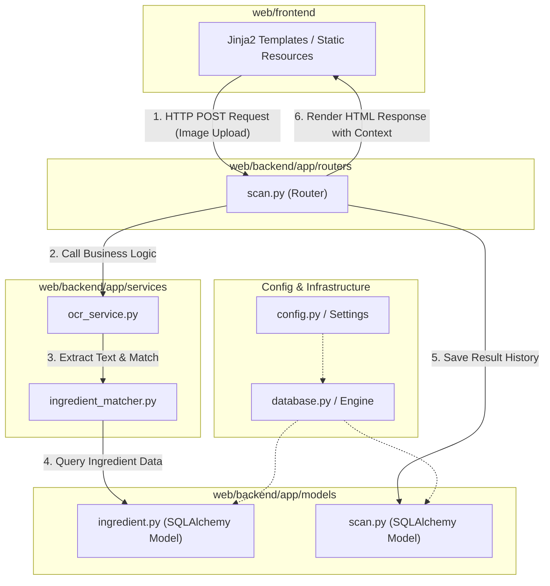

화장품 성분 분석 서비스 PickSafe를 개발하면서, 초기 쾌속 프로토타이핑 단계를 지나 비즈니스 로직(OCR 성분 추출, 성분 매칭 엔진 등)과 UI 템플릿 코드가 늘어남에 따라 프로젝트 구조의 복잡도가 급격히 증가했습니다. 

루트 디렉토리에 백엔드 파이썬 파일과 프론트엔드 정적 파일, Jinja2 템플릿이 뒤섞여 얹어지면서 코드 작성 위치를 찾기 번거로워졌고, 라우터에서 데이터베이스 조회와 성분 분석 비즈니스 로직을 동시에 처리하는 등 책임의 경계가 모호해졌습니다. 

이러한 문제를 해결하고 추후 프론트엔드를 SPA(Single Page Application) 형태로 전환하거나 API를 독립적으로 확장할 수 있도록, 프로젝트 전체의 폴더 구조를 재설계하고 계층화 마이그레이션을 진행했습니다.

---

## 🎯 마주한 고민과 문제 배경

초기 설계에서는 빠르게 실행 결과를 확인하는 것이 우선이었기 때문에 디렉토리 계층 구조를 깊게 가져가지 않았습니다. 그러나 기능이 추가되면서 다음과 같은 문제들이 지속적으로 발생했습니다.

1. **디렉토리 결합도 상승**: 백엔드 애플리케이션 파일과 Jinja2 HTML 템플릿, CSS/JS 리소스가 루트 디렉토리 하위에 혼재되어 있어 백엔드 로직 수정과 프론트엔드 마크업 작업 간 분리가 명확하지 않았습니다.
2. **비즈니스 로직의 파편화**: 이미지 OCR 처리(`ocr_service`), 알레르기 유발 성분 판별(`ingredient_matcher`) 등 핵심 서비스 로직이 라우터 함수 내부에 작성되거나 유틸리티 폴더에 임의로 흩어져 있어 코드 재사용성과 단위 테스트 작성이 어려웠습니다.
3. **향후 아키텍처 확장성의 한계**: 현재는 Jinja2 템플릿을 통한 SSR(Server-Side Rendering) 방식을 사용하고 있지만, 향후 React나 Next.js 기반으로 프론트엔드를 전환하거나 모바일 앱용 REST API만 별도로 제공해야 할 때 기존 구조에서는 프론트/백엔드 코드를 분리해내기가 까다로운 상태였습니다.

---

## ⚖️ 기술적 대안 비교 및 선택 이유

프로젝트 구조 변경을 검토하면서 크게 3가지 형태의 구조를 놓고 장단점 및 트레이드오프(Trade-off)를 비교했습니다.

| 구분 | 대안 1: 단일 모놀리식 구조 (기존 유지) | 대안 2: 완전 분리형 레포지토리 (Multi-Repo) | 대안 3: 경계 격리형 단일 레포지토리 (`web/backend` + `web/frontend`) |
| :--- | :--- | :--- | :--- |
| **구조** | 루트 하위에 Router, Service, Template 모두 혼재 | 백엔드/프론트엔드 Git 레포지토리 완전 분리 | 하나의 레포지토리 내부에서 `/web/backend`와 `/web/frontend` 디렉토리 명확히 격리 |
| **유지보수성** | 낮음 (코드 탐색 및 책임 분리 어려움) | 높음 (완벽한 독립성) | 높음 (명확한 역할 분리 및 접근성 확보) |
| **개발 생산성** | 초기엔 빠르나 규모 커질수록 하락 | 빌드/배포 파이프라인 각각 관리로 오버헤드 존재 | 단일 레포지토리 이점을 살리면서 효율적인 관리 가능 |
| **마이그레이션 용이성** | - | 변경 공수가 매우 큼 | 향후 프론트엔드 프레임워크 전면 교체 시 `/frontend` 디렉토리만 교체 가능 |

**선택한 대안: 경계 격리형 단일 레포지토리 (대안 3)**

완전 분리형 레포지토리는 개발 및 파이프라인 관리 비용을 지나치게 증가시킬 위험이 있었습니다. 따라서 단일 레포지토리의 효율성을 유지하면서도 책임 경계를 명확히 긋는 **`web/backend` 및 `web/frontend` 분리 구조**를 선택했습니다.

또한 백엔드 내부에서는 계층형 아키텍처(Layered Architecture)를 적용하여 **Models, Routers, Services**를 3개 레이어로 철저히 분리했습니다.

*   `models`: SQLAlchemy ORM 데이터베이스 데이터 구조 정의
*   `routers`: HTTP 요청 처리, 인가 체크 및 Jinja2 뷰/JSON 응답 반환
*   `services`: OCR 스캔, 성분 매칭 등 순수 비즈니스 데이터 처리 및 도메인 로직

---

## 🏗️ 시스템 아키텍처 및 흐름

재설계된 PickSafe의 디렉토리 구조 및 레이어 간 호출 흐름은 다음과 같습니다.

### 디렉토리 구조

```
/picksafe
  /web
    /backend
      /app
        /models       # 데이터베이스 ORM 모델 (user, ingredient, product 등)
        /routers      # 엔드포인트 및 뷰 렌더링 (auth, scan, products 등)
        /services     # 비즈니스 로직 (ocr_service, ingredient_matcher 등)
        config.py     # Pydantic Settings 환경 설정
        database.py   # SQLAlchemy DB 엔진 및 세션 관리
        main.py       # FastAPI 진입점
      requirements.txt
    /frontend
      /static         # Static Assets (CSS, JS, Images)
      /templates      # Jinja2 HTML 템플릿
  /docs               # 기획 및 기술 의사결정 문서 (ADR)
  .env
  README.md
```

### 레이어 간 데이터 흐름 다이어그램



---

## 💻 핵심 구현 및 트러블슈팅

### 1. 계층 분리 구현 예시 (Router - Service - Model)

라우터 함수에 뭉쳐 있던 비즈니스 로직을 `services/` 모듈로 이관했습니다. 라우터는 요청 수신 및 서비스 호출, 결과 응답만을 담당합니다.

**`app/services/ingredient_matcher.py` (비즈니스 로직)**
```python
from typing import List, Dict, Any
from sqlalchemy.orm import Session
from app.models.ingredient import Ingredient

class IngredientMatcher:
    def __init__(self, db: Session):
        self.db = db

    def match_ingredients(self, raw_texts: List[str]) -> Dict[str, Any]:
        """
        OCR 추출 텍스트를 기반으로 DB 성분 정보와 매칭하는 도메인 로직
        """
        matched_items = []
        unknown_items = []

        for text in raw_texts:
            ingredient = self.db.query(Ingredient).filter(Ingredient.name_ko == text).first()
            if ingredient:
                matched_items.append(ingredient)
            else:
                unknown_items.append(text)

        return {
            "matched": matched_items,
            "unknown": unknown_items
        }
```

**`app/routers/scan.py` (라우터)**
```python
from fastapi import APIRouter, Depends, UploadFile, File, Request
from fastapi.responses import HTMLResponse
from sqlalchemy.orm import Session
from app.database import get_db
from app.services.ocr_service import OCRService
from app.services.ingredient_matcher import IngredientMatcher

router = APIRouter(prefix="/scan", tags=["scan"])

@router.post("/analyze", response_class=HTMLResponse)
async def analyze_ingredient_image(
    request: Request,
    file: UploadFile = File(...),
    db: Session = Depends(get_db)
):
    # 1. OCR 처리 서비스 호출
    ocr_service = OCRService()
    extracted_texts = await ocr_service.extract_text(file)

    # 2. 성분 매칭 서비스 호출
    matcher = IngredientMatcher(db)
    result = matcher.match_ingredients(extracted_texts)

    # 3. 뷰 렌더링 데이터 전달
    templates = request.app.state.templates
    return templates.TemplateResponse(
        "result.html",
        {"request": request, "result": result}
    )
```

---

### 2. 마이그레이션 과정에서의 트러블슈팅: 패키지 모듈 경로 및 구동 환경 문제

#### [문제 현상]
디렉토리를 `web/backend` 구조로 옮긴 후, 기존 구동 명령어(`uvicorn app.main:app`)를 실행했을 때 파이썬 모듈 검색 경로 이슈로 인해 `ModuleNotFoundError: No module named 'app'` 에러가 발생하거나 환경변수 설정 파일(`.env`)의 경로를 찾지 못하는 문제가 드러났습니다.

#### [원인 분석]
파이썬 프로세스가 최상위 루트 디렉토리 `/picksafe`에서 실행될 경우 `app` 패키지의 실행 기준점과 `web/backend` 하위로 이동했을 때의 `sys.path` 기준점이 서로 달라집니다. 또한 Pydantic Settings 기반의 `config.py`가 상위 디렉토리에 위치한 `.env` 파일을 올바르게 읽어오지 못했습니다.

#### [해결 방법]
1. `app/config.py` 내 Pydantic Settings 설정에서 `.env` 파일의 상대 경로 명시 방식을 상대 탐색 구조로 안정화했습니다.
   
```python
from pydantic_settings import BaseSettings, SettingsConfigDict
from pathlib import Path

# web/backend 기준 상위 폴더의 .env 위치 자동 도출
BASE_DIR = Path(__file__).resolve().parent.parent.parent

class Settings(BaseSettings):
    SETTINGS_DATABASE_URL: str
    SETTINGS_SECRET_KEY: str
    
    model_config = SettingsConfigDict(
        env_file=BASE_DIR / ".env",
        env_file_encoding="utf-8",
        extra="ignore"
    )

settings = Settings()
```

2. 서비스 구동 기준 경로를 `web/backend`로 통일하고 실행 가이드를 정리했습니다. 기존 상대 임포트 경로(`from app.models.user import User`)는 유지되도록 보장했습니다.

```bash
# 실행 기준 디렉토리 이동 후 Uvicorn 구동
cd web/backend
uvicorn app.main:app --reload
```

---

## 💡 돌아보며 배운 점 (회고)

프로젝트 구조 마이그레이션을 진행하며 얻은 주요 교훈은 다음과 같습니다.

1. **초기 구조 설계의 중요성과 빠른 결단의 필요성**  
   개발 초기 '빠른 기능 구현'을 이유로 폴더 구조 구분을 유예해두었으나, 코드가 늘어남에 따라 리팩토링 비용은 비선형적으로 증가했습니다. 이상적인 구조를 미리 완성하진 못하더라도 최소한의 영역 격리(`frontend` / `backend`) 및 비즈니스 로직 분리(`services`)는 극초기부터 다잡는 것이 타당함을 체감했습니다.

2. **단위 테스트 및 기능 검증의 용이성 확보**  
   라우터에 작성되어 있던 데이터 파싱 및 판별 로직을 `services/` 레이어로 완전히 격리한 덕분에, 이제 HTTP 요청이나 데이터베이스 연결 없이도 순수 파이썬 객체만을 이용하여 핵심 도메인 로직(OCR 텍스트 파싱, 성분 매칭 규칙)을 유닛 테스트(Unit Test) 형태로 손쉽게 다룰 수 있게 되었습니다.

3. **향후 아키텍처 변화에 대한 유연한 준비**  
   `web/frontend` 디렉토리가 백엔드 패키지와 완전히 독립됨에 따라, 훗날 프론트엔드 UI 프레임워크를 도입하거나 API 서버 전용 구조로 변경하더라도 백엔드 핵심 비즈니스 로직(`web/backend/app/services`)은 아무런 수정 없이 온전히 재사용할 수 있는 기반이 마련되었습니다.

기본 아키텍처 구조가 단단하게 잡아졌으므로, 다음 단계로 성분 매칭 알고리즘의 쿼리 성능 최적화와 캐싱 계층 도입을 진행할 계획입니다.