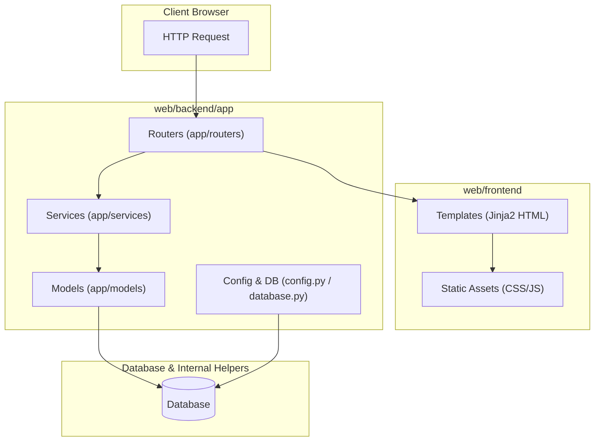

화장품 성분 분석 서비스 PickSafe를 개발하면서 프로토타입 단계의 코드가 빠르게 쌓여감에 따라, 디렉토리 구조의 모호함이 개발 생산성을 떨어뜨리는 병목으로 작용하기 시작했습니다. 

초기에는 빠른 구현을 위해 FastAPI 엔드포인트 파일에 데이터베이스 접속, OCR 실행, 성분 문자열 파싱, Jinja2 템플릿 렌더링 로직을 한데 섞어 작성했습니다. 그러나 성분 DB가 늘어나고 알레르기 유발 성분 교차 검증 로직이 복잡해지면서, 단일 파일이나 루트 디렉토리에 평평하게(Flat) 배치된 구조로는 더 이상 코드의 가독성과 유지보수성을 담보하기 어려워졌습니다.

프로젝트가 더 커지기 전에 프론트엔드와 백엔드의 경계를 명확히 나누고, 비즈니스 로직과 데이터 액세스 레이어를 격리하는 구조적 마이그레이션을 진행했습니다.

---

## 🎯 마주한 고민과 문제 배경

기존 루트 구조에서는 몇 가지 명확한 기술적 채무가 발생하고 있었습니다.

1. **관심사의 혼재 (Mixing of Concerns)**
   - 라우터 엔드포인트 내에서 `SQLAlchemy` 세션을 생성하고, OCR 결과 텍스트를 파싱하며, 성분 마스터 테이블을 조회해 결과를 조합한 뒤 HTML을 렌더링하는 작업이 모두 한 함수 내부에서 이루어졌습니다.
   - 이로 인해 특정 OCR 추출 알고리즘만 단체 테스트(Unit Test)하거나 디버깅하려고 해도 전체 HTTP 요청/응답 컨텍스트나 DB 커넥션을 모킹(Mocking)해야 하는 불편함이 있었습니다.

2. **프론트엔드-백엔드 경계의 모호함**
   - Jinja2 템플릿 HTML 파일과 JS/CSS 정적 리소스, 백엔드 Python 파이썬 모듈이 루트 디렉토리의 여러 폴더에 흩어져 있었습니다.
   - 추후 웹 프론트엔드를 SPA(Single Page Application, 예: React/Next.js)로 전환하더라도 백엔드 API 레이어와 깔끔하게 분리할 수 있는 디렉토리 격리가 필요했습니다.

---

## ⚖️ 기술적 대안 비교 및 선택 이유

디렉토리 구조 리팩토링을 위해 크게 세 가지 구조를 검토했습니다.

| 구분 | 대안 1: Flat 구조 (기존 유지) | 대안 2: 기능 단위 구조 (Feature-first) | 대안 3: 계층형 구조 + Web 격리 (최종 선택) |
| :--- | :--- | :--- | :--- |
| **구조** | 루트에 모든 파일 배치 | `app/scan/router.py`, `app/scan/service.py` | `web/backend/app/(models,routers,services)` + `web/frontend` |
| **장점** | 초기 진입 장벽이 낮고 파일 이동이 적음 | 특정 기능(Scan 등) 단위 응집도가 매우 높음 | 레이어별 역할 분리가 명확하고, 템플릿/정적 자산 분리가 수월함 |
| **단점** | 프로젝트가 커질수록 파일 찾기가 어렵고 스파게티화 | SSR 템플릿 및 공통 서비스 공유 시 경계가 모호해짐 | 디렉토리 깊이가 길어지고 Uvicorn 실행 경로 설정 필요 |

### 최종 선택: 계층형 구조 및 물리적 Web 격리 (`web/backend` & `web/frontend`)

PickSafe는 현재 FastAPI 내부에서 Jinja2를 이용해 화면을 렌더링하지만, 향후 API 서버와 프론트엔드 앱이 분리될 가능성을 염두에 두어야 했습니다. 

따라서 최상위에 `/web` 디렉토리를 두고 그 하위에 `backend`와 `frontend`를 물리적으로 나눴습니다. 백엔드 내부에서는 계층형 아키텍처(Layered Architecture)를 채택하여 **Models(데이터) - Routers(엔드포인트) - Services(비즈니스 로직)**로 명확히 나눴습니다.

---

## 🏗️ 시스템 아키텍처 및 흐름

리팩토링 후 PickSafe 백엔드의 레이어 간 의존성 방향 및 프론트엔드 자산과의 연동 구조는 아래와 같습니다.



의존성의 흐름이 **Router → Service → Model → Database**로 단방향으로 흐르도록 단순화하여, 순환 참조(Circular Import) 위험을 차단했습니다.

---

## 💻 핵심 구현 및 트러블슈팅

### 1. 최종 마이그레이션 디렉토리 구조

프로젝트 루트를 깔끔하게 정돈하고 백엔드 패키지화 기준을 정리한 최종 구조입니다.

```text
/picksafe
  /web
    /backend
      /app
        /models       # SQLAlchemy ORM 모델
          __init__.py
          user.py
          ingredient.py
          product.py
          scan.py
        /routers      # 엔드포인트 및 Jinja2 뷰 컨트롤러
          __init__.py
          auth.py
          scan.py
          products.py
        /services     # 핵심 비즈니스 로직 (OCR, 성분 매칭 등)
          __init__.py
          ocr_service.py
          ingredient_matcher.py
        config.py     # Pydantic Settings 환경 설정
        database.py   # DB 엔진 및 세션 관리
        main.py       # FastAPI 진입점
      requirements.txt
    /frontend
      /static         # CSS, JS, 이미지
      /templates      # Jinja2 HTML 템플릿
  /docs
  .env
```

### 2. 비즈니스 로직의 Service 레이어 추출 예시

기존에는 라우터 함수 내부에 작성되어 있던 성분 텍스트 매칭 및 알레르기 판별 로직을 `IngredientMatcher` 서비스 클래스로 격리했습니다.

**`app/services/ingredient_matcher.py` (비즈니스 로직 격리)**
```python
from typing import List, Dict, Any

class IngredientMatcher:
    def __init__(self, allergen_standards: List[str]):
        self.allergen_standards = allergen_standards

    def analyze_ingredients(self, raw_text: str) -> Dict[str, Any]:
        """
        OCR로 추출된 원문 텍스트에서 성분을 정규화하고 위험 성분을 매칭합니다.
        """
        extracted_tokens = [token.strip() for token in raw_text.split(",") if token.strip()]
        matched_allergens = []

        for token in extracted_tokens:
            if any(allergen in token for allergen in self.allergen_standards):
                matched_allergens.append(token)

        return {
            "total_count": len(extracted_tokens),
            "matched_allergens": matched_allergens,
            "tokens": extracted_tokens
        }
```

**`app/routers/scan.py` (라우터는 서비스 호출 및 결과 전달만 담당)**
```python
from fastapi import APIRouter, Depends, Request
from app.services.ingredient_matcher import IngredientMatcher

router = APIRouter(prefix="/scan", tags=["scan"])

@router.post("/analyze")
async def analyze_scan_result(request: Request, raw_text: str):
    # 서비스 레이어 객체 활용 (비즈니스 로직 분리)
    matcher = IngredientMatcher(allergen_standards=["파라벤", "페녹시에탄올"])
    result = matcher.analyze_ingredients(raw_text)
    
    return {
        "status": "success",
        "data": result
    }
```

### 3. 트러블슈팅: 애플리케이션 구동 경로 및 모듈 임포트 이슈

마이그레이션 직후 `uvicorn app.main:app --reload` 명령어를 루트 디렉토리에서 실행했을 때, 파이썬이 `app` 패키지를 찾지 못하는 `ModuleNotFoundError` 및 상대 경로 참조 문제가 발생했습니다.

*   **원인**: 기존에는 루트 디렉토리가 Python Path(`PYTHONPATH`)에 등록되어 있었으나, `app` 디렉토리가 `web/backend/app`으로 깊어지면서 Execution Context가 어긋남.
*   **해결 방법**: 
    1. 애플리케이션 구동 주체를 `web/backend` 디렉토리 내부로 한정하거나, 구동 스크립트 실행 시 실행 작업 디렉토리를 `web/backend`로 고정했습니다.
    2. 모든 모듈 내 내부 임포트 문 구문을 `app` 패키지 루트를 기준으로 통일했습니다. (예: `from app.models.user import User`)
    3. `Jinja2Templates` 디렉토리 지정 시 상대 경로 대신 기준 디렉토리 기반의 절대 경로로 해석되도록 `config.py` 설정을 보완했습니다.

---

## 💡 돌아보며 배운 점

1. **테스트 가용성의 비약적 증가**
   - 비즈니스 로직을 `app/services` 단으로 완전히 끌어어낸 덕분에, 데이터베이스 연동이나 HTTP 요청 없이도 `ingredient_matcher.py`의 단위 테스트를 수초 내에 빠르게 실행할 수 있게 되었습니다.

2. **작은 단위 리팩토링의 중요성**
   - 코드베이스가 작을 때 계층을 분리해 둔 덕분에, 향후 성분 분석 알고리즘이 고도화되거나 데이터 모델이 변경되더라도 라우터나 프론트엔드 템플릿 영역에 파급 효과가 미치지 않도록 방파제를 구축했습니다.

3. **향후 과제**
   - 현재는 `IngredientMatcher` 인스턴스를 라우터에서 직접 생성하고 있으나, 향후 FastAPI의 `Depends`를 활용한 의존성 주입(Dependency Injection) 패턴을 더 상시 적용하여 객체 생명주기를 더욱 효율적으로 관리할 계획입니다.