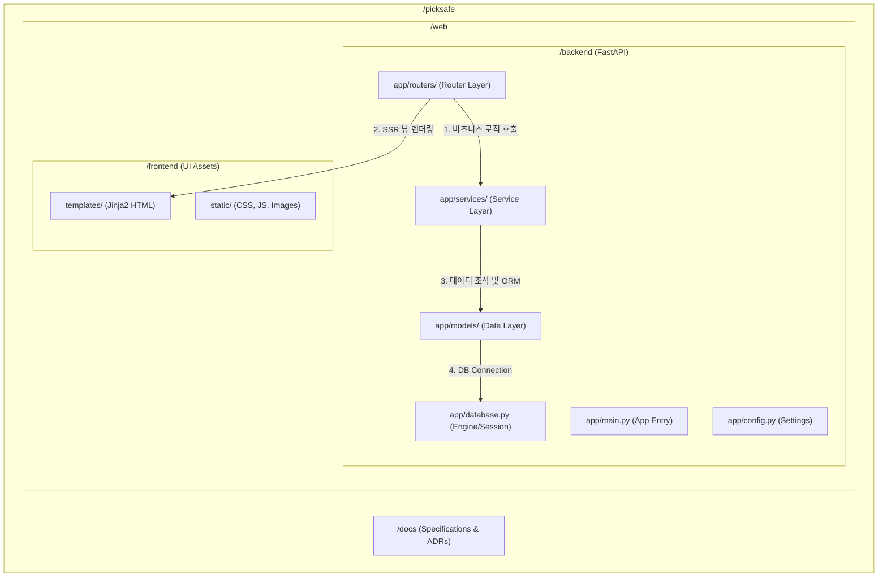

화장품 성분 분석 서비스 PickSafe를 개발하면서, 프로젝트 초기에 빠르게 구축했던 루트 디렉토리 중심의 파일 구조가 기능 확장 과정에서 점차 구조적 한계를 나타내기 시작했습니다. 

성분 OCR 스캔, 데이터베이스 매칭, 사용자 인증, 어드민 기능 등이 추가되면서 백엔드 비즈니스 로직과 프론트엔드 뷰 템플릿, 정적 리소스가 얽히는 문제가 발생했습니다. 이를 해결하고 향후 프론트엔드 아키텍처 전환(React/Next.js 등)까지 염두에 둔 디렉토리 구조 마이그레이션 과정을 기록으로 남깁니다.

---

## 🎯 마주한 고민과 문제 배경

초기 개발 단계에서는 빠른 프로토타이핑을 위해 루트 디렉토리에 백엔드 엔트리포인트(`main.py`), ORM 모델, Jinja2 템플릿, Static 자원들을 함께 배치했습니다. 그러나 코드가 늘어남에 따라 다음과 같은 난관에 마주쳤습니다.

1. **계층 간 경계 모호성**: 라우터 엔드포인트 함수 내부에 데이터베이스 조회 쿼리와 성분 매칭 분석 로직, Jinja2 HTML 렌더링 코드가 함께 존재하여 코드 가독성이 떨어지고 단위 테스트 작성이 어려워졌습니다.
2. **프론트엔드/백엔드 자원 혼재**: HTML 템플릿 파일과 정적 자원(CSS, JS)이 백엔드 파이썬 코드와 동일 레벨에 존재하다 보니 프로젝트 루트가 어수선해지고 파일 탐색 효율이 낮아졌습니다.
3. **향후 기술 스택 전환의 어려움**: 현재는 FastAPI + Jinja2 SSR 방식을 사용하고 있지만, 향후 프론트엔드를 독립된 SPA/SSR 프레임워크로 이관할 때 프론트엔드 자원과 백엔드 자원을 깔끔하게 분리하기 어려운 구조였습니다.

---

## ⚖️ 기술적 대안 비교 및 선택 이유

구조 개편을 위해 크게 세 가지 디렉토리 아키텍처 패턴을 비교 검토했습니다.

| 구분 | 대안 1: 루트 일괄 구조 (기존) | 대안 2: 도메인(기능)별 완전 분리 | 대안 3: 계층 기반 분리 (`web/backend` + `web/frontend`) |
| :--- | :--- | :--- | :--- |
| **구조** | 루트에 모든 파일 수평 배치 | `/scan`, `/user` 등 도메인별 폴더 구성 | `/web` 내 상위 디렉토리 분리 후 백엔드 내부 계층화 |
| **장점** | 초기 진입 장벽 낮음, 빠른 파일 접근 | 도메인 간 모듈 독립성 높음 | 프론트/백엔드 관심사 완전 격리, 표준 계층 구조로 직관적 |
| **단점** | 스케일업 시 유지보수 및 테스트 불가능 | 프로젝트 초기 파일 파편화 및 오버헤드 | Uvicorn 구동 경로 및 Import Path 관리 필요 |
| **결과** | 탈락 | 보류 (향후 서비스 확장 시 검토) | **최종 선택** |

**선택 이유:**
PickSafe의 현재 규모와 요구사항에서는 프론트엔드 템플릿자원과 백엔드 애플리케이션 자원을 상위 계층(`/web/frontend`, `/web/backend`)에서 명확히 격리하는 대안 3이 가장 현실적이었습니다. 

백엔드 내부에서는 계층형 아키텍처(Layered Architecture) 패턴을 도입하여 `models`(데이터 레이어), `routers`(엔드포인트 레이어), `services`(비즈니스 로직 레이어)로 책임을 명확히 분리했습니다.

---

## 🏗️ 시스템 아키텍처 및 흐름

재설계한 PickSafe 프로젝트의 디렉토리 구조 및 계층 간 데이터/의존성 흐름은 다음과 같습니다.



---

## 💻 핵심 구현 및 트러블슈팅

### 1. 서비스 레이어 분리를 통한 라우터 경량화

기존에는 라우터 내부에 스캔 처리 및 성분 분석 로직이 결합되어 있었으나, 이를 `services` 레이어로 전격 이관했습니다. 

다음은 구조 변경 후 엔드포인트(`routers`)와 비즈니스 로직(`services`)이 독립적으로 작동하는 방식을 나타낸 축약 예시 코드입니다.

```python
# web/backend/app/routers/scan.py
from fastapi import APIRouter, Depends, Request, UploadFile, File
from fastapi.responses import HTMLResponse
from app.services.ocr_service import process_ocr_image
from app.services.ingredient_matcher import analyze_ingredients

router = APIRouter(prefix="/scan", tags=["scan"])

@router.post("/analyze", response_class=HTMLResponse)
async def handle_scan_upload(
    request: Request, 
    file: UploadFile = File(...)
):
    # 1. 비즈니스 로직은 Service Layer로 위임
    ocr_text = await process_ocr_image(file)
    analysis_result = analyze_ingredients(ocr_text)
    
    # 2. Router는 뷰 응답 렌더링 및 DTO 전달만 담당
    return templates.TemplateResponse(
        "result.html", 
        {"request": request, "result": analysis_result}
    )
```

이와 같이 구조를 전환함으로써 `ingredient_matcher.py` 같은 핵심 비즈니스 로직을 HTTP 요청 객체나 HTML 렌더링에 의존하지 않고 독립적으로 단위 테스트(Unit Test)를 작성할 수 있게 되었습니다.

### 2. 마이그레이션 시 마주친 실행 경로(Working Directory) 문제

디렉토리를 `/web/backend` 하위로 이동하면서 기존 루트에서 구동하던 Uvicorn 실행 경로 및 파이썬 모듈 임포트 경로에 변화가 생겼습니다.

* **문제 상황**: 루트 디렉토리에서 `uvicorn app.main:app` 명령을 수행하면 `web/backend/app` 패키지를 찾지 못하는 `ModuleNotFoundError` 발생.
* **해결 방법**: 
  1. 애플리케이션 실행 기준 위치를 `web/backend` 디렉토리 내부로 명확히 명시.
  2. `app` 디렉토리 내 각 모듈 패키지에 `__init__.py`를 배치하여 명확한 파이썬 패키지 경계를 형성.
  3. 절대 경로 임포트 형태(`from app.models.user import User`)를 일관되게 유지하여 소스 코드 내 임포트 구문의 수정 범위를 최소화.

---

## 💡 돌아보며 배운 점 (회고)

프로젝트 초기에는 파일 개수가 적어 수평적인 구조가 편리해 보이지만, 기능이 조금만 확장되어도 구조적 부채(Architectural Debt)로 되돌아온다는 점을 다시금 체감했습니다.

1. **테스트 용이성 확보**: 데이터베이스 및 HTTP 프레임워크와 separation of concerns(관심사 분리)가 이루어지면서, 비즈니스 판정 로직에 대한 Mocking 및 테스트 코드 작성이 훨씬 수월해졌습니다.
2. **유연한 프론트엔드 이관 가능성**: HTML 템플릿과 정적 자원이 `/web/frontend` 디렉토리로 완전히 격리되어, 향후 백엔드 API 서버의 리팩토링 없이도 프론트엔드 영역을 별도의 Node.js 기반 환경으로 분리시킬 수 있는 기틀이 마련되었습니다.
3. **트레이드오프 관리**: 계층을 분리함에 따라 작성해야 하는 파일 개수가 늘어나고 초기 진입 지점(Uvicorn 실행 경로 등) 설정에 주의가 필요해졌지만, 코드 가독성 향상과 유지보수성 측면에서 얻은 실익이 훨씬 컸습니다.

추후 서비스 도메인이 더 거대해진다면 현재의 Layered Architecture에서 도메인 단위(Domain-driven) 모듈화 방식으로 고도화하는 방안도 점진적으로 고려해볼 계획입니다.