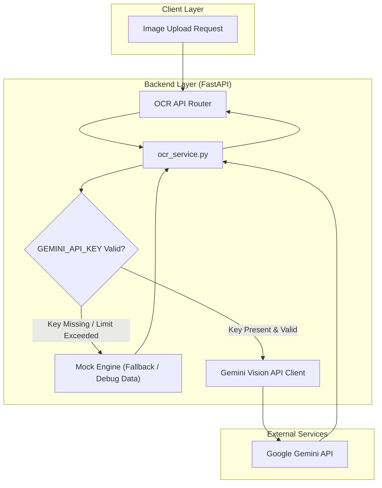

화장품 성분 분석 서비스 **PickSafe**를 개발하면서 가장 첫 번째 병목으로 마주한 문제는 바로 **'비정형 성분표 이미지의 텍스트 디지털화'**였습니다. 

사용자가 촬영한 화장품 용기 뒷면 사진은 곡면 왜곡, 빛 반사, 미세한 폰트 크기, 영어와 한국어가 섞인 복잡한 표기 등 기존 OCR 기술로 깔끔하게 파싱하기 어려운 조건들을 두루 갖추고 있습니다. 

이번 글에서는 성분표 인식율을 높이기 위해 Gemini Vision API를 파이프라인으로 채택한 과정과, 개발 및 운영 안정성을 위해 Mock 폴백(Fallback) 구조를 설계했던 기술적 고민을 기록으로 남깁니다.

---

## 🎯 마주한 고민과 문제 배경

초기 검증 단계에서는 비용 부담을 줄이고자 Tesseract와 같은 오픈소스 기반 Traditional OCR 엔진을 검토했습니다. 하지만 실제 다양한 화장품 성분표 이미지를 테스트하면서 다음과 같은 명확한 한계에 부딪혔습니다.

1. **화학 성분명의 파편화**: 화장품 성분명은 `Caprylic/Capric Triglyceride`, `나이아신아마이드` 등 긴 전문 용어가 많습니다. 기존 OCR은 줄바꿈이나 특수문자(`/`, `,`, `( )`) 구획을 제대로 인식하지 못해 성분 단어가 중간에 찢어지는 현상이 빈번했습니다.
2. **문맥 복원의 불가능성**: 폰트가 뭉개지거나 빛 반사로 일부 글자가 흐려지면 `글리세린`이 `글리세리`로 인식되는 등 잘못된 텍스트가 렌더링되었습니다. 단순 텍스트 추출 방식으로는 앞뒤 문맥을 통해 오탈자를 자체 보정하는 것이 불가능했습니다.
3. **후처리 파이프라인의 비대화**: OCR 결과물에서 개별 성분을 분리해 내기 위해 과도하게 복잡한 정규식(Regex)과 후처리 코드가 필요해졌고, 이는 코드의 유지보수성을 크게 떨어뜨렸습니다.

이 문제를 해결하려면 단순히 이미지에서 좌표 기반으로 글자를 읽어오는 전통적 OCR이 아닌, **이미지와 문맥을 함께 이해하는 멀티모달 모델(Vision LLM)** 도입이 필수적이었습니다.

---

## ⚖️ 기술적 대안 비교 및 선택 이유

성분표 파싱 파이프라인 후보군으로 **Tesseract OCR**, **상용 Enterprise OCR (GCP Cloud Vision / AWS Textract)**, 그리고 **Gemini Vision API**를 비교 검토했습니다.

| 비교 항목 | Tesseract OCR (Open Source) | Commercial Cloud OCR (AWS/GCP) | Gemini Vision API |
| :--- | :--- | :--- | :--- |
| **성분 단어 인식률** | 낮음 (경계 왜곡에 취약) | 보통~높음 (글자 추출 정확) | **매우 높음 (문맥 기반 보정)** |
| **다국어 및 특수문자** | 노이즈 다량 발생 | 양호 | **우수 (구획 분리 명확)** |
| **후처리 복잡도** | 매우 높음 (정규식 의존) | 높음 (단어 쉼표 결합 필요) | **낮음 (프롬프트로 정형화)** |
| **도입 비용** | 무상 (자체 서버 자원 사용) | 유상 (호출 건당 과금) | **무료 티어 활용 가능 (MVP 단계)** |

### 최종 선택: Gemini Vision API

1. **문맥 기반 오탈자 자동 보정**: Vision LLM 특성상 이미지 내 글자가 살짝 뭉개져 있어도 성분명 DB 문맥을 바탕으로 정확한 성분명을 추론하여 추출하는 능력이 탁월했습니다.
2. **비용 효율성**: 서비스 초기 MVP 단계에서 과금 부담 없이 Free Tier 범위 내에서 충분히 안정적으로 API를 활용할 수 있었습니다.
3. **구조화된 출력**: 프롬프트 지시를 통해 OCR 결과물을 별도의 복잡한 정규식 파싱 없이 쉼표(`,`) 구분의 정제된 성분 리스트 형태로 직접 반환받을 수 있었습니다.

---

## 🏗️ 시스템 아키텍처 및 흐름

Gemini API를 파이프라인에 통합할 때 가장 중요하게 고려한 점은 **'API 키가 없거나 외부 API 서버의 Rate Limit이 발생했을 때 전체 시스템이 멈추지 않아야 한다'**는 것이었습니다. 이를 위해 `ocr_service.py` 내부에 안전한 **Mock 디버그 폴백(Fallback) 구조**를 내장시켰습니다.



---

## 💻 핵심 구현 및 트러블슈팅

### 1. 서비스 모듈 추상화 및 폴백 처리 (`ocr_service.py`)

로컬 개발 환경이거나 CI 파이프라인 테스트 시 매번 외부 API를 직접 호출하는 것은 비용 및 속도 측면에서 비효율적입니다. 따라서 환경 변수의 API 키 유효성 여부에 따라 동적으로 동작을 전환하도록 구현했습니다.

```python
import logging
from typing import List
from app.config import settings

logger = logging.getLogger(__name__)

# 외부 서비스 의존성이 차단되었을 때 사용할 Mock 성분 데이터 셋
MOCK_INGREDIENTS = [
    "정제수", "글리세린", "부틸렌글라이콜", "나이아신아마이드",
    "1,2-헥산다이올", "카프릴릭/카프릭트라이글리세라이드", "소듐하이알루로네이트"
]

class OCRService:
    def __init__(self):
        self.api_key = settings.GEMINI_API_KEY
        self._is_mock_mode = not bool(self.api_key and self.api_key.strip())
        
        if self._is_mock_mode:
            logger.warning("[OCRService] GEMINI_API_KEY가 설정되지 않았습니다. Mock 디버그 모드로 동작합니다.")

    async def extract_ingredients(self, image_bytes: bytes) -> List[str]:
        """
        이미지 바이너리를 받아 성분 텍스트 리스트를 반환합니다.
        API 키 부재 또는 장애 발생 시 Mock 데이터를 안전하게 로깅 후 반환합니다.
        """
        if self._is_mock_mode:
            logger.info("[OCRService] Mock 성분 목록을 반환합니다.")
            return MOCK_INGREDIENTS

        try:
            return await self._call_gemini_vision_api(image_bytes)
        except Exception as e:
            logger.error(f"[OCRService] Gemini API 호출 중 예외 발생: {str(e)}. Mock 폴백으로 전환합니다.")
            return MOCK_INGREDIENTS

    async def _call_gemini_vision_api(self, image_bytes: bytes) -> List[str]:
        # 실제 Gemini Vision API 호출 및 프롬프트 기반 텍스트 추출 로직 실행
        # (생략: google.generativeai SDK 활용 구문)
        pass
```

### 2. 마주친 트러블슈팅: Rate Limit (429) 및 네트워크 예외 처리

실제 테스트 과정에서 무료 티어의 분당 요청 제한(RPM) 초과 시 `429 Too Many Requests` 예외가 발생하는 것을 확인했습니다. 

처음에는 단순히 에러를 뿜으며 500 응답을 내려주었으나, 사용자 경험 및 프론트엔드 연동 개발의 연속성을 위해 API 예외 발생 시 `logger.error`로 상세 로그를 남긴 뒤, 준비된 디버그 데이터를 반환하도록 예외 안전망을 겹겹이 구성했습니다.

---

## 💡 돌아보며 배운 점 (회고)

### 1. 기술 선택의 핵심은 '단순함'과 '유연성'
처음에는 이미지 전처리(흑백 전환, 이진화, 노이즈 제거) 모듈과 Open Source OCR 모델을 조합하느라 수많은 파이프라인 코드를 작성했었습니다. 하지만 **Gemini Vision API**로 전환하면서 텍스트 인식 정확도는 크게 상승한 반면, 코드베이스의 복잡도는 기존 대비 절반 이하로 줄어들었습니다. MVP 단계에서는 복잡한 자체 처리 파이프라인보다 검증된 모델을 명확한 추상화 레이어로 감싸 활용하는 것이 훨씬 효율적임을 배웠습니다.

### 2. 시스템의 견고함을 지켜주는 Mock 폴백 설계
외부 API 키가 없는 환경(새로운 개발자 머신, CI/CD 테스트 환경)이나 외부 서비스 장애 시에도 백엔드 전체가 멈추지 않고 스캔 파이프라인의 후속 흐름(성분 분석 DB 조회 logic 등)을 그대로 테스트할 수 있는 기반을 마련했습니다.

### 3. 향후 개선 과제
현재는 Mock 데이터로 안전하게 폴백되도록 처리해 두었으나, 향후 서비스 스케일이 커진다면 다음과 같은 추가 고도화를 검토하고 있습니다:
* **JSON Schema Enforcement**: 단순 텍스트 쉼표 분리 방식에서 더 나아가, Gemini의 Structured Outputs 기능을 활용하여 JSON 포맷 출력을 강제함으로써 파싱 신뢰도 향상.
* **다중 OCR 엔지니어링 (Circuit Breaker)**: Gemini API 쿼터가 초과되었을 때 순차적으로 차선책 클라우드 OCR로 릴레이되는 구조 도입.

비용과 정확도, 그리고 운영 안정성 사이에서 최적의 균형점을 고민하며 아키텍처를 하나씩 다듬어 나가는 과정의 가치를 다시금 느낄 수 있었습니다.