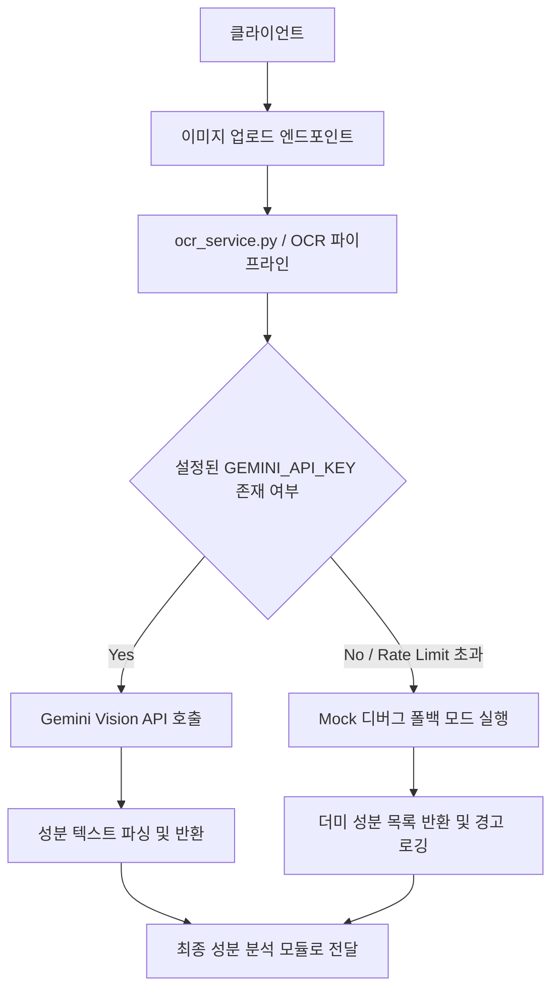

화장품 성분 분석 서비스 PickSafe를 개발하면서 마주한 가장 첫 번째 기술적 과제는 사용자가 촬영한 화장품 뒷면의 성분표 이미지를 정확하고 빠르게 텍스트로 추출하는 것이었습니다. 

제한된 인프라 리소스 환경에서 복잡한 성분표 레이아웃을 효율적으로 처리하기 위해 어떤 고민을 거쳤고, 왜 Gemini Vision API를 선택하여 파이프라인을 구축했는지 그 과정을 정리해 보았습니다.

---

## 🎯 마주한 고민과 문제 배경

화장품 성분표는 일반적인 문서나 영수증과 달리 다음과 같은 고유한 특성을 지닙니다.

1. **비정형 레이아웃**: 원형 용기, 곡면, 혹은 좁은 패키지 면에 인쇄되어 있어 줄바꿈이 불규칙하고 콤마(,), 슬래시(/) 등 특수문자가 혼재되어 있습니다.
2. **다국어 및 전문 용어**: 한글 성분명과 INCI(국제 화장품 원료집) 표준 영문명이 혼용되며, 일반적인 단어 사전으로 매칭하기 까다로운 화학 명칭이 대다수입니다.

처음에는 별도의 무거운 인프라 구축 없이 가볍게 접근할 수 있는 오픈소스 OCR 엔진(Tesseract 등)을 검토했습니다. 그러나 로컬 테스트 단계에서 줄바꿈이 깨지거나 유사한 글자(예: '글리세린'과 '글리세리드')를 오인식하는 비율이 높았습니다. 성분 분석 서비스의 신뢰도는 정확한 텍스트 추출에서부터 시작되기에, OCR 엔진의 인식률을 높이거나 문맥을 보정할 수 있는 대안이 필요했습니다.

---

## ⚖️ 기술적 대안 비교 및 선택 이유

성분 텍스트 추출 기능을 구현하기 위해 검토했던 대안들과 각각의 Trade-off는 다음과 같았습니다.

| 대안 | 장점 | 단점 | 최종 선택 여부 |
| :--- | :--- | :--- | :--- |
| **전통적 오픈소스 OCR (Tesseract 등)** | 외부 API 의존성 없음, 완전 무료 및 로컬 구동 | 비정형 성분표 문맥 이해 부족, 오인식률 높음 | ❌ 기각 |
| **상용 클라우드 OCR (Google Cloud Vision / AWS Textract)** | 뛰어난 텍스트 바운딩 박스 인식 및 고성능 | MVP 검증 단계에서 고정 비용 발생 부담 | ❌ 기각 |
| **Gemini Vision API (무료 티어 활용)** | 거대언어모델 기반의 뛰어난 문맥 복원 및 성분 단어 구획 추출 능력, 무료 한도 활용 가능 | 외부 API 레이트 리밋 및 네트워크 의존성 존재 | ⭕ **최종 채택** |

LLM 기반 Vision API는 단순히 이미지 속 글자를 읽어내는 것을 넘어, 앞뒤 문맥을 파악해 불완전하게 인쇄된 성분명을 유추하는 능력이 탁월했습니다. 특히 MVP 검증 단계라는 프로젝트 규모에 맞춰 비용 부담 없이 고성능의 텍스트 추출 기능을 도입할 수 있다는 점이 결정적인 요인이었습니다.

---

## 🏗️ 시스템 아키텍처 및 흐름

이미지 업로드 엔드포인트로부터 전달된 성분표 이미지가 OCR 서비스를 거쳐 텍스트로 변환되고, API 키 유무에 따라 폴백 처리되는 전체 흐름을 다이어그램으로 정리했습니다.



---

## 💻 핵심 구현 및 트러블슈팅

실제 구현 과정에서 외부 API 의존성으로 인해 발생할 수 있는 로컬 개발 환경의 병목을 해결하는 데 집중했습니다. API 키가 설정되지 않거나 네트워크 장애가 발생하더라도 서비스가 비정상 종료(Crash)되지 않도록 안전장치를 마련했습니다.

### 1. 설정 및 OCR 서비스 추상화 (`config.py` & `ocr_service.py`)

```python
# web/backend/app/config.py (일부 발췌)
import os

class Settings:
    GEMINI_API_KEY: str = os.getenv("SETTINGS.KEY", "")

settings = Settings()
```

```python
# web/backend/app/services/ocr_service.py
import logging
from app.config import settings

logger = logging.getLogger(__name__)

class OCRService:
    def __init__(self):
        self.api_key = settings.GEMINI_API_KEY
        
    def extract_ingredients(self, image_bytes: bytes) -> str:
        if not self.api_key:
            logger.warning("GEMINI_API_KEY가 설정되지 않았습니다. Mock 디버그 폴백 모드로 동작합니다.")
            return self._get_mock_fallback_data()
        
        try:
            # 실제 Gemini Vision API 연동 로직
            # response = client.generate_content(...)
            pass
        except Exception as e:
            logger.error(f"OCR 처리 중 오류 발생: {str(e)}, 폴백 데이터로 대체합니다.")
            return self._get_mock_fallback_data()
            
    def _get_mock_fallback_data(self) -> str:
        # 로컬 테스트 및 API 키 누락 시 반환할 샘플 성분 텍스트
        return "정제수, 글리세린, 나이아신아마이드, 판테놀, 1,2-헥산디올"
```

이 구조를 통해 API 키가 없는 로컬 머신이나 테스트 환경에서도 런타임 오류 없이 원활한 프론트엔드 연동 테스트가 가능해졌으며, 예외 상황에서도 서비스의 가용성을 높일 수 있었습니다.

---

## 💡 돌아보며 배운 점 (회고)

이번 OCR 파이프라인 구축을 통해 얻은 실질적인 교훈은 다음과 같습니다.

1. **외부 의존성과 개발 생산성의 균형**: 고성능 AI 모델을 도입하면서 얻는 이점이 컸지만, 반대로 외부 API 환경(키 누락, 레이트 리밋 등)에 서비스가 강하게 결합될 위험이 있었습니다. 초기 설계 단계에서부터 **Mock 폴백 모드**를 염두에 둔 덕분에 로컬 개발과 테스트의 민첩성을 잃지 않을 수 있었습니다.
2. **도메인 특화 데이터의 특성 이해**: 범용 OCR 대신 LLM 기반 비전 API를 선택한 것은 화장품 성분표라는 비정형 텍스트의 특성을 정확히 파악한 올바른 판단이었습니다. 기술을 선택할 때는 유행을 따르기보다 해결하려는 문제의 본질(텍스트의 오인식률 감소)에 집중해야 함을 다시 한번 느꼈습니다.

추후에는 실제 사용자들의 피드백을 바탕으로 자주 오인식되는 특정 화학 성분 명칭에 대한 후처리(Post-processing) 정규식 필터를 고도화하여, OCR 정확도를 더욱 안정적으로 끌어올릴 계획입니다.